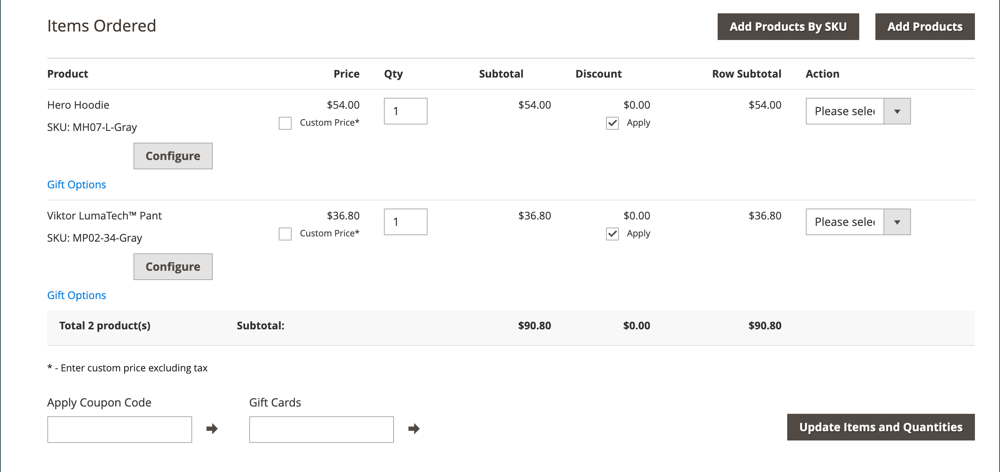

# オーダーの作成

サポートが必要な登録ユーザーの場合は、管理者から直接注文全体を作成できます。 _[!UICONTROL Create New Order]_&#x200B;フォームには、通常のチェックアウトプロセスに必要なすべての情報と、顧客のアカウントダッシュボードからのアクティビティ概要が含まれます。

{width="700" zoomable="yes"}

## 手順 1：オーダーの作成

1. _管理者_ サイドバーで、「**[!UICONTROL Customers]**」をクリックします。

1. グリッドで顧客を検索します。

1. _アクション_ 列の「**[!UICONTROL Edit]**」をクリックします。

1. ワークスペースヘッダーで、「**[!UICONTROL Create Order]**」をクリックします。

   {width="700" zoomable="yes"}

   [ 注文ワークスペース ](orders.md#orders-workspace) で **[!UICONTROL Create New Order]** をクリックして注文を作成することもできます。

## 手順 2：製品を追加

ストアに複数のビューがある場合は、注文を行うストア表示を選択します。

### [!UICONTROL Customer's Activities] サイドバーからの製品の追加

顧客のウィッシュリストから買い物かごに項目を転送したり、最近表示した項目、比較した項目または注文した項目を転送したりできます。

1. 次のいずれかのセクションで  を展開します。

   - **[!UICONTROL Wish List]**
   - **[!UICONTROL Last Ordered Items]**
   - **[!UICONTROL Products in Comparison List]**
   - **[!UICONTROL Recently Compared Products]**
   - **[!UICONTROL Recently Viewed Products]**

1. 左側のパネルで各製品のチェックボックスをオンにします。

1. 下にスクロールして、「**[!UICONTROL Update Changes]**」をクリックします。

   項目が注文フォームに表示されます。

   {width="600" zoomable="yes"}

### カタログから製品を追加

1. 「**[!UICONTROL Add Products]**」をクリックします。

   {width="600" zoomable="yes"}

1. グリッドで、買い物かごに追加する各製品のチェックボックスを選択し、購入する **[!UICONTROL Qty]** を入力します。

   {width="600" zoomable="yes"}

   >[!NOTE]
   >
   >商品選択グリッドには、割引や買い物かごまたはグループ価格ルールが適用されていなくても、常に商品の通常の基本価格が表示されます。 最終製品価格は、製品が注文/買い物かごに追加された場合にのみ計算されます。

1. 使用可能な製品オプションを設定します。

   - 「**[!UICONTROL Configure]**」をクリックします。

   - 必要に応じてオプションを入力します。

   - 「**[!UICONTROL OK]**」をクリックします。

   - 「**[!UICONTROL Add Selected Product(s) to Order]**」をクリックすると、買い物かごが更新されます。

1. 製品が [ ギフトオプション ](../catalog/product-gift-options.md) に設定されている場合は、必要に応じてオプションを設定します。

1. 必要に応じて品目の価格を上書きします。

   - 「**[!UICONTROL Custom Price]**」チェックボックスをオンにして、下のボックスに新しい価格を入力します。

   - 買い物かごの合計を更新するには、「**[!UICONTROL Update Items and Quantities]**」をクリックします。

   {width="600" zoomable="yes"}

1. 注文の際に必要に応じて、以下の節を完了してください。

   - [!UICONTROL Order Currency]
   - [!UICONTROL Apply Coupon Codes / Gift Card Code]
   - [!UICONTROL Payment Method]
   - [!UICONTROL Shipping Method]
   - [!UICONTROL Order Comments]

>[!NOTE]
>
>Payment Services 拡張機能がインストールおよび設定されている場合に、この機能をサポートする支払方法の詳細については、[Payment Services Guide](https://experienceleague.adobe.com/en/docs/commerce/payment-services/guide-overview) を参照してください。

## 手順 3：注文を送信する

「**[!UICONTROL Submit Order]**」をクリックします。

確認が顧客に送信され、顧客は自分のアカウントから注文の詳細を表示できます。
