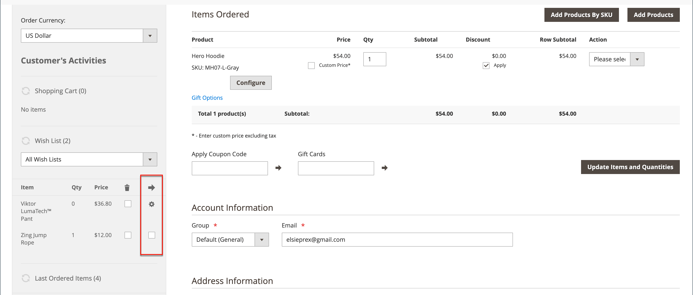
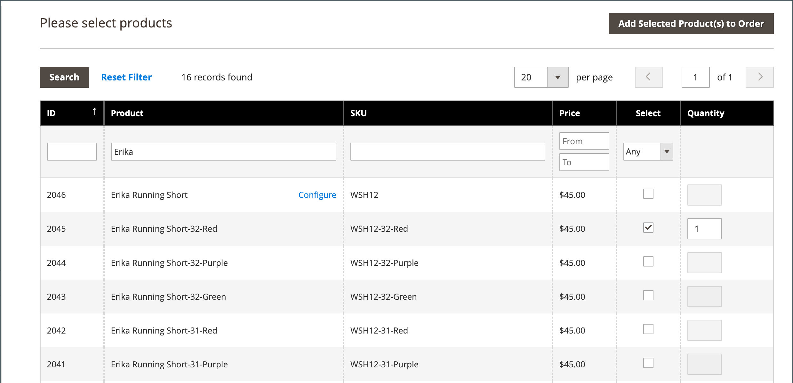
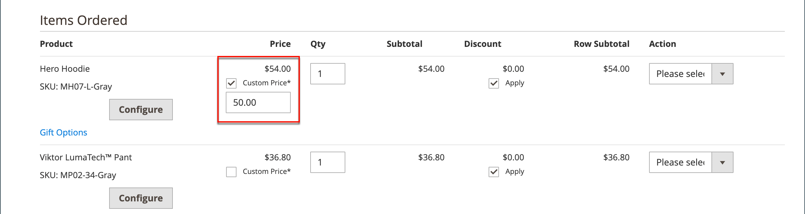

# 注文の作成

サポートが必要な登録済みのお客様は、Adminから直接注文全体を作成できます。 _[!UICONTROL Create New Order]_フォームには、通常のチェックアウトプロセスに必要なすべての情報と、顧客のアカウントダッシュボードからのアクティビティの概要が含まれています。

{width="700" zoomable="yes"}

## 手順1：注文の作成

1. _管理者_ サイドバーで、**[!UICONTROL Customers]**&#x200B;をクリックします。

1. グリッド内の顧客を検索します。

1. _アクション_&#x200B;列で、**[!UICONTROL Edit]**&#x200B;をクリックします。

1. ワークスペースのヘッダーで、**[!UICONTROL Create Order]**&#x200B;をクリックします。

   {width="700" zoomable="yes"}

   **[!UICONTROL Create New Order]**&#x200B;をクリックして、[注文ワークスペース ](orders.md#orders-workspace)で注文を作成することもできます。

## 手順2：製品の追加

ストアに複数のビューがある場合は、注文を配置するストアビューを選択します。

### [!UICONTROL Customer's Activities] サイドバーから商品を追加

顧客のウィッシュリストから、または最近閲覧した商品、比較した商品、注文した商品から商品をカートに転送できます。

1. 次のいずれかのセクションでを展開します。

   - **[!UICONTROL Wish List]**
   - **[!UICONTROL Last Ordered Items]**
   - **[!UICONTROL Products in Comparison List]**
   - **[!UICONTROL Recently Compared Products]**
   - **[!UICONTROL Recently Viewed Products]**

1. 左側のパネルで各製品のチェックボックスを選択します。

1. 下にスクロールして、**[!UICONTROL Update Changes]**&#x200B;をクリックします。

   注文フォームにアイテムが表示されます。

   {width="600" zoomable="yes"}

### カタログから商品を追加する

1. **[!UICONTROL Add Products]**&#x200B;をクリックします。

   {width="600" zoomable="yes"}

1. グリッドで、買い物かごに追加する各商品のチェックボックスを選択し、購入する&#x200B;**[!UICONTROL Qty]**&#x200B;を入力します。

   {width="600" zoomable="yes"}

   >[!NOTE]
   >
   >商品選択グリッドには、割引やカートやグループ価格のルールが適用されることなく、商品の通常の基本価格が常に表示されます。 最終商品価格は、商品が注文/カートに追加された場合にのみ計算されます。

1. 使用可能な製品オプションを設定します。

   - **[!UICONTROL Configure]**&#x200B;をクリックします。

   - 必要に応じてオプションを完了します。

   - **[!UICONTROL OK]**&#x200B;をクリックします。

   - **[!UICONTROL Add Selected Product(s) to Order]**&#x200B;をクリックして買い物かごを更新します。

1. 商品が[ ギフトオプション ](../catalog/product-gift-options.md)用に設定されている場合は、必要に応じてオプションを設定します。

1. 必要に応じて、項目の価格を上書きします。

   - 「**[!UICONTROL Custom Price]**」チェックボックスを選択し、下のボックスに新しい価格を入力します。

   - 買い物かごの合計を更新するには、**[!UICONTROL Update Items and Quantities]**&#x200B;をクリックします。

   {width="600" zoomable="yes"}

1. 注文に必要に応じて、次のセクションを完了します。

   - [!UICONTROL Order Currency]
   - [!UICONTROL Apply Coupon Codes / Gift Card Code]
   - [!UICONTROL Payment Method]
   - [!UICONTROL Shipping Method]
   - [!UICONTROL Order Comments]
   - [!UICONTROL [ カスタム注文属性]](../stores-purchase/order-processing.md#custom-order-attributes)

>[!NOTE]
>
>Payment Services拡張機能がインストールされ、設定されている場合にこの機能をサポートする支払い方法について詳しくは、[支払いサービスガイド ](https://experienceleague.adobe.com/en/docs/commerce/payment-services/guide-overview)を参照してください。

## 手順3：注文の送信

**[!UICONTROL Submit Order]**&#x200B;をクリックします。

お客様に確認書が送信され、お客様はアカウントから注文詳細を確認できます。
