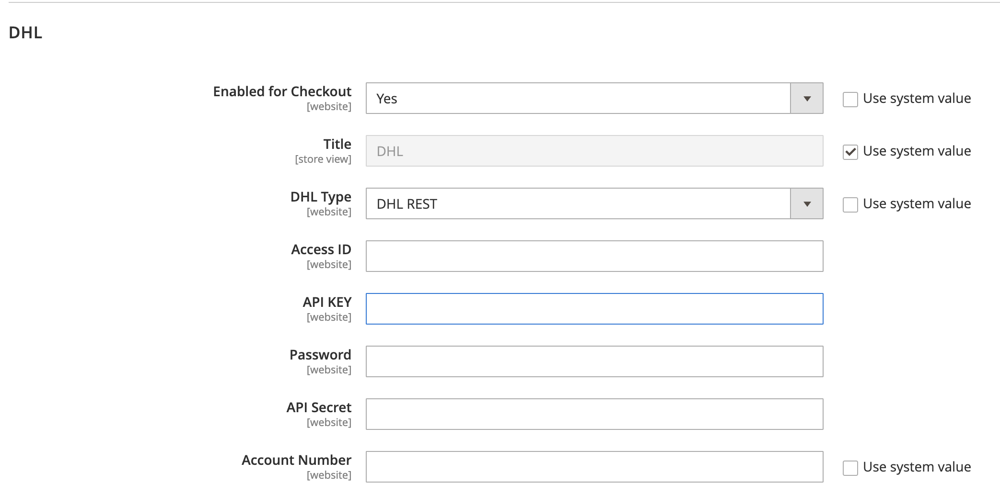

# DHL

DHLは、統合された国際サービスと、手紙、商品、情報を管理および輸送するためのカスタマイズされた顧客中心のソリューションを提供しています。

## ステップ 1: DHLを有効にする

1. _管理者_ サイドバーで、**[!UICONTROL Stores]** > _[!UICONTROL Settings]_>**[!UICONTROL Configuration]**に移動します。

1. 左側のパネルで、**[!UICONTROL Sales]**&#x200B;を展開し、**[!UICONTROL Delivery Methods]**&#x200B;を選択します。

1. **[!UICONTROL DHL]** セクションのを展開します。

   >[!NOTE]
   >
   >必要に応じて、まず&#x200B;**[!UICONTROL Use system value]** チェックボックスをオフにして、説明に従って次の設定を変更します。

1. **[!UICONTROL Enabled for Checkout]**&#x200B;を`Yes`に設定します。

1. DHL REST APIを使用している場合は、**[!UICONTROL DHL Type]**&#x200B;を`DHL REST`に設定します。

   DHL XML APIを使用している場合は、**[!UICONTROL DHL Type]**&#x200B;を`DHL XML`に設定します。

   >[!NOTE]
   >
   >DHL REST APIは、DHLとの統合に適した方法です。 XML APIは非推奨（廃止予定）であり、今後のリリースで削除される可能性があります。

1. DHLが提供する資格情報を使用して、次のフィールドに入力します。

DHL REST APIを使用している場合は、次の資格情報を指定する必要があります。

    - **[!UICONTROL API KEY]**
    - **[!UICONTROL API SECRET]**

DHL XML APIを使用している場合は、次の資格情報を指定する必要があります。

    - **[!UICONTROL Access ID]**
    - **[!UICONTROL Password]**
    - **[!UICONTROL Account Number]**

{width="600" zoomable="yes"}

## ステップ 2; パッケージの説明と処理手数料を入力する

1. **[!UICONTROL Content Type]** リストで、配送するパッケージの種類を最もよく表すオプションを選択します。

   - `Documents`
   - `Non documents`

1. 要件に応じて処理手数料オプションを設定します。

   処理手数料はオプションで、DHLの送料に追加される追加料金として表示されます。 処理手数料を含める場合は、次の操作を行います。

   - **[!UICONTROL Calculate Handling Fee]**&#x200B;について、処理手数料の計算に使用する方法を選択します。

      - `Fixed`
      - `Percentage`

   - **[!UICONTROL Handling Applied]**&#x200B;の場合、処理手数料を適用する方法を選択します。

      - `Per Order`
      - `Per Package`

   - **[!UICONTROL Handling Fee]**&#x200B;に、金額を計算するために選択した方法に基づいて、請求金額を入力します。

     例えば、料金が固定料金に基づいている場合は、金額を小数（`4.90`）で入力します。 ただし、手数料が注文の割合に基づいている場合は、金額を割合で入力します。 例えば、注文の6%を請求する場合は、値を`6`と入力します。

   - 配送料を正確に計算するために合計注文金額を分割するには、**[!UICONTROL Divide Order Weight]**&#x200B;を`Yes`に設定します。

   - パッケージの&#x200B;**[!UICONTROL Weight Unit]**&#x200B;を次のいずれかに設定します。

      - `Pounds`
      - `Kilograms`

   - 標準パッケージの&#x200B;**[!UICONTROL Size]**&#x200B;を次のいずれかに設定します。

      - `Regular`
      - `Specific`

     `Specific`を選択した場合は、パッケージの&#x200B;**[!UICONTROL Height]**、**[!UICONTROL Depth]**&#x200B;および&#x200B;**[!UICONTROL Width]**&#x200B;をセンチメートル単位で入力します。

   >[!NOTE]
   >
   >ディメンションが指定されていない場合、各ディメンションはデフォルトで3の最小値になります。

   {width="600" zoomable="yes"}

## 手順3：許可される配信方法の指定

1. **[!UICONTROL Allowed Methods]**&#x200B;の場合、顧客が利用できるようにしたい各メソッドを選択します。

   複数の方法を選択するには、Ctrl キー（PC）またはCommand キー（Mac）を押しながら、各オプションをクリックします。

   配信方法の正しいリストを表示するには、まず[国](../configuration-reference/sales/shipping-settings.md)を指定する必要があります。

1. **[!UICONTROL Ready Time]**&#x200B;の場合、注文が送信されてから、パッケージの発送準備が整った時間を入力します。

1. 必要に応じて&#x200B;**[!UICONTROL Displayed Error Message]**&#x200B;を編集します。

   このメッセージは、選択したメソッドが使用できない場合に表示されます。

1. DHLを通じて[送料無料](shipping-free.md) オプションを提供する場合は、送料無料オプションを設定します。

   - **[!UICONTROL Free Method]**&#x200B;の場合、送料無料に使用する方法を選択してください。

   - **[!UICONTROL Free Shipping Amount Threshold]**&#x200B;を設定：

     `Enable` – 最低注文時に送料無料を提供する場合は、**[!UICONTROL Minimum Order Amount for Free Shipping]**&#x200B;を入力します。

     `Disable` – 注文に無料のDHL配送は適用されません。

     この設定は、標準の&#x200B;_送料無料_&#x200B;方式と似ていますが、「DHL」セクションに表示されるため、顧客は、注文に使用されている方法を把握できます。

   - **[!UICONTROL Free Shipping Amount Threshold]**&#x200B;の場合、送料無料の対象となる注文の最小金額を入力します。

     {width="600" zoomable="yes"}

## ステップ 4：該当する国を指定する

1. **[!UICONTROL Ship to Applicable Countries]**&#x200B;を次のいずれかに設定します：

   - `All Allowed Countries`
   - `Specific Countries`

   特定の国に配送する場合は、**[!UICONTROL Ship to Specific Countries]** リストから各国を選択します。

1. **[!UICONTROL Show Method if Not Applicable]**&#x200B;を設定：

   `Yes` – 注文に該当しない場合でも、チェックアウト時にDHLを配送方法として表示します。

   `No` - チェックアウト時にDHLを配送方法として表示します（該当する場合のみ）。

1. ストアから行われたDHL配送の詳細を含むログファイルを作成するには、**[!UICONTROL Debug]**&#x200B;を`Yes`に設定します。

1. DHLは&#x200B;**[!UICONTROL sandbox mode]** オプションを提供します。サンドボックスモードを使用している場合は、**[!UICONTROL sandbox mode]**&#x200B;を`Yes`に設定します。
ライブモードを使用している場合は、**[!UICONTROL sandbox mode]**&#x200B;を`No`に設定します。

   >[!NOTE]
   >
   >サンドボックスモードは、テスト目的でのみ使用されます。 実店舗に影響を与えることなく、DHLとの統合をテストできます。

1. **[!UICONTROL Sort Order]**&#x200B;に数値を入力して、チェックアウト時に他の配信方法と共にリストされた場合にDHLが表示されるシーケンスを決定します。

   `0` = first、`1` = second、`2` = thirdなど。

1. **[!UICONTROL Save Config]**&#x200B;をクリックします。

   {width="600" zoomable="yes"}
