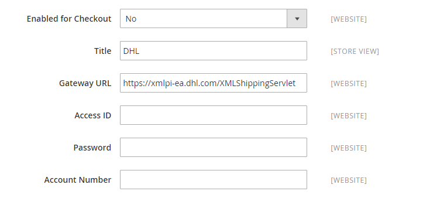

# DHL

DHL は、手紙、商品、情報を管理および輸送するための統合された国際サービスと、カスタマイズされた顧客志向のソリューションを提供します。

## 手順 1:DHL を有効にする

1. _管理者_ サイドバーで、**[!UICONTROL Stores]**/_[!UICONTROL Settings]_/**[!UICONTROL Configuration]**&#x200B;に移動します。

1. 左側のパネルで「**[!UICONTROL Sales]**」を展開し、「**[!UICONTROL Delivery Methods]**」を選択します。

1. 「」を展開し、「**[!UICONTROL DHL]**」セクションを展開します。

   >[!NOTE]
   >
   >必要に応じて、最初に「**[!UICONTROL Use system value]**」チェックボックスをオフにして、説明に従って次の設定を変更します。

1. **[!UICONTROL Enabled for Checkout]** を `Yes` に設定します。

1. 通常は、デフォルトの **[!UICONTROL Gateway URL]** を使用できます。

   DHL から代替 URL が提供されている場合は、このフィールドにその値を入力します。

1. DHL から提供された資格情報を使用して、次のフィールドに入力します。

   - **[!UICONTROL Access ID]**
   - **[!UICONTROL Password]**
   - **[!UICONTROL Account Number]**

{width="600" zoomable="yes"}

## 手順 2：パッケージの説明と手数料を入力します

1. **[!UICONTROL Content Type]** リストで、出荷するパッケージのタイプを最もよく表すオプションを選択します。

   - `Documents`
   - `Non documents`

1. 要件に応じて手数料オプションを設定します。

   手数料は任意で、DHL の送料に加算される追加料金として表示されます。 手数料を含める場合は、次の操作を行います。

   - **[!UICONTROL Calculate Handling Fee]**：手数料の計算に使用する方法を選択します。

      - `Fixed`
      - `Percentage`

   - **[!UICONTROL Handling Applied]** しくは、手数料の適用方法を選択します。

      - `Per Order`
      - `Per Package`

   - **[!UICONTROL Handling Fee]** に、金額の計算方法に基づいて、請求金額を入力します。

     例えば、料金が固定料金に基づいている場合は、`4.90` のように小数で金額を入力します。 ただし、手数料が注文のパーセンテージに基づいている場合は、パーセンテージで金額を入力します。 例えば、注文の 6% を請求する場合は、値を `.06` のように入力します。

   - 合計注文重量を分割して配送料を正確に計算するには、**[!UICONTROL Divide Order Weight]** を `Yes` に設定します。

   - パッケージの **[!UICONTROL Weight Unit]** を次のいずれかに設定します。

      - `Pounds`
      - `Kilograms`

   - 一般的なパッケージの **[!UICONTROL Size]** を次のいずれかに設定します。

      - `Regular`
      - `Specific`

     `Specific` を選択した場合は、パッケージの **[!UICONTROL Height]**、**[!UICONTROL Depth]**、**[!UICONTROL Width]** をセンチメートル単位で入力します。

   {width="600" zoomable="yes"}

## 手順 3：許可される配信方法の指定

1. **[!UICONTROL Allowed Methods]** しくは、顧客が使用できるようにする各方法を選択します。

   複数の方法を選択するには、Ctrl キー（PC）または Command キー（Mac）を押したまま、各オプションをクリックします。

   配信方法の正しいリストを表示するには、まず [&#x200B; 原産国 &#x200B;](../configuration-reference/sales/shipping-settings.md) を指定する必要があります。

1. **[!UICONTROL Ready Time]**：注文が送信されてからパッケージの出荷準備が整うまでの時間数を入力します。

1. 必要に応じて **[!UICONTROL Displayed Error Message]** を編集します。

   このメッセージは、選択したメソッドが使用できない場合に表示されます。

1. DHL を通じて [&#x200B; 送料無料 &#x200B;](shipping-free.md) オプションを提供したい場合は、送料無料オプションを設定します。

   - **[!UICONTROL Free Method]** しくは、送料無料で使用する方法を選択します。

   - Set **[!UICONTROL Free Shipping Amount Threshold]**:

     `Enable` – 最小注文で送料無料を提供する場合は、**[!UICONTROL Minimum Order Amount for Free Shipping]** を入力します。

     `Disable` – 注文に DHL 送料無料は適用されません。

     この設定は、標準の _送料無料_ 方法の設定と似ていますが、DHL セクションに表示されるので、顧客は注文にどの方法が使用されているかを把握できます。

   - **[!UICONTROL Free Shipping Amount Threshold]**：送料無料の対象となる注文の最小金額を入力します。

     {width="600" zoomable="yes"}

## 手順 4：適用国を指定する

1. **[!UICONTROL Ship to Applicable Countries]** を次のいずれかに設定します。

   - `All Allowed Countries`
   - `Specific Countries`

   特定の国に配送する場合は、**[!UICONTROL Ship to Specific Countries]** のリストから各国を選択します。

1. Set **[!UICONTROL Show Method if Not Applicable]**:

   `Yes` - チェックアウト時に DHL を配送方法として表示します（注文に適用されない場合も含む）。

   `No` - チェックアウト時の配送方法として DHL を表示します（該当する場合のみ）。

1. ストアから送信された DHL 配送の詳細を記録したログ ファイルを作成するには、**[!UICONTROL Debug]** を `Yes` に設定します。

1. **[!UICONTROL Sort Order]**：番号を入力して、チェックアウト時に他の配信方法と一緒に表示される DHL の表示順序を決定します。

   `0` = 1 番目、`1` = 2 番目、`2` = 3 番目など。

1. 「**[!UICONTROL Save Config]**」をクリックします。

   {width="600" zoomable="yes"}
