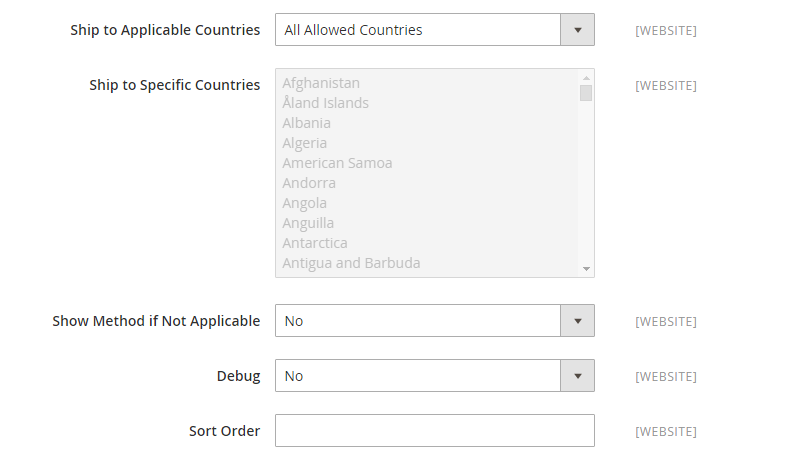

# DHL

DHL は、統合された国際サービスと、レター、商品、情報を管理および輸送するためのカスタマイズされた顧客中心のソリューションを提供します。

## ステップ 1: DHL を有効にする

1. 次の日： _管理者_ サイドバー、移動 **[!UICONTROL Stores]** > _[!UICONTROL Settings]_>**[!UICONTROL Configuration]**.

1. 左側のパネルで、を展開します。 **[!UICONTROL Sales]** を選択します。 **[!UICONTROL Delivery Methods]**.

1. 展開  の **[!UICONTROL DHL]** 」セクションに入力します。

   >[!NOTE]
   >
   >必要に応じて、まず **[!UICONTROL Use system value]** チェックボックスをオンにして、次の設定を変更します。

1. 設定 **[!UICONTROL Enabled for Checkout]** から `Yes`.

1. 通常は、デフォルトの **[!UICONTROL Gateway URL]**.

   DHL から代替 URL が提供された場合は、このフィールドにその値を入力します。

1. DHL から提供された資格情報を使用して、次のフィールドに入力します。

   - **[!UICONTROL Access ID]**
   - **[!UICONTROL Password]**
   - **[!UICONTROL Account Number]**

{width="600" zoomable="yes"}

## 手順 2：パッケージの説明と処理料を入力します。

1. Adobe Analytics の **[!UICONTROL Content Type]** 「 」リストで、出荷するパッケージのタイプに最も適したオプションを選択します。

   - `Documents`
   - `Non documents`

1. 必要に応じて、取り扱い料金オプションを設定します。

   手数料はオプションで、DHL の送料に追加される追加料金として表示されます。 手数料を含める場合は、次の手順を実行します。

   - の場合 **[!UICONTROL Calculate Handling Fee]**、処理費の計算に使用する方法を選択します。

      - `Fixed`
      - `Percentage`

   - の場合 **[!UICONTROL Handling Applied]**&#x200B;をクリックし、処理料金を適用する方法を選択します。

      - `Per Order`
      - `Per Package`

   - の場合 **[!UICONTROL Handling Fee]**」に、金額の計算に選択した方法に基づいて、請求する金額を入力します。

     例えば、料金が固定料金に基づく場合は、金額を小数で入力します。例： `4.90`. ただし、手数料が注文のパーセンテージに基づいている場合は、金額をパーセンテージで入力します。 例えば、注文の 6%を請求する場合は、値に「 」と入力します。 `.06`.

   - 合計注文の重み付けを分割して配送料を正確に計算するには、 **[!UICONTROL Divide Order Weight]** から `Yes`.

   - を設定します。 **[!UICONTROL Weight Unit]** を次のいずれかに設定します。

      - `Pounds`
      - `Kilograms`

   - を設定します。 **[!UICONTROL Size]** を次のいずれかに変更します。

      - `Regular`
      - `Specific`

     次を選択した場合： `Specific`、 **[!UICONTROL Height]**, **[!UICONTROL Depth]**、および **[!UICONTROL Width]** センチ単位のパッケージの。

   {width="600" zoomable="yes"}

## 手順 3：許可される配信方法の指定

1. の場合 **[!UICONTROL Allowed Methods]**」で、顧客に提供する各方法を選択します。

   複数の方法を選択するには、Ctrl キー (PC) または Command キー (Mac) を押しながら各オプションをクリックします。

   適切な配信方法のリストを表示するには、まず [原産国](../configuration-reference/sales/shipping-settings.md).

1. の場合 **[!UICONTROL Ready Time]**、注文が送信されてから、パッケージの出荷準備が整った時間数を入力します。

1. を編集します。 **[!UICONTROL Displayed Error Message]** 必要に応じて。

   このメッセージは、選択した方法が使用できない場合に表示されます。

1. 次を指定する場合、 [送料無料](shipping-free.md) オプションを DHL 経由で、無料の配送オプションを設定します。

   - の場合 **[!UICONTROL Free Method]**、無料配送に使用する方法を選択します。

   - 設定 **[!UICONTROL Free Shipping Amount Threshold]**:

     `Enable`  — 最小注文で送料無料を提供する場合は、 **[!UICONTROL Minimum Order Amount for Free Shipping]**.

     `Disable`  — 無料の DHL 配送は、どの注文にも適用されません。

     この設定は、標準の設定に似ています _送料無料_ メソッドですが、DHL セクションに表示されるので、注文に使用されるメソッドを顧客が把握できます。

   - の場合 **[!UICONTROL Free Shipping Amount Threshold]**、無料配送の条件を満たす注文の最小金額を入力します。

     {width="600" zoomable="yes"}

## 手順 4：該当する国を指定します。

1. 設定 **[!UICONTROL Ship to Applicable Countries]** を次のいずれかに変更します。

   - `All Allowed Countries`
   - `Specific Countries`

   特定の国に配送する場合、 **[!UICONTROL Ship to Specific Countries]** リスト。

1. 設定 **[!UICONTROL Show Method if Not Applicable]**:

   `Yes`  — 注文に該当しない場合でも、チェックアウト時の発送方法として DHL を表示します。

   `No` - DHL をチェックアウト時の発送方法として表示します（該当する場合）。

1. お客様のストアで行われた DHL 出荷の詳細を含むログファイルを作成するには、 **[!UICONTROL Debug]** から `Yes`.

1. の場合 **[!UICONTROL Sort Order]**、数値を入力して、チェックアウト時に DHL が他の配信方法と共に表示される際の順序を決定します。

   `0` =最初 `1` =秒 `2` = 3 番目、など。

1. クリック **[!UICONTROL Save Config]**.

   {width="600" zoomable="yes"}
