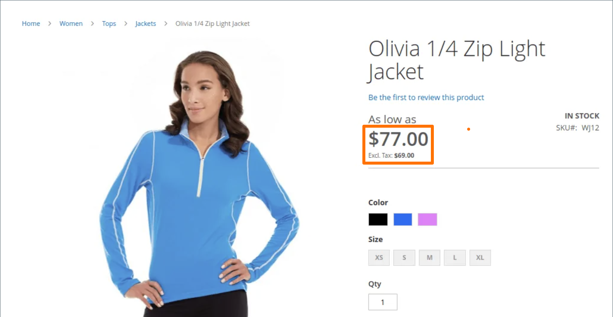

# 価格の表示設定

価格の表示設定では、製品と配送価格に税が含まれているか除外されているか、または価格の 2 つのバージョン（1 つは税が含まれているか、もう 1 つは税が含まれていないかを決定します。

製品価格に税金が含まれる場合、税金が表示されるのは、税源に一致する税務処理基準があるか、顧客所在地が税務処理基準に一致する場合のみです。 一致をトリガーにできるイベントには、お客様がアカウントを作成したり、ログインしたり、買い物かごから税金と送料の見積もりを生成したりする場合が含まれます。

>[!IMPORTANT]
>
>税金を含む/除外する価格を示すと、お客様にとって混乱を招く可能性があります。 警告メッセージが表示されないようにするには、お住まいの国の [ ガイドライン ](international-tax-guidelines.md) および [ 推奨設定 ](taxes.md#warning-messages) を参照して、警告メッセージが表示されないようにします。

{width="600" zoomable="yes"}

これらの各設定の詳細については、『 [ 設定リファレンスガイド _の ](../configuration-reference/sales/tax.md#price-display-settings) 価格表示設定_ を参照してください。

## 価格表示設定の指定

税金、レートおよび区分の計算の構成が終了すると、これらの設定に従って税金が計算されます。 ただし、カタログ、買い物かご、注文、請求書、クレジットメモに含まれる税金の表示は、ストアフロントでの顧客体験をサポートするように設定する必要もあります。

ベストプラクティスは、価格に関連する税金（税を含むもの、または税を含む場合と税を除く場合の両方）を表示して、顧客が注文を行う前にこれらの計算がどのように適用されるかを把握できるようにすることです。

### 手順 1：カタログ価格の表示設定の構成

1. _管理者_ サイドバーで、**[!UICONTROL Stores]**/_[!UICONTROL Settings]_/**[!UICONTROL Configuration]**&#x200B;に移動します。

1. 左側のパネルで「**[!UICONTROL Sales]**」を展開し、「**[!UICONTROL Tax]**」を選択します。

1. 「」を展開し、「**[!UICONTROL Price Display Settings]**」セクションを展開します。

1. **[!UICONTROL Display Product Prices in Catalog]** の場合は、次のいずれかを選択します。

   - `Excluding Tax`
   - `Including Tax`
   - `Including and Excluding Tax`

   >[!NOTE]
   >
   >このオプションを「`Including Tax`」に設定すると、税金が表示されるのは、税金発生元と一致する税務処理基準がある場合、または税務処理基準と一致する顧客所在地がある場合のみです。 照合をトリガーにできるイベントには、顧客アカウントの作成、ログイン、またはショッピング・カート内の税金および出荷見積ツールの使用が含まれます。

1. **[!UICONTROL Display Shipping Prices]** の場合は、次のいずれかを選択します。

   - `Excluding Tax`
   - `Including Tax`
   - `Including and Excluding Tax`

両方の価格（税込および非税込）を表示することを選択した場合、ストアフロントは次のようになります。

{width="700" zoomable="yes"}

### 手順 2：買い物かごの表示設定

1. 「」を展開し、「**[!UICONTROL Shopping Cart Display Settings]**」セクションを展開します。

   {width="600" zoomable="yes"}

1. **[!UICONTROL Display Prices]** の場合は、次のいずれかを選択します。

   - `Excluding Tax`
   - `Including Tax`
   - `Including and Excluding Tax`

1. **[!UICONTROL Display Subtotal]** の場合は、次のいずれかを選択します。

   - `Excluding Tax`
   - `Including Tax`
   - `Including and Excluding Tax`

1. **[!UICONTROL Display Shipping Amount]** の場合は、次のいずれかを選択します。

   - `Excluding Tax`
   - `Including Tax`
   - `Including and Excluding Tax`

1.  （Adobe Commerceのみ） **[!UICONTROL Display Gift Wrapping Prices]** に対して、次のいずれかを選択します。

   - `Excluding Tax`
   - `Including Tax`
   - `Including and Excluding Tax`

1.  （Adobe Commerceのみ） **[!UICONTROL Display Printed Card Prices]** に対して、次のいずれかを選択します。

   - `Excluding Tax`
   - `Including Tax`
   - `Including and Excluding Tax`

1. その他のオプションごとに、必要に応じて `Yes` または `No` に切り替えます。

   - **[!UICONTROL Include Tax in Order Total]**
   - **[!UICONTROL Display Full Tax Summary]**
   - **[!UICONTROL Display Zero Tax Subtotal]**

### 手順 3：受注、請求書およびクレジット・メモの表示設定の構成

1. 「」を展開し、「**[!UICONTROL Orders, Invoices, Credit Memos Display Settings]**」セクションを展開します。

   {width="600" zoomable="yes"}

1. **[!UICONTROL Display Prices]** の場合は、次のいずれかを選択します。

   - `Excluding Tax`
   - `Including Tax`
   - `Including and Excluding Tax`

1. **[!UICONTROL Display Subtotal]** の場合は、次のいずれかを選択します。

   - `Excluding Tax`
   - `Including Tax`
   - `Including and Excluding Tax`

1. **[!UICONTROL Display Shipping Amount]** の場合は、次のいずれかを選択します。

   - `Excluding Tax`
   - `Including Tax`
   - `Including and Excluding Tax`

1.  （Adobe Commerceのみ） **[!UICONTROL Display Gift Wrapping Prices]** に対して、次のいずれかを選択します。

   - `Excluding Tax`
   - `Including Tax`
   - `Including and Excluding Tax`

1.  （Adobe Commerceのみ） **[!UICONTROL Display Printed Card Prices]** に対して、次のいずれかを選択します。

   - `Excluding Tax`
   - `Including Tax`
   - `Including and Excluding Tax`

1. その他のオプションごとに、必要に応じて `Yes` または `No` に切り替えます。

   - **[!UICONTROL Include Tax in Order Total]**
   - **[!UICONTROL Display Full Tax Summary]**
   - **[!UICONTROL Display Zero Tax Subtotal]**

1. 完了したら、「**[!UICONTROL Save Config]**」をクリックします。
