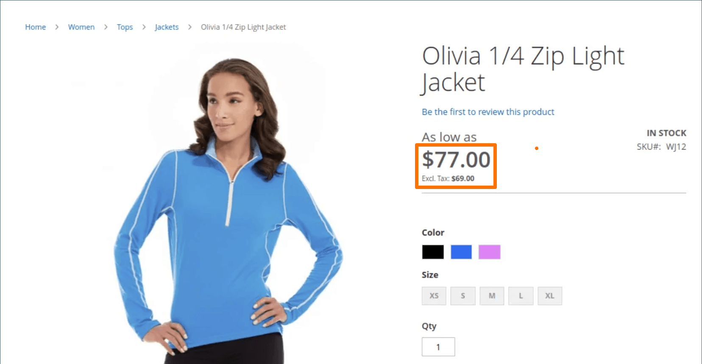

# 価格の表示設定

価格の表示設定は、製品と送料の価格に税を含めるか除外するかを決定し、価格の 2 つのバージョン（1 つは付き、もう 1 つは税なし）を表示します。

製品価格に税が含まれる場合、税金は、税源と一致する税金ルールがある場合、または顧客住所が税務処理基準と一致する場合にのみ表示されます。 一致をトリガーできるイベントには、顧客がアカウントを作成したり、ログインしたり、買い物かごから税金と送料の見積もりを生成したりする場合などがあります。

>[!IMPORTANT]
>
>税込みと税込みを含む価格を示すと、顧客にとって混乱を招く可能性があります。 警告メッセージがトリガーされないようにするには、 [ガイドライン](international-tax-guidelines.md) あなたの国にとって [推奨設定](taxes.md#warning-messages) 警告メッセージを避けるため。

{width="600" zoomable="yes"}

これらの各設定について詳しくは、 [価格の表示設定](../configuration-reference/sales/tax.md#price-display-settings) （内） _設定リファレンスガイド_.

## 価格の表示設定の指定

税金、料金および区分の計算の設定が完了すると、これらの設定に従って税金が計算されます。 ただし、ストアフロントでの顧客体験をサポートするように、カタログ、買い物かご、注文、請求書、クレジットメモでの税金の表示も設定する必要があります。

注文をおこなう前に、顧客がこれらの計算がどのように適用されるかを把握できるように、関連する税（税を含む、または税を含む税と除く税の両方）と共に価格を表示することをお勧めします。

### 手順 1：カタログ価格の表示設定を構成します

1. 次の日： _管理者_ サイドバー、移動 **[!UICONTROL Stores]** > _[!UICONTROL Settings]_>**[!UICONTROL Configuration]**.

1. 左側のパネルで、を展開します。 **[!UICONTROL Sales]** を選択します。 **[!UICONTROL Tax]**.

1. 展開  の **[!UICONTROL Price Display Settings]** 」セクションに入力します。

1. の場合 **[!UICONTROL Display Product Prices in Catalog]**、次のいずれかを選択します。

   - `Excluding Tax`
   - `Including Tax`
   - `Including and Excluding Tax`

   >[!NOTE]
   >
   >このオプションを `Including Tax`、税金基準に一致する税金基準がある場合、または税金基準に一致する顧客住所がある場合にのみ、税金が表示されます。 一致をトリガーできるイベントには、顧客アカウントの作成、ログイン、買い物かごでの税金と送料の見積もりツールの使用などがあります。

1. の場合 **[!UICONTROL Display Shipping Prices]**、次のいずれかを選択します。

   - `Excluding Tax`
   - `Including Tax`
   - `Including and Excluding Tax`

両方の価格（税込み、税抜き）を表示する場合、ストアフロントは次のようになります。

{width="700" zoomable="yes"}

### 手順 2：買い物かごの表示設定

1. 展開  の **[!UICONTROL Shopping Cart Display Settings]** 」セクションに入力します。

   {width="600" zoomable="yes"}

1. の場合 **[!UICONTROL Display Prices]**、次のいずれかを選択します。

   - `Excluding Tax`
   - `Including Tax`
   - `Including and Excluding Tax`

1. の場合 **[!UICONTROL Display Subtotal]**、次のいずれかを選択します。

   - `Excluding Tax`
   - `Including Tax`
   - `Including and Excluding Tax`

1. の場合 **[!UICONTROL Display Shipping Amount]**、次のいずれかを選択します。

   - `Excluding Tax`
   - `Including Tax`
   - `Including and Excluding Tax`

1.  (Adobe Commerceのみ ) **[!UICONTROL Display Gift Wrapping Prices]**、次のいずれかを選択します。

   - `Excluding Tax`
   - `Including Tax`
   - `Including and Excluding Tax`

1.  (Adobe Commerceのみ ) **[!UICONTROL Display Printed Card Prices]**、次のいずれかを選択します。

   - `Excluding Tax`
   - `Including Tax`
   - `Including and Excluding Tax`

1. 残りの各オプションに対して、をに切り替えます。 `Yes` または `No` 好みに応じて、次の手順に従います。

   - **[!UICONTROL Include Tax in Order Total]**
   - **[!UICONTROL Display Full Tax Summary]**
   - **[!UICONTROL Display Zero Tax Subtotal]**

### 手順 3：オーダー、請求書およびクレジット・メモの表示設定を構成します。

1. 展開  の **[!UICONTROL Orders, Invoices, Credit Memos Display Settings]** 」セクションに入力します。

   {width="600" zoomable="yes"}

1. の場合 **[!UICONTROL Display Prices]**、次のいずれかを選択します。

   - `Excluding Tax`
   - `Including Tax`
   - `Including and Excluding Tax`

1. の場合 **[!UICONTROL Display Subtotal]**、次のいずれかを選択します。

   - `Excluding Tax`
   - `Including Tax`
   - `Including and Excluding Tax`

1. の場合 **[!UICONTROL Display Shipping Amount]**、次のいずれかを選択します。

   - `Excluding Tax`
   - `Including Tax`
   - `Including and Excluding Tax`

1.  (Adobe Commerceのみ ) **[!UICONTROL Display Gift Wrapping Prices]**、次のいずれかを選択します。

   - `Excluding Tax`
   - `Including Tax`
   - `Including and Excluding Tax`

1.  (Adobe Commerceのみ ) **[!UICONTROL Display Printed Card Prices]**、次のいずれかを選択します。

   - `Excluding Tax`
   - `Including Tax`
   - `Including and Excluding Tax`

1. 残りの各オプションに対して、をに切り替えます。 `Yes` または `No` 好みに応じて、次の手順に従います。

   - **[!UICONTROL Include Tax in Order Total]**
   - **[!UICONTROL Display Full Tax Summary]**
   - **[!UICONTROL Display Zero Tax Subtotal]**

1. 完了したら、「 **[!UICONTROL Save Config]**.
