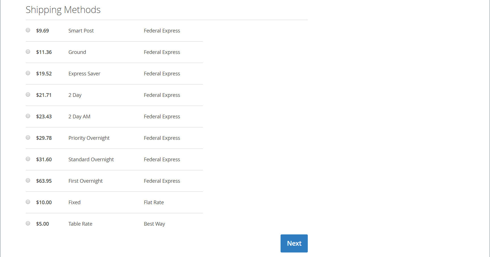

# FedEx

FedExは世界最大級の海運サービス企業であり、航空、貨物、地上輸送サービスにいくつかのレベルの優先事項を提供しています。

チェックアウト時に{width="700" zoomable="yes"}

>[!NOTE]
>
>FedExでは、[ ディメンションの重み](carriers.md#dimensional-weight)を使用して、一部の配送料を決定できます。 ただし、Adobe CommerceとMagento Open Sourceでは、重量ベースの送料の計算のみがサポートされています。

## 手順1:FedEx Web Services Productionへの登録

FedEx Web Services Production AccessのFedEx マーチャント アカウントと登録が必要です。 FedEx アカウントを作成したら、実稼動アカウント情報ページを読み取り、ページ下部の&#x200B;_実稼動キーの取得_ リンクをクリックしてキーを登録および取得します。

>[!NOTE]
>
>必ず認証キーをコピーまたは書き留めてください。 Commerceの出荷設定でFedExを設定する必要があります。

## ステップ 2：ストアでFedExを有効にする

1. _管理者_ サイドバーで、**[!UICONTROL Stores]** > _[!UICONTROL Settings]_>**[!UICONTROL Configuration]**に移動します。

1. 左側のパネルで、**[!UICONTROL Sales]**&#x200B;を展開し、**[!UICONTROL Delivery Methods]**&#x200B;を選択します。

1. **[!UICONTROL FedEx]** セクションのを展開します。

1. **[!UICONTROL Enabled for Checkout]**&#x200B;を`Yes`に設定します。

1. **[!UICONTROL Title]**&#x200B;の場合、チェックアウト時にFedExの配送方法を識別するタイトルを入力します。

1. FedEx アカウントから次の情報を入力します。

   - **[!UICONTROL Account ID]**
   - **[!UICONTROL Api Key]**
   - **[!UICONTROL Secret Key]**

1. 個別のトラッキング API資格情報がある場合は、次の設定を有効にします。

   - **[!UICONTROL Enable Tracking API credentials]**

1. FedEx アカウントから次の情報を入力します。

   - **[!UICONTROL Tracking API Key]**
   - **[!UICONTROL Tracking API Secret Key]**

1. FedEx サンドボックスを設定しており、テスト環境で作業する場合は、**[!UICONTROL Sandbox Mode]**&#x200B;を`Yes`に設定します。

   >[!NOTE]
   >
   >FedExを顧客への配送方法として提供する準備ができたら、サンドボックスモードを`No`に設定することを忘れないでください。

   {width="600" zoomable="yes"}

## ステップ 3：パッケージの説明と手数料

1. **[!UICONTROL Pickup Type]**&#x200B;を出荷時に使用する受け取り方法に設定します。

   - `DropOff at Fedex Location` - （デフォルト）は、ローカルのFedEx ステーションで荷物を脱落したことを示します。
   - `Contact Fedex to Schedule` – 受け取りをリクエストするためにFedExに連絡したことを示します。
   - `Use Scheduled Pickup` – 通常のスケジュール済み受け取りの一環として出荷が受け取られていることを示します。
   - `On Call` - FedExを呼び出してピックアップがスケジュールされていることを示します。
   - `Package Return Program` – 荷物がFedEx Ground Package Returns Programによって受け取られることを示します。
   - `Regular Stop` – 通常の受け取りスケジュールで荷物が受け取られることを示します。
   - `Tag` – 出荷受け取りがExpress タグまたはGround コールタグ受け取り要求に固有であることを示します。 これは、返送用ラベルにのみ適用されます。

1. **[!UICONTROL Packages Request Type]**&#x200B;の場合、注文を複数の配送に分割する際に、ご自身の好みに最もよく当てはまるものを選択してください。

   - `Divide to equal weight (one request)`
   - `Use origin weight (few requests)`

1. **[!UICONTROL Packaging]**&#x200B;の場合、ストアから商品を配送するために通常使用するFedEx パッケージの種類を選択します。

1. **[!UICONTROL Weight Unit]**&#x200B;を、ロケールで使用される測定単位に設定します。

   - `Pounds`
   - `Kilograms`

1. FedExの出荷に許可されている&#x200B;**[!UICONTROL Maximum Package Weight]**&#x200B;を入力します。

   デフォルトのFedEx最大重量は150 lbsです。 詳しくは、配送業者にお問い合わせください。 FedExと特別な取り決めを行っていない限り、デフォルト値をお勧めします。 詳しくは、[ ディメンションの重み](carriers.md#dimensional-weight)を参照してください。

   {width="600" zoomable="yes"}

1. 要件に応じて処理手数料オプションを設定します。

   手数料の処理はオプションで、チェックアウト時には表示されません。 処理手数料を含める場合は、次の操作を行います。

   - **[!UICONTROL Calculate Handling Fee]**&#x200B;を設定：

      - `Fixed Fee`
      - `Percentage`

   - **[!UICONTROL Handling Applied]**&#x200B;の場合、処理手数料を管理する次のいずれかの方法を選択します。

      - `Per Order`
      - `Per Package`

   - 計算方法に応じて、**[!UICONTROL Handling Fee]**&#x200B;を`fixed`額または`percentage`額として入力します。

1. 販売先がB2C （Business-to-Consumer）かB2B （Business-to-Business）かに応じて、**[!UICONTROL Residential Delivery]**&#x200B;を次のいずれかに設定します。

   - `Yes` - B2C レジデンス配信の場合。
   - `No` - B2B レジデンス配信の場合。

   {width="600" zoomable="yes"}

## ステップ 4：許可された方法と適用国

1. **[!UICONTROL Allowed Methods]**&#x200B;を、提供する各出荷方法に設定します。

   方法を選択する際には、FedEx アカウント、発送頻度とサイズ、および国際配送を許可する場合を考慮してください。 次のような手法を、必要な数だけ、または数だけ提供できます。

   - ヨーロッパ最優先
   - 配達日オプション：1日貨物、2日貨物、2日貨物、2日午前、3日貨物
   - 国内オプション – エクスプレスセーバー、地面、最初の、一晩、宅配、標準一晩
   - 国際オプション – 国際経済，国際貨物輸送，国際最初，国際地上，国際，Priority Intl
   - 優先度オプション：運賃、優先度（一晩）
   - スマート投稿メソッドを提供するスマート投稿If （**Hub ID**&#x200B;を入力）
   - 貨物オプション – 貨物、国貨物

1. FedExを通じて[送料無料](shipping-free.md) オプションを提供する場合は、送料無料オプションを設定します。

   - **[!UICONTROL Free Method]**&#x200B;を送料無料に使用する方法に設定します。 FedExを通じて送料無料を提供しない場合は、`None`を選択します。

   - FedExで送料無料の注文に該当する最低注文金額を要求するには、**[!UICONTROL Enable Free Shipping Threshold]**&#x200B;を`Enable`に設定します。 次に、最小値を&#x200B;**[!UICONTROL Free Shipping Amount Threshold]**&#x200B;に入力します。

   この設定は、標準的な送料無料の方法と似ていますが、チェックアウト時にFedEx セクションに表示されるため、顧客はどの方法が注文に使用されているかを知ることができます。

1. 必要に応じて、**[!UICONTROL Displayed Error Message]**&#x200B;を変更します。

   このテキストボックスにはデフォルトのメッセージがプリセットされていますが、FedExが使用できなくなった場合に表示する別のメッセージを入力できます。

   {width="600" zoomable="yes"}

1. **[!UICONTROL Ship to Applicable Countries]**&#x200B;を設定：

   - `All Allowed Countries` - ストア設定で指定されたすべての[国](../getting-started/store-details.md#country-options)のお客様は、この配信方法を使用できます。

   - `Specific Countries` – このオプションを選択すると、_特定国への配送_ リストが表示されます。 この配信方法を使用できるリストの各国を選択します。

1. ストアとFedEx システム間のすべての通信のログを保持する場合は、**[!UICONTROL Debug]**&#x200B;を`Yes`に設定します。

1. **[!UICONTROL Show Method if Not Applicable]**&#x200B;を設定：

   - `Yes` – 顧客の空き状況に関係なく、FedExのすべての配送方法を顧客に表示します。
   - `No` – 注文に適用されるFedExの配送方法のみを表示します。

1. **[!UICONTROL Sort Order]**&#x200B;に数値を入力して、チェックアウト時に他の配信方法と共に表示されるときにFedExが表示されるシーケンスを決定します。

   `0` = first、`1` = second、`2` = thirdなど。

1. **[!UICONTROL Save Config]**&#x200B;をクリックします。

   {width="600" zoomable="yes"}

>[!NOTE]
>
>Commerceは、配送料を計算する際に、常にFedExに注文金額を申告します。 この動作は変更できません。
