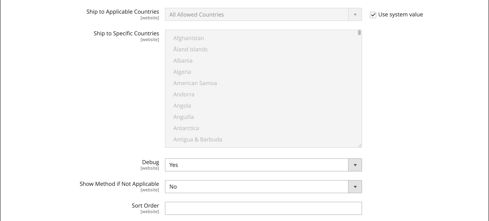

# FedEx

FedEx 社は、航空便、貨物、陸上輸送サービスを複数の優先課題で提供する世界最大級の輸送サービス企業です。

{width="700" zoomable="yes"}

>[!NOTE]
>
>FedEx は [ ディメンション重量 ](carriers.md#dimensional-weight) を使用して、配送料を決定できます。 ただし、Adobe CommerceとMagento Open Sourceでは、重量ベースの送料の計算のみをサポートしています。

## 手順 1:FedEx Web サービスの本番環境への登録

[FedEx マーチャントアカウント ][1] と、FedEx Web サービス実稼動アクセスの登録が必要です。 FedEx アカウントを作成したら、実稼動アカウントの情報ページを読み、ページの下部にある _実稼動キーを取得_ リンクをクリックして登録し、キーを取得します。

>[!NOTE]
>
>認証キーを必ずコピーまたは書き留めてください。 Commerceの配送設定で FedEx を設定する必要があります。

## 手順 2：ストアに対して FedEx を有効にする

1. _管理者_ サイドバーで、**[!UICONTROL Stores]**/_[!UICONTROL Settings]_/**[!UICONTROL Configuration]**に移動します。

1. 左側のパネルで「**[!UICONTROL Sales]**」を展開し、「**[!UICONTROL Delivery Methods]**」を選択します。

1. 「」を展開し、「**[!UICONTROL FedEx]**」セクションを展開します。

1. **[!UICONTROL Enabled for Checkout]** を `Yes` に設定します。

1. **[!UICONTROL Title]** しくは、チェックアウト時に FedEx の配送方法を識別するタイトルを入力します。

1. FedEx アカウントから以下の情報を入力します。

   - **[!UICONTROL Account ID]**
   - **[!UICONTROL Api Key]**
   - **[!UICONTROL Secret Key]**

1. FedEx サンドボックスをセットアップ済みで、テスト環境で作業する場合は、**[!UICONTROL Sandbox Mode]** を `Yes` に設定します。

   >[!NOTE]
   >
   >顧客に配送方法として FedEx を提供する準備ができたら、サンドボックスモードを `No` に設定することを忘れないでください。

   {width="600" zoomable="yes"}

## 手順 3：パッケージの説明と手数料

1. 出荷に使用する集荷方法に **[!UICONTROL Pickup Type]** を設定します。

   - `DropOff at Fedex Location` - （デフォルト）ローカルの FedEx ステーションで出荷をドロップ・オフすることを示します。
   - `Contact Fedex to Schedule` - FedEx に連絡して集荷を依頼することを示します。
   - `Use Scheduled Pickup` – 出荷が通常のスケジュール済の集荷の一部として集荷されることを示します。
   - `On Call` - FedEx を呼び出してピックアップがスケジュールされていることを示します。
   - `Package Return Program` – 出荷が FedEx Ground Package Returns プログラムによって受け取られることを示します。
   - `Regular Stop` – 出荷が通常の集荷スケジュールで集荷されることを示します。
   - `Tag` – 出荷集荷が Express タグまたは Ground コール タグの集荷要求に固有であることを示します。 これは、返品配送ラベルにのみ適用されます。

1. **[!UICONTROL Packages Request Type]** に、1 つの受注を複数の出荷に分割する場合に、作業環境を最もよく表す要求タイプを選択します。

   - `Divide to equal weight (one request)`
   - `Use origin weight (few requests)`

1. **[!UICONTROL Packaging]** しくは、通常ストアから商品を出荷するために使用する FedEx パッケージのタイプを選択します。

1. ロケールで使用される測定単位に **[!UICONTROL Weight Unit]** を設定します。

   - `Pounds`
   - `Kilograms`

1. FedEx 出荷に対して許可される **[!UICONTROL Maximum Package Weight]** を入力します。

   デフォルトの FedEx の最大重量は 150 ポンドです。 詳しくは、配送業者にお問い合わせください。 FedEx で特別な取り決めを行っていない限り、デフォルト値をお勧めします。 詳しくは、[ ディメンションの重み付け ](carriers.md#dimensional-weight) を参照してください。

   {width="600" zoomable="yes"}

1. 要件に応じて手数料オプションを設定します。

   手数料はオプションで、チェックアウト時には表示されません。 手数料を含める場合は、次の操作を行います。

   - Set **[!UICONTROL Calculate Handling Fee]**:

      - `Fixed Fee`
      - `Percentage`

   - **[!UICONTROL Handling Applied]** しくは、手数料を管理する方法として、次のいずれかを選択します。

      - `Per Order`
      - `Per Package`

   - 計算方法に応じて、**[!UICONTROL Handling Fee]** を `fixed` 額または `percentage` で入力します。

1. B2C 販売か B2B 販売かに応じて、**[!UICONTROL Residential Delivery]** を次のいずれかに設定します。

   - `Yes` - B2C レジデンシャル配信用。
   - `No` - B2B レジデンシャル配信用。

   {width="600" zoomable="yes"}

## 手順 4：許可される方法と適用国

1. 提供する出荷の各方法に **[!UICONTROL Allowed Methods]** を設定します。

   方法を選択する際は、FedEx アカウント、発送の頻度とサイズ、および国際発送を許可している場合を考慮してください。 次のようなメソッドをいくつでも好きなだけ提供できます。

   - ヨーロッパの最優先事項
   - 搬送日オプション：1 日運送費、2 日運送費、2 日、午前 2 日、運送費 3 日
   - 国内のオプション – エクスプレス セーバー、グラウンド、ファースト、オーバーナイト、宅配、スタンダード オーバーナイト
   - 国際オプション – 国際経済，Intl Economy Freight, International First, International Ground, International, Priority Intl
   - 優先オプション – 運賃、一晩での優先
   - スマートPost方式を使用するスマートPost-If （「ハブ ID **を入力**）
   - 運送費 – 運送費、全国運送費

1. FedEx を通じて [ 送料無料 ](shipping-free.md) オプションを提供したい場合は、送料無料オプションを設定します。

   - 送料無料に使用する方法に **[!UICONTROL Free Method]** を設定します。 FedEx を通じて送料無料を提供したくない場合は、`None` を選択します。

   - FedEx を使用して送料無料の注文に適合する最小注文金額を要求するには、**[!UICONTROL Enable Free Shipping Threshold]** を `Enable` に設定します。 次に、**[!UICONTROL Free Shipping Amount Threshold]** に最小値を入力します。

   この設定は、標準の送料無料の方法の設定と似ていますが、チェックアウト時に FedEx セクションに表示されるので、お客様はどの方法が注文に使用されているかを把握できます。

1. 必要に応じて、**[!UICONTROL Displayed Error Message]** を変更します。

   このテキスト ボックスには既定のメッセージがあらかじめ設定されていますが、FedEx が使用できなくなったときに表示する別のメッセージを入力できます。

   {width="600" zoomable="yes"}

1. Set **[!UICONTROL Ship to Applicable Countries]**:

   - `All Allowed Countries` - ストア設定で指定されたすべての [ 国 ](../getting-started/store-details.md#country-options) の顧客がこの配信方法を使用できます。

   - `Specific Countries` – このオプションを選択すると、「_特定の国に発送_ リストが表示されます。 リストで、この配信方法を使用できる国を選択します。

1. ストアと FedEx システム間のすべての通信のログを保持する場合は、**[!UICONTROL Debug]** を `Yes` に設定します。

1. Set **[!UICONTROL Show Method if Not Applicable]**:

   - `Yes` – 可用性に関係なく、顧客に対するすべての FedEx 配送方法を表示します。
   - `No` – 注文に適用される FedEx 配送方法のみを表示します。

1. **[!UICONTROL Sort Order]** しくは、チェックアウト時に他の配信方法と共に表示される場合の FedEx の表示順序を決定する番号を入力します。

   `0` = 1 番目、`1` = 2 番目、`2` = 3 番目など。

1. 「**[!UICONTROL Save Config]**」をクリックします。

   {width="600" zoomable="yes"}

>[!NOTE]
>
>Commerceは、配送料を計算する際に、常にフルオーダー価格を FedEx に宣言します。 この動作は変更できません。

[1]: https://www.fedex.com/login/web/jsp/contactInfo1.jsp
