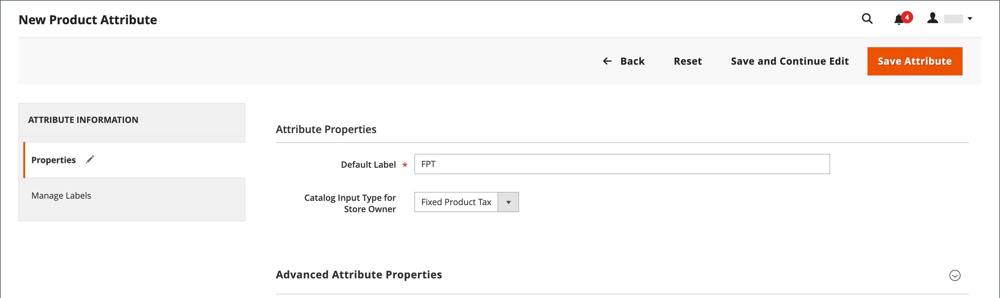
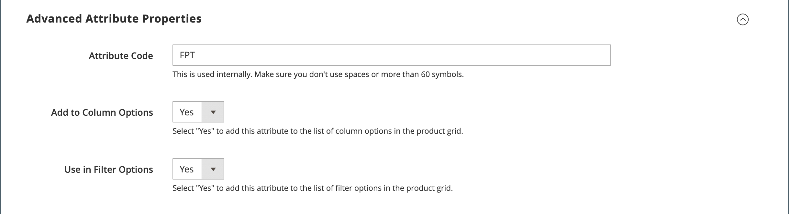
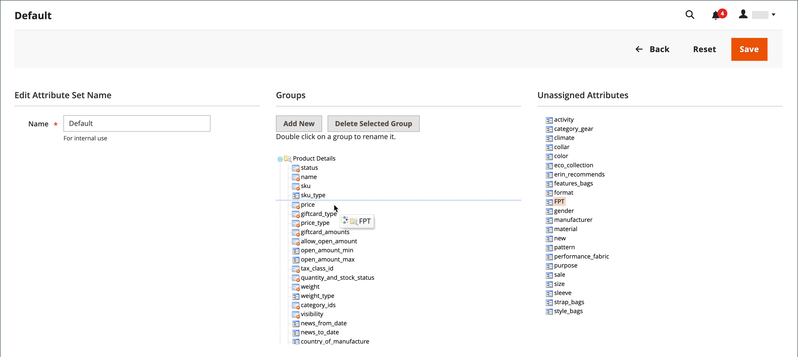

# 固定製品税（FPT）

一部の税理士法人では、特定の種類の商品に追加する必要がある固定税を設けています。 ストアの税金計算に必要に応じて、_固定製品税_ （FPT）を設定できます。 一部の国では、FPTを使用して電気電子機器廃棄物（WEEE）税を設定できます。 この税金は&#x200B;_環境税_&#x200B;または&#x200B;_環境税_&#x200B;とも呼ばれ、特定の種類の電子機器に対して回収され、リサイクルのコストを相殺します。 商品価格に対する割合ではなく、固定額です。

固定製品税は、製品に基づいて品目レベルで適用されます。 一部の法域では、この税は追加の%税の計算の対象となります。 また、税管轄区域では、製品の価格が顧客にどのように表示されるかについての規則を、税別または税別のいずれかで設定している場合もあります。 ルールを理解し、それに応じてFPT表示オプションを設定してください。

電子メールでFPTの価格を見積もる場合は、価格の違いが注文に対する顧客の信頼に影響を与える可能性があるため、注意が必要です。 例えば、FPTを表示せずに「注文レビュー」価格を表示すると、関連するFPTを含む商品を購入した顧客には、FPT税額を含む合計が表示されますが、明細は表示されません。 この価格の違いにより、予想される金額と異なるため、一部の顧客はカートを放棄する可能性があります。

## FPT表示価格

| FPT | 表示設定と計算 | |
|--- |--- |---|
| 非課税 | **[!UICONTROL Excluding FPT]** | FPTはカート内の別の行として表示され、その値は適切な税金計算で使用されます。 |
| | **[!UICONTROL Including FPT]** | FPTは品目の基準価格に追加されますが、税ルール ベースの計算には含まれません。 |
| | **[!UICONTROL Excluding FPT, FPT Description, Final Price]** | FPTの金額または説明なしで価格が表示されます。 FPTは税ルール ベースの計算には含まれません。 |
| 課税済み | **[!UICONTROL Excluding FPT]** | FPTはカート内の別の行として表示され、その値は適切な税金計算で使用されます。 |
| | **[!UICONTROL Including FPT]** | FPTは商品の価格に含まれており、税金計算の変更は必要ありません。 |
| | **[!UICONTROL Excluding FPT, FPT Description, Final Price]** | FPTの金額または説明なしで価格が表示されます。 ただし、FPTは税ルールベースの計算に含まれます。 |

{style="table-layout:auto"}

## FPTの設定

固定製品税（FPT） [入力タイプ ](../catalog/attributes-input-types.md)は、各地域の税を管理するためのフィールドのセクションを作成します。

次の手順では、「エコタックス」を例に、ストアの固定商品税を設定する方法を示します。 税金の範囲と税金が適用される国と州を設定した後、選択したオプションに応じて、入力フィールドは現地の要件に応じて変更できます。 詳しくは、[製品属性の作成](../catalog/attribute-product-create.md)を参照してください。

### 手順1：固定製品税の有効化

1. _管理者_ サイドバーで、**[!UICONTROL Stores]** > _[!UICONTROL Settings]_>**[!UICONTROL Configuration]**に移動します。

1. 左側のパネルで、**[!UICONTROL Sales]**&#x200B;を展開し、**[!UICONTROL Tax]**&#x200B;を選択します。

1. **[!UICONTROL Fixed Product Taxes]** セクションのを展開します。

1. **[!UICONTROL Enable FPT]**&#x200B;を`Yes`に設定します。

1. 店舗価格での固定商品税の使用方法を判断するには、次の価格表示場所ごとにFPT設定を選択します。

   - **[!UICONTROL Display Prices in Product Lists]**
   - **[!UICONTROL Display Prices on Product View Page]**
   - **[!UICONTROL Display Prices in Sales Modules]**
   - **[!UICONTROL Display Prices in Emails]**

   オプション（それぞれ同じ）:

   - `Including FPT Only`
   - `Including FPT and FPT description`
   - `Excluding FPT. Including FPT description and final price`
   - `Excluding FPT`

1. 必要に応じて&#x200B;**[!UICONTROL Apply Tax to FPT]**&#x200B;を設定します。

1. 必要に応じて&#x200B;**[!UICONTROL Include FPT in Subtotal]**&#x200B;を設定します。

   {width="600" zoomable="yes"}

   これらの各構成設定の詳細については、_構成リファレンスガイド_&#x200B;の[固定製品税](../configuration-reference/sales/tax.md#fixed-product-taxes)を参照してください。

1. 完了したら、**[!UICONTROL Save Config]**&#x200B;をクリックします。

### 手順2:FPT属性の作成

1. _管理者_ サイドバーで、**[!UICONTROL Stores]** > _[!UICONTROL Attributes]_>**[!UICONTROL Product]**に移動します。

1. 右上隅の「**[!UICONTROL Add New Attribute]**」をクリックし、次の操作を行います。

   - **[!UICONTROL Default Label]**&#x200B;に、属性を識別するラベルを入力します。

   - **[!UICONTROL Catalog Input for Store Owner]**&#x200B;を`Fixed Product Tax`に設定します。

   {width="600" zoomable="yes"}

1. **[!UICONTROL Advanced Attribute Properties]** セクションのを展開し、プロパティオプションを設定します。

   - **[!UICONTROL Attribute Code]** - スペースや特殊文字を使用せずに、一意の識別子を小文字で入力します。 最大長は30文字です。 「デフォルトラベル」フィールドのテキストに対して、フィールドを空白のままにできます。

   - **[!UICONTROL Add to Column Options]** - FPT フィールドを[製品リスト ](../catalog/products-list.md)に表示する場合は、`Yes`に設定します。

   - **[!UICONTROL Use in Filter Options]** - FPT フィールドの値に基づいてグリッド内の商品を[ フィルター](../getting-started/admin-workspace.md)できるようにする場合は、`Yes`に設定します。

   {width="600" zoomable="yes"}

1. （オプション）左側のパネルで「**[!UICONTROL Manage Labels]**」を選択し、各ストアビューのデフォルトラベルの代わりに使用するラベルを入力します。

   {width="600" zoomable="yes"}

1. 完了したら、**[!UICONTROL Save Attribute]**&#x200B;をクリックします。

1. プロンプトが表示されたら、[ キャッシュ ](../systems/cache-management.md)を更新します。

### 手順3：属性セットにFPT属性を追加する

1. _管理者_ サイドバーで、**[!UICONTROL Stores]** > _[!UICONTROL Attributes]_>**[!UICONTROL Attribute Set]**に移動します。

1. リストで、属性セットをクリックして、レコードを編集モードで開きます。

   {width="600" zoomable="yes"}

1. 右側の&#x200B;**[!UICONTROL Unassigned Attributes]**&#x200B;のリストからFPT属性を中央の列の&#x200B;**[!UICONTROL Groups]** リストにドラッグします。

   各グループフォルダーは、製品情報のセクションに対応します。 商品を編集モードで開いたときに、表示する場所に属性を配置できます。

   {width="600" zoomable="yes"}

1. 完了したら、**[!UICONTROL Save]**&#x200B;をクリックします。

1. 固定製品税を含める必要がある各属性セットについて、この手順を繰り返します。

### ステップ 4：特定の製品にFPTを適用する

1. _管理者_ サイドバーで、**[!UICONTROL Catalog]** > **[!UICONTROL Products]**&#x200B;に移動します。

1. 固定製品税が必要な製品を編集モードで開きます。

1. 属性セットに追加したフィールドの&#x200B;**[!UICONTROL FPT]** セクションを見つけて、**[!UICONTROL Add Tax]**&#x200B;をクリックします。

1. 製品に適用される税金を指定します。

   {width="600" zoomable="yes"}

   - Commerce インスタンスに複数のweb サイトがある場合は、適切な&#x200B;**[!UICONTROL Website]**&#x200B;と基本通貨を選択します。 この例では、フィールドはデフォルトで`All Websites [USD]`に設定されています。

   - 固定製品税が適用される地域に&#x200B;**[!UICONTROL Country/State]**&#x200B;を設定します。

   - **[!UICONTROL Tax]**&#x200B;の場合、固定製品税を10進法の金額として入力します。

1. さらに固定製品税を追加するには、**[!UICONTROL Add Tax]**&#x200B;をクリックして、このプロセスを繰り返します。

1. 完了したら、**[!UICONTROL Save]**&#x200B;をクリックします。
