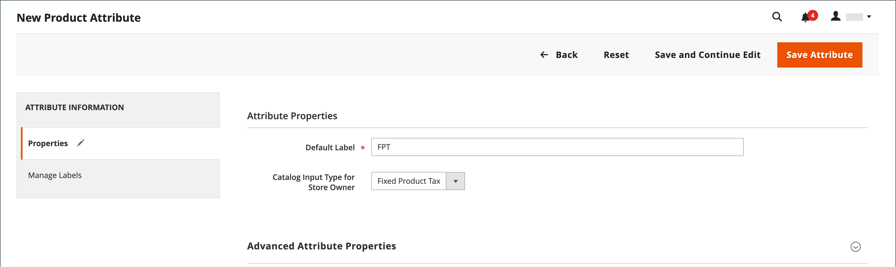
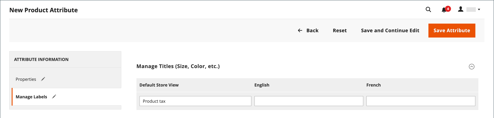
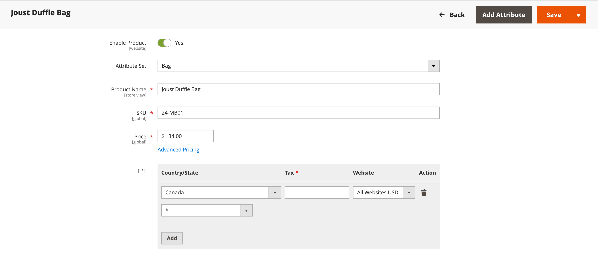

# 固定製品税 (FPT)

一部の税管轄地域には、特定の種類の製品に追加する必要がある固定税が含まれています。 次の設定を行うことができます： _固定製品税_ (FPT) を設定します。 一部の国では、FPT を使用して Waste Electrical and Electronic Equipment(WEEE) 税を設定することができます。 この税は、 _生態学的税_ または _エコ税_、およびは、リサイクルコストを相殺するために、特定のタイプのエレクトロニクスに収集されます。 製品価格のパーセンテージではなく、固定金額です。

固定の製品税は、製品に基づいて品目レベルで適用されます。 一部の地域では、この税は追加の%税計算の対象となります。 税金管轄区域には、税金の有無にかかわらず、顧客に対する製品価格の表示に関するルールが含まれている場合もあります。 ルールを理解し、それに応じて FPT 表示オプションを設定してください。

FPT の価格をメールで見積もる際は、価格の違いが注文に対する顧客の信頼に影響を与える可能性があるので、注意が必要です。 例えば、FPT を表示せずに「受注確認価格」を表示した場合、関連 FPT を持つ品目を購入した顧客には、FPT 税額を含むが項目別内訳は含まれない合計が表示されます。 価格の違いは、合計が予想額と異なるので、一部の顧客が買い物かごを放棄する可能性があります。

## FPT 表示価格

| FPT | 設定と計算を表示 | |
|--- |--- |---|
| 課税なし | **[!UICONTROL Excluding FPT]** | FPT は、買い物かご内の別の行として表示され、その値は適切な税金計算に使用されます。 |
| | **[!UICONTROL Including FPT]** | FPT は品目の基準価格に追加されますが、税金ルールベースの計算には含まれません。 |
| | **[!UICONTROL Excluding FPT, FPT Description, Final Price]** | 価格は、FPT の金額や説明なしで表示されます。 FPT は、税ルールベースの計算に含まれません。 |
| 課税済み | **[!UICONTROL Excluding FPT]** | FPT は、買い物かご内の別の行として表示され、その値は適切な税金計算に使用されます。 |
| | **[!UICONTROL Including FPT]** | FPT は品目の価格に含まれ、税金計算に対する変更は不要です。 |
| | **[!UICONTROL Excluding FPT, FPT Description, Final Price]** | 価格は、FPT の金額や説明なしで表示されます。 ただし、FPT は税ルールベースの計算に含まれます。 |

{style="table-layout:auto"}

## FPT を設定

固定製品税 (FPT) [入力タイプ](../catalog/attributes-input-types.md) 各リージョンの税金を管理するためのフィールドのセクションを作成します。

次の手順は、「エコタックス」を例として使用して、店舗に対して固定製品タックスを設定する方法を示しています。 税の範囲を設定し、税が適用される国と州を設定した後、選択したオプションに応じて、入力フィールドが地域の要件に応じて変わる場合があります。 詳しくは、 [製品属性の作成](../catalog/attribute-product-create.md).

### 手順 1：固定製品税の有効化

1. 次の日： _管理者_ サイドバー、移動 **[!UICONTROL Stores]** > _[!UICONTROL Settings]_>**[!UICONTROL Configuration]**.

1. 左側のパネルで、を展開します。 **[!UICONTROL Sales]** を選択します。 **[!UICONTROL Tax]**.

1. 展開  の **[!UICONTROL Fixed Product Taxes]** 」セクションに入力します。

1. 設定 **[!UICONTROL Enable FPT]** から `Yes`.

1. 固定商品税が店舗価格でどのように使用されるかを決定するには、次の価格表示場所ごとに FPT 設定を選択します。

   - **[!UICONTROL Display Prices in Product Lists]**
   - **[!UICONTROL Display Prices on Product View Page]**
   - **[!UICONTROL Display Prices in Sales Modules]**
   - **[!UICONTROL Display Prices in Emails]**

   オプション（それぞれ同じ）:

   - `Including FPT Only`
   - `Including FPT and FPT description`
   - `Excluding FPT. Including FPT description and final price`
   - `Excluding FPT`

1. 設定 **[!UICONTROL Apply Tax to FPT]** 必要に応じて。

1. 設定 **[!UICONTROL Include FPT in Subtotal]** 必要に応じて。

   {width="600" zoomable="yes"}

   これらの各設定について詳しくは、 [固定製品税](../configuration-reference/sales/tax.md#fixed-product-taxes) （内） _設定リファレンスガイド_.

1. 完了したら、「 **[!UICONTROL Save Config]**.

### 手順 2:FPT 属性の作成

1. 次の日： _管理者_ サイドバー、移動 **[!UICONTROL Stores]** > _[!UICONTROL Attributes]_>**[!UICONTROL Product]**.

1. 右上隅で、 **[!UICONTROL Add New Attribute]** 次の操作を実行します。

   - の場合 **[!UICONTROL Default Label]**」で、属性を識別するラベルを入力します。

   - 設定 **[!UICONTROL Catalog Input for Store Owner]** から `Fixed Product Tax`.

   {width="600" zoomable="yes"}

1. 展開  の **[!UICONTROL Advanced Attribute Properties]** セクションに移動して、次のプロパティオプションを設定します。

   - **[!UICONTROL Attribute Code]**  — 一意の識別子を、スペースや特殊文字を含まない小文字で入力します。 最大長は 30 文字です。 「デフォルトのラベル」フィールドのテキストに対しては、フィールドを空白のままにすることができます。

   - **[!UICONTROL Add to Column Options]** - FPT フィールドを [製品リスト](../catalog/products-list.md)、に設定 `Yes`.

   - **[!UICONTROL Use in Filter Options]**  — 次の操作を実行できるようにする場合 [フィルター](../getting-started/admin-workspace.md) 「FPT」フィールドの値に基づくグリッド内の製品は、に設定します。 `Yes`.

   {width="600" zoomable="yes"}

1. （オプション）左側のパネルで、 **[!UICONTROL Manage Labels]** 各ストアビューのデフォルトのラベルの代わりに使用するラベルを入力します。

   {width="600" zoomable="yes"}

1. 完了したら、「 **[!UICONTROL Save Attribute]**.

1. プロンプトが表示されたら、 [キャッシュ](../systems/cache-management.md).

### 手順 3:FPT 属性を属性セットに追加する

1. 次の日： _管理者_ サイドバー、移動 **[!UICONTROL Stores]** > _[!UICONTROL Attributes]_>**[!UICONTROL Attribute Set]**.

1. リストで、属性セットをクリックして、レコードを編集モードで開きます。

   {width="600" zoomable="yes"}

1. FPT 属性を **[!UICONTROL Unassigned Attributes]** ～の右側に **[!UICONTROL Groups]** リストを中央の列に追加します。

   各グループフォルダは、製品情報のセクションに対応しています。 製品が編集モードで開いているときに、任意の場所に属性を配置できます。

   {width="600" zoomable="yes"}

1. 完了したら、「 **[!UICONTROL Save]**.

1. 固定製品税を含める必要がある属性セットごとに、この手順を繰り返します。

### 手順 4：特定の製品に FPT を適用する

1. 次の日： _管理者_ サイドバー、移動 **[!UICONTROL Catalog]** > **[!UICONTROL Products]**.

1. 固定製品税が必要な製品を編集モードで開きます。

1. 次を検索： **[!UICONTROL FPT]** 属性セットに追加したフィールドのセクションで、 **[!UICONTROL Add Tax]**.

1. 製品の適用税を指定します。

   {width="600" zoomable="yes"}

   - コマースインスタンスに複数の Web サイトがある場合は、適切な **[!UICONTROL Website]** 基準通貨。 この例では、フィールドはデフォルトでに設定されています。 `All Websites [USD]`.

   - 設定 **[!UICONTROL Country/State]** 固定製品税が適用されるリージョンに対して。

   - の場合 **[!UICONTROL Tax]**、固定製品税を小数で入力します。

1. 固定商品税を追加するには、 **[!UICONTROL Add Tax]** プロセスを繰り返します。

1. 完了したら、「 **[!UICONTROL Save]**.
