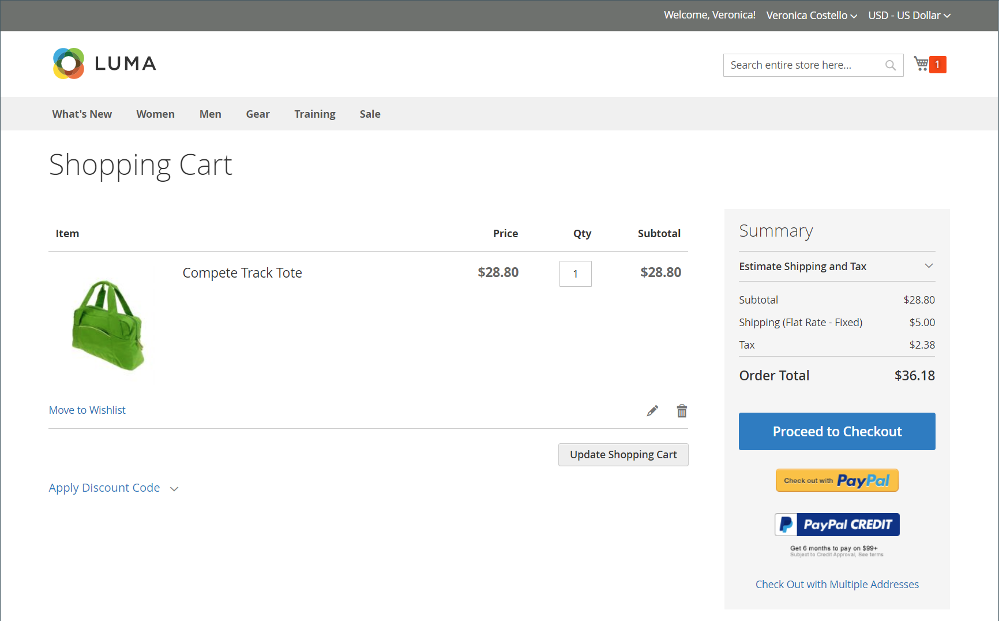

# ストアと購入体験の概要

Adobe CommerceとMagento Open Sourceは、オンラインストアと顧客の購入体験を構築および管理するための包括的な機能セットを提供します。 Commerce インスタンス内では、web サイト、ストア、ビューのストア階層を管理できます。 また、商品や顧客グループの税クラスを含む、複数のロケール用のストアを実行するために必要な税金と通貨レートを設定することもできます。

## ストア構造

Adobe CommerceまたはMagento Open Sourceの 1 つのインスタンスで、異なる属性やコンテンツを使用する複数のサイト、ストア、ストアビューをサポートできます。 一般的なシナリオは、異なるドメインに異なるオプションを持つストアを設定することです。 例えば、あるドメインにカテゴリと製品のセットを、別の言語で別のドメインにカテゴリと製品のセットを作成するとします。 マーチャントは、管理画面で web サイト、ストア、ストア表示を設定できます。

[ 階層 ](stores.md) を定義すると、[ 範囲 ](../getting-started/websites-stores-views.md#scope-settings) に応じて設定を適用できるので、各サイト、ストア、ストアの表示で、必要な製品カタログとストアフロントのエクスペリエンスを提供できます。

## POI

Adobe CommerceとMagento Open Sourceは、注文が送信される前に SKU と商品の可用性を自動的に確認することで、注文エラーを減らします。 [ 買い物かご ](cart.md) および [ チェックアウトオプション ](checkout-process.md) を設定して、トランザクションから配信まで、最適な購入エクスペリエンスを提供できます。 アカウントにログインしている顧客は、情報の多くが既にアカウントに存在するので、すばやくチェックアウトを完了できます。 _チェックアウト_ ページでは、注文トランザクションを完了するためのプロセスの各ステップを通じて顧客をリードします。 [ 即時購入 ](checkout-instant-purchase.md) をアクティブ化すると、顧客は、アカウントに保存された情報を使用して、チェックアウトプロセスを迅速に実行できます。

>[!TIP]
>
> Adobe Commerce B2B のインストールとイネーブルメントを使用すると、会社アカウントに関連付けられているお客様に対して _クイックオーダー_ を設定できます。 この機能により、注文する商品の名前や SKU がわかっている場合の注文プロセスが数回のクリックに短縮されます。 また、会社アカウントの譲渡可能見積もりのサポートを設定することもできます。 B2B 機能について詳しくは、[Adobe Commerce B2B ユーザーガイド ](https://experienceleague.adobe.com/docs/commerce-admin/b2b/introduction.html) を参照してください。

## 買い物かご支援

お客様が購入を完了するために支援が必要な場合があります。 一部のお客様はオンラインで買い物するのが好きですが、電話で注文することを好みます。 お店でアカウントを登録したゲストと顧客の両方にすぐに支援を提供できます。

- [買い物かごの管理](shopping-assisted-cart-manage.md)
- 登録顧客の [ 注文の作成 ](customer-account-create-order.md)
- [注文を更新](order-update.md)

{width="700" zoomable="yes"}

次のビデオで、販売者支援による買い物について説明します。

>[!VIDEO](https://video.tv.adobe.com/v/343662/?quality=12)

## オーダー管理と運用

管理者では、マーチャントは注文ワークフローの各ステージの情報にアクセスし、注文を処理できます。

- [ 注文 ](orders.md) ページでは、現在のすべての注文が一覧にわかりやすく表示されます。また、顧客の代わりに既存の注文を編集、処理したり、注文を作成したりするツールが含まれます。

- [ 請求書 ](invoices.md) ページには、一時的な受注に基づいた請求書が一覧表示され、その受注の永続的な記録が提供されます。

- 「[ 出荷 ](shipments.md)」ページには、出荷準備が完了した各請求書の出荷記録がリストされます。

- [ クレジットメモ ](credit-memos.md) ページを使用すると、マーチャントはクレジットメモを処理および管理できます。クレジットメモは、顧客に支払う金額を表示するドキュメントです。 金額は、購入に対して適用することも、顧客に払い戻すこともできます。

-  （Adobe Commerceのみ） [ 返品 ](returns.md) ページには、現在の返品要求（RMA）が一覧表示され、新しい返品要求を入力するために使用されます。

- [ トランザクション ](transactions.md) ページには、ストアと支払いシステムの間で発生したすべての支払いアクティビティが一覧表示され、より詳細な情報にアクセスできます。

## 発送および配信

複数の [ 配信方法 ](delivery.md) を選択して顧客に提供する店舗は、単一の方法を使用する店舗よりもコンバージョン率が高いことが、調査で示されています。 管理者は、マーチャントが複数の配信方法や [ 配送業者 ](carriers.md) を設定し、[ 配送ラベル ](shipping-labels.md) を印刷するために使用できる様々なツールを提供します。
