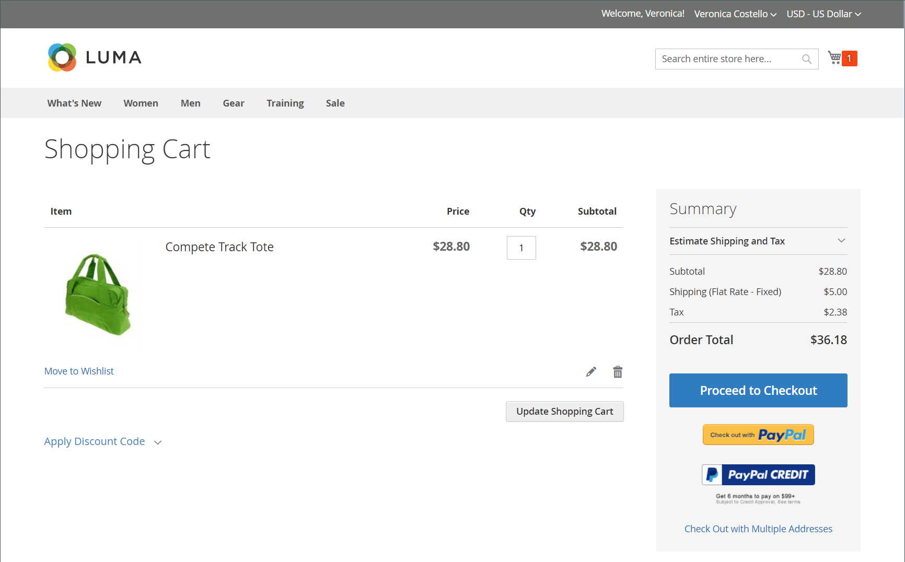

# ストア体験と購入体験の概要

Adobe CommerceとMagento Open Sourceは、オンラインストアを構築および管理し、購買体験を向上させるための包括的な機能を提供します。 Commerce インスタンス内では、web サイト、ストア、ビューのストア階層を管理できます。 商品や顧客グループの税区分など、複数のロケールのストアを実行するために必要な税金と通貨レートを設定することもできます。

## ストア構造

Adobe CommerceまたはMagento Open Sourceの1つのインスタンスで、異なる属性やコンテンツを使用する複数のサイト、ストア、ストアビューをサポートできます。 典型的なシナリオは、異なるドメインにさまざまなオプションを持つストアを設定することです。 たとえば、あるドメインにあるカテゴリと商品のセットと、別の言語にある別のドメインにあるカテゴリと商品のセットを使用することができます。 マーチャントは、管理画面でweb サイト、ストア、ストアビューを設定できます。

[階層](stores.md)が定義されている場合、[&#x200B; スコープ &#x200B;](../getting-started/websites-stores-views.md#scope-settings)に従って構成設定を適用して、各サイト、ストア、およびストアビューで製品カタログとストアフロントのエクスペリエンスを提供することができます。

## POS

Adobe CommerceとMagento Open Sourceは、注文が送信される前に、すべての商品のSKUと在庫状況を自動的に確認することで、注文ミスを減らします。 トランザクションから配信まで、最適な購入エクスペリエンスを提供するように、[買い物かご](cart.md)と[&#x200B; チェックアウトオプション &#x200B;](checkout-process.md)を設定できます。 アカウントにログインしている顧客は、多くの情報が既にアカウント内にあるため、チェックアウトをすばやく完了できます。 _チェックアウト_ ページは、注文トランザクションを完了するためのプロセスの各ステップを通じて顧客をリードします。 [即時購入](checkout-instant-purchase.md)を有効にすると、顧客はアカウントに保存されている情報を使用して、チェックアウトプロセスをスピードアップできます。

>[!TIP]
>
> Adobe Commerce B2Bのインストールと有効化を使用すると、会社アカウントに関連付けられたお客様に対して&#x200B;_クイックオーダー_&#x200B;を設定できます。 この機能を利用すれば、顧客が注文する商品の名前またはSKUを把握したうえで、数回のクリックで注文プロセスを完了できます。 会社アカウントの交渉可能な見積のサポートを設定することもできます。 B2B機能について詳しくは、[Adobe Commerce B2B ユーザーガイド &#x200B;](https://experienceleague.adobe.com/docs/commerce-admin/b2b/introduction.html)を参照してください。

## ショッピング支援

時には、顧客は購入を完了するために支援を必要としています。 一部の顧客はオンラインでのショッピングを好むが、電話での注文を好む。 お客様の店舗でアカウントを登録したゲストと顧客の両方に、すぐにサポートを提供できます。

- [買い物かごの管理](shopping-assisted-cart-manage.md)
- 登録済み顧客の[注文を作成](customer-account-create-order.md)
- [注文の更新](order-update.md)

{width="700" zoomable="yes"}

このビデオを見て、売り手が支援するショッピングについて説明します。

>[!VIDEO](https://video.tv.adobe.com/v/343662/?quality=12&learn=on)

## 注文管理とオペレーション

管理画面では、注文ワークフローの各段階で情報にアクセスし、注文を処理することができます。

- [注文](orders.md) ページには、現在のすべての注文の一覧が表示され、顧客の代理で注文を作成したり、既存の注文を編集および処理したりするツールが含まれています。

- [請求書](invoices.md) ページのリスト請求書は一時的な販売注文に基づいており、注文の永続的な記録を提供します。

- [発送](shipments.md) ページには、発送準備が整った各請求書の発送レコードが一覧表示されます。

- [&#x200B; クレジットメモ &#x200B;](credit-memos.md) ページでは、顧客に支払われる金額を示す文書であるクレジットメモを処理および管理できます。 金額は購入に適用されるか、顧客に返金されます。

-  （Adobe Commerceのみ） [返品](returns.md) ページには、現在返品された商品リクエスト（RMA）が一覧表示され、新しい返品リクエストを入力するために使用されます。

- [&#x200B; トランザクション &#x200B;](transactions.md) ページには、ストアと支払いシステムの間で行われたすべての支払いアクティビティが一覧表示され、より詳細な情報にアクセスできます。

## 発送

調査によると、顧客が複数の[配信方法](delivery.md)を選択できる店舗は、単一の方法を使用する店舗よりもコンバージョン率が高いことが示されています。 管理者は、販売者が複数の配送方法と[配送業者](carriers.md)を設定し、[配送ラベル &#x200B;](shipping-labels.md)を印刷するために使用できる様々なツールを提供します。
