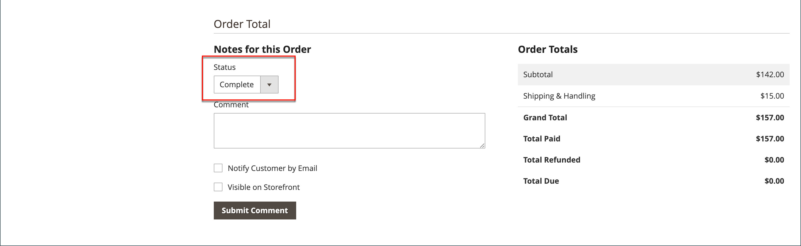

# 請求書

請求書は、注文の支払い記録のレコードです。 複数の請求書を使用できます [作成済み](#create-an-invoice) 1 回の注文の場合、各注文には、指定した数の購入済み製品を含めることができます。 また、 [印刷可能なPDF請求書](#print-invoices) 顧客向けのセールスドキュメントとして。

次の日： _管理者_ サイドバー、移動 **[!UICONTROL Sales]** > _運用_ > **請求書** 開く _請求書_ グリッドに移動し、作成した請求書にアクセスします。

{width="700" zoomable="yes"}

## 列の説明

| 列 | 説明 |
|--- |--- |
| [!UICONTROL Select] | アクションの対象となる引用符のチェックボックスをオンにするか、列ヘッダーの選択コントロールを使用します。 オプション： `Select All` / `Deselect All` |
| [!UICONTROL Invoice] | 請求書が管理者から送信されたときに割り当てられる一意の数値識別子。 請求書の詳細を表示すると、この番号は見積もり名ではなく、ページの上部に表示されます。 |
| [!UICONTROL Invoice Date] | 管理者が最初に請求書を発行した日時。 |
| [!UICONTROL Order#] | 注文が購入者によって行われた際に割り当てられる一意の数値識別子。 請求書の詳細を表示すると、この番号は「注文とアカウント情報」ブロックにリンクとして表示されます。 |
| [!UICONTROL Order Date] | 顧客が最初に正常に注文した日時。 |
| [!UICONTROL Bill-to Name] | 注文の支払いを担当する人の名前。 |
| [!UICONTROL Status] | 請求書の現在の状態を示します。 ステータスは、購入者または販売者の側のアクションによってのみ変更できます。 |
| [!UICONTROL Grand Total (Base)] | 購入する製品の合計価格。 合計金額は、Web サイトのベース通貨とストアフロントの通貨で表示されます。 |
| [!UICONTROL Grand Total (purchase)] | 注文で購入された製品の総計。 合計金額は、Web サイトのベース通貨とストアフロントの通貨で表示されます。 |
| [!UICONTROL Purchased From] | 請求書の作成元となった Web サイト/ストア/ストア表示。 |
| [!UICONTROL Billing Address] | 注文をした顧客の請求先住所。 |
| [!UICONTROL Shipping Address] | 注文が発送される住所。 |
| [!UICONTROL Customer Name] | 請求書を受け取る顧客の氏名。 |
| [!UICONTROL Email] | 請求書を受け取る顧客の電子メールアドレス。 |
| [!UICONTROL Customer Group] | 請求書を受け取る顧客に割り当てられた顧客グループ。 |
| [!UICONTROL Payment Method] | 支払いに使用する支払い方法。 |
| [!UICONTROL Shipping Information] | 注文の出荷に使用するメソッド。 |
| [!UICONTROL Subtotal] | 注文の小計、送料および処理なし、および税。 |
| [!UICONTROL Shipping and Handling] | 送料と処理に請求された金額。 |
| [!UICONTROL Action] | **[!UICONTROL View]**  — 請求書を編集モードで開きます。 |

{style="table-layout:auto"}

## 請求書の作成

注文の請求書を作成すると、キャンセルまたは変更できない状態に移行します。 新しい請求書ページは、注文の完了と似ていますが、追加のフィールドが表示されます。 注文に関連するすべてのアクティビティは、請求書の「コメント」セクションに記載されます。

通常、注文は、発送プロセスの開始時に請求およびキャプチャされます。 支払い方法が発注書の場合、または [支払手続](../configuration-reference/sales/payment-methods.md#payment-actions) が `Authorize and Capture`の場合、注文は請求済みで、支払いはチェックアウト時にキャプチャされます。 梱包明細を含む請求書を生成し、配送業者アカウントから配送ラベルも印刷できます。 1 つの注文を部分出荷に分割し、必要に応じて、個別に請求を行います。

新しい注文の状態が `Processing`、に対するオプション _すべての項目を自動的に請求_ が設定で使用可能になります。 一部のクレジットカード支払い方法は、プロセスの一部として請求手順を完了します。 [支払手続](../configuration-reference/sales/payment-methods.md#payment-actions) が `Authorize and Capture`. この場合、「請求書」ボタンは表示されず、注文は出荷可能な状態になっています。

>[!NOTE]
>
>請求書は、 `Gift Card`, `Store Credit`, `Reward Points`、またはその他のオフラインの支払い方法。

注文の請求書は、印刷する前に生成する必要があります。 PDFを表示または印刷するには、まず、次のようなPDFリーダーをダウンロードしてインストールします。 [Adobe Acrobat Reader][1].

**_受注を請求する手順は、次のとおりです。_**

1. 次の日： _管理者_ サイドバー、移動 **[!UICONTROL Sales]** > _[!UICONTROL Operations]_>**[!UICONTROL Orders]**.

1. ステータスが「 」の販売注文を検索します `Processing` グリッド内に表示されます。 次に、以下の手順を実行します。

1. Adobe Analytics の _アクション_ 列、クリック **[!UICONTROL View]**.

1. 販売注文のヘッダーで、 **[!UICONTROL Invoice]** オプション。

   >[!NOTE]
   >
   >The _[!UICONTROL Invoice]_オプションは、 [支払手続](../configuration-reference/sales/payment-methods.md#payment-actions) の [支払方法](../configuration-reference/sales/payment-methods.md) が `Authorize and Capture`：請求書を自動生成します。 また、注文が行われ、支払い方法の支払い処理が `Authorize` 注文は請求済みです。

   {width="700" zoomable="yes"}

   新しい請求書ページは、完了した注文ページに似ており、追加のフィールドを編集できます。

1. 品目が出荷準備が整っている場合は、請求書の作成と同時に出荷の梱包明細を生成します。

   - Adobe Analytics の _配送先情報_ セクションで、 **[!UICONTROL Create Shipment]** チェックボックスをオンにして選択します。

     出荷レコードは、請求書が生成されるのと同時に作成されます。

   - トラッキング番号を含める：

      - クリック **[!UICONTROL Add Tracking Number]**.
      - トラッキング情報を入力します。 _[!UICONTROL Carrier]_,_[!UICONTROL Title]_、および _[!UICONTROL Number]_

     {width="600" zoomable="yes"}

   - 必要に応じて、請求書の一部を生成します。

      - Adobe Analytics の _請求する品目_ セクション、 **[!UICONTROL Qty to Invoice]** 列を使用して、請求書に特定の品目のみを含めます。
      - 次に、「 **[!UICONTROL Update Qty's]**.

        {width="600" zoomable="yes"}

1. 注文にオンライン支払い方法が使用された場合は、 **[!UICONTROL Amount]** を適切なオプションに追加します。

1. 請求書の生成時に顧客に電子メールで通知するには、次の手順を実行します。

   - を選択します。 **[!UICONTROL Email Copy of Invoice]** チェックボックス。

   - 任意を入力 **[!UICONTROL Invoice Comments]**. 通知 E メールにコメントを含めるには、 **[!UICONTROL Append Comments]** チェックボックス。

1. 完了したら、「 **[!UICONTROL Submit Invoice]** をクリックします。

   **_オンライン支払い方法：_**

   {width="600" zoomable="yes"}

   **_オフラインの支払い方法：_**

   {width="600" zoomable="yes"}

   注文のステータスが次の値から変わります： `Pending` から `Complete`.

   {width="600" zoomable="yes"}

## 請求書の印刷

請求書は、個別に印刷することも、バッチとして印刷することもできます。 ただし、請求書を印刷する前に、まず注文に対して請求書を生成する必要があります。 印刷可能なPDF請求書用に高解像度のロゴをアップロードし、 [注文 ID](../stores-purchase/sales-documents.md#add-reference-ids) 」と入力します。 ロゴと住所を使用して請求書テンプレートをカスタマイズするには、 [PDFロゴの要件](../stores-purchase/sales-documents.md#image-formats).

>[!NOTE]
>
>PDFを表示または印刷するには、PDFリーダーが必要です。 ダウンロード可能 [Adobe Reader][1] 無料で

### 単一の請求書を印刷します

1. 次の日： _管理者_ サイドバー、移動 **[!UICONTROL Sales]** > _[!UICONTROL Operations]_>**[!UICONTROL Invoices]**.

1. Adobe Analytics の _[!UICONTROL Invoices]_グリッドで、請求書を検索し、**[!UICONTROL View]**（内）_&#x200B;アクション&#x200B;_列。

1. 請求書の上部で、「 **[!UICONTROL Print]** 請求書のPDFを生成する場合。

1. 生成したPDFをファイルに保存するか、印刷します。

### 複数の請求書の印刷

1. 次の日： _管理者_ サイドバー、移動 **[!UICONTROL Sales]** > _[!UICONTROL Operations]_>**[!UICONTROL Invoices]**.

1. Adobe Analytics の _[!UICONTROL Invoices]_「グリッド」で、印刷する各請求書のチェックボックスを選択します。

1. を設定します。 **[!UICONTROL Actions]** ～を制御する `PDF Invoices`.

   {width="600" zoomable="yes"}

請求書は、プリンターに送信または保存できる単一のPDFファイルに保存されます。

## リソースのトラブルシューティング

請求書の問題のトラブルシューティングについては、次を参照してください。 _コマースサポートナレッジベース_ 記事：

- [仮想およびシンプルな製品をバンドルして請求することはできません](https://experienceleague.adobe.com/docs/commerce-knowledge-base/kb/support-tools/patches/v1-0-9/mdva-30889-magento-patch-can-t-invoice-bundle-products-virtual-and-simple.html)
- [店舗クレジット情報のない請求書](https://experienceleague.adobe.com/docs/commerce-knowledge-base/kb/support-tools/patches/v1-0-8/mdva-31150-magento-patch-invoice-without-store-credit-info.html)
- [100%割引の請求書に税が表示されます](https://experienceleague.adobe.com/docs/commerce-knowledge-base/kb/support-tools/patches/v1-0-22/mdva-35773-tax-appears-on-invoice-with-100-discount.html)
- [請求書の注文が自動的に送信されません](https://experienceleague.adobe.com/docs/commerce-knowledge-base/kb/support-tools/patches/v1-0-13/mdva-32545-magento-patch-order-invoices-don-t-send-automatically.html)

[1]: https://www.adobe.com/acrobat/pdf-reader.html "Get Adobe Reader"
