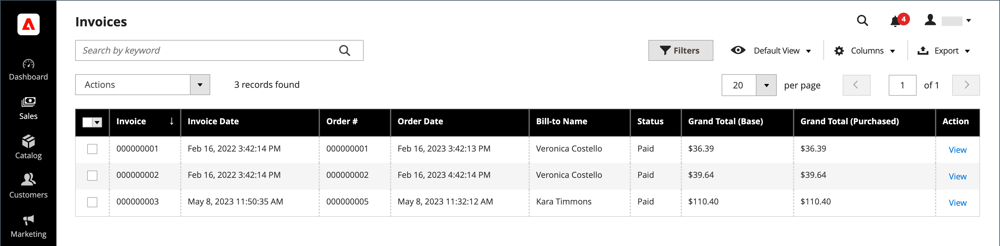
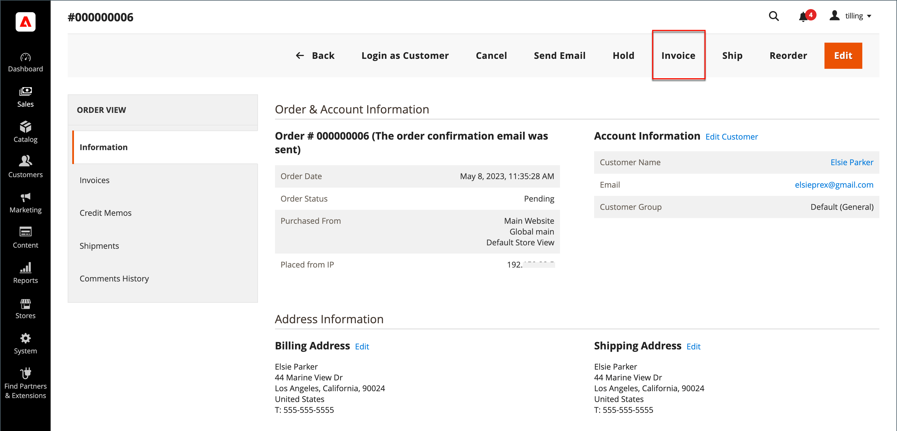
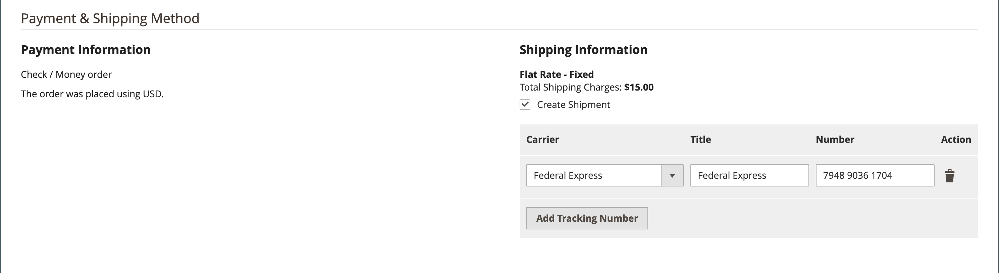
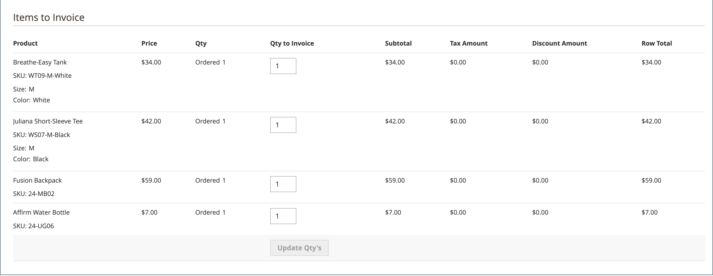
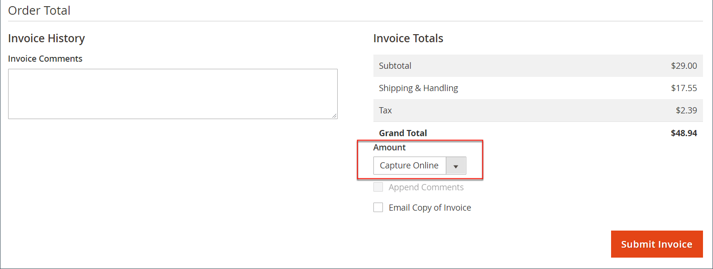
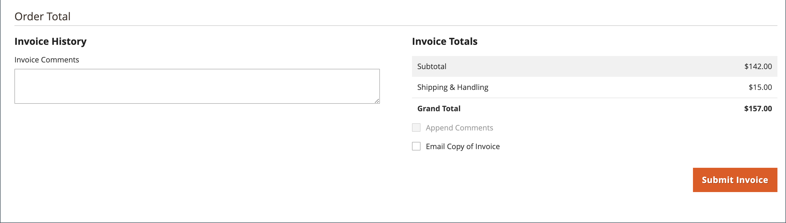
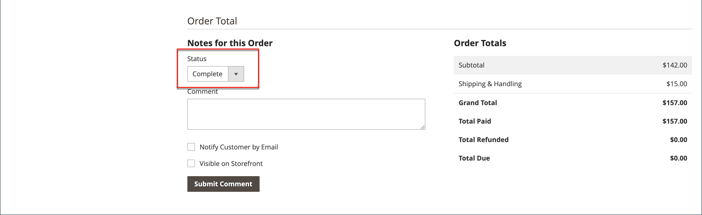
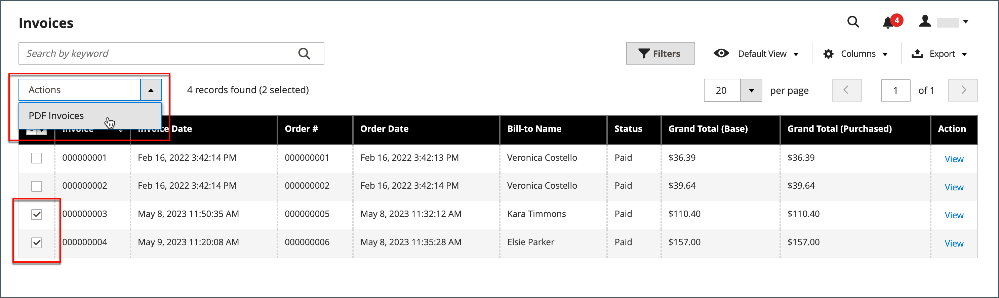

# 請求書

請求書は、注文の支払い記録の記録です。 1回の注文に対して複数の請求書を[作成](#create-an-invoice)でき、それぞれ、指定した購入済み製品の数または数を指定できます。 [印刷可能なPDF請求書](#print-invoices)を、お客様向けのセールスドキュメントとして作成することもできます。

_管理者_ サイドバーで、**[!UICONTROL Sales]** > _操作_ > **請求書**&#x200B;に移動して、_請求書_ グリッドを開き、作成した請求書にアクセスします。

{width="700" zoomable="yes"}

## 列の説明

| 列 | 説明 |
|--- |--- |
| [!UICONTROL Select] | アクションの対象となる引用符のチェックボックスを選択するか、列ヘッダーの選択コントロールを使用します。 オプション：`Select All` / `Deselect All` |
| [!UICONTROL Invoice] | 請求書が管理者から送信されたときに割り当てられる一意の数値識別子。 請求書の詳細を表示する場合、見積書名ではなく、この番号がページの上部に表示されます。 |
| [!UICONTROL Invoice Date] | 管理者が最初に請求書を送信した日時。 |
| [!UICONTROL Order#] | 購入者が注文を行ったときに割り当てられる一意の数値識別子。 請求書の詳細を表示すると、この番号は注文とアカウント情報ブロックにリンクとして表示されます。 |
| [!UICONTROL Order Date] | 顧客が最初に注文に成功した日時。 |
| [!UICONTROL Bill-to Name] | 注文の支払いの責任を負う人の名前。 |
| [!UICONTROL Status] | 請求書の現在の状態を示します。 ステータスは、買い手または売り手の行動によってのみ変更できます。 |
| [!UICONTROL Grand Total (Base)] | 購入する製品の合計価格。 合計金額は、web サイトの基本通貨およびストアフロントの通貨に表示されます。 |
| [!UICONTROL Grand Total (purchase)] | 注文で購入された製品の合計数。 合計金額は、web サイトの基本通貨およびストアフロントの通貨に表示されます。 |
| [!UICONTROL Purchased From] | 請求書の作成元のweb サイト/ストア/ストアビュー。 |
| [!UICONTROL Billing Address] | 注文した顧客の請求先住所。 |
| [!UICONTROL Shipping Address] | 注文が発送される住所。 |
| [!UICONTROL Customer Name] | 請求書を受け取る顧客の姓と名。 |
| [!UICONTROL Email] | 請求書を受信する顧客の電子メールアドレス。 |
| [!UICONTROL Customer Group] | 請求書を受信する顧客に割り当てられた顧客グループ。 |
| [!UICONTROL Payment Method] | 支払いに使用する支払い方法。 |
| [!UICONTROL Shipping Information] | 注文の出荷に使用する方法。 |
| [!UICONTROL Subtotal] | 注文の小計（送料および処理料なし）、および税金。 |
| [!UICONTROL Shipping and Handling] | 送料と処理費。 |
| [!UICONTROL Action] | **[!UICONTROL View]** – 請求書を編集モードで開きます。 |

{style="table-layout:auto"}

## 請求書の作成

注文の請求書を作成すると、キャンセルまたは変更できない状態に移動します。 新しい請求書ページは、注文が完了した状態と似ていますが、追加フィールドもあります。 注文に関連するすべてのアクティビティは、請求書の「コメント」セクションに記載されます。

通常、注文は請求され、出荷プロセスが開始されたときに取り込まれます。 支払い方法が発注である場合、または[支払いアクション ](../configuration-reference/sales/payment-methods.md#payment-actions)が`Authorize and Capture`に設定されている場合、注文は請求され、支払いはチェックアウト中に取り込まれます。 梱包伝票を含む請求書を生成し、配送業者アカウントから配送ラベルを印刷することもできます。 1回の注文で部分的な配送に分割し、必要に応じて個別に請求することもできます。

新しい注文の状態が`Processing`に設定されると、_すべてのアイテムを自動的に請求書_&#x200B;のオプションが設定で使用できるようになります。 一部のクレジットカードの支払い方法は、[支払いアクション ](../configuration-reference/sales/payment-methods.md#payment-actions)が`Authorize and Capture`に設定されている場合、プロセスの一環として請求手順を完了します。 このような場合、請求書ボタンは表示されず、注文は発送する準備ができています。

>[!NOTE]
>
>`Gift Card`、`Store Credit`、`Reward Points`またはその他のオフラインの支払い方法を使用して行われた注文に対して、請求書が自動的に作成されません。

注文の請求書は、印刷する前に生成する必要があります。 PDFを表示または印刷するには、まず[Adobe Acrobat Reader](https://www.adobe.com/acrobat/pdf-reader.html "Adobe Readerを入手")などのPDF リーダーをダウンロードしてインストールします。

**_注文の請求書を作成するには:_**

1. _管理者_ サイドバーで、**[!UICONTROL Sales]** > _[!UICONTROL Operations]_>**[!UICONTROL Orders]**に移動します。

1. グリッド内のステータスが`Processing`の販売注文を検索します。 次に、次の操作を行います。

1. _アクション_&#x200B;列で、**[!UICONTROL View]**&#x200B;をクリックします。

1. 販売注文のヘッダーで、**[!UICONTROL Invoice]** オプションを選択します。

   >[!NOTE]
   >
   >特定の[支払い方法](../configuration-reference/sales/payment-methods.md)の[支払いアクション ](../configuration-reference/sales/payment-methods.md#payment-actions)が請求書を自動生成する`Authorize and Capture`に設定されている場合、_[!UICONTROL Invoice]_オプションは表示されません。 これは、注文が行われ、支払い方法の支払いアクションが`Authorize`に設定され、注文が請求される場合にも当てはまります。

   {width="700" zoomable="yes"}

   新しい請求書ページは、編集可能な追加フィールドを含む完了した注文ページと似ています。

1. 品目の出荷準備が整った場合は、請求書の作成と同時に出荷の梱包明細を生成します。

   - _配送情報_ セクションで、**[!UICONTROL Create Shipment]** チェックボックスをクリックして選択します。

     出荷レコードは、請求書が生成されるのと同時に作成されます。

   - 追跡番号を含める：

      - **[!UICONTROL Add Tracking Number]**&#x200B;をクリックします。
      - トラッキング情報を入力：_[!UICONTROL Carrier]_、_[!UICONTROL Title]_、_[!UICONTROL Number]_

     {width="600" zoomable="yes"}

   - 必要に応じて、請求書の一部を生成します。

      - _請求書へのアイテム_ セクションで、**[!UICONTROL Qty to Invoice]**&#x200B;列を更新して、請求書に特定のアイテムのみを含めるようにします。
      - 次に、**[!UICONTROL Update Qty's]**&#x200B;をクリックします。

        {width="600" zoomable="yes"}

1. オンライン支払い方法を注文に使用した場合は、**[!UICONTROL Amount]**&#x200B;を適切なオプションに設定します。

1. 請求書が生成されたときに電子メールで顧客に通知するには、次の操作を行います。

   - 「**[!UICONTROL Email Copy of Invoice]**」チェックボックスを選択します。

   - 任意の&#x200B;**[!UICONTROL Invoice Comments]**&#x200B;を入力してください。 通知メールにコメントを含めるには、**[!UICONTROL Append Comments]** チェックボックスをオンにします。

1. 完了したら、ページの下部にある「**[!UICONTROL Submit Invoice]**」をクリックします。

   **_オンライン支払い方法:_**

   {width="600" zoomable="yes"}

   **_オフライン支払い方法:_**

   {width="600" zoomable="yes"}

   注文のステータスが`Pending`から`Complete`に変更されます。

   {width="600" zoomable="yes"}

## 請求書の印刷

請求書は個別に印刷することも、バッチで印刷することもできます。 ただし、請求書を印刷する前に、最初に注文のために生成する必要があります。 印刷用のPDF請求書の高解像度ロゴをアップロードし、ヘッダーに[注文ID](../stores-purchase/sales-documents.md#add-reference-ids)を含めることができます。 請求書テンプレートをロゴと住所でカスタマイズするには、[PDFのロゴ要件](../stores-purchase/sales-documents.md#image-formats)を参照してください。

>[!NOTE]
>
>PDFを表示または印刷するには、PDF リーダーが必要です。 [Adobe Reader](https://www.adobe.com/acrobat/pdf-reader.html "Adobe Readerを入手")は無料でダウンロードできます。

### 1つの請求書を印刷

1. _管理者_ サイドバーで、**[!UICONTROL Sales]** > _[!UICONTROL Operations]_>**[!UICONTROL Invoices]**に移動します。

1. _[!UICONTROL Invoices]_グリッドで、請求書を探し、_ アクション _列の&#x200B;**[!UICONTROL View]**をクリックします。

1. 請求書の上部にある「**[!UICONTROL Print]**」をクリックして、請求書のPDFを生成します。

1. 生成されたPDFをファイルに保存するか、印刷します。

### 複数の請求書の印刷

1. _管理者_ サイドバーで、**[!UICONTROL Sales]** > _[!UICONTROL Operations]_>**[!UICONTROL Invoices]**に移動します。

1. _[!UICONTROL Invoices]_グリッドで、印刷する各請求書のチェックボックスを選択します。

1. **[!UICONTROL Actions]** コントロールを`PDF Invoices`に設定します。

   {width="600" zoomable="yes"}

請求書は、1つのPDF ファイルに保存され、プリンターに送信するか、保存できます。

## カスタムキャプチャ量

[!BADGE SaaSのみ]{type=Positive url="https://experienceleague.adobe.com/en/docs/commerce/user-guides/product-solutions" tooltip="Adobe Commerce as a Cloud Service プロジェクト（Adobeで管理されるSaaS インフラストラクチャ）にのみ適用されます。"}

部分的なキャプチャや特殊な支払いシナリオに対してより柔軟にマーチャントを提供するために、Invoice APIは拡張属性を使用したカスタムキャプチャ量をサポートしています。

請求書を作成する際に、REST呼び出しを行ってカスタム金額を取得できます。  [`POST V1/order/:orderId/invoice`](https://developer.adobe.com/commerce/webapi/reference/rest/saas/) REST エンドポイントを使用し、ペイロードの`extension_attributes.custom_capture_amount` フィールドでカスタム金額を指定します。

>[!NOTE]
>
>この機能を有効にするには、サポート担当者にお問い合わせください。
>
>法的な制限により、カスタムキャプチャ金額は、北米（NA）地域および支払い超過キャプチャが許可されているその他の地域でのみ使用できます。
