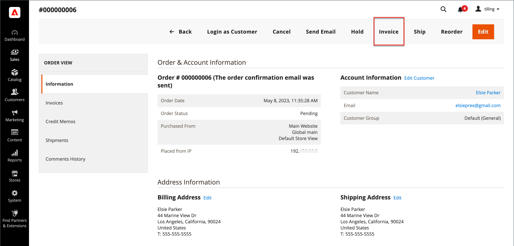

# 請求書

請求書は、注文の支払い記録です。 複数の請求書を使用できます [作成日](#create-an-invoice) 1 回の注文の場合、それぞれに、指定した購入製品をいくつでも含めることができます。 以下を作成することもできます [印刷可能なPDF請求書](#print-invoices) 顧客の販売ドキュメントとして。

日 _Admin_ サイドバー、に移動 **[!UICONTROL Sales]** > _運用_ > **請求書** を開きます _請求書_ 作成した請求書をグリッド化してアクセスします。

{width="700" zoomable="yes"}

## 列の説明

| 列 | 説明 |
|--- |--- |
| [!UICONTROL Select] | アクションの対象とする引用符のチェックボックスを選択するか、列ヘッダーの選択コントロールを使用します。 オプション： `Select All` / `Deselect All` |
| [!UICONTROL Invoice] | 管理者から請求書が送信される際に割り当てられる一意の数値 ID。 請求書の詳細を表示する場合、この番号は見積書名ではなく、ページの上部に表示されます。 |
| [!UICONTROL Invoice Date] | 管理者が最初に請求書を送信した日時。 |
| [!UICONTROL Order#] | 購入者によって注文が行われるときに割り当てられる一意の数値識別子。 請求書の詳細を表示すると、この番号は注文および口座情報ブロックにリンクとして表示されます。 |
| [!UICONTROL Order Date] | 顧客が最初に正常に注文した日時。 |
| [!UICONTROL Bill-to Name] | 注文の支払いを担当する人物の名前。 |
| [!UICONTROL Status] | 請求書の現在の状態を示します。 ステータスは、買い手または売り手の一部の行動によってのみ変更できます。 |
| [!UICONTROL Grand Total (Base)] | 購入する製品の合計価格。 合計金額は、web サイトの基本通貨とストアフロントの通貨で表示されます。 |
| [!UICONTROL Grand Total (purchase)] | 注文で購入した製品の合計金額。 合計金額は、web サイトの基本通貨とストアフロントの通貨で表示されます。 |
| [!UICONTROL Purchased From] | 請求書が作成された web サイト /店舗/店舗表示。 |
| [!UICONTROL Billing Address] | 注文を行った顧客の請求先住所。 |
| [!UICONTROL Shipping Address] | 注文を発送する住所。 |
| [!UICONTROL Customer Name] | 請求書を受け取る顧客の氏名。 |
| [!UICONTROL Email] | 請求書を受け取る顧客の E メール アドレス。 |
| [!UICONTROL Customer Group] | 請求書を受け取る顧客に割り当てられた顧客グループ。 |
| [!UICONTROL Payment Method] | 支払に使用される支払方法。 |
| [!UICONTROL Shipping Information] | 注文を発送するために使用される方法。 |
| [!UICONTROL Subtotal] | 出荷および処理を伴わない注文の小計および税金。 |
| [!UICONTROL Shipping and Handling] | 出荷および処理に対して請求される金額。 |
| [!UICONTROL Action] | **[!UICONTROL View]**  – 請求書を編集モードで開きます。 |

{style="table-layout:auto"}

## 請求書の作成

オーダーに対して請求書を作成すると、取消や変更ができない状態に移行します。 新しい請求書ページは、いくつかのフィールドが追加された、完了済みの注文に似ています。 注文に関連するすべてのアクティビティは、請求書の「コメント」セクションに記載されています。

通常、注文は出荷処理が開始されると請求され、取得されます。 支払方法が発注書である場合、または [支払いアクション](../configuration-reference/sales/payment-methods.md#payment-actions) はに設定されています。 `Authorize and Capture`、注文が請求され、支払いはチェックアウト時にキャプチャされます。 梱包明細を含む請求書を生成したり、配送業者アカウントから出荷ラベルを印刷することもできます。 必要に応じて、1 つの注文を部分出荷に分割し、個別に請求することができます。

新しい注文の状態が `Processing`、のオプション _すべての品目を自動的に請求_ が設定で使用できるようになります。 一部のクレジット カード支払方法では、次の場合にプロセスの一部として請求ステップが完了します [支払いアクション](../configuration-reference/sales/payment-methods.md#payment-actions) はに設定されています。 `Authorize and Capture`. このような場合、「請求書」ボタンは表示されず、注文の出荷準備が整います。

>[!NOTE]
>
>を使用して注文した場合、請求書は自動的には作成されません。 `Gift Card`, `Store Credit`, `Reward Points`、またはその他のオフライン支払い方法。

注文の請求書は、印刷する前に生成する必要があります。 PDFを表示または印刷するには、まず、次のようなPDFリーダーをダウンロードしてインストールします [Adobe Acrobat Reader][1].

**_受注を請求する手順は、次のとおりです。_**

1. 日 _Admin_ サイドバー、に移動 **[!UICONTROL Sales]** > _[!UICONTROL Operations]_>**[!UICONTROL Orders]**.

1. ステータスが「」の受注を検索します。 `Processing` グリッドの 次に、以下の手順を実行します。

1. が含まれる _アクション_ 列、クリック **[!UICONTROL View]**.

1. 受注のヘッダーで、 **[!UICONTROL Invoice]** オプション。

   >[!NOTE]
   >
   >この _[!UICONTROL Invoice]_次の場合、オプションは表示されません [支払いアクション](../configuration-reference/sales/payment-methods.md#payment-actions) 具体的な内容 [支払い方法](../configuration-reference/sales/payment-methods.md) はに設定されています。 `Authorize and Capture`：請求書を自動生成します。 これは、注文が行われ、支払い方法の支払いアクションがに設定されている場合にも当てはまります `Authorize` 注文が請求されます。

   {width="700" zoomable="yes"}

   新しい請求書ページは完了済み注文ページに似ていますが、編集可能なフィールドが追加されています。

1. 品目の出荷準備が完了している場合は、請求書の作成と同時に出荷の梱包明細を生成します。

   - が含まれる _配送先情報_ セクションで、 **[!UICONTROL Create Shipment]** チェックボックスをオンにして選択します。

     出荷レコードは、請求書の生成時に作成されます。

   - 追跡番号を含める：

      - クリック **[!UICONTROL Add Tracking Number]**.
      - トラッキング情報を入力します。 _[!UICONTROL Carrier]_,_[!UICONTROL Title]_、および _[!UICONTROL Number]_

     {width="600" zoomable="yes"}

   - 必要に応じて、部分請求書を生成します。

      - が含まれる _請求書の品目_ セクションで、 **[!UICONTROL Qty to Invoice]** 請求書に特定の品目のみを含める列。
      - 次に、 **[!UICONTROL Update Qty's]**.

        {width="600" zoomable="yes"}

1. 注文にオンライン支払い方法を使用した場合は、次のように設定します **[!UICONTROL Amount]** を適切なオプションに変更します。

1. 請求書が生成されたときに E メールで顧客に通知するには、次の手順を実行します。

   - 「」を選択します **[!UICONTROL Email Copy of Invoice]** チェックボックス。

   - 次のいずれかを入力 **[!UICONTROL Invoice Comments]**. 通知メールにコメントを含めるには、 **[!UICONTROL Append Comments]** チェックボックス。

1. 完了したら、 **[!UICONTROL Submit Invoice]** ページの下部

   **_オンライン支払い方法：_**

   {width="600" zoomable="yes"}

   **_オフラインでの支払方法：_**

   {width="600" zoomable="yes"}

   注文のステータスが次のように変更されます `Pending` 対象： `Complete`.

   {width="600" zoomable="yes"}

## 請求書の印刷

請求書は、個別に印刷することも、バッチとして印刷することもできます。 ただし、請求書を印刷する前に、最初に注文に対して請求書を生成する必要があります。 印刷可能なPDF請求書の高解像度ロゴをアップロードして、 [注文 ID](../stores-purchase/sales-documents.md#add-reference-ids) ヘッダーで。 ロゴと住所を使用して請求書テンプレートをカスタマイズするには、を参照してください。 [PDFロゴの要件](../stores-purchase/sales-documents.md#image-formats).

>[!NOTE]
>
>PDFを表示または印刷するには、PDF リーダーが必要です。 次をダウンロードできます [Adobe Reader][1] 無料です。

### 単一の請求書を印刷する

1. 日 _Admin_ サイドバー、に移動 **[!UICONTROL Sales]** > _[!UICONTROL Operations]_>**[!UICONTROL Invoices]**.

1. が含まれる _[!UICONTROL Invoices]_グリッドで請求書を見つけて、**[!UICONTROL View]**が含まれる_&#x200B;アクション&#x200B;_列。

1. 請求書の上部で、 **[!UICONTROL Print]** 請求書のPDFを生成します。

1. 生成したPDFをファイルに保存するか、印刷します。

### 複数の請求書の印刷

1. 日 _Admin_ サイドバー、に移動 **[!UICONTROL Sales]** > _[!UICONTROL Operations]_>**[!UICONTROL Invoices]**.

1. が含まれる _[!UICONTROL Invoices]_グリッド：印刷する各請求書のチェックボックスを選択します。

1. を **[!UICONTROL Actions]** コントロール先 `PDF Invoices`.

   {width="600" zoomable="yes"}

請求書は、プリンタに送ったり保存したりできる 1 つのPDFファイルに保存されます。

## リソースのトラブルシューティング

請求書の問題のトラブルシューティングについては、次を参照してください _コマースサポートのナレッジベース_ 記事：

- [バンドル製品をバーチャルおよびシンプルで請求することはできません](https://experienceleague.adobe.com/docs/commerce-knowledge-base/kb/support-tools/patches/v1-0-9/mdva-30889-magento-patch-can-t-invoice-bundle-products-virtual-and-simple.html)
- [店舗クレジット情報のない請求書](https://experienceleague.adobe.com/docs/commerce-knowledge-base/kb/support-tools/patches/v1-0-8/mdva-31150-magento-patch-invoice-without-store-credit-info.html)
- [100% 割引の税が請求書に表示されます](https://experienceleague.adobe.com/docs/commerce-knowledge-base/kb/support-tools/patches/v1-0-22/mdva-35773-tax-appears-on-invoice-with-100-discount.html)
- [注文請求書が自動的に送信されない](https://experienceleague.adobe.com/docs/commerce-knowledge-base/kb/support-tools/patches/v1-0-13/mdva-32545-magento-patch-order-invoices-don-t-send-automatically.html)

[1]: https://www.adobe.com/acrobat/pdf-reader.html "Adobe Readerの取得"
