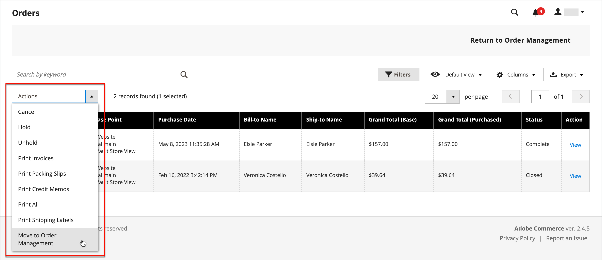

# 注文のアーカイブ

{{ee-feature}}

注文を定期的にアーカイブすると、パフォーマンスが向上し、ワークスペースに不要な情報が含まれなくなるので、現在のビジネスに集中できます。 請求書、出荷およびクレジット・メモは、自動または手動でアーカイブでき、いつでも表示できます。

>[!NOTE]
>
>「_[!UICONTROL Archive]_」オプションは [&#128279;](sales-menu.md) アーカイブが [ 有効 ](../configuration-reference/sales/sales.md) の場合にのみ [!UICONTROL Sales] メニューに表示されます。

## 注文アーカイブの設定

ストアは、設定した日数が経過した後に注文、請求書、出荷、およびクレジット メモをアーカイブするように構成できます。 オーダーおよび関連ドキュメントをアーカイブに移動したり、以前の状態に復元したりできます。 アーカイブ済み注文は削除されず、管理者から引き続き使用できます。 アーカイブしたデータを CSV ファイルに書き出して、スプレッドシートで開くことができます。 有効にすると、_アーカイブ_ アクションがワークスペースの上部に表示されます。

1. _管理者_ サイドバーで、**[!UICONTROL Stores]**/_[!UICONTROL Settings]_/**[!UICONTROL Configuration]**&#x200B;に移動します。

1. 左側のパネルで「**[!UICONTROL Sales]**」セクションを展開し、その下 **[!UICONTROL Sales]** 選択します。

1. 「」を展開し、「**[!UICONTROL Orders, Invoices, Shipments, Credit Memos Archiving]**」セクションを展開します。

   {width="600" zoomable="yes"}

1. **[!UICONTROL Enable Archiving]** を `Yes` に設定します。

   >[!NOTE]
   >
   >後でアーカイブをオフにすることにした場合、アーカイブされたすべての注文は以前の状態に復元されます。

1. 完了した注文がアーカイブされるまで待機する日数に **[!UICONTROL Archive Orders Purchased]** を設定します。

   デフォルトでは、注文は購入から 30 日後にアーカイブされます。

1. **[!UICONTROL Order Statuses to be Archived]** リストで、アーカイブする注文を識別するために使用する各注文ステータスを選択します。

   複数の項目を選択するには、Ctrl キー（Windows）または Command キー（Mac）を押しながら各項目をクリックします。

1. 「**[!UICONTROL Save Config]**」をクリックします。

1. プロンプトが表示されたら、無効なキャッシュを更新します。

## アーカイブしたドキュメントの表示

1. _[!UICONTROL Archive]_&#x200B;の下の&#x200B;_[!UICONTROL Sales]_ メニューで、次のいずれかを選択します。

   - **[!UICONTROL Orders]**
   - **[!UICONTROL Invoices]**
   - **[!UICONTROL Shipments]**
   - **[!UICONTROL Credit Memos]**

1. 詳細を表示するには、リスト内のアーカイブされたドキュメントをクリックします。

## アーカイブしたドキュメントへのアクションの適用

アクションのターゲットにする各ドキュメントを選択し、次のいずれかの **[!UICONTROL Actions]** を選択します。

- `Cancel`
- `Hold`
- `Unhold`
- `Print`
- `Move to Orders Management`

## ドキュメントの手動アーカイブ

1. 以下からアーカイブするドキュメントのタイプを選択します。

   - **[!UICONTROL Orders]**
   - **[!UICONTROL Invoices]**
   - **[!UICONTROL Shipments]**
   - **[!UICONTROL Credit Memos]**

1. アーカイブする各項目のチェックボックスを選択します。

1. 右上隅の **[!UICONTROL Actions]** を `Move to Archive` に設定します。

1. 「**[!UICONTROL Submit]**」をクリックして、選択したドキュメントをアーカイブします。

## アーカイブされたドキュメントの復元

1. 復元するドキュメントの種類を選択します。

1. 次のいずれかのオプションを使用してドキュメントを選択します。

   - 表示されているすべてのドキュメントを選択するには、左上隅の [**[!UICONTROL Select Visible]**] をクリックします。

   - 復元する各ドキュメントのチェックボックスを手動で選択します。

1. 右上で、**[!UICONTROL Action]** を `Move to Orders Management` に設定します。

1. 「**[!UICONTROL Submit]**」をクリックすると、ドキュメントが復元されます。

## アーカイブしたドキュメントの書き出し

1. 書き出すドキュメントのタイプを選択します。

1. 右上のメニューで、**[!UICONTROL Export to:]** を次のいずれかの値に設定します。

   - `CSV`
   - `Excel`

1. 「**[!UICONTROL Export]**」をクリックします。

ストアは、設定した日数が経過した後に注文、請求書、出荷、およびクレジット メモをアーカイブするように構成できます。 オーダーおよび関連ドキュメントをアーカイブに移動したり、以前の状態に復元したりできます。 アーカイブ済み注文は削除されず、管理者から引き続き使用できます。 アーカイブしたデータを CSV ファイルに書き出して、スプレッドシートで開くことができます。 有効にすると、_[!UICONTROL Archive]_&#x200B;コマンドがワークスペースの上部に表示されます。

## 注文を手動でアーカイブ

1. _管理者_ サイドバーで、**[!UICONTROL Sales]**/_[!UICONTROL Operations]_/**[!UICONTROL Orders]**&#x200B;に移動します。

1. グリッド上の順序を選択するには、最初の列のチェックボックスを選択します。

1. **[!UICONTROL Actions]** コントロールを `Move to Archive` に設定して、注文がアーカイブされたメッセージを探します。

   {width="700" zoomable="yes"} への移動

>[!TIP]
>
>アーカイブ可能な注文ステータスのリストを指定するには、[ 注文アーカイブの設定 ](#configure-the-order-archive) を参照してください。

## アーカイブした注文の表示

1. 次のいずれかの方法を使用して、アーカイブ・ビューを開きます。

   - _[!UICONTROL Orders]_&#x200B;グリッドの上にあるボタン バーで、[**[!UICONTROL Go to Archive]**] をクリックします。

   - _管理者_ サイドバーで、**[!UICONTROL Sales]**/_[!UICONTROL Archive]_/**[!UICONTROL Orders]**&#x200B;に移動します。

   >[!NOTE]
   >
   >注文ページと同様に、アーカイブされた注文ページのタイトルは _[!UICONTROL Orders]_&#x200B;です。 顕著な違いは、ボタンバーの「_[!UICONTROL Return to Orders Management]_」オプションだけです。 ページの URL は、オーダーアーカイブにいることも示します。

1. _アクション_ 列の「**[!UICONTROL View]**」をクリックします。

   {width="600" zoomable="yes"}

## アーカイブした注文の復元

>[!NOTE]
>
>アーカイブされた注文から復元された注文は、注文設定で設定された日数に従って再びアーカイブされます（[ 注文のアーカイブの設定 ](#configure-the-order-archive) を参 [!UICONTROL Archive Orders Purchased]）。 日数は、オーダーの [!UICONTROL Updated At] 定日に対して計算されます。この日付は、オーダーがアーカイブから移動される際に変更されます。

1. _管理者_ サイドバーで、**[!UICONTROL Sales]**/_[!UICONTROL Operations]_/**[!UICONTROL Orders]**&#x200B;に移動します。

1. ボタン バーで、[**[!UICONTROL Go to Archive]**] をクリックします。

1. 復元するレコードを見つけ、チェックボックスをクリックして選択します。

   {width="600" zoomable="yes"}

1. **[!UICONTROL Actions]** コントロールの値を `Move to Order Management` に設定します。

アーカイブした注文がアーカイブから削除されたというメッセージを探します。

## アーカイブした注文の書き出し

1. _管理者_ サイドバーで、**[!UICONTROL Sales]**/_[!UICONTROL Operations]_/**[!UICONTROL Orders]**&#x200B;に移動します。

1. アクションメニューで「**[!UICONTROL Export]**」をクリックし、目的の形式を選択します。
