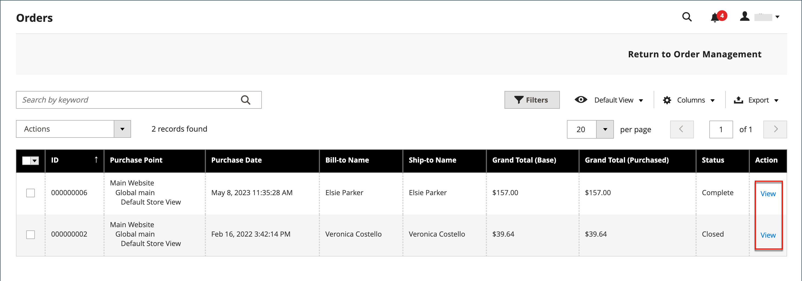
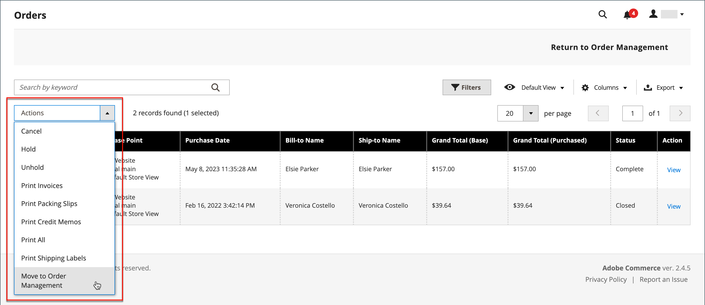

# 注文をアーカイブ

{{ee-feature}}

注文を定期的にアーカイブすることで、パフォーマンスが向上し、ワークスペースに不要な情報がなくなるため、現在のビジネスに集中することができます。 請求書、発送、およびクレジットメモは、自動または手動でアーカイブでき、いつでも表示できます。

>[!NOTE]
>
>アーカイブが[有効](../configuration-reference/sales/sales.md)の場合にのみ、[[!UICONTROL Sales] メニュー](sales-menu.md)に&#x200B;_[!UICONTROL Archive]_&#x200B;オプションが表示されます。

## 注文アーカイブの設定

設定された日数が経過すると、注文、請求書、出荷、クレジットメモをアーカイブするようにストアを設定できます。 注文とその関連ドキュメントをアーカイブに移動したり、以前の状態に復元したりできます。 アーカイブされた注文は削除されず、管理者から引き続き利用できます。 アーカイブされたデータはCSV ファイルに書き出して、スプレッドシートで開くことができます。 有効にすると、_アーカイブ_ アクションがワークスペースの上部に表示されます。

1. _管理者_ サイドバーで、**[!UICONTROL Stores]** > _[!UICONTROL Settings]_>**[!UICONTROL Configuration]**&#x200B;に移動します。

1. 左側のパネルで「**[!UICONTROL Sales]**」セクションを展開し、下の「**[!UICONTROL Sales]**」を選択します。

1. **[!UICONTROL Orders, Invoices, Shipments, Credit Memos Archiving]** セクションのを展開します。

   {width="600" zoomable="yes"}

1. **[!UICONTROL Enable Archiving]**&#x200B;を`Yes`に設定します。

   >[!NOTE]
   >
   >後でアーカイブをオフにすると、アーカイブされたすべての注文が前の状態に復元されます。

1. 完了した注文がアーカイブされるまでの待機日数に&#x200B;**[!UICONTROL Archive Orders Purchased]**&#x200B;を設定します。

   デフォルトでは、注文は購入後30日以内にアーカイブされます。

1. **[!UICONTROL Order Statuses to be Archived]** リストで、アーカイブする注文を識別するために使用する各注文ステータスを選択します。

   複数の項目を選択するには、Ctrl キー（Windows）またはCommand キー（Mac）を押しながら各項目をクリックします。

1. **[!UICONTROL Save Config]**&#x200B;をクリックします。

1. プロンプトが表示されたら、無効なキャッシュを更新します。

## アーカイブされたドキュメントを表示

1. _[!UICONTROL Archive]_&#x200B;の下の&#x200B;_[!UICONTROL Sales]_ メニューで、次のいずれかを選択します。

   - **[!UICONTROL Orders]**
   - **[!UICONTROL Invoices]**
   - **[!UICONTROL Shipments]**
   - **[!UICONTROL Credit Memos]**

1. 詳細を表示するには、リスト内のアーカイブされたドキュメントをクリックします。

## アーカイブされたドキュメントへのアクションの適用

アクションの対象となる各ドキュメントを選択し、次のいずれかの&#x200B;**[!UICONTROL Actions]**&#x200B;を選択します。

- `Cancel`
- `Hold`
- `Unhold`
- `Print`
- `Move to Orders Management`

## 文書を手動でアーカイブ

1. アーカイブするドキュメントのタイプを次から選択します。

   - **[!UICONTROL Orders]**
   - **[!UICONTROL Invoices]**
   - **[!UICONTROL Shipments]**
   - **[!UICONTROL Credit Memos]**

1. アーカイブする各アイテムのチェックボックスをオンにします。

1. 右上隅で、**[!UICONTROL Actions]**&#x200B;を`Move to Archive`に設定します。

1. 選択したドキュメントをアーカイブするには、**[!UICONTROL Submit]**&#x200B;をクリックします。

## アーカイブされたドキュメントの復元

1. 復元するドキュメントのタイプを選択します。

1. 次のいずれかのオプションを使用してドキュメントを選択します。

   - 表示されているすべての文書を選択するには、左上隅の「**[!UICONTROL Select Visible]**」をクリックします。

   - 復元する各ドキュメントのチェックボックスを手動で選択します。

1. 右上で、**[!UICONTROL Action]**&#x200B;を`Move to Orders Management`に設定します。

1. **[!UICONTROL Submit]**&#x200B;をクリックしてドキュメントを復元します。

## アーカイブされたドキュメントの書き出し

1. 書き出すドキュメントのタイプを選択します。

1. 右上のメニューで、**[!UICONTROL Export to:]**&#x200B;を次のいずれかの値に設定します。

   - `CSV`
   - `Excel`

1. **[!UICONTROL Export]**&#x200B;をクリックします。

設定された日数が経過すると、注文、請求書、出荷、クレジットメモをアーカイブするようにストアを設定できます。 注文とその関連ドキュメントをアーカイブに移動したり、以前の状態に復元したりできます。 アーカイブされた注文は削除されず、管理者から引き続き利用できます。 アーカイブされたデータはCSV ファイルに書き出して、スプレッドシートで開くことができます。 有効にすると、_[!UICONTROL Archive]_&#x200B;コマンドがワークスペースの上部に表示されます。

## 注文を手動でアーカイブ

1. _管理者_ サイドバーで、**[!UICONTROL Sales]** > _[!UICONTROL Operations]_>**[!UICONTROL Orders]**&#x200B;に移動します。

1. グリッド上の順序を選択するには、最初の列のチェックボックスを選択します。

1. **[!UICONTROL Actions]** コントロールを`Move to Archive`に設定し、注文がアーカイブされたメッセージを探します。

   {width="700" zoomable="yes"}に移動

>[!TIP]
>
>アーカイブ可能な注文ステータスのリストを指定するには、[注文アーカイブの設定](#configure-the-order-archive)を参照してください。

## アーカイブされた注文の表示

1. 次のいずれかの方法を使用してアーカイブ ビューを開きます。

   - _[!UICONTROL Orders]_&#x200B;グリッドの上にあるボタンバーで、**[!UICONTROL Go to Archive]**&#x200B;をクリックします。

   - _管理者_ サイドバーで、**[!UICONTROL Sales]** > _[!UICONTROL Archive]_>**[!UICONTROL Orders]**&#x200B;に移動します。

   >[!NOTE]
   >
   >注文ページと同様に、アーカイブされた注文ページのタイトルは&#x200B;_[!UICONTROL Orders]_&#x200B;です。 唯一の顕著な違いは、ボタンバーの&#x200B;_[!UICONTROL Return to Orders Management]_&#x200B;へのオプションです。 ページのURLは、注文アーカイブ内にあることも示します。

1. _アクション_&#x200B;列で、**[!UICONTROL View]**&#x200B;をクリックします。

   {width="600" zoomable="yes"}

## アーカイブされた注文の復元

>[!NOTE]
>
>アーカイブされた注文から復元された注文は、[!UICONTROL Archive Orders Purchased]設定で設定された日数に従って再度アーカイブされます（[注文アーカイブの設定](#configure-the-order-archive)を参照）。 日数は、注文の[!UICONTROL Updated At]日に対して計算されます。これは、注文がアーカイブから移動されたときに変更されます。

1. _管理者_ サイドバーで、**[!UICONTROL Sales]** > _[!UICONTROL Operations]_>**[!UICONTROL Orders]**&#x200B;に移動します。

1. ボタンバーで、**[!UICONTROL Go to Archive]**&#x200B;をクリックします。

1. 復元するレコードを見つけ、チェックボックスをクリックして選択します。

   {width="600" zoomable="yes"}

1. **[!UICONTROL Actions]** コントロール値を`Move to Order Management`に設定します。

アーカイブされた順序がアーカイブから削除されたというメッセージを探します。

## アーカイブされた注文のエクスポート

1. _管理者_ サイドバーで、**[!UICONTROL Sales]** > _[!UICONTROL Operations]_>**[!UICONTROL Orders]**&#x200B;に移動します。

1. アクションメニューで「**[!UICONTROL Export]**」をクリックし、目的の形式を選択します。
