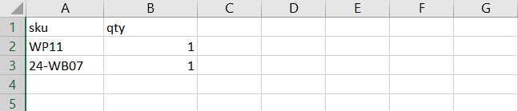

# SKU で並べ替え

{{ee-feature}}

「SKU」は「在庫管理単位」です。 SKU は通常、オンラインセラーがサイズ、色、価格、素材などの最も重要な製品特性を識別するのに役立ちます。 製品 ID は SKU とは異なります。

- `Product ID` は、製品を内部的に識別するために使用される一連の数値で、顧客は使用できません。
- `SKU` は通常、マーケティングまたは内部トラッキングの製品名および属性に基づいて、販売者によって生成されます。 例：青色の綿 T シャツ、サイズ中間：T-COT-MED-BL。 SKU は、必要に応じて販売者によって変更される場合があります。

通常、SKU には製品の際立った特徴を示す略語のセットが含まれます。 SKU の長さは最大 64 文字です。 SKU は在庫を効果的に追跡および管理するために重要なので、SKU を正しく設定することは、e コマースにとって重要です。

_SKU で並べ替え_ は、[ ウィジェット ](../content-design/widgets.md) であり、すべての買い物客の利便性としてストアに表示したり、特定の顧客グループの買い物客にのみ使用したりできます。 買い物客は、SKU および数量情報を Order by SKU ブロックに直接入力するか、顧客アカウントから CSV ファイルをアップロードできます。 設定に関係なく、ストア管理者は常に SKU で注文できます。

{width="700" zoomable="yes"}

## SKU による順序の設定

1. _管理者_ サイドバーで、**[!UICONTROL Stores]**/_[!UICONTROL Settings]_/**[!UICONTROL Configuration]**に移動します。

1. 左側のパネルで「**[!UICONTROL Sales]**」セクションを展開し、その下 **[!UICONTROL Sales]** 選択します。

1. 「」を展開し、「**[!UICONTROL Order by SKU Settings]**」セクションを展開します。

1. **[!UICONTROL Enable Order by SKU on my Account in Storefront]** を次のいずれかに設定します。

   - `Yes, for Everyone` – 並べ替え順 SKU ブロックは、すべての買い物客に対してストアで使用できます。
   - `Yes, for Specified Customer Groups` - 「SKU で並べ替え」は、`Wholesale` など、特定の顧客グループのメンバーのみが使用できます。
   - `No` - ストアフロントに「SKU で注文」ブロックが表示されず、お客様のアカウントでは「SKU で注文」ページを使用できません。

   {width="600" zoomable="yes"}

1. 「**[!UICONTROL Save Config]**」をクリックします。

 （Adobe Commerce B2B のみ） _**SKU による注文機能を有効にするには、クイックオーダー機能を無効にします。**_

1. **[!UICONTROL Stores]**/_[!UICONTROL Settings]_/**[!UICONTROL Configuration]**に移動します。

1. _[!UICONTROL General]_の下の左パネルで、「**[!UICONTROL B2B Features]**」を選択します

1. 「」を展開し、「**[!UICONTROL B2B Features]**」セクションを展開します。

1. **[!UICONTROL Enable Quick Order]** を `No` に設定します。

   [ クイックオーダー機能 ](../b2b/quick-order.md) を使用すると、顧客とゲストは SKU または製品名に基づいてすばやく注文できます。

## ストアフロントの経験

ストアに対して機能が設定されている場合、顧客は、「SKU で注文 _ウィジェットを含むすべてのページまたは自分のアカウントダッシュボードから SKU で注文でき_ す。

### ページブロックからの SKU で並べ替え

1. _SKU で注文_ ブロックで、顧客は注文する商品の **[!UICONTROL SKU]** と **[!UICONTROL Qty]** を入力します。

1. 別の項目を追加するには、**[!UICONTROL Add Row]** をクリックしてプロセスを繰り返します。

1. **[!UICONTROL Add to Cart]** をクリックします。

### 顧客アカウントからの SKU による注文

1. ストアフロントから、顧客は自分のアカウントにログインします。

1. 左側のパネルで、「**[!UICONTROL Order by SKU]**」を選択します。

1. 環境設定に従って個別の項目を追加します。

   _**SKU ごとに各項目を追加：**_

   - 注文する品目の **[!UICONTROL SKU]** と **[!UICONTROL Qty]** を入力します。

   - 必要に応じて項目を追加するには、「_行を追加_ をクリックし、必要な数の項目に対して繰り返します。

   - **[!UICONTROL Add to Cart]** をクリックします。

   _**複数の項目の CSV ファイルをアップロードします。**_

   - `SKU` と `Qty` の列を含む [ データを読み込む ](../systems/data-csv.md)CSV （コンマ区切り値）ファイルを準備します。

   {width="500" zoomable="yes"}

   - CSV ファイルをアップロードするには、「**[!UICONTROL Choose File]**」をクリックし、アップロードするファイルを選択します。

   - **[!UICONTROL Add to Cart]** をクリックします。

   いずれかの製品に追加のオプションがある場合、買い物かごから、製品に注意が必要であることを尋ねられます。

   {width="600" zoomable="yes"}

   >[!NOTE]
   >
   >SKU が重複している場合、買い物かごで数量が 1 つの行項目に結合されます。 顧客は任意の品目の数量を変更し、合計を再計算するには **[!UICONTROL Update Shopping Cart]** をクリックします。

