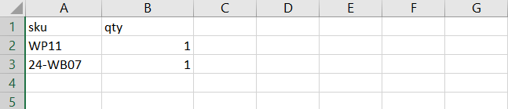

# SKUで注文

{{ee-feature}}

SKUとは「在庫保管単位」のことです。 SKUは一般的に、オンライン販売者が、サイズ、色、価格、素材など、最も重要な製品特性を特定するのに役立ちます。 製品IDはSKUと異なります。

- `Product ID`は、内部で製品を識別するために使用される連続的な数列であり、顧客が利用できません。
- `SKU`は販売者によって生成されます。通常は、マーケティングまたは内部追跡用に製品名と属性に基づいて生成されます。 例：青いコットン T シャツ、サイズは中：T-COT-MED-BL。 必要に応じて、販売者がSKUを変更する場合があります。

通常、SKUには製品の特徴を示す一連の略語が含まれます。 SKUの最大長は64文字です。 SKUは在庫を効果的に追跡、管理するために重要であり、正しく設定することはe コマースにとって非常に重要です。

_SKUによる注文_&#x200B;は[ ウィジェット ](../content-design/widgets.md)であり、すべての買い物客の利便性としてストアに表示したり、特定の顧客グループの買い物客のみに利用できるようにしたりできます。 顧客は、SKUおよび数量情報を直接注文SKU ブロックに入力するか、顧客アカウントからcsv ファイルをアップロードできます。 設定に関係なく、SKUによる注文は常にストア管理者が利用できます。

{width="700" zoomable="yes"}

## SKUによる注文の設定

1. _管理者_ サイドバーで、**[!UICONTROL Stores]** > _[!UICONTROL Settings]_>**[!UICONTROL Configuration]**に移動します。

1. 左側のパネルで「**[!UICONTROL Sales]**」セクションを展開し、下の「**[!UICONTROL Sales]**」を選択します。

1. **[!UICONTROL Order by SKU Settings]** セクションのを展開します。

1. **[!UICONTROL Enable Order by SKU on my Account in Storefront]**&#x200B;を次のいずれかに設定します：

   - `Yes, for Everyone` - SKUによる注文ブロックは、買い物客ごとにストアで利用できます。
   - `Yes, for Specified Customer Groups` - SKUによる注文は、`Wholesale`など、特定の顧客グループのメンバーのみが利用できます。
   - `No` - SKUによる注文ブロックがストアフロントに表示されず、SKUによる注文ページは顧客アカウントで使用できません。

   {width="600" zoomable="yes"}

1. **[!UICONTROL Save Config]**&#x200B;をクリックします。

 （Adobe Commerce B2Bのみ） _**SKUによる注文機能を有効にするには、クイックオーダー機能を無効にします：**_

1. **[!UICONTROL Stores]** > _[!UICONTROL Settings]_>**[!UICONTROL Configuration]**に移動します。

1. _[!UICONTROL General]_の下の左パネルで、**[!UICONTROL B2B Features]**を選択します

1. **[!UICONTROL B2B Features]** セクションのを展開します。

1. **[!UICONTROL Enable Quick Order]**&#x200B;を`No`に設定します。

   [ クイックオーダー機能](../b2b/quick-order.md)を使用すると、お客様とゲストは、SKUまたは商品名に基づいて素早く注文できます。

## ストアフロント体験

ストアの機能が設定されている場合、顧客は&#x200B;_SKUで注文_ ウィジェットを含む任意のページまたはアカウントダッシュボードからSKUで注文できます。

### ページブロックからのSKUによる注文

1. _注文SKU_ ブロックで、顧客は注文するアイテムの&#x200B;**[!UICONTROL SKU]**&#x200B;と&#x200B;**[!UICONTROL Qty]**&#x200B;にエントリします。

1. 別の項目を追加するには、**[!UICONTROL Add Row]**&#x200B;をクリックして、プロセスを繰り返します。

1. **[!UICONTROL Add to Cart]**&#x200B;をクリックします。

### 顧客アカウントからSKUで注文

1. ストアフロントから、顧客は自分のアカウントにログインします。

1. 左側のパネルで、**[!UICONTROL Order by SKU]**&#x200B;を選択します。

1. 環境設定に従って個々の項目を追加します。

   _**SKU:**_&#x200B;で各項目を追加します

   - 注文するアイテムの&#x200B;**[!UICONTROL SKU]**&#x200B;と&#x200B;**[!UICONTROL Qty]**&#x200B;を入力します。

   - 必要に応じてアイテムを追加するには、_行を追加_ をクリックし、必要な数のアイテムについて繰り返します。

   - **[!UICONTROL Add to Cart]**&#x200B;をクリックします。

   _**複数の項目のCSV ファイルをアップロード：**_

   - `SKU`と`Qty`の列を含む[ インポートデータ CSV](../systems/data-csv.md) （カンマ区切り値）ファイルを準備します。

   読み込む{width="500" zoomable="yes"}

   - CSV ファイルをアップロードするには、**[!UICONTROL Choose File]**&#x200B;をクリックし、アップロードするファイルを選択します。

   - **[!UICONTROL Add to Cart]**&#x200B;をクリックします。

   商品のいずれかに追加オプションがある場合、顧客はショッピングカートから、商品に注意が必要であることを確認するように求められます。

   {width="600" zoomable="yes"}

   >[!NOTE]
   >
   >重複したSKUがある場合、数量はショッピングカート内の1つの行項目にまとめられます。 お客様は、任意の項目の数量を変更し、**[!UICONTROL Update Shopping Cart]**&#x200B;をクリックして合計を再計算できます。

