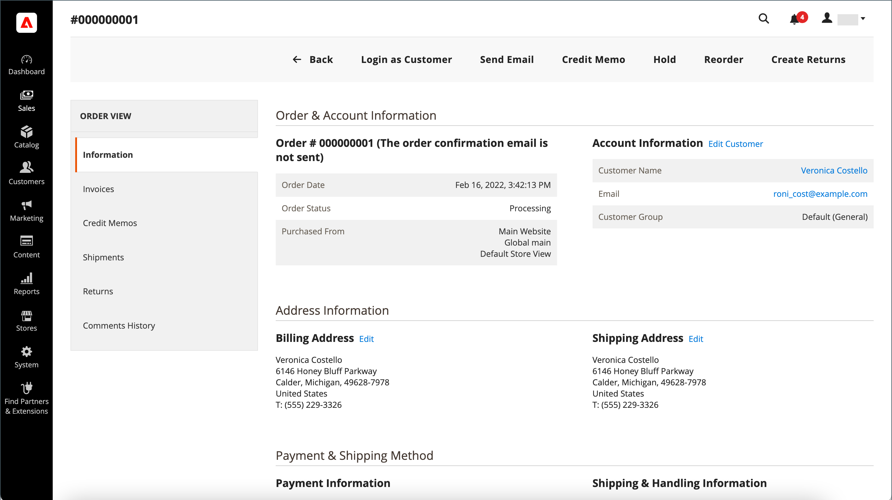
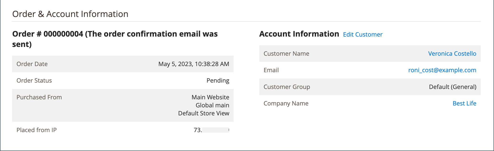

# 注文のワークフローと処理

顧客が注文を行うと、そのトランザクションの一時的なレコードとして受注が作成されます。 受注グリッドでは、最初の受注のステータスは「保留」で、支払が処理されるまでいつでも取り消すことができます。 支払いが確認された後、注文を請求して出荷することができます。

**手順 1：注文** - チェックアウトプロセスは、買い物客が買い物かごページを **[!UICONTROL Go to Checkout]** リックするか、顧客アカウントから直接 [ 再注文 ](reorders-allow.md) すると開始されます。

**手順 2：受注保留** – 最初の受注ステータスは「`Pending`」です。 この状態では、支払いは処理されておらず、注文は引き続き編集またはキャンセルできます。 この状態は、支払方法が承認モードに設定されている場合に発生します。

**ステップ 3：支払いを受け取る** – 支払いが受領または承認されると、注文ステータスは `Processing` に変更されます。 支払い方法によっては、トランザクションが承認または処理されたときに通知が届く場合があります。 この状態は、支払方法がキャプチャまたはインテント販売モードに設定されている場合に自動的に発生します。

**ステップ 4：注文の請求** – 注文は通常、支払いを受け取った後に請求されます。 支払い方法によって、注文に必要な請求オプションが決まります。 請求書が生成されて送信されると、コピーが顧客に送信されます。 支払方法が `capture` または `intent sale` 支払アクションで設定されている場合、支払が承認および取得されると、請求書が自動的に生成されます。

>[!NOTE]
>
>`Gift Card`、`Store Credit`、`Reward Points` またはその他のオフライン支払い方法を使用して注文された場合、請求書は自動的には作成されません。

**ステップ 5：単一出荷の記帳** – 出荷詳細が完了し、出荷が記帳され、出荷が設定されると、受注ステータスは `Complete` に変更されます。 出荷要件が印刷された梱包明細と出荷ラベルで満たされるか、_集荷準備完了の通知_ が選択されます（店舗での配送方法）。 お客様に通知が届き、パッケージが出荷されます。 追跡番号を使用している場合、出荷は顧客のアカウントから追跡できます。

>[!NOTE]
>
>注文ステータスと支払方法の設定オプションについて詳しくは、[ 注文ステータス ](order-status.md) および [ 支払 ](payments.md) を参照してください。

## オーダーを表示

1. _管理者_ サイドバーで、**[!UICONTROL Sales]**/_[!UICONTROL Operations]_/**[!UICONTROL Orders]**&#x200B;に移動します。

1. グリッド内の順序を検索します。

1. 「_[!UICONTROL Action]_」列で「**[!UICONTROL View]**」をクリックします。

1. 注文ステータスの確認：

   - `Pending` 注は、変更、保留、キャンセル、請求および出荷が可能です。

   - 注 `Processing` を大幅に編集またはキャンセルすることはできなくなりましたが、請求先と配送先住所は編集できます。

   - `Completed` の注文は並べ替えることができます。

顧客のメールは、注文ワークフローの任意の時点で、顧客を編集することで編集できます。 ゲストが注文した場合は、メールを編集できません。

オープン注文の左側のパネルから、注文に関連する様々なタイプの情報にアクセスできます。

{width="700" zoomable="yes"}

## オーダーを処理

顧客が注文を行うと、そのトランザクションの一時的なレコードとして受注が作成されます。 支払が受領されるまで、販売注文のステータスは `Pending` になります。 `Pending` のステータスの間、注文は、支払いを受け取って請求書を生成するまで、編集またはキャンセルできます。 簡単に考えると、注文は請求書になり、請求書は出荷になります。 注文グリッドには、ワークフロー内の位置に関係なく、すべての注文が一覧表示されます。 顧客の注文を支援する方法については、[ 注文の更新 ](order-update.md) を参照してください。

{width="700" zoomable="yes"}

`Pending` 注文を開くには、右上隅の **[!UICONTROL Edit]** をクリックします。

>[!NOTE]
>
>注文は、`Pending` ステータスの場合にのみ編集できます。 異なるステータスの注文または [ 交渉済みの見積 ](../b2b/quotes.md) に基づく注文の場合、「編集」ボタンは表示されません。

{width="600" zoomable="yes"}

参照用のフィールドの説明を使用して、受注の次の項を確認します。

### 注文ビューの説明

| タブ | 説明 |
|--- |--- |
| [!UICONTROL Information] | 請求先と配送先住所、支払いと配送方法、品目注文、合計、メモなど、注文とアカウントに関する詳細情報を表示します。 |
| [!UICONTROL Invoices] | 注文に関連付けられている各請求書を一覧表示します。 |
| [!UICONTROL Credit Memos] | 受注に関連付けられている各クレジット・メモがリストされます。 |
| [!UICONTROL Shipments] | 注文に関連付けられている各出荷レコードを一覧表示します。 |
| [!UICONTROL Comments History] | 注文に関連するすべてのメモをリストします。 |

{style="table-layout:auto"}

>[!NOTE]
>
>管理者ユーザーが **[!UICONTROL Sales / Archive]** 請求書 [、「クレジットメモ ](../systems/permissions-user-roles.md) および _出荷_ の注文タブを表示するには、役割の範囲に対する _の__権限_ が必要です。

### ボタンバー

| ボタン | 説明 |
|--- |--- |
| **[!UICONTROL Back]** | 変更を保存せずに [ 受注 ] ページに戻ります。 |
| **[!UICONTROL Cancel]** | 販売注文をキャンセルします。 |
| **[!UICONTROL Send Email]** | 注文に関するメールを顧客に送信します。 |
| **[!UICONTROL Hold]** / **[!UICONTROL Unhold]** | 販売注文の状態を `On Hold` に変更します。 受注の保留を解除するには、「**[!UICONTROL Unhold]**」を選択します。 |
| **[!UICONTROL Invoice]** | 受注を請求書に変換して、受注から請求書を作成します。 |
| **[!UICONTROL Ship]** | 注文の出荷レコードを作成します。 |
| **[!UICONTROL Notify Order is Ready for Pickup]** | 注文が店舗の配信として配置された場合にのみ表示されます。 受注の集荷準備が完了したことを顧客に通知します。 |
| **[!UICONTROL Reorder]** | 現在の注文に基づいて販売注文を作成します。 |
| **[!UICONTROL Edit]** | 保留中の注文を編集モードで開きます。 ステータスが `Processing` の注文または交渉済みの見積もりに基づく注文の場合、「編集」ボタンは表示されません。 |

{style="table-layout:auto"}

### 注文をキャンセル

まだ請求されていない注文は [ キャンセル ](order-update.md) できます。 顧客が注文後に注文をキャンセルしたい場合は [ クレジットメモ ](credit-memos.md) を発行する必要があります（支払いが取り込まれます）。

注文が `Pending` または `Processing` であり、支払いがキャプチャされていないか、完全にキャプチャされていない場合は、注文をキャンセルする代わりに [ 注文を無効 ](#void-an-order) することができます。

キャンセルされた注文を復元するには、「**[!UICONTROL Reorder]**」ボタンをクリックすると、ステータス `Pending` の新しい注文が作成されます。

>[!NOTE]
>
>注文をキャンセルした場合も無効になりますが、注文を無効にしてもキャンセルはトリガーになりません。

### 注文を無効にする

請求されていない、状態が `Processing` で、[ 支払の統合設定が `Authorize`](../configuration-reference/sales/payment-methods.md#payment-actions) である販売注文のみ [ 無効 ](order-update.md#void-a-processing-order) にできます。 注文を無効にした後は、キャンセルできます。

### [!UICONTROL Order and Account Information]

{width="600" zoomable="yes"}

#### オーダー情報

| フィールド | 説明 |
|--- |--- |
| [!UICONTROL Order Number] | 注文番号が販売注文の上部に表示され、その後に確認メールが送信されたかどうかを示すメモが表示されます。 |
| [!UICONTROL Order Date] | 注文が行われた日時。 |
| [!UICONTROL Purchased From] | 注文が行われた web サイト、ストア、ストア表示を示します。 |
| [!UICONTROL Placed from IP] | 注文元のコンピューターの IP アドレスを示します。 |
| [!UICONTROL Order Placed from Quote] |  （Adobe Commerce B2B で使用可能）注文が生成された [ 見積もり ](../b2b/quotes.md) を示します（該当する場合）。 見積書名は見積書にリンクされています。 |

{style="table-layout:auto"}

#### アカウント情報

| フィールド | 説明 |
|--- |--- |
| [!UICONTROL Customer Name] | 注文を行った顧客または購入者の名前。 顧客名が顧客プロファイルにリンクされています。 |
| [!UICONTROL Email] | 顧客または購入者の電子メールアドレス。 このメールアドレスに、新しいメールメッセージを開くリンクが付いています。 |
| [!UICONTROL Customer Group] | 顧客が割り当てられている顧客グループまたは共有カタログの名前。 |
| [!UICONTROL Company Name] |  （Adobe Commerce B2B で使用可能）購入者が関連付けられており、その代わりに注文が行われる会社の名前。 会社名は [ 会社のプロファイル ](../b2b/account-companies.md) にリンクされています。 |

{style="table-layout:auto"}

### [!UICONTROL Address Information]

{width="600" zoomable="yes"}

| フィールド | 説明 |
|--- |--- |
| [!UICONTROL Billing Address] | 注文を行った顧客または購入者の名前、続いて請求先住所、電話番号、[VAT](vat.md) （該当する場合）。 電話番号は、モバイルデバイスでのオートダイヤルにリンクされています。 |
| [!UICONTROL Shipping Address] | 注文を出荷する必要がある人物の名前、出荷先住所、電話番号。 電話番号は、モバイルデバイスでのオートダイヤルにリンクされています。 |

{style="table-layout:auto"}

### [!UICONTROL Payment & Shipping Method]

{width="600" zoomable="yes"}

| フィールド | 説明 |
|--- |--- |
| [!UICONTROL Payment Information] | 注文に使用される支払い方法、発注書番号（該当する場合）、注文の際に使用された通貨が続きます。 注文が [ アカウントでの支払い ](../b2b/enable-basic-features.md#configure-payment-on-account) を使用して会社のクレジットに請求される場合、アカウントに請求される金額が示されます。 |
| [!UICONTROL Shipping & Handling Information] | 使用する発送方法と、該当する手数料。 |

{style="table-layout:auto"}

### カスタム注文属性

[!BADGE SaaS のみ &#x200B;]{type=Positive url="https://experienceleague.adobe.com/ja/docs/commerce/user-guides/product-solutions" tooltip="Adobe Commerce as a Cloud Service プロジェクトにのみ適用されます（Adobeで管理される SaaS インフラストラクチャ）。"}

カスタムの注文属性を使用すると、ビジネスニーズに固有の追加情報を注文に関連付けることができます。

{width="600" zoomable="yes"}

**[!UICONTROL Custom Order Attributes]** セクションでは、すべてのカスタム注文属性とその現在の値が表示されます。

新しいカスタム注文属性を作成するには、**[!UICONTROL Attribute Code]** と **[!UICONTROL Value]** を入力します

追加のカスタム注文属性を作成するには、「**[!UICONTROL Add Attribute]**」をクリックします。

カスタム順序属性を削除するには、「**[!UICONTROL X]**」アイコンをクリックします。

>[!NOTE]
>
>カスタム注文の属性は、注文が `Pending` ステータスの場合にのみ編集できます。 他のステータスの注文の場合、属性値は表示できますが、変更はできません。

### 並べ替えられた項目を確認

{width="600" zoomable="yes"}

**[!UICONTROL Order Total]** セクションで、次の操作を行います。

1. 注文に含める **[!UICONTROL Comment]** を入力します。

1. コメントを顧客にメールで送信する場合は、「**[!UICONTROL Notify Customer by Email]**」チェックボックスをオンにします。

1. コメントを顧客アカウントに表示する場合は、「**[!UICONTROL Visible on Storefront]**」チェックボックスをオンにします。

   {width="600" zoomable="yes"}

1. 注文を請求する準備ができている場合は、**[!UICONTROL Invoice]** をクリックし、指示に従って [ 請求書を作成 ](invoices.md#create-an-invoice) します。

#### [!UICONTROL Items Ordered]

| フィールド | 説明 |
|--- |--- |
| [!UICONTROL Product] | 製品名、SKU、オプション（該当する場合）。 |
| [!UICONTROL Item Status] | 項目のステータスを示します。 値：`Ordered` |
| [!UICONTROL Original Price] | 割引前の品目の元のカタログ価格。 |
| [!UICONTROL Price] | 商品の購入価格。 この値は、共有カタログから品目に適用された割引を反映します（該当する場合）。 |
| [!UICONTROL Qty] | 注文された数量。 |
| [!UICONTROL Subtotal] | 小計は、購買価格に数量を乗算したものです。 |
| [!UICONTROL Tax Amount] | 小数値として品目に適用される税の金額。 |
| [!UICONTROL Tax Percent] | この品目に適用される税の割合（パーセント）。 |
| [!UICONTROL Discount Amount] | この品目に適用される割引。 注文が見積りに基づいている場合、割引値はゼロになります。 |
| [!UICONTROL Row Total] | 品目の合計（商品レベルで支払い期限が切れる適用税を含み、割引を差し引いた額）。 |

{style="table-layout:auto"}

#### [!UICONTROL Notes for this Order]

| フィールド | 説明 |
|--- |--- |
| [!UICONTROL Status] | 受注のステータスが表示されます。 |
| [!UICONTROL Comment] | 注文に付随する顧客にコメントを入力するために使用されるテキストボックス。  **[!UICONTROL Notify Customer by Email]**- コメントを別のメールとして顧客に送信する場合は、このチェックボックスをオンにします。 **[!UICONTROL Visible on Storefront]** - コメントを顧客のアカウントから表示する場合は、チェックボックスをオンにします。  **[!UICONTROL Update]**- コメントを追加し、該当する場合はメールを送信します。 |

{style="table-layout:auto"}

#### [!UICONTROL Order Totals]

| フィールド | 説明 |
|--- |--- |
| [!UICONTROL Shipping & Handling] | 配送料および手数料に対して請求される金額。 |
| [!UICONTROL Tax] | 注文に適用される税額（該当する場合）。 |
| [!UICONTROL Grand Total] | 注文の合計。 |
| [!UICONTROL Total Paid] | 注文に対して支払われた合計金額（該当する場合）。 |
| [!UICONTROL Total Refunded] | 注文から返金された合計金額（該当する場合）。 |
| [!UICONTROL Total Due] | 期限の合計金額。 |
| [!UICONTROL Store Credit] |  （Adobe Commerceのみ）注文に適用される利用可能なストアクレジットの量（該当する場合）。 |
| [!UICONTROL Catalog Total Price] |  （Adobe Commerce B2B で使用可能）見積もりの基礎として使用される共通カタログまたは標準カタログの価格に従った、見積もりの合計価格（税抜き）。 ストアフロントの表示通貨が基本通貨と異なる場合、値は両方の通貨で表示され、ストアフロントは角括弧で囲まれて表示されます。 |
| [!UICONTROL Negotiated Discount] |  （Adobe Commerce B2B で利用可能）買い手と売り手の間で交渉された見積もりの結果である割引。 ストアフロントの表示通貨が基本通貨と異なる場合、値は両方の通貨で表示され、ストアフロントは角括弧で囲まれて表示されます。 |
| [!UICONTROL Subtotal] |  （Adobe Commerce B2B で使用可能） カタログの合計価格から交渉済みの割引を差し引いた値。 |

{style="table-layout:auto"}

## 注文処理デモ

このビデオでは、注文の処理とステータスについて詳しく説明します。

>[!VIDEO](https://video.tv.adobe.com/v/3410799/?quality=12&learn=on&captions=jpn)
