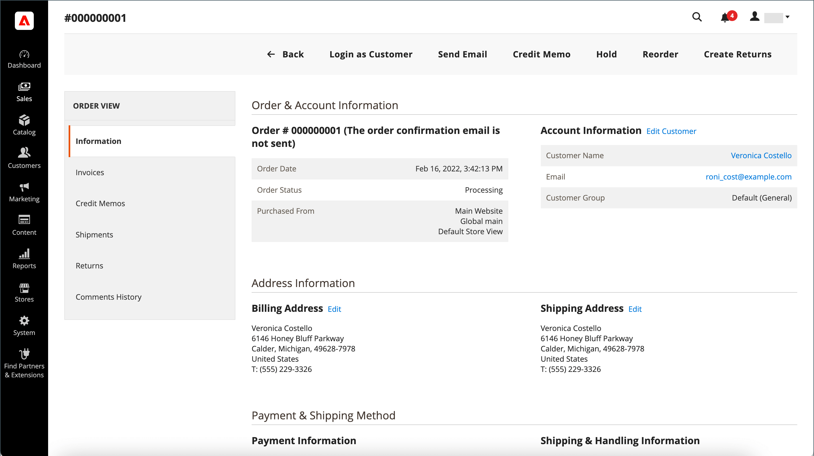
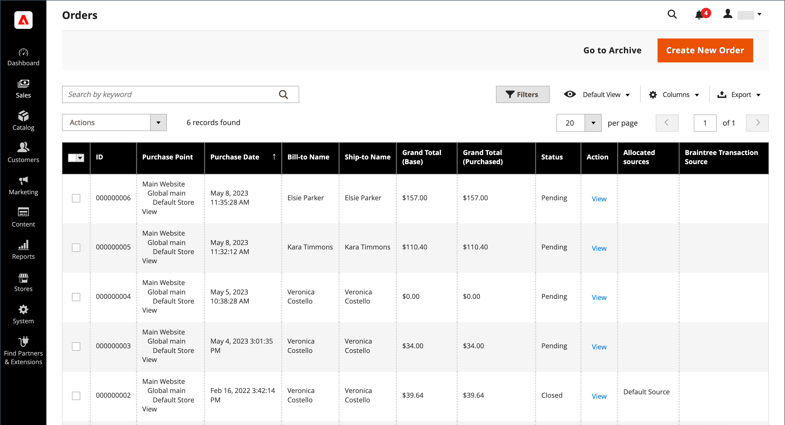
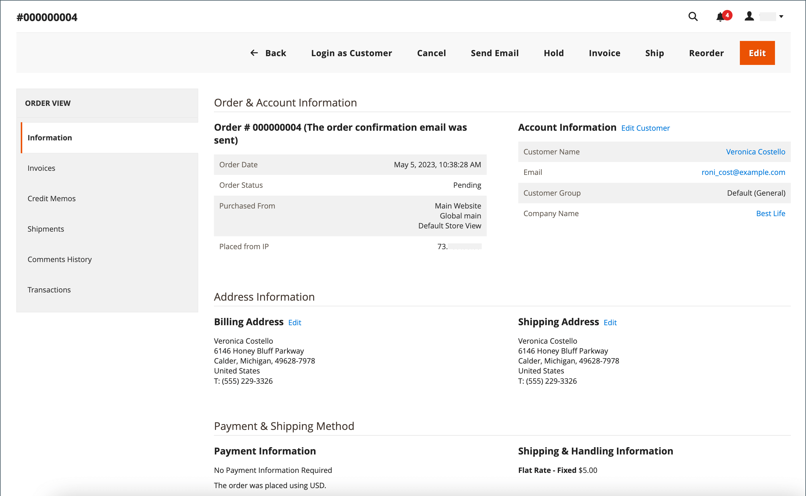
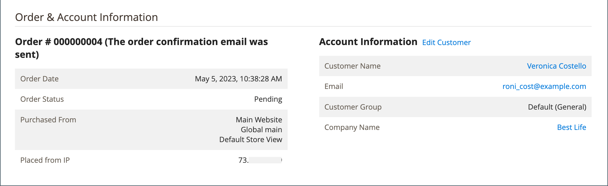
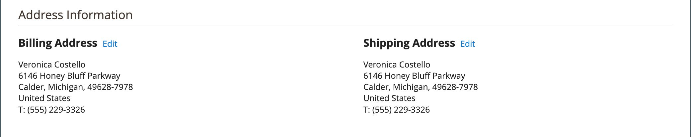
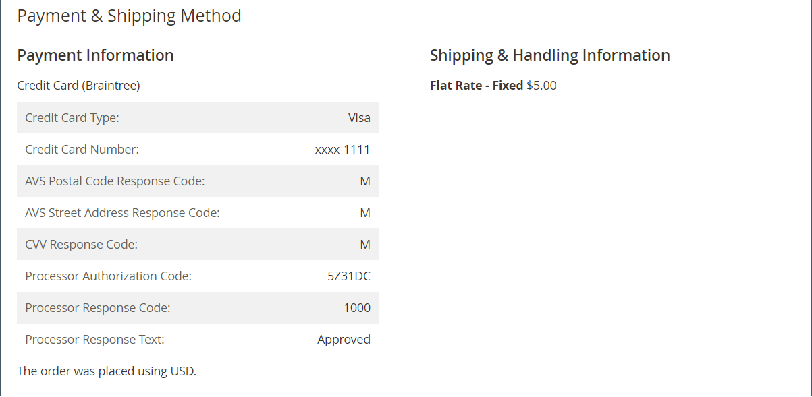
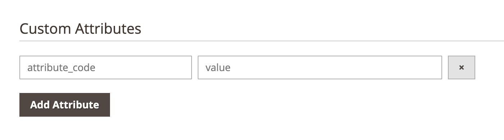
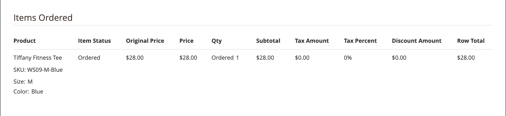
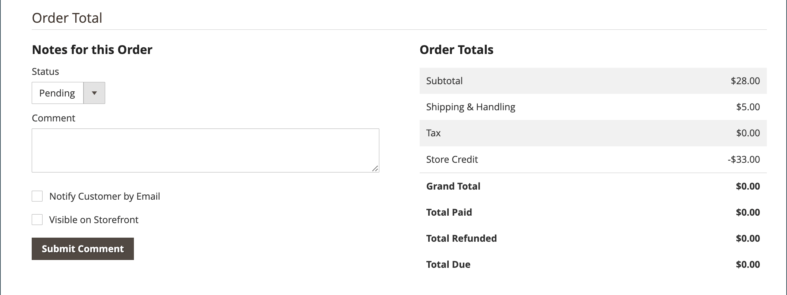

# 注文ワークフローと処理

顧客が注文すると、販売注文が取引の一時的なレコードとして作成されます。 受注グリッドでは、最初に受注のステータスが「保留中」となり、支払いが処理されるまでいつでもキャンセルできます。 支払いが確認された後、注文は請求され、発送されます。

**手順1：注文** – 買い物客がショッピングカートページの&#x200B;**[!UICONTROL Go to Checkout]**&#x200B;をクリックするか、顧客アカウントから直接[再注文](reorders-allow.md)をクリックすると、チェックアウトプロセスが開始されます。

**手順2：注文保留中** – 最初の販売注文ステータスは`Pending`です。 この状態では、支払いは処理されておらず、注文は引き続き編集またはキャンセルできます。 この状態は、支払い方法が認証モードに設定されている場合に発生します。

**手順3：支払いを受け取る** – 支払いを受け取るか承認すると、注文状況が`Processing`に変わります。 支払い方法によっては、取引が承認または処理されたときに通知が届く場合があります。 この状態は、支払い方法がキャプチャまたはインテント販売モード用に設定されている場合に自動的に発生します。

**手順4：請求書注文** – 通常、支払いを受け取った後に注文が請求されます。 支払い方法は、注文に必要な請求オプションを決定します。 請求書を生成して送信すると、コピーがお客様に送信されます。 支払い方法が`capture`または`intent sale`支払いアクションで設定されている場合、支払いが承認され、取り込まれると、請求書が自動的に生成されます。

>[!NOTE]
>
>`Gift Card`、`Store Credit`、`Reward Points`またはその他のオフラインの支払い方法を使用して行われた注文に対して、請求書が自動的に作成されません。

**手順5:1回の配送を予約** – 出荷の詳細が完了し、配送が予約され、配送が設定されると、注文状況が`Complete`に変わります。 配送要件が印刷された梱包伝票と発送ラベルで満たされているか、_受け取り準備完了の通知_&#x200B;が選択されています（実店舗での配送方法）。 お客様は通知を受け取り、パッケージが発送されます。 追跡番号を使用する場合、出荷は顧客のアカウントから追跡できます。

>[!NOTE]
>
>注文状況と支払い方法の設定オプションについて詳しくは、[注文状況](order-status.md)および[支払い](payments.md)を参照してください。

## 注文の表示

1. _管理者_ サイドバーで、**[!UICONTROL Sales]** > _[!UICONTROL Operations]_>**[!UICONTROL Orders]**&#x200B;に移動します。

1. グリッド内の順序を検索します。

1. _[!UICONTROL Action]_&#x200B;列で、**[!UICONTROL View]**&#x200B;をクリックします。

1. 注文ステータスの確認：

   - `Pending`件の注文は、変更、保留、キャンセル、または請求および発送できます。

   - `Processing`注文の実質的な編集やキャンセルは行えなくなりましたが、請求先住所と配送先住所の編集は可能です。

   - `Completed`件の注文を並べ替えることができます。

お客様の電子メールは、お客様を編集することにより、注文ワークフローの任意の時点で編集できます。 注文がゲストによって行われた場合、メールを編集することはできません。

オープン注文の左側のパネルでは、注文に関連するさまざまな種類の情報にアクセスできます。

{width="700" zoomable="yes"}

## 注文の処理

顧客が注文すると、販売注文が取引の一時的なレコードとして作成されます。 支払いを受け取るまで、販売注文のステータスは`Pending`です。 `Pending`のステータスでは、支払いを受け取り、請求書が生成されるまで、注文を編集またはキャンセルできます。 注文が請求書になり、請求書が出荷になるという考え方は簡単です。 「注文」グリッドには、ワークフロー内の場所に関係なく、すべての注文が一覧表示されます。 注文のお客様を支援する方法については、[注文の更新](order-update.md)を参照してください。

{width="700" zoomable="yes"}

`Pending`注文を開くには、右上隅の&#x200B;**[!UICONTROL Edit]**&#x200B;をクリックします。

>[!NOTE]
>
>注文は、`Pending` ステータスのときにのみ編集できます。 「編集」ボタンは、異なるステータスの注文や、[交渉済みの見積](../b2b/quotes.md)に基づく注文には表示されません。

{width="600" zoomable="yes"}

参照用のフィールド説明を使用して、受注の次のセクションを確認します。

### 注文ビューの説明

| Tab | 説明 |
|--- |--- |
| [!UICONTROL Information] | 請求先や配送先住所、支払いと配送方法、注文アイテム、合計、メモなど、注文とアカウントに関する詳細な情報を表示します。 |
| [!UICONTROL Invoices] | 注文に関連付けられている各請求書を一覧表示します。 |
| [!UICONTROL Credit Memos] | 注文に関連付けられている各クレジットメモを一覧表示します。 |
| [!UICONTROL Shipments] | 注文に関連付けられている各出荷レコードを一覧表示します。 |
| [!UICONTROL Comments History] | 注文に関連するすべてのメモを一覧表示します。 |

{style="table-layout:auto"}

>[!NOTE]
>
>_請求書_、_クレジットメモ_、_配送_&#x200B;注文タブを表示するには、管理者ユーザーの役割スコープに&#x200B;**[!UICONTROL Sales / Archive]** [権限](../systems/permissions-user-roles.md)が必要です。

### ボタンバー

| ボタン | 説明 |
|--- |--- |
| **[!UICONTROL Back]** | 変更を保存せずに注文ページに戻ります。 |
| **[!UICONTROL Cancel]** | 販売注文のキャンセル。 |
| **[!UICONTROL Send Email]** | 注文に関する電子メールを顧客に送信します。 |
| **[!UICONTROL Hold]** / **[!UICONTROL Unhold]** | 販売注文のステータスを`On Hold`に変更します。 販売注文の保留を解除するには、**[!UICONTROL Unhold]**&#x200B;を選択します。 |
| **[!UICONTROL Invoice]** | 受注を請求書に変換して、受注から請求書を作成します。 |
| **[!UICONTROL Ship]** | 注文の出荷レコードを作成します。 |
| **[!UICONTROL Notify Order is Ready for Pickup]** | 注文が実店舗での配送として行われた場合にのみ表示されます。 注文を受け取る準備ができたことを顧客に通知します。 |
| **[!UICONTROL Reorder]** | 現在の注文に基づいて販売注文を作成します。 |
| **[!UICONTROL Edit]** | 編集モードで保留中の注文を開きます。 ステータスが`Processing`の注文、または交渉済みの見積もりに基づく注文では、「編集」ボタンは表示されません。 |

{style="table-layout:auto"}

### 注文のキャンセル

まだ請求されていない注文を[&#x200B; キャンセル &#x200B;](order-update.md)できます。 お客様が請求された後に注文をキャンセルしたい場合は、[&#x200B; クレジットメモ &#x200B;](credit-memos.md)を発行する必要があります（支払いが行われます）。

注文が`Pending`または`Processing`で、支払いがキャプチャされていないか、完全にキャプチャされていない場合は、注文をキャンセルする代わりに[注文をキャンセルできます](#void-an-order)。

キャンセルされた注文を復元するには、**[!UICONTROL Reorder]** ボタンをクリックすると、ステータス `Pending`の新しい注文が作成されます。

>[!NOTE]
>
>注文をキャンセルしても無効になりますが、注文をキャンセルしてもキャンセルはトリガーされません。

### 注文を無効にする

請求書がなく、ステータスが`Processing`で、[支払い統合設定が`Authorize`](../configuration-reference/sales/payment-methods.md#payment-actions)の販売注文のみが[無効化](order-update.md#void-a-processing-order)できます。 注文を無効にした後、キャンセルできます。

### [!UICONTROL Order and Account Information]

{width="600" zoomable="yes"}

#### 注文情報

| フィールド | 説明 |
|--- |--- |
| [!UICONTROL Order Number] | 注文番号は、販売注文の上部に表示され、その後、確認メールが送信されたかどうかを示すメモが続きます。 |
| [!UICONTROL Order Date] | 注文が行われた日時。 |
| [!UICONTROL Purchased From] | 注文が行われたweb サイト、ストア、ストアビューを示します。 |
| [!UICONTROL Placed from IP] | 注文が行われたコンピューターのIP アドレスを示します。 |
| [!UICONTROL Order Placed from Quote] |  （Adobe Commerce B2Bで利用可能）注文が生成された[見積](../b2b/quotes.md)を示します（該当する場合）。 見積書名は見積書にリンクされています。 |

{style="table-layout:auto"}

#### アカウント情報

| フィールド | 説明 |
|--- |--- |
| [!UICONTROL Customer Name] | 注文した顧客または購入者の名前。 お客様の名前は、お客様のプロファイルにリンクされています。 |
| [!UICONTROL Email] | 顧客または購入者のメールアドレス。 メールアドレスがリンクされ、新しいメールメッセージが開きます。 |
| [!UICONTROL Customer Group] | 顧客が割り当てられている顧客グループまたは共有カタログの名前。 |
| [!UICONTROL Company Name] |  （Adobe Commerce B2Bで利用可能）購入者が関連付けられ、注文が行われる会社の名前。 会社名は[会社プロファイル &#x200B;](../b2b/account-companies.md)にリンクされています。 |

{style="table-layout:auto"}

### [!UICONTROL Address Information]

{width="600" zoomable="yes"}

| フィールド | 説明 |
|--- |--- |
| [!UICONTROL Billing Address] | 注文を行った顧客または購入者の名前の後に、請求先住所、電話番号、および[VAT](vat.md) （該当する場合）が続きます。 電話番号は、モバイルデバイス上のオートダイヤルにリンクされています。 |
| [!UICONTROL Shipping Address] | 注文を発送する担当者の名前の後に、配送先住所と電話番号が続きます。 電話番号は、モバイルデバイス上のオートダイヤルにリンクされています。 |

{style="table-layout:auto"}

### [!UICONTROL Payment & Shipping Method]

{width="600" zoomable="yes"}

| フィールド | 説明 |
|--- |--- |
| [!UICONTROL Payment Information] | 注文に使用する支払い方法、および注文番号（該当する場合）、その後に注文を行うために使用された通貨。 注文がアカウント [&#128279;](../b2b/enable-basic-features.md#configure-payment-on-account)の支払いを使用して会社のクレジットに請求された場合、アカウントに請求された金額が表示されます。 |
| [!UICONTROL Shipping & Handling Information] | 使用する配送方法、および適用される処理手数料。 |

{style="table-layout:auto"}

### カスタム注文属性

[!BADGE SaaSのみ]{type=Positive url="https://experienceleague.adobe.com/ja/docs/commerce/user-guides/product-solutions" tooltip="Adobe Commerce as a Cloud Service プロジェクト（Adobeで管理されるSaaS インフラストラクチャ）にのみ適用されます。"}

カスタム注文属性を使用すると、ビジネスニーズに固有の追加情報を注文に関連付けることができます。

{width="600" zoomable="yes"}

**[!UICONTROL Custom Order Attributes]** セクションには、すべてのカスタム注文属性とその現在の値が表示されます。

新しいカスタム注文属性を作成するには、**[!UICONTROL Attribute Code]**&#x200B;と&#x200B;**[!UICONTROL Value]**&#x200B;を入力します

追加のカスタム注文属性を作成するには、**[!UICONTROL Add Attribute]**&#x200B;をクリックします。

カスタム注文属性を削除するには、**[!UICONTROL X]** アイコンをクリックします。

>[!NOTE]
>
>カスタム注文属性は、注文が`Pending` ステータスの場合にのみ編集できます。 他のステータスの注文の場合は、属性値を表示できますが、変更することはできません。

### 注文済み品目の確認

{width="600" zoomable="yes"}

**[!UICONTROL Order Total]** セクションで、次の操作を行います。

1. 注文に含める&#x200B;**[!UICONTROL Comment]**&#x200B;を入力します。

1. お客様にコメントを電子メールで送信する場合は、**[!UICONTROL Notify Customer by Email]** チェックボックスを選択します。

1. 顧客アカウントにコメントを表示する場合は、**[!UICONTROL Visible on Storefront]** チェックボックスを選択します。

   {width="600" zoomable="yes"}

1. 注文を請求する準備ができたら、**[!UICONTROL Invoice]**&#x200B;をクリックし、指示に従って[請求書を作成](invoices.md#create-an-invoice)します。

#### [!UICONTROL Items Ordered]

| フィールド | 説明 |
|--- |--- |
| [!UICONTROL Product] | 商品名、SKU、およびオプション（該当する場合）。 |
| [!UICONTROL Item Status] | 項目のステータスを示します。 値：`Ordered` |
| [!UICONTROL Original Price] | 割引前の商品の元のカタログ価格。 |
| [!UICONTROL Price] | 商品の購入価格。 この値は、共有カタログからアイテムに適用された割引（該当する場合）を反映します。 |
| [!UICONTROL Qty] | 注文数量。 |
| [!UICONTROL Subtotal] | 小計は、購入価格に数量を掛けた値です。 |
| [!UICONTROL Tax Amount] | 品目に小数点以下桁で適用される税額。 |
| [!UICONTROL Tax Percent] | この品目に適用される税金の割合（パーセント）。 |
| [!UICONTROL Discount Amount] | この項目に適用される割引。 見積もりに基づいて注文を行った場合、割引値は0になります。 |
| [!UICONTROL Row Total] | 明細の項目合計（製品レベルで支払われる適用税を含む）。割引は少なくなります。 |

{style="table-layout:auto"}

#### [!UICONTROL Notes for this Order]

| フィールド | 説明 |
|--- |--- |
| [!UICONTROL Status] | 販売注文のステータスを表示します。 |
| [!UICONTROL Comment] | 注文に伴う顧客へのコメントを入力するために使用されるテキストボックス。 **[!UICONTROL Notify Customer by Email]**- コメントを別の電子メールとしてお客様に送信する場合は、チェックボックスを選択します。 **[!UICONTROL Visible on Storefront]** – 顧客のアカウントからコメントを表示する場合は、チェックボックスを選択します。 **[!UICONTROL Update]**- コメントを追加し、該当する場合は電子メールを送信します。 |

{style="table-layout:auto"}

#### [!UICONTROL Order Totals]

| フィールド | 説明 |
|--- |--- |
| [!UICONTROL Shipping & Handling] | 送料と処理手数料に対して請求される金額。 |
| [!UICONTROL Tax] | 注文に適用される税額（該当する場合）。 |
| [!UICONTROL Grand Total] | 注文の合計。 |
| [!UICONTROL Total Paid] | 注文に対して支払われた合計金額（該当する場合）。 |
| [!UICONTROL Total Refunded] | 注文から返金された合計金額（該当する場合）。 |
| [!UICONTROL Total Due] | 期限が切れている合計金額。 |
| [!UICONTROL Store Credit] |  （Adobe Commerceのみ）注文に適用される利用可能なストアクレジットの金額（該当する場合）。 |
| [!UICONTROL Catalog Total Price] |  （Adobe Commerce B2Bで利用可能）見積書の基となる共有カタログまたは標準カタログの価格に従って、見積書に含まれる商品の合計価格（税抜き）です。 ストアフロントの表示通貨が基本通貨と異なる場合、値は両方の通貨で表示され、ストアフロントは角括弧で表示されます。 |
| [!UICONTROL Negotiated Discount] |  （Adobe Commerce B2Bで利用可能）購入者と販売者の間で交渉された見積もりの結果である割引。 ストアフロントの表示通貨が基本通貨と異なる場合、値は両方の通貨で表示され、ストアフロントは角括弧で表示されます。 |
| [!UICONTROL Subtotal] |  （Adobe Commerce B2Bで利用可能） カタログの合計価格から交渉済み割引を差し引きます。 |

{style="table-layout:auto"}

## 注文処理のデモ

このビデオを見て、注文処理とステータスについて詳しく説明します。

>[!VIDEO](https://video.tv.adobe.com/v/3410799/?captions=jpn&quality=12&learn=on)
