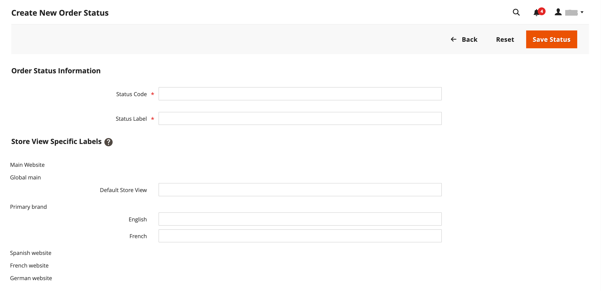
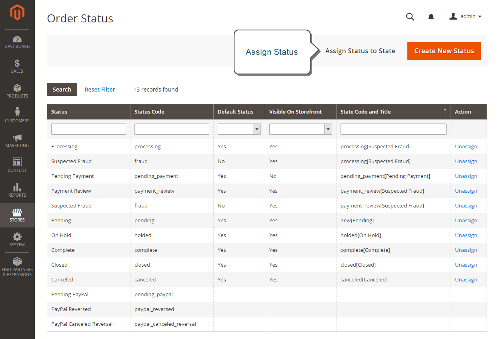
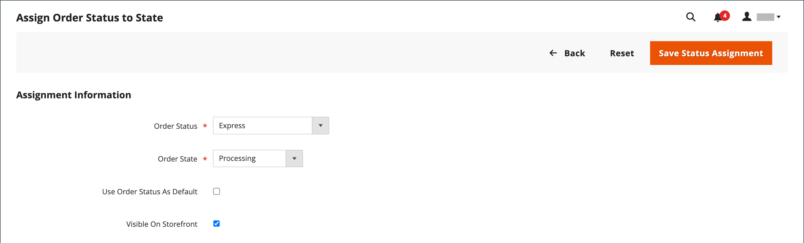
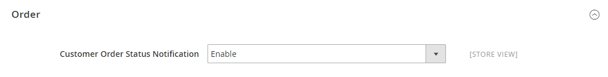

# 注文ステータス

すべての注文には、注文処理[&#x200B; ワークフロー](order-processing.md)のステージに関連付けられた注文ステータスがあります。\
注文状態と注文ステータスの違いは、**[!UICONTROL order states]**&#x200B;がプログラムで使用されていることです。 彼らはそうではありません
顧客または管理者ユーザーに表示されます。 注文のフローを決定し、どの操作が可能かを決定します
一定の状態での順序。\
**[!UICONTROL Order statuses]**&#x200B;は、注文のステータスを顧客と管理者ユーザーに伝えるために使用されます。
運用上のニーズに合わせて、追加の注文ステータスを作成できます。注文状況の表示
Adobe Commerce外での進捗（注文のピッキングや配送の進捗など）。注文への影響はありません
処理ワークフロー：\
各注文ステータスは、注文ステータスに関連付けられます。 ストアには、あらかじめ定義された注文ステータスと
注文状況の設定：

{width="700" zoomable="yes"}

各注文のステータスは、_Orders_ グリッドの&#x200B;_Status_&#x200B;列に表示されます。

{width="700" zoomable="yes"}

>[!TIP]
>
>一部返金された注文は、**_すべての_**&#x200B;件の注文アイテム（返金されたアイテムを含む）が発送されるまで`Processing` ステータスのままになります。 注文のすべての商品が出荷されるまで、注文ステータスは`Complete`に変更されません。

## 注文状態ワークフロー

## 定義済みステータス

| 注文ステータス | ステータスコード |                                                                                                                                                                                                                                                                                        |
|--------------------------|----------------------------|----------------------------------------------------------------------------------------------------------------------------------------------------------------------------------------------------------------------------------------------------------------------------------------|
| 受信 | `received` | このステータスは、非同期注文が有効になっている場合に発注される注文の初期ステータスです。 |
| 詐欺の疑い | `fraud` | PayPalやその他の支払いゲートウェイを介して支払われた注文が、_詐欺の疑い_&#x200B;としてマークされる場合があります。 このステータスは、注文に請求書が発行されず、確認メールも送信されないことを意味します。 |
| 処理中 | `processing` | 新しい注文のステータスが「処理中」に設定されている場合、設定で「_すべてのアイテムを自動的に請求_」オプションが使用できるようになります。 ギフトカード、店舗クレジット、リワードポイント、またはその他のオフラインの支払い方法を使用して行われた注文に対して、請求書が自動的に作成されることはありません。 |
| 支払い待ち | `pending_payment` | このステータスは、注文が作成され、PayPalなどの支払い方法が使用された場合に使用されます。 お客様が支払いゲートウェイのweb サイトに誘導されたことを意味しますが、返品情報はまだ受信されていません。 このステータスは、顧客が支払うと変更されます。 |
| 支払いレビュー | `payment_review` | このステータスは、PayPal支払いレビューがオンになっている場合に表示されます。 |
| 保留 | `pending` | このステータスは、請求書と出荷が送信されていないことを示します。 |
| 保留中 | `holded` | このステータスは手動でのみ割り当てることができます。 どんな注文でも保留にすることができます。 |
| 完了 | `complete` | このステータスは、注文が作成され、支払われ、顧客に発送されることを意味します。 |
| クローズ | `closed` | このステータスは、注文がクレジットメモに割り当てられ、顧客が払い戻しを受けたことを示します。 |
| キャンセル済み | `canceled` | このステータスは、管理者または一部の支払いゲートウェイで、お客様が指定した時間内に支払いを行わない場合に、手動で割り当てられます。 |
| 却下 | `rejected` | このステータスは、非同期注文処理中に注文が拒否されたことを意味します。 これは、非同期注文の配置中にen エラーが発生した場合に発生します。 |
| PayPal キャンセル済み取り消し | `paypay_canceled_reversal` | このステータスは、PayPalがリバーサルをキャンセルしたことを意味します。 |
| 保留中のPayPal | `pending_paypal` | このステータスは、注文がPayPalで受信されたが、支払いがまだ処理されていないことを意味します。 |
| PayPalを反転 | `paypal_reversed` | このステータスは、PayPalがトランザクションを取り消したことを意味します。 |

{style="table-layout:auto"}

## カスタム注文ステータス

プリセットの注文ステータス設定に加えて、独自のカスタム注文ステータス設定を作成し、注文ステータスに割り当て、注文ステータスにデフォルトの注文ステータスを設定できます。 注文状態は、注文処理ワークフロー内の注文の位置を示し、注文ステータスは、意味のある翻訳可能ラベルを注文の位置に割り当てます。 例えば、`packaging"`、`backordered`などのカスタム注文ステータス、またはニーズに固有のステータスが必要な場合があります。 カスタムステータスのわかりやすい名前を作成し、ワークフロー内の関連する注文状態に割り当てることができます。

>[!NOTE]
>
>注文ワークフローでは、デフォルトのカスタム注文ステータス値のみが使用されます。 デフォルトとして設定されていないカスタムステータス値は、注文の「コメント」セクションでのみ使用できます。

{width="700" zoomable="yes"}

### カスタム注文ステータスの作成

1. _管理者_ サイドバーで、**[!UICONTROL Stores]** > _[!UICONTROL Settings]_>**[!UICONTROL Order Status]**&#x200B;に移動します。

1. 右上隅の「**[!UICONTROL Create New Status]**」をクリックします。

   {width="600" zoomable="yes"}

1. _[!UICONTROL Order Status Information]_&#x200B;セクションを更新します。

   - 内部参照用に&#x200B;**[!UICONTROL Status Code]**&#x200B;を入力します。 最初の文字は文字（a ～ z）にする必要があり、残りは文字と数字の任意の組み合わせにすることができます（0 ～ 9）。 スペースの代わりにアンダースコア文字を使用します。

   - **[!UICONTROL Status Label]**&#x200B;の場合、管理者とストアフロントの両方でステータス設定を識別するラベルを入力します。

1. 「_[!UICONTROL Store View Specific Labels]_」セクションで、異なるストアビューに必要なラベルを入力します。

1. **[!UICONTROL Save Status]**&#x200B;をクリックします。

### 注文ステータスの状態への割り当て

1. _注文状況_ ページで、**[!UICONTROL Assign Status to State]**&#x200B;をクリックします。

   {width="600" zoomable="yes"}

1. **[!UICONTROL Assignment Information]** セクションを更新し、次の操作を行います。

   - 割り当てる&#x200B;**[!UICONTROL Order Status]**&#x200B;を選択します。 ステータスラベルでリストされます。

   - **[!UICONTROL Order State]**&#x200B;を、注文ステータスが属するワークフロー内の場所に設定します。

     >[!NOTE]
     >
     >**_[!UICONTROL Order State]_** リストには、デフォルトの割り当て済み注文ステータスが含まれています。 例えば、`New`の注文状態の値ではなく、`Pending`のデフォルトの注文状態が表示されます。

   - このステータスを注文状態のデフォルトにするには、**[!UICONTROL Use Order Status as Default]** チェックボックスを選択します。

     >[!NOTE]
     >
     >注文ワークフローでは、デフォルトの注文ステータスのみが使用されます。 デフォルト以外のステータスは、Adminの&#x200B;**[!UICONTROL Order Comments]** セクションでのみ設定できます。

   - このステータスをストアフロントから表示するには、**[!UICONTROL Visible On Storefront]** チェックボックスを選択します。

   {width="600" zoomable="yes"}

1. **[!UICONTROL Save Status Assignment]**&#x200B;をクリックします。

### 既存の注文ステータスの編集

1. _[!UICONTROL Order Status]_&#x200B;グリッドで、ステータスレコードを編集モードで開きます。

1. 必要に応じてステータス設定を更新します。

1. **[!UICONTROL Save Status]**&#x200B;をクリックします。

### 割り当てられた状態から注文ステータスを削除する

>[!NOTE]
>
>ステータスが使用中の場合、ステータス設定をステータスから割り当て解除することはできません。

1. _[!UICONTROL Order Status]_&#x200B;グリッドで、割り当て解除する注文ステータス レコードを見つけます。

1. 行の右端にある&#x200B;_[!UICONTROL Action]_&#x200B;列で、**[!UICONTROL Unassign]**&#x200B;リンクをクリックします。

   注文ステータスが割り当て解除されたことを示すメッセージがワークスペースの上部に表示されます。 注文ステータスラベルは引き続きリストに表示されますが、ステータスに割り当てられなくなりました。 注文状況の設定は削除できません。

>[!NOTE]
>
>デフォルトの注文ステータスが注文状態から未割り当てである場合、_&#x200B;**another**&#x200B;_&#x200B;の注文ステータスは&#x200B;_&#x200B;**自動的に**&#x200B;_&#x200B;この注文状態のデフォルトとして設定されます。

## 通知

顧客は、設定で注文RSS フィードが有効になっている場合、[RSS フィード &#x200B;](../merchandising-promotions/social-rss.md)によって注文のステータスを追跡できます。 有効にすると、各注文にRSS フィードへのリンクが表示されます。

### 注文ステータス通知を有効にする

1. _管理者_ サイドバーで、**[!UICONTROL Stores]** > _[!UICONTROL Settings]_>**[!UICONTROL Configuration]**&#x200B;に移動します。

1. 左側のパネルで「**[!UICONTROL Catalog]**」を展開し、下の「**[!UICONTROL RSS Feeds]**」を選択します。

1. **[!UICONTROL Order]** セクションのを展開します。

1. **[!UICONTROL Customer Order Status Notification]**&#x200B;を`Enable`に設定します。

   {width="600" zoomable="yes"}

1. 完了したら、**[!UICONTROL Save Config]**&#x200B;をクリックします。

### 新しい注文メール通知の設定

1. _管理者_ サイドバーで、**[!UICONTROL Stores]** > _[!UICONTROL Settings]_>**[!UICONTROL Configuration]**&#x200B;に移動します。

1. 左側のパネルで「**[!UICONTROL Sales]**」を展開し、下の「**[!UICONTROL Sales Emails]**」を選択します。

1. **[!UICONTROL Order]** セクションのを展開します。

   {width="600" zoomable="yes"}

1. **[!UICONTROL New Order Confirmation Email Sender]**&#x200B;を次のいずれかに設定します：

   - `General Contact`
   - `Sales Representative`
   - `Customer Support`
   - `Custom Email 1`
   - `Custom Email 2`

1. 顧客タイプごとに使用するテンプレートを選択します。

   - **[!UICONTROL New Order Confirmation Template]** – 登録済みのストアアカウントを持つ顧客に使用するテンプレートを選択します。
   - **[!UICONTROL New Order Confirmation Template for Guest]** – 登録されたストアアカウントを持たないゲストのお客様に使用するテンプレートを選択します。

1. 新しい注文について別のユーザー（ビジネス マネージャーなど）に通知するには、電子メールアドレスを&#x200B;**[!UICONTROL Send Order Email Copy To]**&#x200B;に入力します。

   複数の受信者が必要な場合は、複数のメールアドレスを追加できます。

1. **[!UICONTROL Send Order Email Copy Method]**&#x200B;を次のいずれかに設定します。

   - `Bcc` – 新しい注文に関する電子メールは、お客様と追加の受信者の両方に送信されますが、お客様は、受信した電子メールが追加の受信者にも送信されたことを確認しません。
   - `Separate Email` - 2つの別々の電子メールが送信されます。1つは受信者に、1つは顧客に送信されます。

1. 完了したら、**[!UICONTROL Save Config]**&#x200B;をクリックします。
