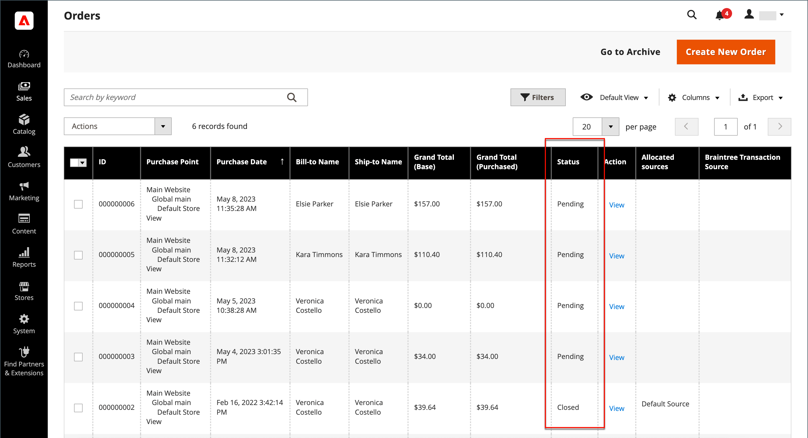

# 注文ステータス

すべての注文には、注文処理 [ ワークフロー ](order-processing.md) のステージに関連付けられた注文ステータスがあります。\
注文ステータスと注文ステータスの違いは、**[!UICONTROL order states]** がプログラムで使用される点です。 次ではありません
顧客または管理者ユーザーに表示されます。 注文のフローと、注文に対して実行できる操作を決定します。
特定の状態で注文してください。\
注文のステータスを顧客および管理者ユーザーに伝えるために使用されます **[!UICONTROL Order statuses]**
運用ニーズに合わせて、追加の注文ステータスを作成できます。 注文ステータスは表示に便利です
Adobe Commerce以外の進行状況（注文ピッキングや配送の進行状況など）。 注文には影響しません
ワークフローを処理しています。\
各注文ステータスは、注文ステータスに関連付けられています。 ストアには、事前に定義された一連の注文ステータスがあり、
オーダー状態の設定。

{width="700" zoomable="yes"}

各注文のステータスは、_注文_ グリッドの _ステータス_ 列に表示されます。

{width="700" zoomable="yes"}

>[!TIP]
>
>一部返金された注文は、注文された品目 **_返金された品目を含む_** すべて）が出荷されるまで、`Processing` のステータスのままとなります。 注文ステータスは、注文のすべての品目が出荷されるまで `Complete` に変わりません。

## 注文の状態ワークフロー

## 事前定義済みステータス

| 注文ステータス | 状態コード |                                                                                                                                                                                                                                                                                        |
|--------------------------|----------------------------|----------------------------------------------------------------------------------------------------------------------------------------------------------------------------------------------------------------------------------------------------------------------------------------|
| 受信済み | `received` | このステータスは、非同期の注文プレースメントが有効な場合に配置される注文の初期ステータスです。 |
| 詐欺の疑い | `fraud` | PayPal または他の支払い方法で支払われた注文は、_不正の疑い_ としてマークされることがあります。 このステータスは、注文に請求書が発行されておらず、確認メールも送信されていないことを意味します。 |
| 処理中 | `processing` | 新しい注文のステータスが「処理中」に設定されている場合は、「すべての項目を自動的に請求 _オプションが設定で使用できる_ うになります。 ギフトカード、ストアクレジット、報酬ポイント、またはその他のオフラインの支払い方法を使用して注文した場合、請求書は自動的には作成されません。 |
| 保留中の支払い | `pending_payment` | このステータスは、注文が作成され、PayPal または同様の支払い方法が使用される場合に使用されます。 つまり、顧客が支払いゲートウェイの web サイトに誘導されたが、返品情報はまだ受信されていないことを意味します。 このステータスは、顧客が支払う際に変更されます。 |
| 支払いの確認 | `payment_review` | このステータスは、PayPal 支払いレビューがオンの場合に表示されます。 |
| 保留中 | `pending` | このステータスは、請求書と出荷が送信されていないことを示します。 |
| 保留中 | `holded` | このステータスは手動でのみ割り当てることができます。 どんな注文でも保留にできます。 |
| 完了 | `complete` | このステータスは、注文が作成、支払い、顧客に出荷されることを意味します。 |
| クローズ | `closed` | このステータスは、受注がクレジット・メモに割り当てられ、顧客が払戻を受け取ったことを示します。 |
| キャンセル済み | `canceled` | このステータスは、管理者で手動で割り当てられます。または、一部の支払いゲートウェイでは、顧客が指定した時間内に支払わない場合に割り当てられます。 |
| 却下 | `rejected` | このステータスは、非同期注文処理中に注文が却下されたことを意味します。 これは、非同期注文の配置中にエラーが発生した場合に発生します。 |
| PayPal キャンセル取消 | `paypay_canceled_reversal` | このステータスは、PayPal が取消をキャンセルしたことを意味します。 |
| 保留中の PayPal | `pending_paypal` | このステータスは、注文が PayPal によって受け取られたが、支払いがまだ処理されていないことを意味します。 |
| PayPal 取消 | `paypal_reversed` | このステータスは、PayPal がトランザクションを取り消したことを意味します。 |

{style="table-layout:auto"}

## カスタム注文ステータス

プリセットの注文ステータス設定に加えて、独自のカスタム注文ステータス設定を作成し、それらを注文ステータスに割り当て、注文ステータスのデフォルトの注文ステータスを設定できます。 注文状態は、注文処理ワークフロー内の注文の位置を示し、注文ステータスは、注文の位置に意味のある翻訳可能なラベルを割り当てます。 例えば、`packaging"`、`backordered` などのカスタム注文ステータスや、ニーズに固有のステータスが必要な場合があります。 カスタムステータスにわかりやすい名前を作成し、ワークフロー内の関連する注文ステータスに割り当てることができます。

>[!NOTE]
>
>注文ワークフローでは、デフォルトのカスタム注文ステータス値のみが使用されます。 デフォルトとして設定されていないカスタムステータス値は、注文のコメントセクションでのみ使用できます。

{width="700" zoomable="yes"}

### カスタム注文ステータスの作成

1. _管理者_ サイドバーで、**[!UICONTROL Stores]**/_[!UICONTROL Settings]_/**[!UICONTROL Order Status]**に移動します。

1. 右上隅の「**[!UICONTROL Create New Status]**」をクリックします。

   {width="600" zoomable="yes"}

1. _[!UICONTROL Order Status Information]_のセクションを更新します。

   - 内部参照の **[!UICONTROL Status Code]** を入力します。 最初の文字は文字（a ～ z）である必要があり、残りは文字と数字（0 ～ 9）の任意の組み合わせにすることができます。 スペースの代わりにアンダースコア文字を使用します。

   - **[!UICONTROL Status Label]**：管理とストアフロントの両方のステータス設定を識別するラベルを入力します。

1. [_[!UICONTROL Store View Specific Labels]_] セクションで、異なるストア ビューに必要なラベルを入力します。

1. 「**[!UICONTROL Save Status]**」をクリックします。

### 注文ステータスの状態への割り当て

1. _注文ステータス_ ページで、「**[!UICONTROL Assign Status to State]**」をクリックします。

   {width="600" zoomable="yes"}

1. **[!UICONTROL Assignment Information]** セクションを更新し、次の操作を実行します。

   - 割り当てる **[!UICONTROL Order Status]** を選択します。 ステータスラベル別にリストされます。

   - ワークフロー内の注文ステータスが属する場所に **[!UICONTROL Order State]** を設定します。

     >[!NOTE]
     >
     >リスト **_[!UICONTROL Order State]_** は、デフォルトの割り当て済み注文ステータスが含まれます。 例えば、`New` しい注文ステータス値ではなく、`Pending` のデフォルトの注文ステータスが表示されます。

   - このステータスを注文ステータスのデフォルトにするには、「**[!UICONTROL Use Order Status as Default]**」チェックボックスを選択します。

     >[!NOTE]
     >
     >注文ワークフローでは、デフォルトの注文ステータスのみが使用されます。 デフォルト以外のステータスは、管理者の「**[!UICONTROL Order Comments]**」セクションでのみ設定できます。

   - このステータスをストアフロントから表示するには、「**[!UICONTROL Visible On Storefront]**」チェックボックスをオンにします。

   {width="600" zoomable="yes"}

1. 「**[!UICONTROL Save Status Assignment]**」をクリックします。

### 既存の注文ステータスの編集

1. _[!UICONTROL Order Status]_グリッドで、ステータスレコードを編集モードで開きます。

1. 必要に応じて、ステータス設定を更新します。

1. 「**[!UICONTROL Save Status]**」をクリックします。

### 割り当て済み状態から注文ステータスを削除する

>[!NOTE]
>
>ステータスが使用中の場合は、ステータス設定のステータスからの割り当てを解除できません。

1. _[!UICONTROL Order Status]_グリッドで、割り当てを解除する注文ステータスレコードを見つけます。

1. 行の右端にある _[!UICONTROL Action]_列で、**[!UICONTROL Unassign]**のリンクをクリックします。

   注文ステータスが未割り当てであることを示すメッセージがワークスペースの上部に表示されます。 注文ステータスラベルはリスト内に残りますが、状態に割り当てられなくなります。 注文ステータス設定は削除できません。

>[!NOTE]
>
>デフォルトの注文ステータスが注文ステータスから割り当て解除されている場合、_**別の**_ 注文ステータスはこの注文ステータスのデフォルトとして _**自動的に設定**_ されます。

## 通知

設定で「注文 RSS フィード」が有効になっている場合、顧客は [RSS フィード ](../merchandising-promotions/social-rss.md) によって注文のステータスを追跡できます。 有効化すると、各注文に RSS フィードへのリンクが表示されます。

### 注文ステータス通知を有効にする

1. _管理者_ サイドバーで、**[!UICONTROL Stores]**/_[!UICONTROL Settings]_/**[!UICONTROL Configuration]**に移動します。

1. 左側のパネルで「**[!UICONTROL Catalog]**」を展開し、その下の「**[!UICONTROL RSS Feeds]**」を選択します。

1. 「」を展開し、「**[!UICONTROL Order]**」セクションを展開します。

1. **[!UICONTROL Customer Order Status Notification]** を `Enable` に設定します。

   {width="600" zoomable="yes"}

1. 完了したら、「**[!UICONTROL Save Config]**」をクリックします。

### 新規注文のメール通知を設定する

1. _管理者_ サイドバーで、**[!UICONTROL Stores]**/_[!UICONTROL Settings]_/**[!UICONTROL Configuration]**に移動します。

1. 左側のパネルで「**[!UICONTROL Sales]**」を展開し、その下の「**[!UICONTROL Sales Emails]**」を選択します。

1. 「」を展開し、「**[!UICONTROL Order]**」セクションを展開します。

   {width="600" zoomable="yes"}

1. **[!UICONTROL New Order Confirmation Email Sender]** を次のいずれかに設定します。

   - `General Contact`
   - `Sales Representative`
   - `Customer Support`
   - `Custom Email 1`
   - `Custom Email 2`

1. 顧客タイプごとに使用するテンプレートを選択します。

   - **[!UICONTROL New Order Confirmation Template]** – 登録済みのストアアカウントを持つ顧客に使用するテンプレートを選択します。
   - **[!UICONTROL New Order Confirmation Template for Guest]** - ストアアカウントが登録されていないゲスト顧客に使用するテンプレートを選択します。

1. 新しい注文について別の担当者（ビジネス マネージャなど）に通知するには、**[!UICONTROL Send Order Email Copy To]** の電子メール アドレスを入力します。

   複数の受信者が必要な場合は、複数のメールアドレスを追加できます。

1. **[!UICONTROL Send Order Email Copy Method]** を次のいずれかに設定します。

   - `Bcc` – 新しい注文に関するメールが 1 つだけ顧客と追加の受信者の両方に送信されますが、顧客が受け取ったメールが追加の受信者にも送信されたことは確認されません。
   - `Separate Email` - 2 通のメールが別々に送信されます。1 つは受信者に、もう 1 つは顧客に送信されます。

1. 完了したら、「**[!UICONTROL Save Config]**」をクリックします。
