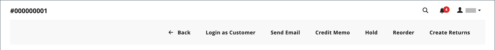

# 注文を更新

注文を行ったお客様を支援する場合、注文のステータスを決定する必要があります。 `Pending` しい注文に使用できるオプションは、`Processing` しい注文のオプションとは異なります。 詳しくは、「[ 注文の処理 ](order-processing.md)」を参照してください。

## 保留中の注文

顧客が注文した後、支払いを受け取る前に、注文は `Pending` ステータスになります。 注文を編集したり、保留にしたり、完全にキャンセルしたりできます。 保留中の注文のボタンバーには、注文に使用できるアクションのリストが表示されます。

{width="600" zoomable="yes"}

オーダーの大部分を変更すると、元のオーダーがキャンセルされ、新しいオーダーが生成されます。 ただし、新しい注文を生成せずに請求先または配送先住所を変更することはできます。

| ボタン | 説明 |
|--- |--- |
| **[!UICONTROL Back]** | 変更を保存せずに [ 受注 ] ページに戻ります。 |
| **[!UICONTROL Login as Customer]** | 管理者ユーザーが、顧客の注文を支援できるようにします。 |
| **[!UICONTROL Cancel]** | 保留中の注文をキャンセルします。 |
| **[!UICONTROL Send Email]** | 保留中の注文に関するメールを顧客に送信します。 |
| **[!UICONTROL Hold]** / **[!UICONTROL Unhold]** | 保留中の注文の状態を `On Hold` に変更します。 保留を解除するには、「_[!UICONTROL Unhold]_」を選択します。 |
| **[!UICONTROL Invoice]** | 受注を請求書に変換して、保留中受注から [ 請求書 ](invoices.md#create-an-invoice) を作成し、受注ステータスを `processing` に変更します。 |
| **[!UICONTROL Ship]** | 注文の [ 出荷 ](shipments.md#create-a-shipment) レコードを作成します。 |
| **[!UICONTROL Reorder]** | 現在の保留中の注文と重複する新しい保留中の注文を作成します。 |
| **[!UICONTROL Edit]** | 保留中の注文を編集モードで開きます。 「編集」ボタンは、保留中の受注、または交渉済 [ 見積 ](../b2b/quotes.md) に基づく受注に対してのみ使用できます。 |

{style="table-layout:auto"}

## オーダーの処理

注文は次の場合に `Processing` 状態になります。

* 注文の支払いが受領/キャプチャされ、支払いアクションが `Authorize and Capture` に設定されている場合に請求書が生成されます。
* 注文トランザクションは許可されますが、支払いアクションが `Authorize` に設定されている場合、支払いはまだキャプチャされません。

[ 支払いアクションの設定 ](../configuration-reference/sales/payment-methods.md#payment-actions) により、注文の作成後に使用できる注文アクションが決定されます。

注 `Processing` を大幅に変更することはできませんが、請求先と配送先住所は編集できます。

{width="600" zoomable="yes"}

>[!NOTE]
>
>支払方法の支払処理が `Authorize and Capture` に設定されている場合、顧客が注文すると請求書が自動的に作成されます。 この場合、資金の払戻には [ クレジット・メモ ](credit-memo-create.md) を使用できますが、受注を [ 取消 ](#cancel-a-pending-order) または [ 無効 ](#void-a-processing-order) することはできません。

| ボタン | 説明 |
|--- |--- |
| **[!UICONTROL Back]** | 変更を保存せずに [ 受注 ] ページに戻ります。 |
| **[!UICONTROL Send Email]** | 注文に関するメールを顧客に送信します。 |
| **[!UICONTROL Void]** | [ ボイド ](#void-a-processing-order) 受注取引または一部受注取引。 |
| **[!UICONTROL Credit Memo]** | [ クレジット メモ ](credit-memo-create.md) を作成する処理を開始します。 |
| **[!UICONTROL Hold]** / **[!UICONTROL Unhold]** | 販売注文の状態を `On Hold` に変更します。 受注の保留を解除するには、「_[!UICONTROL Unhold]_」を選択します。 |
| **[!UICONTROL Reorder]** | 現在の注文に基づいて新しい保留中注文を作成します。 |
| **[!UICONTROL Create Returns]** |  （Adobe Commerceのみ）注文から 1 つ以上の商品を [ 返品 ](returns.md) するプロセスを開始します。 |

{style="table-layout:auto"}

## 処理順序の無効化

注文がまだ `Processing` ステータスで、支払いの統合が `Authorize` （`Authorize and Capture` ではなく）に設定されている場合、トランザクションを無効にするか、注文をキャンセルすることしかできません。 [ 注文をキャンセル ](#cancel-a-pending-order) すると、認証も無効になります。

支払処理が「`Authorize and Capture`」に設定されている支払方法を使用して注文を行った場合、クレジット・メモによる資金の払戻は可能ですが、請求され、支払が取り込まれるため、取消はできません。

お支払い方法によって、利用可能な支払いアクションが決まります。 詳しくは、[ 支払いアクション ](../configuration-reference/sales/payment-methods.md#payment-actions) を参照してください。

**_オーダーを無効にするには：_**

1. _管理者_ サイドバーで、**[!UICONTROL Sales]**/_[!UICONTROL Operations]_/**[!UICONTROL Orders]**&#x200B;に移動します。

1. 編集する順序の **[!UICONTROL Action]** 列で、「**[!UICONTROL View]**」をクリックします。

1. 「**[!UICONTROL Void]**」をクリックすると、注文が無効になります。

1. プロンプトで、「**[!UICONTROL OK]**」をクリックして順序を無効にします。

資金を取得した後、必要な払戻を [ クレジット・メモ ](credit-memo-create.md) を使用して発行できます。 また、商品の返品に対して発行される [ 返品承認（RMA） ](returns.md) を作成することもできます。 詳しくは、[ 注文の処理 ](order-processing.md) を参照してください。

## 保留中の注文を編集

1. _管理者_ サイドバーで、**[!UICONTROL Sales]**/_[!UICONTROL Operations]_/**[!UICONTROL Orders]**&#x200B;に移動します。

1. 編集する順序の **[!UICONTROL Action]** 列で、「**[!UICONTROL View]**」をクリックします。

1. 「**[!UICONTROL Edit]**」をクリックします。

   {width="600" zoomable="yes"}

1. プロンプトで「**[!UICONTROL OK]**」をクリックして編集を続行します。

1. 必要に応じて注文を更新します。

1. 変更を適用します。
   * 請求先住所または配送先住所に対する変更を保存するには、[**[!UICONTROL Save]**] をクリックします。
   * 明細品目に加えた変更を保存し、受注を再処理するには、「**[!UICONTROL Submit Order]**」をクリックします。

## 注文を保留にする

お客様のご希望の支払い方法が利用できない場合、または商品が一時的に在庫切れの場合は、注文を保留にすることができます。

1. _注文_ グリッドで、保留にする `Pending` 注文を見つけます。

1. _アクション_ 列の「**[!UICONTROL View]**」をクリックします。

1. **[!UICONTROL Hold]** をクリックして、注文を保留にします。

注文の保留を解除するには、注文を再度編集し、[**[!UICONTROL Unhold]**] をクリックします。

## 保留中の注文をキャンセル

注文をキャンセルすると、ステータスが `Pending` から `Canceled` に変更されます。

1. _[!UICONTROL Orders]_&#x200B;グリッドで、キャンセルする保留中の注文を見つけます。

1. 「_[!UICONTROL Action]_」列で「**[!UICONTROL View]**」をクリックします。

1. 注文をキャンセルするには、「**[!UICONTROL Cancel]**」をクリックします。

注文のステータスは `Canceled` になりました。
