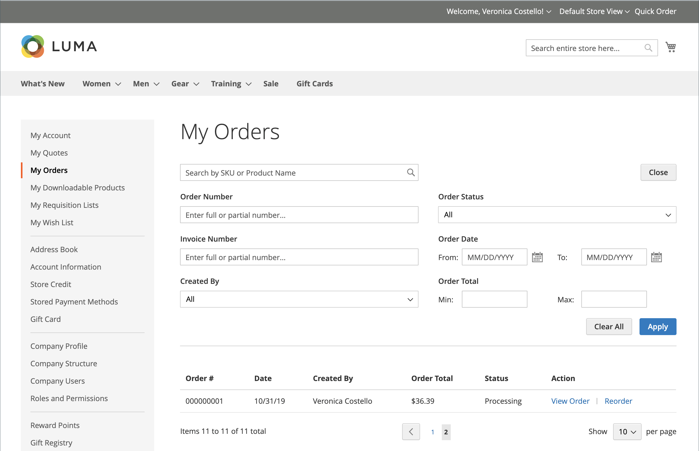
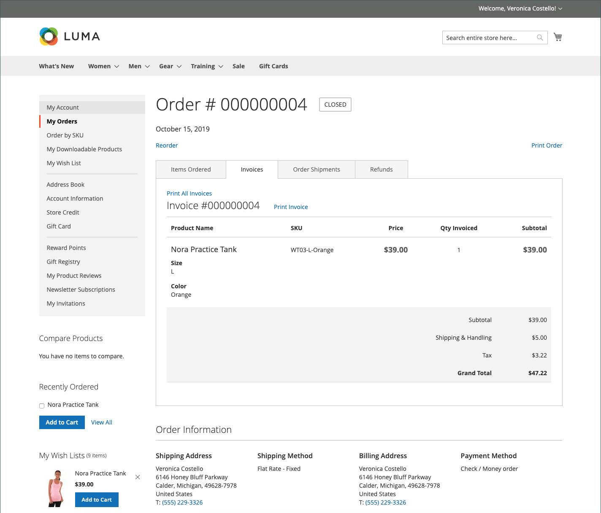
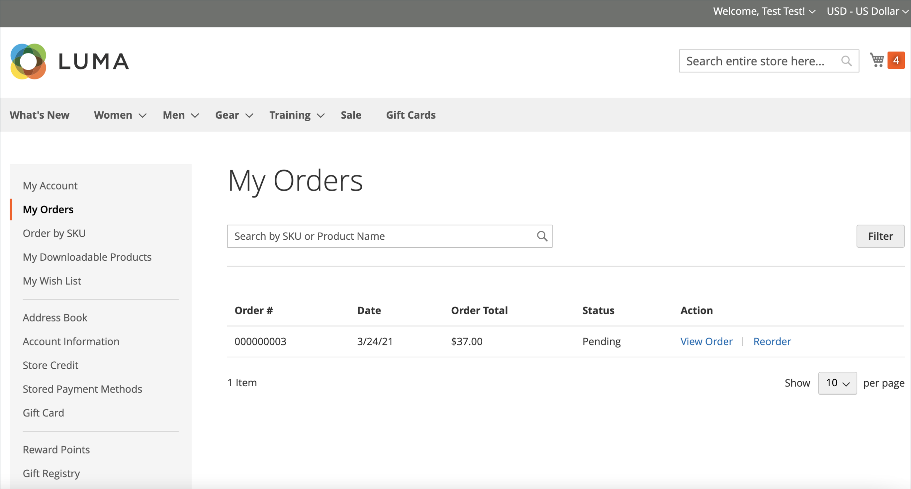
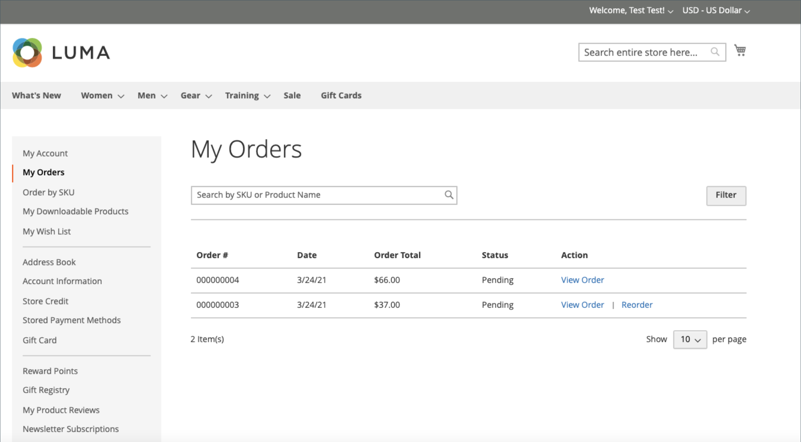
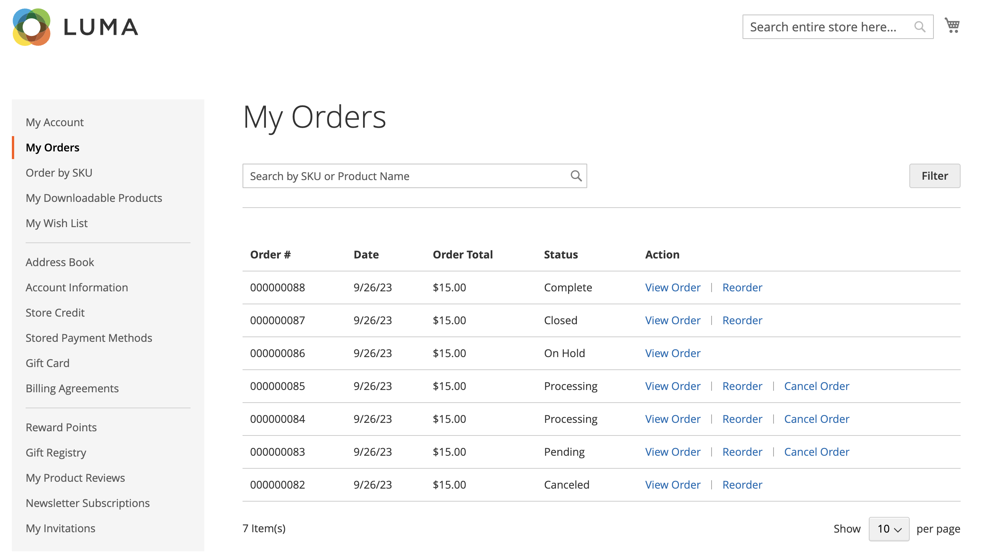
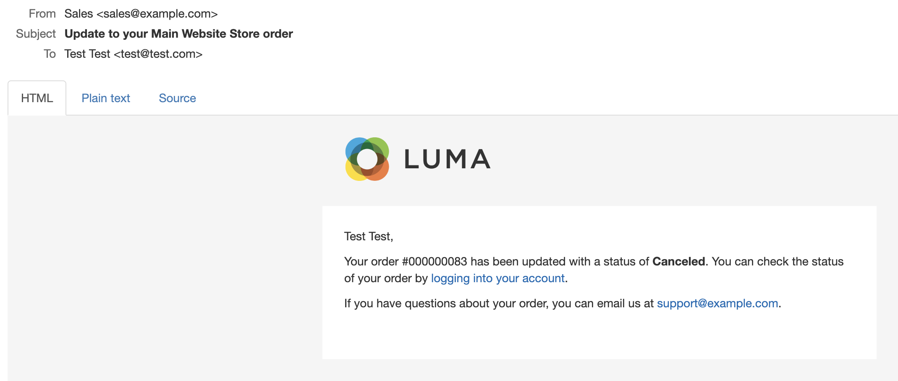
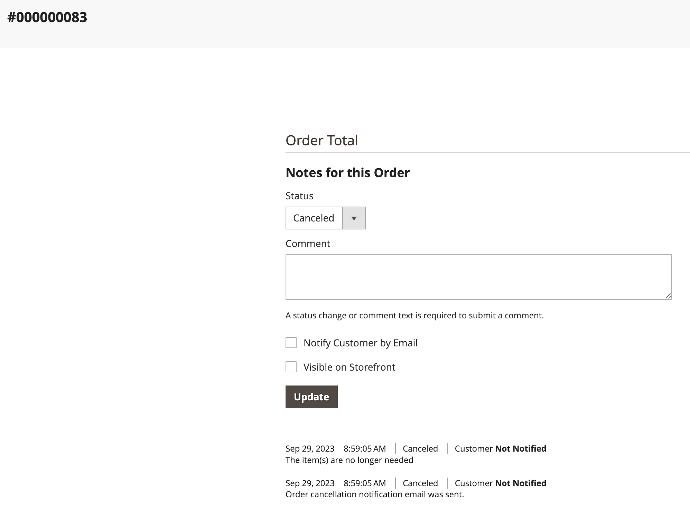
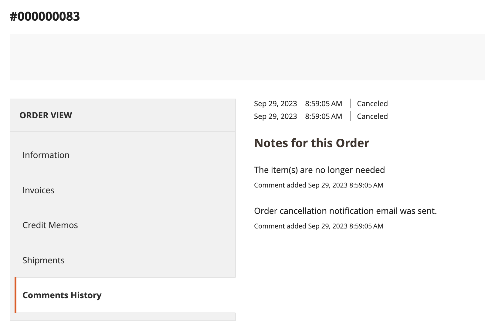
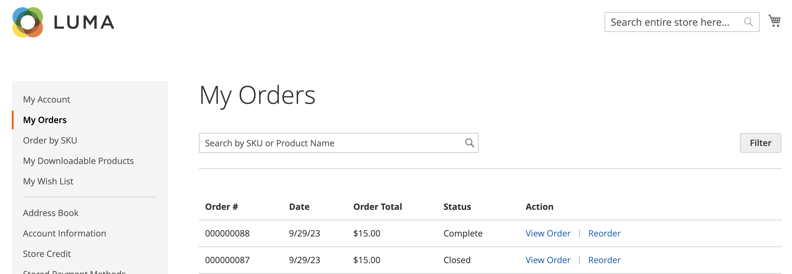

# ストアフロントの注文管理

顧客は、自分のアカウントからすべての注文にアクセスできます。 注文は、新しい注文として表示、フィルタリング、追跡、再送信できます。 注文のステータスに応じて、顧客は注文、請求書、出荷、返品記録を印刷できます。

## フィルターの順序

{{b2b-feature}}

最初の&#x200B;_[!UICONTROL My Orders]_の結果には、コマースインスタンス内のすべてのweb サイトからの下位ユーザーからの一致する注文も含まれています。 会社アカウントに関連付けられている顧客は、注文リストをフィルタリングして、結果内のレコードをすばやく見つけることができます。 フィルターオプションを表示するには、顧客が&#x200B;**[!UICONTROL Filter]**をクリックし、**[!UICONTROL Close]**をクリックしてフィルターを非表示にします。

{width="700" zoomable="yes"}

| フィルター | 説明 |
| ------ | ----------- |
| [!UICONTROL SKU or Product Name] | SKUまたは製品名を入力します。 |
| [!UICONTROL Order Number] | フルオーダー番号または部分的オーダー番号を指定できます。 |
| [!UICONTROL Order Status] | ドロップダウンから値を選択し、ステータスでフィルタリングします。 |
| [!UICONTROL Invoice Number] | 請求書番号の全部または一部を入力します。 |
| [!UICONTROL Order Date] | 1つまたは両方の日付フィールドを設定して、注文日でフィルタリングします。 |
| [!UICONTROL Created by] | 注文の作成者による会社の注文をフィルタリングします。 |
| [!UICONTROL Order Total] | 注文の合計でフィルタリングする最小値、最大値、または両方の値を設定します。 |

## 注文の表示

顧客はリスト内の注文を見つけて、**[!UICONTROL View Order]**&#x200B;をクリックします。 オープンオーダーから、次のいずれかを行うことができます。

{width="700" zoomable="yes"}

### 最近注文した商品の表示

**[!UICONTROL Recent Orders]** ブロックは、注文後にログインしたお客様のサイドバーと&#x200B;**[!UICONTROL My Account]** ページに表示されます。 最後に購入した5つの商品が表示されます。

お客様は、商品を選択し、**[!UICONTROL Add to Cart]**&#x200B;をクリックして、商品をカートに読み込むことができます。 また、**[!UICONTROL View all]**&#x200B;をクリックして最後の注文を表示し、_[!UICONTROL My Account]_ページと&#x200B;**[!UICONTROL Recent Orders]**ブロックにリダイレクトすることもできます。

### 印刷注文

1. お客様は&#x200B;**[!UICONTROL Print Order]**&#x200B;をクリックします。

1. 印刷ダイアログの指示に従って、印刷を完了します。

### 請求書の印刷

1. 「**[!UICONTROL Invoices]**」タブで、お客様は次のいずれかをクリックします。

   - **[!UICONTROL Print All Invoices]**

   - **[!UICONTROL Print Invoice]**

   {width="700" zoomable="yes"}

1. 印刷ダイアログを使用して、印刷を完了します。

### 印刷物の発送

1. 「**[!UICONTROL Order Shipments]**」タブで、お客様は次のいずれかをクリックします。

   - **[!UICONTROL Print All Shipments]**

   - **[!UICONTROL Print Shipment]**

   {width="700" zoomable="yes"}

1. 印刷ダイアログを使用して、印刷を完了します。

### 配送の追跡

1. 「**[!UICONTROL Order Shipments]**」タブで、「**[!UICONTROL Track this Shipment]**」をクリックします。

   使用可能なトラッキング情報は、ポップアップウィンドウに表示されます。

1. 準備ができたら、お客様は&#x200B;**[!UICONTROL Close Window]**&#x200B;をクリックします。

### 返金の印刷

1. 「**返金**」タブで、お客様は次のいずれかをクリックします。

   - **すべての返金を印刷**

   - **返金を印刷**

   {width="700" zoomable="yes"}

1. 印刷ダイアログを使用して、印刷を完了します。

再注文は、[_再注文を許可_](reorders-allow.md)&#x200B;設定オプションが有効になっている場合に、お客様が利用できます。

お客様は、次の2つのページから特定の注文の再発注機能を開始できます。

- マイオーダーのページ
- 注文表示ページ

## 再発注

_[!UICONTROL Reorder]_リンクは、_[!UICONTROL View]_ リンクに近い注文を含むリストに表示されます。

{width="700" zoomable="yes"}の再注文リンク

**ケース 1.** 注文のすべての商品は再発注できます

顧客はショッピングカートにリダイレクトされ、すべての商品がカートに追加されます。

**ケース 2.** 注文の一部またはすべての製品は再発注できません

>[!NOTE]
>
>`Not Visible Individually`個の商品を再注文できます。

_[!UICONTROL Reorder]_リンクが_[!UICONTROL My Orders]_&#x200B;および&#x200B;_[!UICONTROL View Order]_ページに表示されません。

{width="700" zoomable="yes"}

>[!TIP]
>
>買い物かごが空ではなく、顧客が「**[!UICONTROL Reorder]**」（[!UICONTROL My Orders]または[!UICONTROL Order View] ページ）をクリックした場合、既存の商品は追加された再発注商品とともに買い物かごに残ります。

## 注文をキャンセル

「[_キャンセルを許可_](cancel-allow.md)」設定オプションが有効になっている場合、キャンセルは顧客が利用できます。

お客様は、次の3つのページから特定の注文のキャンセル機能を開始できます。

- マイオーダーのページ
- 注文表示ページ
- マイアカウントページ

_[!UICONTROL Cancel Order]_リンクが_[!UICONTROL Reorder]_ リンクの近くに表示されます。 注文をキャンセルできない場合、リンクは表示されません。

{width="700" zoomable="yes"}

キャンセルを実行するには、お客様は次の操作を行います。

1. クリック数：**[!UICONTROL Cancel Order]**

1. 解約理由を指定します

   {width="700" zoomable="yes"}

   解約理由は、[_解約を許可_](cancel-allow.md) ページでカスタマイズできます。

1. クリック数：**[!UICONTROL Confirm]**

   {width="700" zoomable="yes"}

   解約後、_[!UICONTROL Pending]_件の状態だった注文は_[!UICONTROL Canceled]_&#x200B;件の状態に変更され、_[!UICONTROL Processing]_件の状態だった注文は_[!UICONTROL Closed]_&#x200B;件の状態に変更され、返金が処理されます。

   解約が完了すると、お客様にメールが送信されます。

   {width="700" zoomable="yes"}

   キャンセル情報は、お客様の注文履歴に追加されます。 注文のメモと「コメント履歴」タブに表示されます。

   {width="700" zoomable="yes"}

   {width="700" zoomable="yes"}

   何らかの理由で注文がキャンセルできないステータスに変更され、顧客がページを更新しなかった場合、注文をキャンセルするためのリンクが引き続き表示されます。 ただし、キャンセルしようとすると、エラーメッセージが表示されます。

   {width="700" zoomable="yes"}

   ページを更新すると、注文が既に完了したことが表示されます。そのため、キャンセルは機能しませんでした。

   {width="700" zoomable="yes"}
