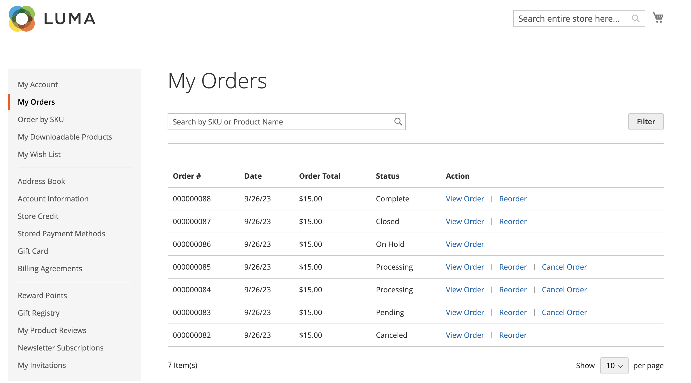

# ストアフロントの注文管理

顧客は、自分のアカウントからすべての注文にアクセスできます。 注文は、新しい注文として表示、フィルタリング、追跡、再送信できます。 注文のステータスに応じて、顧客は注文、請求書、出荷、払い戻しレコードを印刷できます。

## 注文のフィルタリング

{{b2b-feature}}

最初の _[!UICONTROL My Orders]_結果には、コマースインスタンス内のすべての web サイトの下位ユーザーからの一致する注文も含まれます。 会社アカウントに関連付けられている顧客は、注文リストをフィルタリングして、結果に含まれるレコードをすばやく見つけることができます。 フィルターオプションを表示するには、顧客は、**[!UICONTROL Filter]**、およびクリック&#x200B;**[!UICONTROL Close]**をクリックしてフィルターを非表示にします。

{width="700" zoomable="yes"}

| フィルター | 説明 |
| ------ | ----------- |
| [!UICONTROL SKU or Product Name] | SKU または製品名を入力します。 |
| [!UICONTROL Order Number] | 注文番号は、全部または一部を指定できます。 |
| [!UICONTROL Order Status] | ステータスでフィルタリングする値をドロップダウンから選択します。 |
| [!UICONTROL Invoice Number] | 請求書番号の全部または一部を入力します。 |
| [!UICONTROL Order Date] | 1 つまたは両方の日付フィールドを設定して、注文日でフィルタリングします。 |
| [!UICONTROL Created by] | 注文作成者によって会社の注文をフィルタリングします。 |
| [!UICONTROL Order Total] | 合計注文でフィルタリングする最小値、最大値または両方の値を設定します。 |

## オーダーを表示

顧客がリスト内の順序を見つけてクリックします **[!UICONTROL View Order]**. オープン受注から、次の処理を実行できます。

{width="700" zoomable="yes"}

### 最近注文した製品の表示

この **[!UICONTROL Recent Orders]** ブロックはサイドバーおよび **[!UICONTROL My Account]** 注文後にログインした顧客のページ。 前回の購入から 5 つの製品が表示されます。

顧客は、商品を選択してをクリックすることで、買い物かごに商品を追加できます **[!UICONTROL Add to Cart]**. また、をクリックして最後の注文を表示することもできます。 **[!UICONTROL View all]**&#x200B;にリダイレクトされます。 _[!UICONTROL My Account]_ページと&#x200B;**[!UICONTROL Recent Orders]**ブロック。

### 注文の印刷

1. 顧客のクリック数 **[!UICONTROL Print Order]**.

1. 印刷ダイアログの指示に従って、印刷を完了します。

### 請求書の印刷

1. 日 **[!UICONTROL Invoices]** タブをクリックして、顧客は次のいずれかをクリックします。

   - **[!UICONTROL Print All Invoices]**

   - **[!UICONTROL Print Invoice]**

   {width="700" zoomable="yes"}

1. 印刷ダイアログを使用して印刷を完了します。

### 出荷の印刷

1. 日 **[!UICONTROL Order Shipments]** タブをクリックして、顧客は次のいずれかをクリックします。

   - **[!UICONTROL Print All Shipments]**

   - **[!UICONTROL Print Shipment]**

   {width="700" zoomable="yes"}

1. 印刷ダイアログを使用して印刷を完了します。

### 出荷の追跡

1. 日 **[!UICONTROL Order Shipments]** タブ、クリック **[!UICONTROL Track this Shipment]**.

   利用可能なトラッキング情報は、ポップアップウィンドウに表示されます。

1. 準備ができたら、顧客は次をクリックします。 **[!UICONTROL Close Window]**.

### 払戻の印刷

1. 日 **払戻** タブをクリックして、顧客は次のいずれかをクリックします。

   - **すべての払戻の印刷**

   - **払い戻しの印刷**

   {width="700" zoomable="yes"}

1. 印刷ダイアログを使用して印刷を完了します。

顧客は次の場合に並べ替えを使用できます [_並べ替えを許可_](reorders-allow.md) 設定オプションが有効になっています。

顧客は、次の 2 つのページから特定の注文の並べ替え機能を開始できます。

- マイ注文ページ
- 注文ビューページ

## 並べ替え

この _[!UICONTROL Reorder]_リンクは、近くの注文とリストに表示されます_[!UICONTROL View]_ リンク。

{width="700" zoomable="yes"}

**ケース 1.** 注文のすべての製品は再注文できます

顧客は買い物かごにリダイレクトされ、すべての製品が買い物かごに追加されます。

**ケース 2.** 注文の一部/すべての製品を再注文することはできません

>[!NOTE]
>
>並べ替えは可能です `Not Visible Individually` 製品。

この _[!UICONTROL Reorder]_にリンクが表示されない_[!UICONTROL My Orders]_ および _[!UICONTROL View Order]_ページ。

{width="700" zoomable="yes"}

>[!TIP]
>
>買い物かごが空でなく、顧客がクリックした場合 **[!UICONTROL Reorder]** （から [!UICONTROL My Orders] または [!UICONTROL Order View] （ページ）、既存の製品は、追加された並べ替え製品を使用して買い物かごに残ります。

## 注文をキャンセル

お客様は次の場合にキャンセルできます [_キャンセルを許可_](cancel-allow.md) 設定オプションが有効になっています。

お客様は、次の 3 つのページから特定の注文のキャンセル機能を開始できます。

- マイ注文ページ
- 注文ビューページ
- マイアカウントページ

この _[!UICONTROL Cancel Order]_リンクはの近くに表示されます_[!UICONTROL Reorder]_ リンク。 注文をキャンセルできない場合、リンクは表示されません。

{width="700" zoomable="yes"}

キャンセルを実行するには、お客様は次の手順に従います。

1. クリック数 **[!UICONTROL Cancel Order]**

1. キャンセルの理由を提供

   {width="700" zoomable="yes"}

   キャンセル理由は次のようにカスタマイズできます [_キャンセルを許可_](cancel-allow.md) ページ。

1. クリック数 **[!UICONTROL Confirm]**

   ![[ マイ注文 ] ページのキャンセル](./assets/cancel-order.png){width="700" zoomable="yes"}

   キャンセル後、含まれていた注文 _[!UICONTROL Pending]_ステータス、変更先_[!UICONTROL Canceled]_ ステータス、発生した注文 _[!UICONTROL Processing]_ステータス、変更先_[!UICONTROL Closed]_ ステータスと払い戻しが処理されます。

   キャンセルが完了すると、顧客にメールが送信されます。

   {width="700" zoomable="yes"}

   キャンセル情報は、顧客の注文履歴に追加されます。 注文のメモ内および「コメント履歴」タブに表示されます。

   {width="700" zoomable="yes"}

   {width="700" zoomable="yes"}

   何らかの理由で注文がキャンセルできないステータスに変更され、顧客がページを更新しなかった場合でも、注文をキャンセルするためのリンクが表示されます。 ただし、キャンセルしようとすると、エラーメッセージが表示されます。

   {width="700" zoomable="yes"}

   ページを更新すると、注文が既に完了したことが表示されます。そのため、キャンセルは機能しませんでした。

   {width="700" zoomable="yes"}
