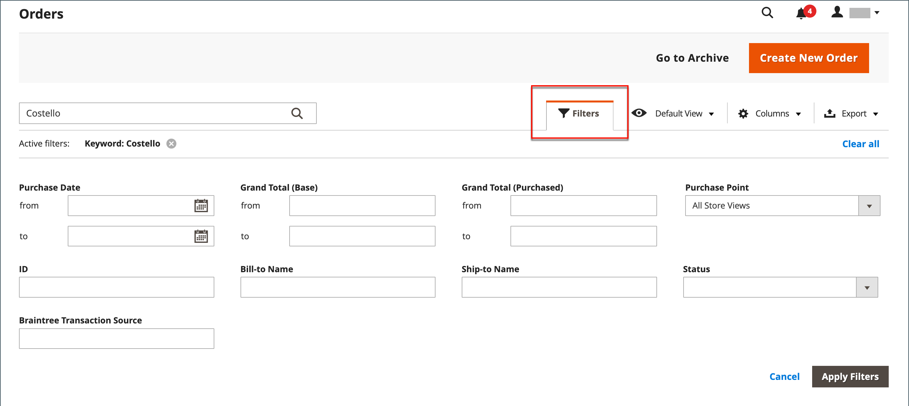

# 購入回数

The _購入回数_ グリッドには、現在の注文がすべてリストされ、進捗状況が追跡されます。 [注文ステータス](order-status.md) から [workflow](order-processing.md). 基本的なプロセスを簡単に理解するには、オーダーが [請求書](invoices.md)で始まり、請求書が [出荷](shipments.md). グリッドはプロセスの最初のステージを表し、ここでを使用できます [更新](order-update.md) 既存のオーダーとオーダーの作成。

通常、注文は、顧客がストアフロントからチェックアウトプロセスを完了すると作成されます。 ただし、顧客がサポートを必要とする場合は、 [買い物かご](shopping-assisted-cart-manage.md) または [注文を作成する](customer-account-create-order.md) 次のいずれかから _購入回数_ グリッドまたは直接、顧客アカウントから。

## 注文ワークスペース

「オーダー」ワークスペースには、現在のすべてのオーダーがリストされ、既存のオーダーと [作成](customer-account-create-order.md) 注文。 グリッドの各行は顧客の注文を表し、各列は属性またはデータフィールドを表します。 標準の [controls](../getting-started/admin-grid-controls.md) リストの並べ替えとフィルター、順序の検索、適用を行うには [アクション](../getting-started/admin-actions-control.md) 選択したオーダーに追加します。 ページネーションコントロールの上にあるタブを使用して、リストのフィルタリング、デフォルトビューの変更、列の変更と並べ替え、データの書き出しをおこないます。

{width="700" zoomable="yes"}

### グリッドレイアウト

グリッド内の列の選択と順序は、好みに応じて変更できます。 新しいレイアウトをグリッドとして保存できます _表示_. デフォルトでは、使用可能な 20 の列のうち 9 つの列のみがグリッドに含まれます。

{width="600" zoomable="yes"}

#### 列の選択を変更する

右上隅で、 _列_ (  ) を制御し、以下の操作を実行します。

- グリッドに追加する列のチェックボックスをオンにします。
- グリッドから削除する列のチェックボックスをオフにします。

#### 列の選択をリセット

1. 次をクリック： _列_ (  ) コントロールを使用します。

1. グリッドの列をリセットするには、 **[!UICONTROL Reset]**.

   グリッドレイアウトは、表示のみに変わります [デフォルトの列](#column-descriptions).

#### 列の移動

1. 列のヘッダーをクリックしたままにします。

1. 列を新しい位置にドラッグし、離します。

#### グリッドビューを保存する

1. 次をクリック： **[!UICONTROL View]** (  ) コントロールを使用します。

1. クリック **[!UICONTROL Save Current View]**.

1. を入力します。 **[!UICONTROL name]** ビューの。

1. すべての変更を保存するには、矢印 (  ) をクリックします。

   ビューの名前が現在のビューとして表示されます。

#### 表示を変更する

次をクリック： **[!UICONTROL View]** (  ) コントロールを使用します。 次のいずれかの操作を行います。

- 別のビューを使用するには、ビューの名前をクリックします。

- ビューの名前を変更するには、 _編集_ (  ) アイコンをクリックし、名前を更新します。

### Workspace のコントロール

| 制御 | 説明 |
|--- |--- |
| [!UICONTROL Create New Order] | 注文を作成します。 詳しくは、 [オーダーの作成](customer-account-create-order.md) を参照してください。 |
| [!UICONTROL Go to Archive] | アーカイブされた注文のリストを表示します。 |
| [!UICONTROL Search] | 現在のフィルターに基づいて注文の検索を開始します。 |
| [!UICONTROL Filters] | グリッドに表示されるレコードをフィルターするために使用される一連の検索パラメーターを定義します。 |
| [!UICONTROL Default View] | グリッドの既定の列レイアウトを決定します。 |
| [!UICONTROL Columns] | グリッド内の列の選択と順序を決定します。 列のレイアウトは、 _表示_. デフォルトでは、列の一部のみがグリッドに含まれます。 |
| [!UICONTROL Export] | 選択したレコードを CSV または Excel XML ファイルとしてエクスポートします。 |

{style="table-layout:auto"}

### アクション

特定の注文にアクションを適用するには、各注文の最初の列にあるチェックボックスをオンにします。 すべての注文を選択または選択解除するには、列の上部にあるコントロールを使用します。

{width="600" zoomable="yes"}

| 制御 | 説明 |
|--- |--- |
| [!UICONTROL Actions] | 選択したオーダーに適用できるすべてのアクションをリストします。 1 つまたは複数の注文に対してアクションを適用するには、各注文の最初の列にあるチェックボックスをオンにします。  オーダーアクション： `Cancel` / `Hold` / `Unhold` / `Print Invoices` / `Print Packing Slips` / `Print Credit Memos` / `Print All` / `Print Shipping Labels` / `Move to Archive`  (Adobe Commerceのみ ) |
| [!UICONTROL Mass Actions] | 複数のレコードをアクションのターゲットとして選択する場合に使用できます。 アクションの対象となる各レコードの最初の列のチェックボックスを選択します。 オプション： `Select All` / `Unselect All` / `Select Visible` / `Unselect Visible` |
| [!UICONTROL Submit] | 選択した注文レコードに現在のアクションを適用します。 |
| [!UICONTROL Edit] | 順序を編集モードで開きます。 |

{style="table-layout:auto"}

### 列の説明

| 列 | 説明 |
|--- |--- |
| [!UICONTROL Select] | アクションの対象となる引用符のチェックボックスをオンにするか、列ヘッダーの選択コントロールを使用します。 オプション：すべてを選択/すべてを選択解除 |
| [!UICONTROL ID] | 新しい注文が初めて保存されるときに割り当てられる一意の順番。 |
| [!UICONTROL Purchase Point] | 注文がおこなわれたストアビューを識別します。 |
| [!UICONTROL Purchase Date] | 注文が行われた日時。 デフォルトのタイムゾーンに従って常に表示されます。 |
| [!UICONTROL Bill-to Name] | 注文の支払いを担当する人の名前。 |
| [!UICONTROL Ship-to Name] | 注文を発送する人物の名前。 |
| [!UICONTROL Grand Total (Base)] | 注文の総計。 |
| [!UICONTROL Grand Total (Purchased)] | 注文で購入された製品の総計。 |
| [!UICONTROL Status] | 現在の注文ステータス。 |
| [!UICONTROL Action] | _[!UICONTROL View]_順序を編集モードで開きます。 |
| [!UICONTROL Allocated sources] | 特定の注文に割り当てられたソース。 |

{style="table-layout:auto"}

追加の列を使用できます。

| 列 | 説明 |
|--- |--- |
| [!UICONTROL Billing Address] | 注文をした顧客の請求先住所。 |
| [!UICONTROL Shipping Address] | 注文が発送される住所。 |
| [!UICONTROL Shipping Information] | 注文の出荷に使用するメソッド。 |
| [!UICONTROL Customer Email] | 注文をした人の電子メールアドレス。 |
| [!UICONTROL Customer Group] | 注文を行った人物が割り当てられる顧客グループ。 |
| [!UICONTROL Subtotal] | 注文の小計、送料および処理なし、および税。 |
| [!UICONTROL Shipping and Handling] | 送料と処理に請求された金額。 |
| [!UICONTROL Customer Name] | 注文をした顧客の氏名。 |
| [!UICONTROL Payment Method] | 注文に使用する支払い方法。 |
| [!UICONTROL Total Refunded] | 顧客に返金される注文からの金額。 |
| [!UICONTROL Refunded to Store Credit] |  (Adobe Commerceのみ ) 注文後、顧客の店舗クレジットに返還される金額。 |
| [!UICONTROL Company Name] |  (B2B でAdobe Commerceに使用可能 ) [会社](../b2b/account-companies.md) 彼は命令を下した |

{style="table-layout:auto"}

## 検索を注文

「注文」グリッドの左上にある「検索」ボックスを使用して、特定の注文をキーワードで検索したり、グリッド内の注文レコードをフィルタリングしたりできます。

{width="600" zoomable="yes"}

### 一致を検索

1. ページ検索ボックスに検索語句を入力します。

1. 結果を表示するには、 _検索_ (  ) をクリックします。

### 検索をフィルター

1. 検索フィルターの選択を表示するには、 _フィルター_ (  )」タブに表示されます。

   {width="600" zoomable="yes"}

1. 検索する注文を記述するのと同じ数のフィルターを入力します。

1. クリック **[!UICONTROL Apply Filters]** をクリックして結果を表示します。

### 検索フィルター

| フィルター | 説明 |
|--- |--- |
| [!UICONTROL Purchase Date] | 購入日に基づいて検索をフィルターします。 特定の日付範囲内の注文を検索するには、 **[!UICONTROL from]** および **[!UICONTROL to]** 日付。 |
| [!UICONTROL ID] | 注文 ID に基づいて検索をフィルターします。 |
| [!UICONTROL Grand Total (Base)] | 各注文の総計に基づいて検索をフィルターします。この中には、注文に適用されたクレジットが含まれています。 |
| [!UICONTROL Grand Total (Purchased)] | 各注文で購入された品目の総計に基づいて検索をフィルターします。 |
| [!UICONTROL Bill-to Name] | 注文の支払いを担当する人物の名前に基づいて検索をフィルターします。 |
| [!UICONTROL Ship-to Name] | 各注文の発送先となる人物の名前に従って検索をフィルターします。 |
| [!UICONTROL Purchase Point] | 注文がおこなわれた Web サイト、ストア、またはストア表示で検索をフィルタリングします。 |
| [!UICONTROL Status] | オーダーのステータスに基づいて検索をフィルターします。 オプション： `Canceled` / `Closed` / `Complete` / `Suspected Fraud` / `On Hold` / `Payment Review` / `PayPal Canceled Reversal` /` PayPal Reversed` /` Pending` / `Pending Payment` / `Pending PayPal` / `Processing` |
| [!UICONTROL Braintree Transaction Source] | トランザクションソースに基づいて検索をフィルターします。 |

{style="table-layout:auto"}

### 検索ツール

| ツール | 説明 |
|--- |--- |
| [!UICONTROL Apply Filters] | すべてのフィルターを検索結果に適用します。 |
| [!UICONTROL Cancel] | 現在の検索をキャンセルします。 |
| [!UICONTROL Clear All] | すべての検索フィルタをクリアします。 |

{style="table-layout:auto"}

## リソースのトラブルシューティング

注文に関する問題のトラブルシューティングについては、次のコマースサポートのナレッジベース記事を参照してください。

- [注文の表示エラー](https://experienceleague.adobe.com/docs/commerce-knowledge-base/kb/troubleshooting/storefront/magento-2.4.0-known-issue-orders-display-error.html)
- [PayPal 重複注文10415エラー](https://experienceleague.adobe.com/docs/commerce-knowledge-base/kb/support-tools/patches/v1-0-6/mdva-31006-magento-patch-paypal-duplicate-orders-10415-error.html)
- [新しい注文がアーカイブに送信されます](https://experienceleague.adobe.com/docs/commerce-knowledge-base/kb/troubleshooting/known-issues-patches-attached/new-orders-are-sent-to-archive.html)
- [管理の「注文」グリッドに表示されない注文](https://experienceleague.adobe.com/docs/commerce-knowledge-base/kb/troubleshooting/known-issues-patches-attached/orders-not-displayed-in-the-orders-grid-in-the-admin.html)
- [注文ステータス — REST API を介して作成された間違った出荷](https://experienceleague.adobe.com/docs/commerce-knowledge-base/kb/support-tools/patches/v1-0-7/mdva-30972-magento-patch-order-status-incorrect-shipment-created-via-rest-api.html)
