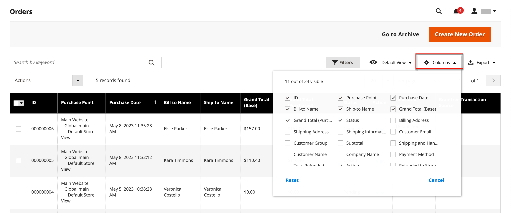
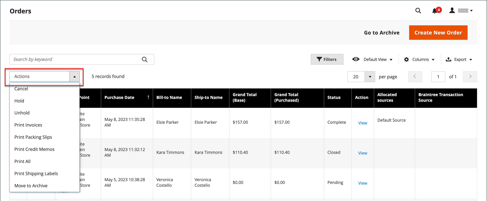
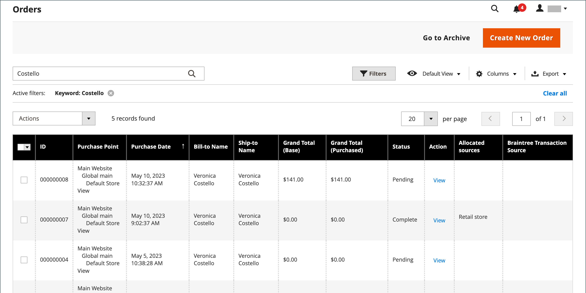
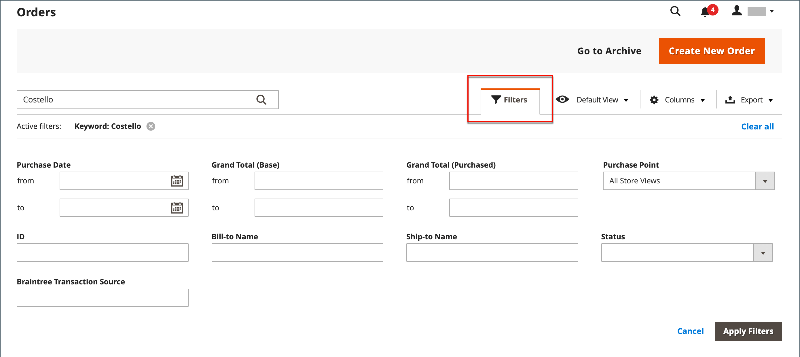

# 注文

_注文_ グリッドには、現在のすべての注文が一覧表示され、その進行状況と[&#x200B; ワークフロー](order-processing.md)を通じた[注文ステータス &#x200B;](order-status.md)が追跡されます。 基本的なプロセスを簡単に理解するには、注文が[請求書](invoices.md)になり、請求書が[出荷](shipments.md)になることです。 グリッドは、プロセスの最初のステージを表します。このステージでは、既存の注文を[更新](order-update.md)および作成できます。

通常、注文は、顧客がストアフロントからのチェックアウトプロセスを完了したときに作成されます。 ただし、お客様がサポートを必要とする場合は、_注文_ グリッドから、または顧客アカウントから直接[&#x200B; ショッピングカート &#x200B;](shopping-assisted-cart-manage.md)または[注文](customer-account-create-order.md)を作成することもできます。

## 受注ワークスペース

注文ワークスペースには、現在のすべての注文が一覧表示され、既存の注文を編集したり、[作成](customer-account-create-order.md)の注文を作成したりできます。 グリッドの各行は顧客注文を表し、各列は属性（データフィールド）を表します。 標準の[&#x200B; コントロール &#x200B;](../getting-started/admin-grid-controls.md)を使用して、リストの並べ替えとフィルタリング、注文の検索、選択した注文への[&#x200B; アクション &#x200B;](../getting-started/admin-actions-control.md)の適用を行います。 ページネーションコントロールの上にあるタブを使用して、リストのフィルタリング、デフォルト表示の変更、列の変更と並べ替え、データの書き出しを行います。

{width="700" zoomable="yes"}

### グリッドレイアウト

列の選択とグリッド内の順序は、好みに応じて変更できます。 新しいレイアウトは、グリッド _ビュー_&#x200B;として保存できます。 デフォルトでは、使用可能な20列のうち9列のみがグリッドに含まれます。

{width="600" zoomable="yes"}

#### 列選択の変更

右上隅の&#x200B;_列_ （）コントロールをクリックし、次の操作を行います。

- グリッドに追加する任意の列のチェックボックスをオンにします。
- グリッドから削除する列のチェックボックスをオフにします。

#### 列選択をリセット

1. _列_ （）コントロールをクリックします。

1. グリッド列をリセットするには、**[!UICONTROL Reset]**&#x200B;をクリックします。

   グリッド レイアウトが変更され、[既定の列](#column-descriptions)のみが表示されます。

#### 列の移動

1. 列のヘッダーをクリックして保持します。

1. 列を新しい位置にドラッグして解除します。

#### グリッドビューを保存

1. **[!UICONTROL View]** （）コントロールをクリックします。

1. **[!UICONTROL Save Current View]**&#x200B;をクリックします。

1. ビューの&#x200B;**[!UICONTROL name]**&#x200B;を入力します。

1. すべての変更を保存するには、矢印（）をクリックします。

   ビューの名前が現在のビューとして表示されます。

#### ビューを変更

**[!UICONTROL View]** （）コントロールをクリックします。 次のいずれかの操作を行います。

- 別のビューを使用するには、ビューの名前をクリックします。

- ビューの名前を変更するには、_編集_ （）アイコンをクリックし、名前を更新します。

### Workspaceコントロール

| 制御 | 説明 |
|--- |--- |
| [!UICONTROL Create New Order] | 注文を作成します。 詳しくは、[注文の作成](customer-account-create-order.md)を参照してください。 |
| [!UICONTROL Go to Archive] | アーカイブされた注文のリストを表示します。 |
| [!UICONTROL Search] | 現在のフィルターに基づいて注文の検索を開始します。 |
| [!UICONTROL Filters] | グリッドに表示されるレコードをフィルタリングするために使用される検索パラメーターのセットを定義します。 |
| [!UICONTROL Default View] | グリッドのデフォルトの列レイアウトを指定します。 |
| [!UICONTROL Columns] | グリッド内の列の選択範囲とその順序を決定します。 列レイアウトを変更し、_ビュー_&#x200B;として保存できます。 デフォルトでは、グリッドに含まれるのは一部の列のみです。 |
| [!UICONTROL Export] | 選択したレコードをCSVまたはExcel XML ファイルとして書き出します。 |

{style="table-layout:auto"}

### アクション

特定の注文にアクションを適用するには、各注文の最初の列にあるチェックボックスを選択します。 すべての注文を選択または選択解除するには、列の上部にあるコントロールを使用します。

{width="600" zoomable="yes"}

| 制御 | 説明 |
|--- |--- |
| [!UICONTROL Actions] | 選択した注文に適用できるすべてのアクションを一覧表示します。 注文または注文グループにアクションを適用するには、各注文の最初の列にあるチェックボックスを選択します。  注文アクション：`Cancel` / `Hold` / `Unhold` / `Print Invoices` / `Print Packing Slips` / `Print Credit Memos` / `Print All` / `Print Shipping Labels` / `Move to Archive`  （Adobe Commerceのみ） |
| [!UICONTROL Mass Actions] | アクションのターゲットとして複数のレコードを選択するために使用できます。 アクションの対象となる各レコードの最初の列のチェックボックスを選択します。 オプション：`Select All` / `Unselect All` / `Select Visible` / `Unselect Visible` |
| [!UICONTROL Submit] | 選択した注文レコードに現在のアクションを適用します。 |
| [!UICONTROL Edit] | 編集モードで注文を開きます。 |

{style="table-layout:auto"}

### 列の説明

| 列 | 説明 |
|--- |--- |
| [!UICONTROL Select] | アクションの対象となる引用符のチェックボックスを選択するか、列ヘッダーの選択コントロールを使用します。 オプション：すべてを選択/すべてを選択解除 |
| [!UICONTROL ID] | 新しい注文が初めて保存されたときに割り当てられる、一意の連続番号。 |
| [!UICONTROL Purchase Point] | 注文が配置されたストアビューを識別します。 |
| [!UICONTROL Purchase Date] | 注文が行われた日時。 デフォルトのタイムゾーンに従って常に表示されます。 |
| [!UICONTROL Bill-to Name] | 注文の支払いの責任を負う人の名前。 |
| [!UICONTROL Ship-to Name] | 注文を発送する人の名前。 |
| [!UICONTROL Grand Total (Base)] | 注文の総計。 |
| [!UICONTROL Grand Total (Purchased)] | 注文で購入された製品の合計数。 |
| [!UICONTROL Status] | 現在の注文ステータス。 |
| [!UICONTROL Action] | _[!UICONTROL View]_&#x200B;さんが編集モードで注文を開きます。 |
| [!UICONTROL Allocated sources] | その特定の注文に割り当てられたソース。 |

{style="table-layout:auto"}

使用可能な追加の列：

| 列 | 説明 |
|--- |--- |
| [!UICONTROL Billing Address] | 注文した顧客の請求先住所。 |
| [!UICONTROL Shipping Address] | 注文が発送される住所。 |
| [!UICONTROL Shipping Information] | 注文の出荷に使用する方法。 |
| [!UICONTROL Customer Email] | 注文したユーザーの電子メールアドレス。 |
| [!UICONTROL Customer Group] | 注文を行った人物が割り当てられる顧客グループ。 |
| [!UICONTROL Subtotal] | 注文の小計（送料および処理料なし）、および税金。 |
| [!UICONTROL Shipping and Handling] | 送料と処理費。 |
| [!UICONTROL Customer Name] | 注文した顧客の姓と名。 |
| [!UICONTROL Payment Method] | 注文に使用する支払い方法。 |
| [!UICONTROL Total Refunded] | お客様に返金される注文の金額。 |
| [!UICONTROL Refunded to Store Credit] |  （Adobe Commerceのみ）お客様の店舗のクレジットに返金される注文の金額。 |
| [!UICONTROL Company Name] |  （Adobe Commerce B2Bで利用可能）注文した[会社](../b2b/account-companies.md)の名前。 |

{style="table-layout:auto"}

## 注文検索

「受注」グリッドの左上にある「検索」ボックスを使用して、キーワード別に特定の受注を検索したり、グリッド内の受注レコードをフィルタリングしたりできます。

{width="600" zoomable="yes"}

### 一致を検索

1. ページ検索ボックスに検索語を入力します。

1. 結果を表示するには、_検索_ （）をクリックします。

### 検索をフィルター

1. 検索フィルターの選択範囲を表示するには、「_フィルター_」（）タブをクリックします。

   {width="600" zoomable="yes"}

1. 検索する注文を記述する必要がある数のフィルターを実行します。

1. **[!UICONTROL Apply Filters]**&#x200B;をクリックして結果を表示します。

### フィルターを検索

| フィルター | 説明 |
|--- |--- |
| [!UICONTROL Purchase Date] | 購入日に基づいて検索をフィルタリングします。 日付の範囲内で注文を検索するには、**[!UICONTROL from]**&#x200B;日付と&#x200B;**[!UICONTROL to]**&#x200B;日付の両方を入力します。 |
| [!UICONTROL ID] | 注文IDに基づいて検索をフィルタリングします。 |
| [!UICONTROL Grand Total (Base)] | 各注文の総計に基づいて検索をフィルタリングします。これには、注文に適用されたクレジットが含まれます。 |
| [!UICONTROL Grand Total (Purchased)] | 各注文で購入された商品の総計に基づいて検索をフィルタリングします。 |
| [!UICONTROL Bill-to Name] | 注文の支払い担当者の名前に従って、検索をフィルタリングします。 |
| [!UICONTROL Ship-to Name] | 各注文の発送先の名前に従って検索をフィルタリングします。 |
| [!UICONTROL Purchase Point] | 注文が配置されたweb サイト、ストア、またはストアビューで検索をフィルタリングします。 |
| [!UICONTROL Status] | 注文ステータスに基づいて検索をフィルタリングします。 オプション：`Canceled` / `Closed` / `Complete` / `Suspected Fraud` / `On Hold` / `Payment Review` / `PayPal Canceled Reversal` / ` PayPal Reversed` / ` Pending` / `Pending Payment` / `Pending PayPal` / `Processing` |
| [!UICONTROL Braintree Transaction Source] | トランザクションソースに基づいて検索をフィルタリングします。 |

{style="table-layout:auto"}

### 検索ツール

| ツール | 説明 |
|--- |--- |
| [!UICONTROL Apply Filters] | 検索結果にすべてのフィルターを適用します。 |
| [!UICONTROL Cancel] | 現在の検索をキャンセルします。 |
| [!UICONTROL Clear All] | すべての検索フィルターを消去します。 |

{style="table-layout:auto"}

