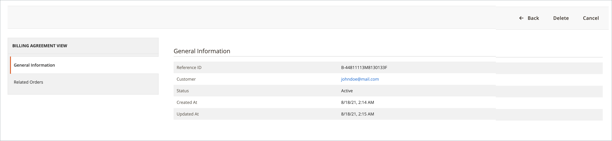
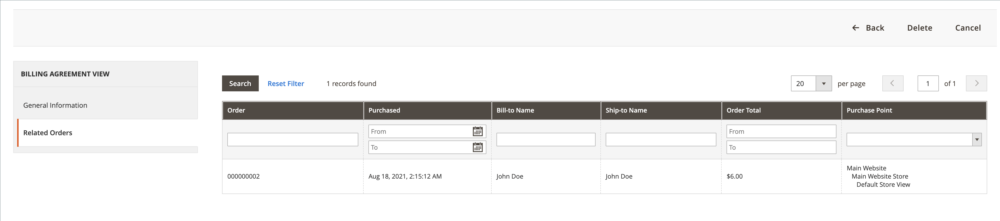
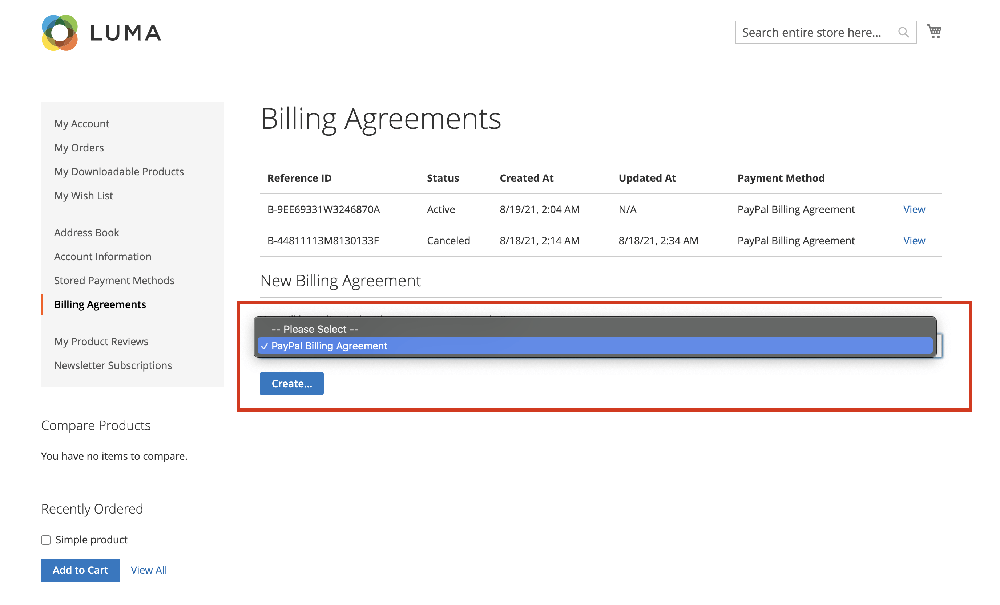
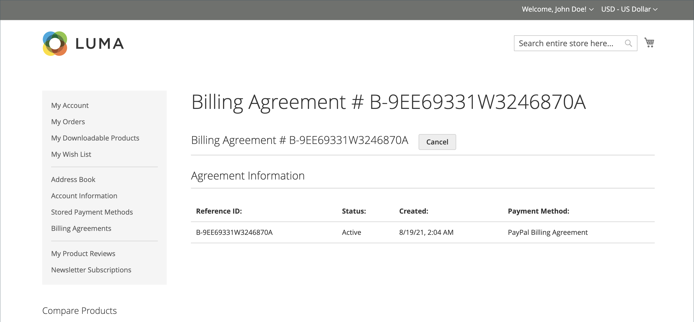

# PayPalの契約形態

チェックアウトプロセスを簡素化するために、顧客は決済サービスプロバイダーとしてPayPalと請求契約を締結できます。 チェックアウト時、お客様は支払い方法として請求契約書を選択します。 支払いシステムは、請求契約書を一意の番号で確認し、顧客アカウントに請求します。 請求契約を締結すれば、顧客は購入ごとに支払い情報を入力する必要がなくなります。 お客様は、お客様アカウントのダッシュボードから請求契約書を管理できます。各アカウントのステータスは、_アクティブ_&#x200B;または&#x200B;_キャンセル済み_&#x200B;と表示されます。 請求契約書がキャンセルされた場合、再度有効にすることはできません。

## 請求契約書ワークフロー

1. **お客様は請求契約書に登録します**。 請求契約書を設定した後、追加の請求契約書は顧客アカウントからのみ追加できます。 お客様が作成できる請求契約書の数に制限はありません。 お客様は、次のいずれかの方法を使用して契約書請求にサインアップできます。

   - **お客様アカウントにサインアップ** – お客様は、お客様アカウントから請求契約書にサインアップできます。
   - **チェックアウト時にサインアップ** - PayPal Express Checkoutで購入金額を支払ったお客様は、チェックボックスにマークを付けて請求契約を作成できます。 請求契約書は現在の注文には使用されませんが、顧客が次回の注文時に支払い方法のオプションとして利用できるようになります。
   - **ストア管理者による登録** – お客様からのリクエストに応じて、ストア管理者は顧客の請求契約書を使用して販売注文を作成できます。

1. **PayPalは契約書を検証して記録します**。 お客様が請求契約書による支払いで注文を行うと、請求契約書の参照IDと販売注文支払いの詳細がPayPalに転送され、参照情報とともに顧客アカウントに記録されます。 支払いが承認されると、Commerceで注文が作成されます。 請求契約書の参照IDは、お客様および店舗に送信されます。

## 請求契約書の管理

_[!UICONTROL Billing Agreements]_ページには、ストアと顧客の間のすべての請求契約書が一覧表示されます。 加盟店は、請求契約書の参照ID、ステータス、作成日など、顧客または請求契約書情報によってレコードをフィルタリングできます。 各レコードには、請求契約書に関する一般的な情報と、それを支払い方法として使用したすべての販売注文が含まれます。 お客様の請求契約書を表示、キャンセル、または削除できます。 キャンセルされた請求契約書は、ストア管理者のみが削除できます。

### 請求契約書の表示

1. _管理者_ サイドバーで、**[!UICONTROL Sales]** > _[!UICONTROL Operations]_>**[!UICONTROL Billing Agreements]**に移動します。

1. リストで請求契約書を見つけて、クリックして開きます。

各請求契約書ページは、_[!UICONTROL General Information]_と_[!UICONTROL Related Orders]_&#x200B;の2つのタブで構成されています。

#### 一般情報

このタブには、請求契約書に関する一般的な情報が含まれます。

- [!UICONTROL Reference ID]：現在の請求契約書に割り当てられている一意の数値識別子。
- [!UICONTROL Customer]：現在の請求契約書に割り当てられているお客様のアカウント。
- [!UICONTROL Status]：支払契約書の状態。
- [!UICONTROL Created At]：作成日。
- [!UICONTROL Updated At]：更新日。

{width="600" zoomable="yes"}

#### 関連オーダー

このタブには、現在の請求契約書を使用して発注された注文のリストが表示されます。

{width="600" zoomable="yes"}

### 請求契約書のキャンセル

1. _管理者_ サイドバーで、**[!UICONTROL Sales]** > _[!UICONTROL Operations]_>**[!UICONTROL Billing Agreements]**に移動します。

1. リストで請求契約書を見つけて、クリックして開きます。

1. 右上隅の「**[!UICONTROL Cancel]**」をクリックします。

1. アクションを確認するには、**[!UICONTROL OK]**&#x200B;をクリックします。

### 請求契約書の削除

1. _管理者_ サイドバーで、**[!UICONTROL Sales]** > _[!UICONTROL Operations]_>**[!UICONTROL Billing Agreements]**に移動します。

1. リストで請求契約書を見つけて、クリックして開きます。

1. 右上隅の「**[!UICONTROL Delete]**」をクリックします。

1. アクションを確認するには、**[!UICONTROL OK]**&#x200B;をクリックします。

### 列の説明

| 列 | 説明 |
|--- |--- |
| [!UICONTROL ID] | 各請求契約書に割り当てられる一意の数値識別子 |
| [!UICONTROL Email] | 顧客の連絡先メール |
| [!UICONTROL First Name] | 顧客の名前（名） |
| [!UICONTROL Last Name] | 顧客の姓 |
| [!UICONTROL Reference ID] | 各請求契約書に割り当てられる一意の数値参照識別子 |
| [!UICONTROL Status] | 支払契約書のステータス。 オプション：`Active`または`Canceled` |
| [!UICONTROL Created] | 作成日 |
| [!UICONTROL Updated] | 更新日 |

{style="table-layout:auto"}

## ストアフロント体験

決済代行会社と請求契約を締結したお客様は、契約に従って、今すぐ購入し、後で支払いを行うことができます。 を

{width="700" zoomable="yes"}

| 列 | 説明 |
|--- |--- |
| [!UICONTROL Reference ID] | 各請求契約書に割り当てられる一意の数値参照識別子 |
| [!UICONTROL Status] | 支払契約書のステータス。 オプション：`Active`または`Canceled` |
| [!UICONTROL Created At] | 作成日 |
| [!UICONTROL Updated At] | 更新日 |
| [!UICONTROL Payment Method] | 請求契約書の支払いプロバイダー |
| [!UICONTROL View] | 請求契約書の表示に使用するボタン |

{style="table-layout:auto"}

### 請求契約書の作成

1. 顧客はアカウント ダッシュボードから&#x200B;**[!UICONTROL Billing Agreements]**&#x200B;を選択します。

1. **[!UICONTROL New Billing Agreement]**&#x200B;で、支払いプロバイダーを選択します。

1. **[!UICONTROL Create]**&#x200B;をクリックします。

このアクションにより、お客様は支払いシステムのweb サイトにリダイレクトされます。

{width="700" zoomable="yes"}

### 請求契約書の表示

1. 顧客はアカウント ダッシュボードから&#x200B;**[!UICONTROL Billing Agreements]**&#x200B;を選択します。

1. 請求契約書を選択し、**[!UICONTROL View]**&#x200B;をクリックします。

{width="700" zoomable="yes"}

### 請求契約書のキャンセル

1. 顧客はアカウント ダッシュボードから&#x200B;**[!UICONTROL Billing Agreements]**&#x200B;を選択します。

1. 請求契約書を選択し、**[!UICONTROL View]**&#x200B;をクリックします。

1. 右上隅の「**[!UICONTROL Cancel]**」をクリックし、「**[!UICONTROL OK]**」をクリックして確定します。

>[!NOTE]
>
>管理者ユーザー（マーチャント）が請求契約書をキャンセルした場合、ストアフロントでキャンセルすることはできません。 この契約書には、_キャンセル済み_ ステータスが表示されます。
