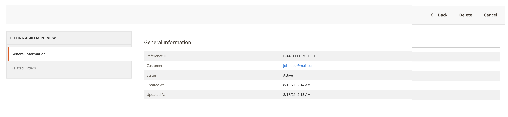

# PayPal 請求契約

チェックアウトプロセスを簡素化するために、お客様は PayPal を支払いサービスプロバイダーとして請求契約を締結することができます。 チェックアウト時に、顧客は支払い方法として請求契約を選択します。 支払システムは、請求契約を一意の番号で検証し、顧客アカウントに請求します。 請求契約が締結されると、顧客は購入ごとに支払い情報を入力する必要がなくなりました。 顧客は顧客アカウントのダッシュボードから請求契約を管理できます。各ステータスは _アクティブ_ または _キャンセル_ と表示されます。 請求契約がキャンセルされると、再度アクティブ化することはできません。

## 請求契約ワークフロー

1. **お客様が請求契約に新規登録する**。 請求契約が締結された後は、追加の請求契約は顧客アカウントからのみ追加できます。 顧客が作成できる請求契約の数に制限はありません。 お客様は、次のいずれかの方法で請求契約に新規登録できます。

   - **カスタマーアカウントに新規登録** – お客様は、カスタマーアカウントから請求契約に新規登録できます。
   - **チェックアウト時にサインアップ** - PayPal Express チェックアウトで購入に対して支払うお客様は、請求契約を作成するためのチェックボックスをマークできます。 請求契約は、現在の注文には使用されませんが、顧客が次回注文を行うときに支払方法オプションとして使用できるようになります。
   - **店舗管理者による新規登録** – お客様のリクエストに応じて、店舗管理者は顧客請求契約を使用して販売注文を作成できます。

1. **PayPal は契約を検証し、記録します**。 お客様が請求契約による支払いで注文を行うと、請求契約参照 ID と販売注文の支払い詳細が PayPal に転送され、参照情報と共に顧客アカウントに記録されます。 支払いが許可されている場合、注文はCommerceで作成されます。 請求契約参照 ID が顧客と店舗に送信されます。

## 請求契約の管理

_[!UICONTROL Billing Agreements]_&#x200B;のページには、ストアと顧客の間のすべての請求契約が一覧表示されます。 マーチャントは、顧客または請求契約情報（請求契約参照 ID、ステータス、作成日など）でレコードをフィルタリングできます。 各レコードには、請求契約に関する一般情報と、支払方法として使用したすべての受注が含まれます。 顧客請求契約を表示、キャンセル、または削除できます。 キャンセルされた請求契約は、店舗管理者のみが削除できます。

### 請求契約の表示

1. _管理者_ サイドバーで、**[!UICONTROL Sales]**/_[!UICONTROL Operations]_/**[!UICONTROL Billing Agreements]**&#x200B;に移動します。

1. リストで請求契約を見つけ、クリックして開きます。

各請求契約ページは、_[!UICONTROL General Information]_&#x200B;と_[!UICONTROL Related Orders]_ の 2 つのタブで構成されています。

#### 一般情報

このタブには、請求契約に関する一般情報が含まれています。

- [!UICONTROL Reference ID]：現在の請求契約に割り当てられている一意の数値 ID。
- [!UICONTROL Customer]：現在の請求契約に割り当てられている顧客のアカウント。
- [!UICONTROL Status]：支払基本契約ステータス。
- [!UICONTROL Created At]：作成日。
- [!UICONTROL Updated At]：更新日。

{width="600" zoomable="yes"}

#### 関連するオーダー

このタブには、現在の請求契約を使用して行われた注文のリストが表示されます。

{width="600" zoomable="yes"}

### 請求契約のキャンセル

1. _管理者_ サイドバーで、**[!UICONTROL Sales]**/_[!UICONTROL Operations]_/**[!UICONTROL Billing Agreements]**&#x200B;に移動します。

1. リストで請求契約を見つけ、クリックして開きます。

1. 右上隅の「**[!UICONTROL Cancel]**」をクリックします。

1. アクションを確定するには、「**[!UICONTROL OK]**」をクリックします。

### 請求契約の削除

1. _管理者_ サイドバーで、**[!UICONTROL Sales]**/_[!UICONTROL Operations]_/**[!UICONTROL Billing Agreements]**&#x200B;に移動します。

1. リストで請求契約を見つけ、クリックして開きます。

1. 右上隅の「**[!UICONTROL Delete]**」をクリックします。

1. アクションを確定するには、「**[!UICONTROL OK]**」をクリックします。

### 列の説明

| 列 | 説明 |
|--- |--- |
| [!UICONTROL ID] | 各請求契約に割り当てられる一意の数値識別子 |
| [!UICONTROL Email] | 顧客の連絡先メール |
| [!UICONTROL First Name] | 顧客の名 |
| [!UICONTROL Last Name] | 顧客の姓 |
| [!UICONTROL Reference ID] | 各請求契約書に割り当てられる一意の数値参照識別子 |
| [!UICONTROL Status] | 支払契約のステータス。 オプション：`Active` または `Canceled` |
| [!UICONTROL Created] | 作成日 |
| [!UICONTROL Updated] | 更新日 |

{style="table-layout:auto"}

## ストアフロントの経験

契約によると、支払いプロバイダーと請求契約を締結したお客様は、今すぐ購入して、後で支払うことができます。 この

{width="700" zoomable="yes"}

| 列 | 説明 |
|--- |--- |
| [!UICONTROL Reference ID] | 各請求契約書に割り当てられる一意の数値参照識別子 |
| [!UICONTROL Status] | 支払契約のステータス。 オプション：`Active` または `Canceled` |
| [!UICONTROL Created At] | 作成日 |
| [!UICONTROL Updated At] | 更新日 |
| [!UICONTROL Payment Method] | 請求契約の支払いプロバイダー |
| [!UICONTROL View] | 請求契約の表示に使用するボタン |

{style="table-layout:auto"}

### 請求契約の作成

1. 顧客は、アカウントダッシュボードから **[!UICONTROL Billing Agreements]** を選択します。

1. [**[!UICONTROL New Billing Agreement]**] で、支払いプロバイダを選択します。

1. 「**[!UICONTROL Create]**」をクリックします。

このアクションにより、お客様は支払いシステムの web サイトにリダイレクトされます。

{width="700" zoomable="yes"}

### 請求契約の表示

1. 顧客は、アカウントダッシュボードから **[!UICONTROL Billing Agreements]** を選択します。

1. 請求契約書を選択し、**[!UICONTROL View]** をクリックします。

{width="700" zoomable="yes"}

### 請求契約のキャンセル

1. 顧客は、アカウントダッシュボードから **[!UICONTROL Billing Agreements]** を選択します。

1. 請求契約書を選択し、**[!UICONTROL View]** をクリックします。

1. 右上隅の「**[!UICONTROL Cancel]**」をクリックし、「**[!UICONTROL OK]**」をクリックして確認します。

>[!NOTE]
>
>管理者ユーザー（マーチャント）が請求契約をキャンセルした場合、ストアフロントでキャンセルすることはできません。 この契約書の _キャンセル済み_ ステータスが表示されます。
