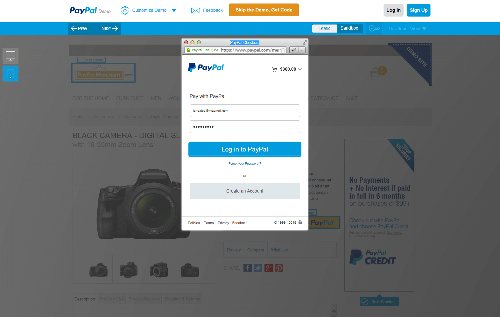
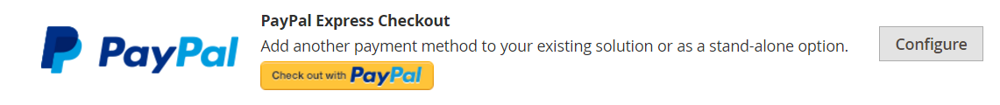
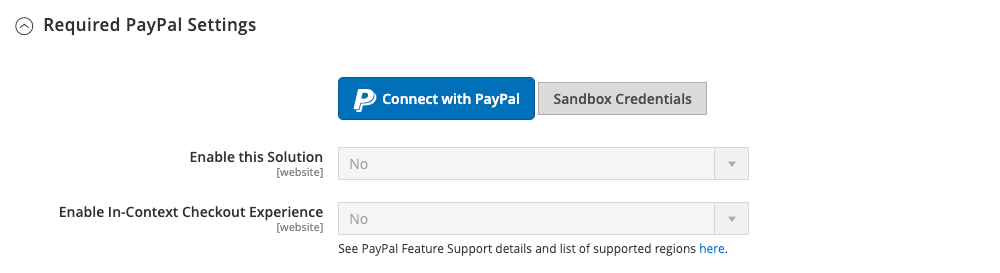
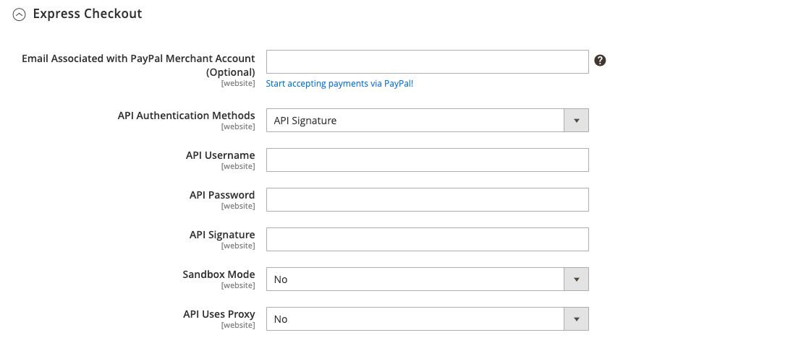

# PayPal Express チェックアウト

PayPal Express Checkoutは、クレジットカードまたは個人のPayPal アカウントのセキュリティによって支払う機能を顧客に提供することで、売上の向上に役立ちます。 チェックアウト中、お客様は安全なPayPal サイトにリダイレクトされ、支払い情報が完了します。 その後、お客様はストアに戻り、残りのチェックアウトプロセスを完了します。 Express Checkoutを選択すると、ストアに使い慣れたPayPal ボタンが追加され、売上が増加すると報告されています。

>[!IMPORTANT]
>
>**PSD2の要件：**  
>2019年9月14日現在、ヨーロッパの銀行は[PSD2](../getting-started/compliance-payment-services-directive.md)の要件を満たさない支払いを拒否する可能性があります。 PayPal Express Checkoutでは、すべての要件がPayPalによって処理されるため、PSD2に準拠するために何もする必要はありません。

現在のPayPal アカウントを持つお客様は、_[!UICONTROL Check out with PayPal]_ボタンをクリックして、1回の手順で購入できます。 Express Checkoutは、スタンドアロンとして使用することも、PayPal オールインワンソリューションの1つで使用することもできます。 すでにクレジットカードをオンラインで利用している場合は、PayPalでの支払いを希望する新規顧客を獲得するための追加オプションとして、Express Checkoutを提供することができます。

>[!NOTE]
>
>PayPalは、PayPal Express Checkoutを通じたデジタル商品の販売に対するサポートを廃止しました。[PayPal Payments Standard](paypal-payments-standard.md)または別のPayPal支払いゲートウェイを使用して、[仮想商品](../catalog/product-create-virtual.md)を含む注文を処理することをお勧めします。

## 要件定義

- 加盟店：[法人向けPayPal アカウント ](https://www.paypal.com/webapps/mpp/how-to-sell-online)
- お客様：[個人のPayPal アカウント ](https://www.paypal.com/webapps/mpp/buying-online)

## Express チェックアウトワークフロー

他の支払い方法とは異なり、PayPal Express Checkoutでは、顧客は商品ページ、ミニカート、ショッピングカートから、通常のチェックアウトワークフローの開始時にチェックアウトできます。

1. **お客様が注文します** – お客様は&#x200B;_[!UICONTROL Check out with PayPal]_ボタンをクリック/タップします。
1. **お客様はPayPal サイトにリダイレクトされます** – お客様は、トランザクションを完了するためにPayPal サイトにリダイレクトされます。
1. **お客様はPayPal アカウントにログインします** – お客様はトランザクションを完了するためにPayPal アカウントにログインする必要があります。 支払いシステムは、PayPal アカウントの請求情報と配送情報を使用します。
1. **お客様がチェックアウトページに戻ります** – お客様は、注文を確認するために、ストアのチェックアウトページにリダイレクトされます。
1. **お客様が注文を行います** – お客様が注文を行うと、注文情報がPayPalに送信されます。
1. **PayPalはトランザクションを決済します** - PayPalは注文を受け取り、トランザクションを決済します。

>[!NOTE]
>
>PayPal Express Checkoutでは、複数のアドレスを持つ注文はサポートされていません。

## インコンテクストなチェックアウト

PayPalの&#x200B;_インコンテクストチェックアウト_&#x200B;により、オンラインでの支払いがこれまで以上に簡単になりました。 顧客は、このシンプルなワンクリックまたは2 クリックのシームレスなチェックアウト中に、オンラインストアを見失うことはありません。 インコンテキストチェックアウトは、MacとPCで同様に機能し、デスクトップコンピューター、タブレット、モバイルデバイスで一貫したエクスペリエンスを提供します。 詳しくは、「[Express Checkoutでのインコンテキストチェックアウト ](https://www.paypal.com/rs/webapps/mpp/express-checkout)」を参照してください。

{width="700" zoomable="yes"}

[_PayPalのインコンテクスト チェックアウト デモ_](https://demo.paypal.com/us/demo/navigation?merchant=bigbox&page=incontextProductCheckout)

[!DNL PayPal Express Checkout]用にストアを設定する場合、このオプションを有効にできます。

## PayPal アカウントの設定

Commerce AdminでPayPal Express Checkoutを設定する前に、PayPal web サイトで加盟店アカウントを設定する必要があります。

1. [manager.paypal.com](https://manager.paypal.com/)でPayPal Advanced アカウントにログインします。

1. **[!UICONTROL Service Settings]** > **[!UICONTROL Hosted Checkout Pages]** > **[!UICONTROL Set Up]**&#x200B;に移動し、次の設定を行います。

   - **[!UICONTROL AVS]**: `No`
   - **[!UICONTROL CSC]**: `No`
   - **[!UICONTROL Enable Secure Token]**: `Yes`

1. **[!UICONTROL Save Changes]**&#x200B;をクリックします。

1. 別のユーザーを設定する（PayPalで推奨）:

   - [manager.paypal.com](https://manager.paypal.com/)に移動し、アカウントにログインします。

   - 別のユーザーを設定するには、指示に従います。

   - **[!UICONTROL Update]**&#x200B;をクリックします。

## CommerceでPayPal Express Checkoutを設定する

PayPal Express Checkoutとオールインワンソリューションの2つのPayPal ソリューションを同時にアクティブにすることができます。 別のソリューションを有効にすると、以前に使用したソリューションは自動的に無効になります。

>[!NOTE]
>
>いつでも&#x200B;**[!UICONTROL Save Config]**&#x200B;をクリックして、進行状況を保存します。

### 手順1：設定を開始する

1. _管理者_ サイドバーで、**[!UICONTROL Stores]** > _[!UICONTROL Settings]_>**[!UICONTROL Configuration]**に移動します。

1. 左側のパネルで、**[!UICONTROL Sales]**&#x200B;を展開し、**[!UICONTROL Payment Methods]**&#x200B;を選択します。

1. インストールに複数のweb サイト、ストア、またはビューがある場合は、この設定を適用するストアビューに&#x200B;**[!UICONTROL Store View]**&#x200B;を設定します。

1. 「_[!UICONTROL Merchant Location]_」セクションで、ビジネスが存在する&#x200B;**[!UICONTROL Merchant Country]**を選択します。

   この設定は、設定に表示されるPayPal ソリューションの選択を決定します。

   {width="600" zoomable="yes"}

1. _[!UICONTROL Recommended Solutions]_で、**[!UICONTROL PayPal Express Checkout]**の&#x200B;**[!UICONTROL Configure]**をクリックします。

   {width="600"}

### ステップ 2:PayPal アカウントを有効にして接続する

1. 必要に応じて、**[!UICONTROL Required PayPal Settings]** セクションのを展開します。

   {width="600" zoomable="yes"}

1. テストまたは本番用にアカウントを接続します。

   - テスト （開発） モードの場合は、**[!UICONTROL Sandbox Credentials]**&#x200B;をクリックし、[PayPal サンドボックス ](https://developer.paypal.com/docs/api-basics/sandbox/)資格情報を入力します。
   - 実稼動モードの場合は、**[!UICONTROL Connect with PayPal]**&#x200B;をクリックし、実稼動アカウントの資格情報を入力します。

   接続が検証されたら、続行できます。

1. **[!UICONTROL Enable this Solution]**&#x200B;を`Yes`に設定します。

1. [PayPal インコンテクスト チェックアウト ](#in-context-checkout)を有効にするには：

   - **[!UICONTROL Enable In-Context Checkout Experience]**&#x200B;を`Yes`に設定します。

   - PayPal **[!UICONTROL Merchant Account ID]**&#x200B;を入力します。

     加盟店アカウント IDは、PayPalの法人アカウントプロファイルに記載されています。

>[!NOTE]
>
>[PayPal Credit](paypal.md#paypal-credit-and-pay-later)は、この支払いオプションに対してデフォルトで有効になっています。

### ステップ 3：必要なPayPal設定を完了する

1. 必要に応じて、**[!UICONTROL Express Checkout]** セクションのを展開します。

   {width="600" zoomable="yes"}

1. （オプション）を入力します。**[!UICONTROL Email Associated with PayPal Merchant Account]**

   >[!IMPORTANT]
   >
   >メールアドレスでは、大文字と小文字が区別されます。 支払いを受け取るには、入力するメールアドレスがPayPal加盟店アカウントで指定されたメールアドレスと一致している必要があります。

   PayPal アカウントをお持ちでない場合は、**[!UICONTROL Start accepting payments via PayPal]**&#x200B;をクリックしてください。

1. **[!UICONTROL API Authentication Methods]**&#x200B;を次のいずれかに設定します：

   - `API Signature` – このPayPal認証方法は、実装が最も簡単で、ユーザー名、パスワード、アカウントを識別する一意の文字と数字の文字列に基づいています。 API署名の資格情報が期限切れになりません。
   - `API Certificate` – このPayPal認証方法はより安全で、ユーザー名、パスワード、ダウンロード可能な証明書に基づいています。 API資格情報は3年後に有効期限が切れ、更新する必要があります。

   必要に応じて、次の手順を実行します。

   - **[!UICONTROL API Username]**
   - **[!UICONTROL API Password]**
   - **[!UICONTROL API Signature]**

1. サンドボックスアカウントの資格情報を使用している場合は、**[!UICONTROL Sandbox Mode]**&#x200B;を`Yes`に設定します。

   サンドボックスで設定をテストする場合は、PayPalが推奨する[ クレジットカード番号](https://www.paypalobjects.com/en_AU/vhelp/paypalmanager_help/credit_card_numbers.htm)のみを使用します。 本番環境に移行する準備ができたら、設定に戻り、サンドボックスモードを`No`に設定し、本番環境のPayPal アカウントに接続します。

1. お使いのシステムがプロキシサーバーを使用してCommerceとPayPal決済システムの間の接続を確立する場合は、**[!UICONTROL API Uses Proxy]**&#x200B;を`Yes`に設定し、次の操作を行います。

   - **[!UICONTROL Proxy Host]**
   - **[!UICONTROL Proxy Port]**

この一連の手順の最後に、必要なPayPal設定が完了します。 基本設定と詳細設定を続行するか、**[!UICONTROL Save Config]**&#x200B;をクリックして後で戻って設定を調整できます

### ステップ 4:Advertising PayPal Credit / Advertising PayPal PayLaterの設定（オプション）

2.4.3 リリース以降、PayPal PayLaterは、PayPalを含むデプロイメントでサポートされています。 この機能により、買い物客は購入時に全額を支払うのではなく、隔週の分割で注文の支払いを行うことができます。 PayPal Credit エクスペリエンスは非推奨（廃止予定）です。

**[!UICONTROL Enable PayPal PayLater Experience]**&#x200B;を次のいずれかに設定します：

- `Yes` - Advertising PayPal PayLaterを設定するには
- `No` - Advertising PayPal クレジットを設定するには

>[!NOTE]
>
>**[!UICONTROL Enable PayPal PayLater Experience]**&#x200B;設定では、[!DNL PayPal PayLater]機能は無効にならず、ストアフロントから&#x200B;**_[!UICONTROL PayPal PayLater]_** ボタンは削除されません。 ストアフロントの&#x200B;**_[!UICONTROL PayPal PayLater]_**&#x200B;と&#x200B;**_[!UICONTROL PayPal Credit]_**&#x200B;の両方のボタンを無効にするには、**[!UICONTROL Disable Funding Options]**&#x200B;設定（[!UICONTROL Advanced Settings] under [!UICONTROL Frontend Experience Settings]）の`PayPal Credit`値を選択する必要があります。

#### Advertising PayPal Credit

1. **[!UICONTROL Advertise PayPal Credit]** セクションのを展開します。

1. アカウント情報を取得するには、**[!UICONTROL Get Publisher ID from PayPal]**&#x200B;をクリックし、指示に従います。

1. **[!UICONTROL Publisher ID]**&#x200B;を入力します。

   {width="600" zoomable="yes"}

1. **[!UICONTROL Home Page]** セクションのを展開します。

1. ページにバナーを配置するには、**[!UICONTROL Display]**&#x200B;を`Yes`に設定します。

1. **[!UICONTROL Position]**&#x200B;を次のいずれかに設定します：

   - `Header (center)`
   - `Sidebar (right)`

1. **[!UICONTROL Size]**&#x200B;を次のいずれかに設定します：

   - `190 x 100`
   - `234 x 60`
   - `300 x 50`
   - `468 x 60`
   - `728 x 90`
   - `800 x 66`

   {width="600" zoomable="yes"}

1. 残りのセクションを展開し、前の手順を繰り返します。

   - [!UICONTROL Catalog Category Page]
   - [!UICONTROL Catalog Product Page]
   - [!UICONTROL Checkout Cart Page]

#### PayPal PayLaterの広告

1. **[!UICONTROL Advertise PayPal PayLater]** セクションのを展開します。

1. **[!UICONTROL Enable PayPal PayLater]**&#x200B;を`Yes`に設定します。

1. **[!UICONTROL Home Page]** セクションのを展開します。

1. ページにバナーを配置するには、**[!UICONTROL Display]**&#x200B;を`Yes`に設定します。

1. **[!UICONTROL Position]**&#x200B;を次のいずれかに設定します：

   - `Header (center)`
   - `Sidebar`

1. **[!UICONTROL Style Layout]**&#x200B;を次のいずれかに設定します：

   - `Text`
   - `Flex`

1. [!UICONTROL Style Layout] **[!UICONTROL Text]**&#x200B;のみの場合は、**[!UICONTROL Logo Type]**&#x200B;を次のいずれかに設定します。

   - `Primary`
   - `Alternative`
   - `Inline`
   - `None`

1. [!UICONTROL Style Layout] **[!UICONTROL Text]**&#x200B;のみの場合は、**[!UICONTROL Logo Position]**&#x200B;を次のいずれかに設定します。

   - `Left`
   - `Right`
   - `Top`

1. [!UICONTROL Style Layout] **[!UICONTROL Text]**&#x200B;のみの場合は、**[!UICONTROL Text Color]**&#x200B;を次のいずれかに設定します。

   - `Black`
   - `White`
   - `Monochrome`
   - `Grayscale`

1. [!UICONTROL Style Layout] **[!UICONTROL Text]**&#x200B;のみの場合は、**[!UICONTROL Text Size]**&#x200B;を次のいずれかに設定します。

   - `10px`
   - `11px`
   - `12px`
   - `13px`
   - `14px`
   - `15px`
   - `16px`

1. [!UICONTROL Style Layout] **[!UICONTROL Flex]**&#x200B;のみの場合は、**[!UICONTROL Ratio]**&#x200B;を次のいずれかに設定します。

   - `1x1`
   - `1x4`
   - `8x1`
   - `20x1`

1. [!UICONTROL Style Layout] **[!UICONTROL Flex]**&#x200B;のみの場合は、**[!UICONTROL Color]**&#x200B;を次のいずれかに設定します。

   - `Blue`
   - `Black`
   - `White`
   - `White No Border`
   - `Gray`
   - `Monochrome`
   - `Grayscale`

   {width="600" zoomable="yes"}

1. 残りのセクションを展開し、前の手順を繰り返します。

   - [!UICONTROL Catalog Product Page]
   - [!UICONTROL Checkout Cart Page]
   - [!UICONTROL Checkout Payment Step]
   - [!UICONTROL Catalog Category Page]

### 手順5：基本設定を完了する

1. **[!UICONTROL Basic Settings - PayPal Express Checkout]** セクションのを展開します。

   {width="600" zoomable="yes"}

1. **[!UICONTROL Title]**&#x200B;に、チェックアウト時にこの支払い方法を識別するタイトルを入力します。

   すべてのストアビューにタイトル _PayPal_&#x200B;を使用することをお勧めします。

1. 複数の支払い方法を提供している場合は、**[!UICONTROL Sort Order]**&#x200B;の数値を入力して、他の支払い方法と一緒に表示されるPayPal Express Checkoutの順序を決定します。

   この数字は他の支払い方法に関連しています。 （`0` = first, `1` = second, `2` = thirdなど）

1. **[!UICONTROL Payment Action]**&#x200B;を次のいずれかに設定します：

   - `Authorization` – 購入を承認し、資金を保留します。 金額は、加盟店が&#x200B;_獲得_&#x200B;するまで引き落とされません。
   - `Sale` – 購入金額が承認され、お客様のアカウントから直ちに引き落とされます。
   - `Order` – 注文の金額は、PayPalの顧客の残高、銀行口座、またはクレジットカードで取得または承認されていません。 注文支払いアクションは、PayPal支払いシステムと加盟店の間の契約を表します。 これにより、最大29日間で、顧客バイヤーアカウントの注文総額に達する1つ以上の金額を獲得できます。 資金が注文された後、加盟店は次の29日間にいつでも獲得できます。 注文金額のキャプチャは、1つ以上の請求書を作成することによって、Commerce管理者からのみ実行できます。

1. 製品ページに&#x200B;_[!UICONTROL Check out with PayPal]_ボタンを表示するには、**[!UICONTROL Display on Product Details Page]**を`Yes`に設定します。

1. 支払いアクションが`Order`に設定されている場合は、次の操作を実行します

   - **[!UICONTROL Authorization Honor Period (days)]** - プライマリ認証が有効な期間を決定します。 この値は、PayPal加盟店アカウントの対応する値と同じである必要があります。 PayPal加盟店アカウントのデフォルト値は`3`です。 この数を増やすには、PayPalに連絡する必要があります。 最終日の米国太平洋標準時の午後11時:49に認証が無効になります。

   - **[!UICONTROL Order Valid Period (days)]** – 注文が有効な期間を決定します。 注文が無効になると、その注文の請求書を作成できなくなります。 PayPal加盟店アカウントの注文有効な期間の値と同じ値を指定します。 PayPal加盟店アカウントのデフォルト値は`29`です。 この番号を変更するには、PayPalにお問い合わせください。

   - **[!UICONTROL Number of Child Authorizations]** -1回の注文に対する最大承認数を指定します。これにより、注文に対して作成できるオンライン部分請求書の最大数が決定されます。 この値は、PayPal加盟店アカウントの対応する設定と同じである必要があります。 PayPal アカウントのデフォルトの子認証の数は`1`です。 この数を増やすには、PayPalに連絡する必要があります。

### 手順6：詳細設定を完了する

1. **[!UICONTROL Advanced Settings]** セクションのを展開します。

   {width="600" zoomable="yes"}

1. **[!UICONTROL Display on Shopping Cart]**&#x200B;を`Yes`に設定します。

1. **[!UICONTROL Payment Applicable From]**&#x200B;を次のいずれかに設定します：

   - `All Allowed Countries` - ストア設定で指定されたすべての国のお客様は、この支払い方法を使用できます。
   - `Specific Countries` – このオプションを選択すると、_[!UICONTROL Payment from Specific Countries]_リストが表示されます。 複数の国を選択するには、Ctrl キー（PC）またはCommand キー（Mac）を押しながら各項目をクリックします。

1. 支払いシステムとの通信をログファイルに書き込むには、**[!UICONTROL Debug Mode]**&#x200B;を`Yes`に設定します。

   PayPal Payments Advancedのログファイルは`_payflow_advanced.log`です。

   >[!NOTE]
   >
   >PCI データセキュリティ基準に従い、クレジットカード情報はログファイルに記録されません。

1. ホストの真正性検証を有効にするには、**[!UICONTROL Enable SSL Verification]**&#x200B;を`Yes`に設定します。

1. PayPal サイトからの顧客注文の完全な概要を行項目ごとに表示するには、**[!UICONTROL Transfer Cart Line Items]**&#x200B;を`Yes`に設定します。

1. 概要に最大10個の配送オプションを含めるには、**[!UICONTROL Transfer Shipping Options]**&#x200B;を`Yes`に設定します。 （このオプションは、行項目が「転送」に設定されている場合にのみ表示されます）。

1. PayPal承認ボタンに使用される画像の種類を判断するには、**[!UICONTROL Shortcut Buttons Flavor]**&#x200B;を次のいずれかに設定します。

   - `Dynamic` - （推奨） PayPal サーバーから動的に変更できる画像を表示します。
   - `Static` – 動的に変更できない特定の画像を表示します。

1. PayPal アカウントを持たない顧客がこの方法で購入できるようにするには、**[!UICONTROL Enable PayPal Guest Checkout]**&#x200B;を`Yes`に設定します。

1. **[!UICONTROL Require Customer's Billing Address]**&#x200B;を次のいずれかに設定します：

   - `Yes` – すべての購入に顧客の請求先住所が必要です。
   - `No` – 購入に顧客の請求先住所は必要ありません。
   - `For Virtual Quotes Only` – お客様の請求先住所がバーチャル見積もりにのみ必要です。

   >[!NOTE]
   >
   >この機能は、PayPal テクニカルサポートを通じて加盟店アカウントに対して有効にする必要があります。

1. （オプション）お客様アカウントで有効な請求契約書がない場合に、お客様がPayPal支払いシステムで[請求契約書](paypal-billing-agreements.md)に店舗と署名できるようにするには、**[!UICONTROL Billing Agreement Signup]**&#x200B;を設定します。

   - `Auto` – お客様は、Express チェックアウト フロー中に請求契約書に署名するか、別の支払い方法を使用できます。
   - `Ask Customer` – お客様は、Express チェックアウト フロー中に請求契約書に署名するかどうかを決定できます。
   - `Never` – お客様は、Express チェックアウト フロー中に請求契約書に署名できません。

   >[!NOTE]
   >
   >加盟店は、[PayPal加盟店テクニカルサポート ](https://developer.paypal.com/support/)に、アカウントで請求契約書を有効にするように依頼する必要があります。 _請求契約書の登録_ パラメーターは、加盟店アカウントに対して請求契約書が有効になっていることをPayPalが確認した後にのみ有効になります。

1. 注文レビューのために店舗に戻ることなく、PayPal サイトからトランザクションを完了できるようにするには、**[!UICONTROL Skip Order Review Step]**&#x200B;を`Yes`に設定します。

1. ストアの必要に応じて、追加のセクションを完了します。

   - [PayPall請求契約書の設定](#paypal-billing-agreement-settings)
   - [決済レポート設定](#settlement-report-settings)
   - [フロントエンドエクスペリエンス設定](#frontend-experience-settings)
   - [スマートボタンのカスタマイズ](#customize-smart-buttons)
   - [機能](#features)

1. 完了したら、**[!UICONTROL Save Config]**&#x200B;をクリックします。

#### PayPal請求契約書の設定

[請求契約書](paypal-billing-agreements.md)とは、複数の注文での使用がPayPalによって承認されている、加盟店とお客様との間の販売契約書です。 チェックアウトプロセス中に、請求契約書の支払いオプションは、会社との請求契約書を既に入力した顧客にのみ表示されます。 PayPalが契約を承認すると、支払いシステムは一意の参照IDを発行して、契約に関連付けられている各注文を識別します。 発注と同様に、顧客が会社と設定できる契約件数に制限はありません。

1. **[!UICONTROL PayPal Billing Agreement Settings]** セクションのを展開します。

   {width="600" zoomable="yes"}

1. **[!UICONTROL Enabled]**&#x200B;を`Yes`に設定します。

1. **[!UICONTROL Title]**&#x200B;に、チェックアウト時にPayPal請求契約書の方法を識別するタイトルを入力します。

1. 複数の支払い方法を提供している場合は、**[!UICONTROL Sort Order]** フィールドに番号を入力して、チェックアウト時に他の支払い方法と一緒に表示される請求契約書の順序を決定します。

1. **[!UICONTROL Payment Action]**&#x200B;を次のいずれかに設定します：

   - `Authorization` – 購入を承認し、資金を保留します。 金額は、加盟店が「獲得」するまで引き落とされません。
   - `Sale` – 購入金額が承認され、お客様のアカウントから直ちに引き落とされます。

1. **[!UICONTROL Payment Applicable From]**&#x200B;を次のいずれかに設定します：

   - `All Allowed Countries` - ストア設定で指定されたすべての国のお客様は、この支払い方法を使用できます。
   - `Specific Countries` – このオプションを選択すると、_[!UICONTROL Payment from Specific Countries]_リストが表示されます。 複数の国を選択するには、Ctrl キー（PC）またはCommand キー（Mac）を押しながら、それぞれの国をクリックします。

1. 支払いシステムとの通信をログファイルに記録するには、**[!UICONTROL Debug Mode]**&#x200B;を`Yes`に設定します。

   >[!NOTE]
   >
   >ログファイルはサーバーに保存され、開発者のみがアクセスできます。 PCI データセキュリティ基準に従い、クレジットカード情報はログファイルに記録されません。

1. SSL検証を有効にするには、**[!UICONTROL Enable SSL Verification]**&#x200B;を`Yes`に設定します。

1. PayPal支払いページでお客様の注文の各行項目の概要を表示するには、**[!UICONTROL Transfer Cart Line Items]**&#x200B;を`Yes`に設定します。

1. 顧客アカウントのダッシュボードから請求契約書を開始できるようにするには、**[!UICONTROL Allow in Billing Agreement Wizard]**&#x200B;を`Yes`に設定します。

#### 決済レポート設定

1. **[!UICONTROL Settlement Report Settings]** セクションのを展開します。

   {width="600" zoomable="yes"}

1. **[!UICONTROL SFTP Credentials]**&#x200B;に対して、次の操作を行います。

   - PayPal Secure FTP Serverにサインアップしている場合は、次のSFTP ログイン資格情報を入力します。

      - ログイン
      - パスワード

   - サイトでExpress Checkoutを使用して&#x200B;_稼働前_&#x200B;にテストレポートを実行するには、**[!UICONTROL Sandbox Mode]**&#x200B;を`Yes`に設定します。

   - **[!UICONTROL Custom Endpoint Hostname or IP Address]**&#x200B;を入力します。

     デフォルトでは、値は`reports.paypal.com`です

   - レポートを保存する&#x200B;**[!UICONTROL Custom Path]**&#x200B;を入力します。

     デフォルトでは、値は`/ppreports/outgoing`です

1. スケジュールに従ってレポートを生成するには、**[!UICONTROL Scheduled Fetching]**&#x200B;設定を完了します。

   - **[!UICONTROL Enable Automatic Fetching]**&#x200B;を`Yes`に設定します。

   - **[!UICONTROL Schedule]**&#x200B;を次のいずれかに設定します：

      - `Daily`
      - `Every 3 Days`
      - `Every 7 Days`
      - `Every 10 Days`
      - `Every 14 Days`
      - `Every 30 Days`
      - `Every 40 Days`

     PayPalは、各レポートを45日間保持します。

   - レポートを生成する場合は、**[!UICONTROL Time of Day]**&#x200B;を時間、分、秒に設定します。

#### フロントエンドエクスペリエンス設定

フロントエンドエクスペリエンス設定を使用して、サイトに表示するPayPal ロゴを選択し、PayPal マーチャントページの外観をカスタマイズします。

1. **[!UICONTROL Frontend Experience Settings]** セクションのを展開します。

   {width="600" zoomable="yes"}

1. ストアのPayPal ブロックに表示する&#x200B;**[!UICONTROL PayPal Product Logo]**&#x200B;を選択します。

   PayPalのロゴには4つのスタイルと2つのサイズがあります。

   - `No Logo`
   - `We Prefer PayPal (150 x 60 or 150 x 40)`
   - `Now Accepting PayPal (150 x 60 or 150 x 40)`
   - `Payments by PayPal (150 x 60 or 150 x 40)`
   - `Shop Now Using PayPal (150 x 60 or 150 x 40)`

1. PayPal マーチャントページの外観をカスタマイズするには、次の操作を行います。

   - PayPal マーチャント ページに適用する&#x200B;**[!UICONTROL Page Style]**&#x200B;の名前を入力します。

      - `paypal` - PayPal ページスタイルを使用します。
      - `primary` - アカウントプロファイルで&#x200B;_primary_ スタイルとして識別したページスタイルを使用します。
      - `your_custom_value` - アカウント プロファイルで指定されたカスタム支払いページ スタイルを使用します。

   - **[!UICONTROL Header Image URL]**&#x200B;に、支払いページの左上隅に表示する画像のURLを入力します。 最大ファイルサイズは、幅750 ピクセル、高さ90 ピクセルです。

     >[!NOTE]
     >
     >PayPalでは、画像が安全な（https）サーバー上にあることをお勧めします。 それ以外の場合、ブラウザーは、_ページにセキュアな項目とセキュアでない項目の両方が含まれていることを警告する場合があります_。

   - ページの色を設定するには、次のそれぞれに`#`記号なしで6文字の16進数コードを入力します。

      - **[!UICONTROL Header Background Color]** - チェックアウト ページ ヘッダーの背景色。
      - **[!UICONTROL Header Border Color]** - ヘッダーの周囲の2 ピクセル境界の色。
      - **[!UICONTROL Page Background Color]** - チェックアウトページと、ヘッダーと支払いフォームの周囲の背景色。

#### スマートボタンのカスタマイズ

_スマート支払いボタン_&#x200B;機能を使用すると、PayPal ボタンをカスタマイズできます。このボタンは、チェックアウト、商品詳細、カート、ミニカートのページに表示できます。 PayPalの社内調査によると、デフォルトのオプションは認知度が高く、購入率が向上する可能性がありますが、デフォルトのオプションがストアのスタイルと一致しない可能性があります。 次の項目を選択できます。

- PayPal ボタンのサイズ、色、形状
- PayPal ボタンに表示されるテキスト
- 複数のボタンが表示されている場合のレイアウト（水平または垂直）

ボタンをカスタマイズするには、次のセクションのそれぞれを展開し、設定を調整します。

- **[!UICONTROL Checkout Page]**
- **[!UICONTROL Product Pages]**
- **[!UICONTROL Cart Page]**
- **[!UICONTROL Mini Cart]**

{width="600" zoomable="yes"}

**_各ページタイプのボタン表示を設定するには:_**

1. セクションのを展開します。

1. **[!UICONTROL Customize Button]**&#x200B;を`Yes`に設定します。

1. PayPalがスマート支払いボタンに表示するテキストを設定するには、**[!UICONTROL Label]**&#x200B;を次のいずれかに設定します。

   - `Checkout` - PayPal チェックアウト
   - `Pay` - PayPal チェックアウト
   - `Buy Now` - PayPalで購入
   - `PayPal` - PayPal
   - `Installment` - PayPal
   - `Credit` - PayPal クレジット

1. **[!UICONTROL Layout]**&#x200B;を次のいずれかに設定します：

   - `Vertical` - （デフォルト） PayPal スマートボタンを垂直方向に表示します。 購入者は、**[!UICONTROL Enable Guest Checkout]**&#x200B;が選択されているかどうかに関係なく、PayPalにログインするか、PayPal アカウントを作成する必要があります。
   - `Horizontal` - PayPal スマートボタンを水平方向に表示します。 **[!UICONTROL Enable Guest Checkout]**&#x200B;を選択すると、**[!UICONTROL Pay with Debit Card or Credit Card]** ボタンがPayPal ポップアップウィンドウに表示されます。 それ以外の場合、購入者はPayPalにログインするか、PayPal アカウントを作成する必要があります。

1. **[!UICONTROL Size]**&#x200B;を次のいずれかに設定します：

   - `Medium` - 250 ピクセル x 35 ピクセル。
   - `Large` - 350 ピクセル x 40 ピクセル。
   - `Responsive` - （デフォルト）コンテナの幅に合わせて調整します。 最小幅は100 ピクセル、最大幅は500 ピクセルです。 高さは、幅に基づいて動的に調整されます。

1. **[!UICONTROL Shape]**&#x200B;を次のいずれかに設定します：

   - `Pill` - （既定値） ボタンはピルのような形をしています（中央が長く、端が曲がっています）。
   - `Rectangle` – 四角形で、曲線のない正方形のシェイプ。

1. **[!UICONTROL Color]**&#x200B;を次のいずれかに設定します：

   - `Gold` （既定値）
   - `Blue`
   - `Silver`
   - `Black`

#### 機能

機能設定を使用すると、このPayPal ソリューションに関連する特定の機能を無効にできます。

1. **[!UICONTROL Features]** セクションのを展開します。

   {width="600" zoomable="yes"}

1. **[!UICONTROL Disable Funding Options]**&#x200B;を設定して、_チェックアウト_ ページに表示されるその他のPayPal資金調達オプションを決定します。

   選択したオプションは、_チェックアウト_ ページに表示されません。 選択されていないオプションは、PayPalがストア通貨と購入者の場所をサポートしている場合にのみ表示されます。 オプションは次のとおりです。

   - PayPal クレジット
   - Venmo
   - PayPal ゲストチェックアウトのクレジットカードのアイコン
   - Elektronisches Lastschriftverfahren - ドイツ語ELV
