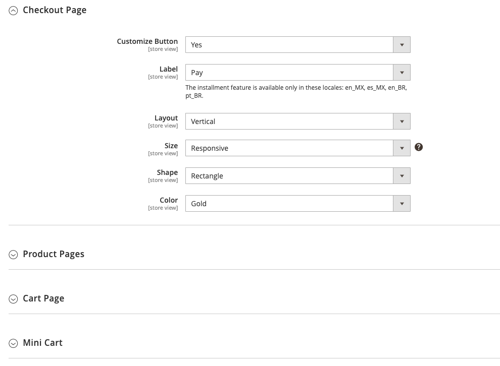

# PayPal Express チェックアウト

PayPal Express Checkout は、顧客がクレジットカードまたは個人の PayPal アカウントのセキュリティから支払う機能を提供することで、売上を高めるのに役立ちます。 チェックアウト時に、お客様は安全な PayPal サイトにリダイレクトされ、支払い情報を完了します。 その後、お客様はストアに戻され、チェックアウトプロセスの残りの部分が完了します。 「エクスプレスチェックアウト」を選択すると、売り上げの増加を報告されている、おなじみの PayPal ボタンがストアに追加されます。

>[!IMPORTANT]
>
>**PSD2 の要件：**  
>2019 年 9 月 14 日（PT）現在、ヨーロッパの銀行は、[PSD2](../getting-started/compliance-payment-services-directive.md) の要件を満たさない支払いを拒否する可能性があります。 PayPal Express Checkout がPSD2 に準拠するには、すべての要件が PayPal で処理されるため、何もする必要はありません。

現在 PayPal アカウントをお持ちのお客様は、_[!UICONTROL Check out with PayPal]_&#x200B;ボタンをクリックすると、1 回の手順で購入することができます。 エクスプレスチェックアウトは、スタンドアロンとして、または PayPal オールインワンソリューションの 1 つと共に使用できます。 既にオンラインでクレジットカードを受け入れている場合は、PayPal で支払うことを好む新規顧客を引き付けるための追加オプションとしてエクスプレスチェックアウトを提供できます。

>[!NOTE]
>
>PayPal は、PayPal Express Checkout を通じたデジタル商品の販売に対するサポートを廃止しており、[PayPal Payments Standard](paypal-payments-standard.md) または別の PayPal 支払いゲートウェイを使用して、[&#x200B; 仮想製品 &#x200B;](../catalog/product-create-virtual.md) を含む注文を処理することをお勧めします。

## 要件

- マーチャント：[Business PayPal アカウント ][1]
- 顧客：[ 個人用 PayPal アカウント ][2]

## 高速チェックアウトワークフロー

他の支払い方法とは異なり、PayPal Express Checkout では、お客様は商品ページ、ミニカート、買い物かごから通常のチェックアウトワークフローの最初にチェックアウトできます。

1. **顧客が注文する** – 顧客が「_[!UICONTROL Check out with PayPal]_」ボタンをクリックまたはタップします。
1. **顧客は PayPal サイトにリダイレクトされます** - トランザクションを完了するために、顧客は PayPal サイトにリダイレクトされます。
1. **顧客が PayPal アカウントにログインする** - トランザクションを完了するには、顧客が PayPal アカウントにログインする必要があります。 支払いシステムは、PayPal アカウントからの請求情報と配送情報を使用します。
1. **お客様がチェックアウトページに戻る** - ユーザーはストアのチェックアウトページにリダイレクトされて注文を確認します。
1. **顧客が注文** – 顧客が注文を行い、注文情報が PayPal に送信されます。
1. **PayPal がトランザクションを決済** - PayPal が注文を受け取り、トランザクションを決済します。

>[!NOTE]
>
>PayPal Express Checkout は、複数の住所を持つ注文をサポートしていません。

## コンテキスト内チェックアウト

PayPal の _コンテキスト内チェックアウト_ を使用すると、オンラインでの支払いがこれまで以上に簡単になります。 お客様は、このシンプルな 1 回または 2 回のクリックでシームレスなチェックアウト中にストアを見失うことはありません。 コンテキスト内チェックアウトは Mac と PC でも同様に機能し、デスクトップコンピューター、タブレット、モバイルデバイスで一貫したエクスペリエンスを提供します。 詳しくは、[ 高速チェックアウトでのコンテキスト内チェックアウト ][5] を参照してください。

{width="700" zoomable="yes"}

[_PayPal コンテキスト内チェックアウトデモ_][6]

ストアを [!DNL PayPal Express Checkout] 用に設定する際に、このオプションを有効にできます。

## PayPal アカウントの設定

Commerce Admin で PayPal Express Checkout を設定する前に、PayPal Web サイトでマーチャントアカウントを設定する必要があります。

1. [manager.paypal.com][3] の PayPal 上級アカウントにログインします。

1. **[!UICONTROL Service Settings]**/**[!UICONTROL Hosted Checkout Pages]**/**[!UICONTROL Set Up]** に移動し、次の設定を行います。

   - **[!UICONTROL AVS]**: `No`
   - **[!UICONTROL CSC]**: `No`
   - **[!UICONTROL Enable Secure Token]**: `Yes`

1. 「**[!UICONTROL Save Changes]**」をクリックします。

1. 別のユーザーを設定します（PayPal が推奨）。

   - [manager.paypal.com][3] に移動し、アカウントにログインします。

   - 別のユーザーを設定するには、手順に従います。

   - 「**[!UICONTROL Update]**」をクリックします。

## Commerceでの PayPal Express チェックアウトの設定

PayPal Express Checkout とオールインワンソリューションの 2 つの PayPal ソリューションを同時にアクティブにすることができます。 別のソリューションを有効にすると、以前に使用したソリューションが自動的に非アクティブになります。

>[!NOTE]
>
>「**[!UICONTROL Save Config]**」をクリックすると、いつでも進行状況を保存できます。

### 手順 1：設定の開始

1. _管理者_ サイドバーで、**[!UICONTROL Stores]**/_[!UICONTROL Settings]_/**[!UICONTROL Configuration]**&#x200B;に移動します。

1. 左側のパネルで「**[!UICONTROL Sales]**」を展開し、「**[!UICONTROL Payment Methods]**」を選択します。

1. インストールに複数の web サイト、ストア、またはビューがある場合は、この設定を適用するストア表示に **[!UICONTROL Store View]** を設定します。

1. 「_[!UICONTROL Merchant Location]_」セクションで、ビジネスが所在する&#x200B;**[!UICONTROL Merchant Country]**&#x200B;を選択します。

   この設定により、設定に表示される PayPal ソリューションの選択が決まります。

   {width="600" zoomable="yes"}

1. [_[!UICONTROL Recommended Solutions]_] で、[**[!UICONTROL PayPal Express Checkout]**] の [**[!UICONTROL Configure]**] をクリックします。

   {width="600"}

### 手順 2:PayPal アカウントを有効にして接続する

1. 必要に応じて、「拡張セレクター ![&#x200B; の「**[!UICONTROL Required PayPal Settings]**」セクション &#x200B;](../assets/icon-display-expand.png) 展開します。

   {width="600" zoomable="yes"}

1. テストまたは実稼動用にアカウントを接続：

   - テスト（開発）モードの場合は、「**[!UICONTROL Sandbox Credentials]**」をクリックし、[PayPal サンドボックス ][7] 資格情報を入力します。
   - 実稼動モードの場合は、「**[!UICONTROL Connect with PayPal]**」をクリックして、実稼動アカウントの資格情報を入力します。

   接続が検証されたら、続行できます。

1. **[!UICONTROL Enable this Solution]** を `Yes` に設定します。

1. [PayPal コンテキスト内チェックアウト &#x200B;](#in-context-checkout) を有効にするには：

   - **[!UICONTROL Enable In-Context Checkout Experience]** を `Yes` に設定します。

   - PayPal **[!UICONTROL Merchant Account ID]** を入力します。

     マーチャントアカウント ID は、PayPal ビジネスアカウントプロファイルに記載されています。

>[!NOTE]
>
>[PayPal クレジット &#x200B;](paypal.md#paypal-credit-and-pay-later) は、この支払いオプションに対してデフォルトで有効になっています。

### 手順 3：必要な PayPal 設定を完了する

1. 必要に応じて、「拡張セレクター ![&#x200B; の「**[!UICONTROL Express Checkout]**」セクション &#x200B;](../assets/icon-display-expand.png) 展開します。

   {width="600" zoomable="yes"}

1. （任意） **[!UICONTROL Email Associated with PayPal Merchant Account]** を入力します。

   >[!IMPORTANT]
   >
   >メールアドレスでは大文字と小文字が区別されます。 支払いを受け取るには、入力するメールアドレスが PayPal マーチャントアカウントで指定されたメールアドレスと一致する必要があります。

   PayPal アカウントをお持ちでない場合は、[**[!UICONTROL Start accepting payments via PayPal]**] をクリックします。

1. **[!UICONTROL API Authentication Methods]** を次のいずれかに設定します。

   - `API Signature` – この PayPal 認証方法は実装が最も簡単で、ユーザー名、パスワード、およびアカウントを識別する一意の文字列と数字に基づいています。 API 署名資格情報の有効期限はありません。
   - `API Certificate` – この PayPal 認証方法はより安全で、ユーザー名、パスワード、ダウンロード可能な証明書に基づいています。 API 資格情報は 3 年後に期限切れになり、更新する必要があります。

   必要に応じて、次の手順を実行します。

   - **[!UICONTROL API Username]**
   - **[!UICONTROL API Password]**
   - **[!UICONTROL API Signature]**

1. サンドボックスアカウントの資格情報を使用している場合は、**[!UICONTROL Sandbox Mode]** を `Yes` に設定します。

   サンドボックスで設定をテストする場合は、PayPal が推奨する [ クレジットカード番号 ][4] のみを使用します。 実稼動に移行する準備が整ったら、設定に戻り、サンドボックスモードを `No` に設定して、実稼動 PayPal アカウントに接続します。

1. プロキシサーバーを使用してCommerceと PayPal 支払いシステムを接続する場合は、**[!UICONTROL API Uses Proxy]** を `Yes` に設定し、次の手順を実行します。

   - **[!UICONTROL Proxy Host]**
   - **[!UICONTROL Proxy Port]**

この一連の手順の最後に、必要な PayPal 設定が完了します。 「基本設定」と「詳細設定」を続行するか、「**[!UICONTROL Save Config]**」をクリックして後で戻り、設定を調整できます

### 手順 4：広告 PayPal クレジット/広告 PayPal PayLater の設定（オプション）

2.4.3 リリース以降、PayPal PayLater は PayPal を含むデプロイメントでサポートされます。 この機能により、買い物客は購入時に全額を支払うのではなく、隔週の分割払いで注文の支払いを行うことができます。 PayPal クレジットエクスペリエンスは非推奨（廃止予定）となりました。

**[!UICONTROL Enable PayPal PayLater Experience]** を次のいずれかに設定します。

- `Yes` - PayPal PayLater をアドバタイズを設定するには
- `No` – 広告 PayPal クレジットを設定する

>[!NOTE]
>
>**[!UICONTROL Enable PayPal PayLater Experience]** の設定では、[!DNL PayPal PayLater] 機能は無効にならず、ストアフロントから **_[!UICONTROL PayPal PayLater]_** のボタンは削除されません。 ストアフロントで **_[!UICONTROL PayPal PayLater]_** ボタンと **_[!UICONTROL PayPal Credit]_** ボタンの両方を無効にするには、**[!UICONTROL Disable Funding Options]** 設定の `PayPal Credit` 値を選択する必要があります（[!UICONTROL Frontend Experience Settings] の下の [!UICONTROL Advanced Settings]）。

#### PayPal クレジットのアドバタイズ

1. 「」を展開し、「**[!UICONTROL Advertise PayPal Credit]**」セクションを展開します。

1. アカウント情報を取得するには、**[!UICONTROL Get Publisher ID from PayPal]** をクリックし、指示に従ってください。

1. **[!UICONTROL Publisher ID]** を入力します。

   {width="600" zoomable="yes"}

1. 「」を展開し、「**[!UICONTROL Home Page]**」セクションを展開します。

1. ページにバナーを配置するには、「**[!UICONTROL Display]**」を「`Yes`」に設定します。

1. **[!UICONTROL Position]** を次のいずれかに設定します。

   - `Header (center)`
   - `Sidebar (right)`

1. **[!UICONTROL Size]** を次のいずれかに設定します。

   - `190 x 100`
   - `234 x 60`
   - `300 x 50`
   - `468 x 60`
   - `728 x 90`
   - `800 x 66`

   {width="600" zoomable="yes"}

1.  残りのセクションを展開し、前の手順を繰り返します。

   - [!UICONTROL Catalog Category Page]
   - [!UICONTROL Catalog Product Page]
   - [!UICONTROL Checkout Cart Page]

#### PayPal PayLater のアドバタイズ

1. 「」を展開し、「**[!UICONTROL Advertise PayPal PayLater]**」セクションを展開します。

1. **[!UICONTROL Enable PayPal PayLater]** を `Yes` に設定します。

1. 「」を展開し、「**[!UICONTROL Home Page]**」セクションを展開します。

1. ページにバナーを配置するには、「**[!UICONTROL Display]**」を「`Yes`」に設定します。

1. **[!UICONTROL Position]** を次のいずれかに設定します。

   - `Header (center)`
   - `Sidebar`

1. **[!UICONTROL Style Layout]** を次のいずれかに設定します。

   - `Text`
   - `Flex`

1. [!UICONTROL Style Layout] **[!UICONTROL Text]** の場合のみ、**[!UICONTROL Logo Type]** を次のいずれかに設定します。

   - `Primary`
   - `Alternative`
   - `Inline`
   - `None`

1. [!UICONTROL Style Layout] **[!UICONTROL Text]** の場合のみ、**[!UICONTROL Logo Position]** を次のいずれかに設定します。

   - `Left`
   - `Right`
   - `Top`

1. [!UICONTROL Style Layout] **[!UICONTROL Text]** の場合のみ、**[!UICONTROL Text Color]** を次のいずれかに設定します。

   - `Black`
   - `White`
   - `Monochrome`
   - `Grayscale`

1. [!UICONTROL Style Layout] **[!UICONTROL Text]** の場合のみ、**[!UICONTROL Text Size]** を次のいずれかに設定します。

   - `10px`
   - `11px`
   - `12px`
   - `13px`
   - `14px`
   - `15px`
   - `16px`

1. [!UICONTROL Style Layout] **[!UICONTROL Flex]** の場合のみ、**[!UICONTROL Ratio]** を次のいずれかに設定します。

   - `1x1`
   - `1x4`
   - `8x1`
   - `20x1`

1. [!UICONTROL Style Layout] **[!UICONTROL Flex]** の場合のみ、**[!UICONTROL Color]** を次のいずれかに設定します。

   - `Blue`
   - `Black`
   - `White`
   - `White No Border`
   - `Gray`
   - `Monochrome`
   - `Grayscale`

   {width="600" zoomable="yes"}

1.  残りのセクションを展開し、前の手順を繰り返します。

   - [!UICONTROL Catalog Product Page]
   - [!UICONTROL Checkout Cart Page]
   - [!UICONTROL Checkout Payment Step]
   - [!UICONTROL Catalog Category Page]

### 手順 5：基本設定を完了する

1. 「」を展開し、「**[!UICONTROL Basic Settings - PayPal Express Checkout]**」セクションを展開します。

   {width="600" zoomable="yes"}

1. **[!UICONTROL Title]** の場合は、チェックアウト時にこの支払い方法を識別するタイトルを入力します。

   すべてのストアビューで _PayPal_ というタイトルを使用することをお勧めします。

1. 複数の支払い方法を提供する場合は、**[!UICONTROL Sort Order]** の番号を入力して、他の支払い方法と共に表示される PayPal Express Checkout の表示順序を決定します。

   この番号は、他の支払い方法と相対的です。 （`0` = 1 番目、`1` = 2 番目、`2` = 3 番目など）。

1. **[!UICONTROL Payment Action]** を次のいずれかに設定します。

   - `Authorization` – 購入を承認し、資金を保留します。 この金額は、マーチャントによって _キャプチャ_ されるまで引き出されません。
   - `Sale` – 購入金額は許可され、すぐにお客様のアカウントから引き出されます。
   - `Order` – 注文金額は、PayPal の顧客残高、銀行口座、クレジットカードで取得または承認されません。 注文支払いアクションは、PayPal 支払いシステムとマーチャントの間の契約を表します。 これにより、マーチャントは、最大 29 日間にわたって、顧客の買い手口座から注文された合計までの 1 つ以上の金額をキャプチャできます。 資金が注文された後、マーチャントは次の 29 日間の間にいつでも資金を取り込むことができます。 注文金額のキャプチャは、1 つ以上の請求書を作成することにより、Commerce管理者からのみ実行できます。

1. 製品ページに「_[!UICONTROL Check out with PayPal]_」ボタンを表示するには、「**[!UICONTROL Display on Product Details Page]**」を「`Yes`」に設定します。

1. 支払処理が「`Order`」に設定されている場合は、次の手順を実行します

   - **[!UICONTROL Authorization Honor Period (days)]** - プライマリ認証が有効なままである期間を決定します。 値は、PayPal マーチャントアカウントの対応する値と等しくなければなりません。 PayPal マーチャントアカウントのデフォルト値は `3` です。 この数を増やすには、PayPal に連絡する必要があります。 この承認は、米国太平洋標準時（PT）の最終日の午後 11 時 49 分に無効になります。

   - **[!UICONTROL Order Valid Period (days)]** – 注文が有効である期間を決定します。 注文が無効になると、請求書を作成できなくなります。 PayPal マーチャントアカウントの「注文有効期間」の値と等しい値を指定します。 PayPal マーチャントアカウントのデフォルト値は `29` です。 この番号を変更するには、PayPal に連絡する必要があります。

   - **[!UICONTROL Number of Child Authorizations]** - 1 つの受注に対する承認の最大数を指定します。この値によって、1 つの受注に対して作成できるオンライン部分請求書の最大数が決まります。 この値は、PayPal マーチャントアカウントの対応する設定と等しい必要があります。 PayPal アカウントの子の認証数のデフォルト値は `1` です。 この数を増やすには、PayPal に連絡する必要があります。

### 手順 6：詳細設定の完了

1. 「」を展開し、「**[!UICONTROL Advanced Settings]**」セクションを展開します。

   {width="600" zoomable="yes"}

1. **[!UICONTROL Display on Shopping Cart]** を `Yes` に設定します。

1. **[!UICONTROL Payment Applicable From]** を次のいずれかに設定します。

   - `All Allowed Countries` - ストア設定で指定されたすべての国の顧客は、この支払い方法を使用できます。
   - `Specific Countries` – このオプションを選択すると、_[!UICONTROL Payment from Specific Countries]_&#x200B;のリストが表示されます。 複数の国を選択するには、Ctrl キー（PC）または Command キー（Mac）を押しながら、各項目をクリックします。

1. 支払いシステムとの通信をログファイルに書き込むには、**[!UICONTROL Debug Mode]** を `Yes` に設定します。

   PayPal Payments Advanced のログファイルは `_payflow_advanced.log` です。

   >[!NOTE]
   >
   >PCI Data Security Standards に従い、クレジットカード情報はログファイルに記録されません。

1. ホストの信頼性の検証を有効にするには、**[!UICONTROL Enable SSL Verification]** を `Yes` に設定します。

1. PayPal サイトの品目別の顧客オーダーの完全な概要を表示するには、**[!UICONTROL Transfer Cart Line Items]** を `Yes` に設定します。

1. 概要に最大 10 個の配送オプションを含めるには、**[!UICONTROL Transfer Shipping Options]** を `Yes` に設定します。 （このオプションは、明細項目が転送に設定されている場合にのみ表示されます。）

1. PayPal 受け入れボタンに使用する画像のタイプを判断するには、**[!UICONTROL Shortcut Buttons Flavor]** を次のいずれかに設定します。

   - `Dynamic` - （推奨） PayPal サーバーから動的に変更できる画像を表示します。
   - `Static` – 動的に変更できない特定の画像を表示します。

1. PayPal アカウントを持たないお客様がこの方法で購入できるようにするには、**[!UICONTROL Enable PayPal Guest Checkout]** を `Yes` に設定します。

1. **[!UICONTROL Require Customer's Billing Address]** を次のいずれかに設定します。

   - `Yes` – すべての購入に対して顧客の請求先住所が必要です。
   - `No` – 購入に際して、顧客の請求先住所は必要ありません。
   - `For Virtual Quotes Only` – 仮想見積もりのみに顧客の請求先住所が必要です。

   >[!NOTE]
   >
   >この機能は、PayPal テクニカルサポートを通じてマーチャントアカウントで有効にする必要があります。

1. （オプション）カスタマーアカウントに有効な請求契約がない場合、顧客が PayPal 支払いシステムのストアと [&#x200B; 請求契約 &#x200B;](paypal-billing-agreements.md) に署名できるように、**[!UICONTROL Billing Agreement Signup]** を設定します。

   - `Auto` – お客様は、エクスプレスチェックアウトフロー中に請求契約に署名するか、別の支払い方法を使用できます。
   - `Ask Customer` – お客様は、エクスプレスチェックアウトフロー中に請求契約に署名するかどうかを決定できます。
   - `Never` – お客様は、エクスプレスチェックアウトフロー中に請求契約に署名できません。

   >[!NOTE]
   >
   >マーチャントは、アカウントで請求契約を有効にするには、[PayPal マーチャントテクニカルサポート &#x200B;](https://developer.paypal.com/support/) に依頼する必要があります。 _請求契約のサインアップ_ パラメーターは、お客様のマーチャントアカウントで請求契約が有効になっていることを PayPal が確認した後でのみ有効になります。

1. お客様が注文レビューのためにストアに戻ることなく、PayPal サイトからトランザクションを完了できるようにするには、**[!UICONTROL Skip Order Review Step]** を `Yes` に設定します。

1. ストアの必要に応じて、次の追加セクションを完了します。

   - [PayPall 請求契約の設定](#paypal-billing-agreement-settings)
   - [決済報告書の設定](#settlement-report-settings)
   - [フロントエンドエクスペリエンス設定](#frontend-experience-settings)
   - [スマートボタンのカスタマイズ](#customize-smart-buttons)
   - [機能](#features)

1. 完了したら、「**[!UICONTROL Save Config]**」をクリックします。

#### PayPal 請求契約設定

[&#x200B; 請求契約 &#x200B;](paypal-billing-agreements.md) は、複数の注文での使用が PayPal によって許可されている、マーチャントと顧客の間の販売契約です。 チェックアウトプロセス中に、請求契約の支払いオプションは、会社と請求契約を既に入力している顧客にのみ表示されます。 PayPal が契約を承認すると、支払いシステムは、契約に関連付けられている各注文を識別するための一意の参照 ID を発行します。 発注書と同様に、顧客が会社で設定できる請求契約の数に制限はありません。

1. 「」を展開し、「**[!UICONTROL PayPal Billing Agreement Settings]**」セクションを展開します。

   {width="600" zoomable="yes"}

1. **[!UICONTROL Enabled]** を `Yes` に設定します。

1. **[!UICONTROL Title]** しくは、チェックアウト時に PayPal 請求契約メソッドを識別するタイトルを入力します。

1. 複数の支払方法を提供する場合は、「**[!UICONTROL Sort Order]**」フィールドに数値を入力して、チェックアウト時に他の支払方法とともに表示される請求基本契約の表示順序を決定します。

1. **[!UICONTROL Payment Action]** を次のいずれかに設定します。

   - `Authorization` – 購入を承認し、資金を保留します。 この金額は、マーチャントによって「キャプチャ」されるまで引き出されません。
   - `Sale` – 購入金額は許可され、すぐにお客様のアカウントから引き出されます。

1. **[!UICONTROL Payment Applicable From]** を次のいずれかに設定します。

   - `All Allowed Countries` - ストア設定で指定されたすべての国の顧客は、この支払い方法を使用できます。
   - `Specific Countries` – このオプションを選択すると、_[!UICONTROL Payment from Specific Countries]_&#x200B;のリストが表示されます。 複数の国を選択するには、Ctrl キー（PC）または Command キー（Mac）を押しながら、それぞれの国をクリックします。

1. 支払いシステムとの通信をログファイルに記録するには、**[!UICONTROL Debug Mode]** を `Yes` に設定します。

   >[!NOTE]
   >
   >ログファイルはサーバーに保存され、開発者のみがアクセスできます。 PCI Data Security Standards に従い、クレジットカード情報はログファイルに記録されません。

1. SSL 検証を有効にするには、**[!UICONTROL Enable SSL Verification]** を `Yes` に設定します。

1. PayPal 支払いページで顧客の注文の各行項目の概要を表示するには、**[!UICONTROL Transfer Cart Line Items]** を `Yes` に設定します。

1. 顧客が顧客アカウントのダッシュボードから請求契約を開始できるようにするには、**[!UICONTROL Allow in Billing Agreement Wizard]** を `Yes` に設定します。

#### 決済報告書の設定

1. 「」を展開し、「**[!UICONTROL Settlement Report Settings]**」セクションを展開します。

   {width="600" zoomable="yes"}

1. **[!UICONTROL SFTP Credentials]** の場合は、次の手順を実行します。

   - PayPal セキュア FTP サーバーに新規登録している場合は、次の SFTP ログイン資格情報を入力します。

      - ログイン
      - パスワード

   - サイトで高速チェックアウトを使用して _運用開始_ 前にテストレポートを実行するには、「**[!UICONTROL Sandbox Mode]**」を「`Yes`」に設定します。

   - **[!UICONTROL Custom Endpoint Hostname or IP Address]** を入力します。

     デフォルト値は `reports.paypal.com` です。

   - レポートを保存する **[!UICONTROL Custom Path]** を入力します。

     デフォルト値は `/ppreports/outgoing` です。

1. スケジュールに従ってレポートを生成するには、**[!UICONTROL Scheduled Fetching]** の設定を完了します。

   - **[!UICONTROL Enable Automatic Fetching]** を `Yes` に設定します。

   - **[!UICONTROL Schedule]** を次のいずれかに設定します。

      - `Daily`
      - `Every 3 Days`
      - `Every 7 Days`
      - `Every 10 Days`
      - `Every 14 Days`
      - `Every 30 Days`
      - `Every 40 Days`

     PayPal は各レポートを 45 日間保持します。

   - レポートを生成する時、分、秒に **[!UICONTROL Time of Day]** を設定します。

#### フロントエンドエクスペリエンス設定

フロントエンドエクスペリエンス設定を使用すると、サイトに表示する PayPal ロゴを選択したり、PayPal マーチャントページの外観をカスタマイズしたりできます。

1. 「」を展開し、「**[!UICONTROL Frontend Experience Settings]**」セクションを展開します。

   {width="600" zoomable="yes"}

1. ストアの PayPal ブロックに表示する **[!UICONTROL PayPal Product Logo]** を選択します。

   PayPal ロゴは、4 つのスタイルと 2 つのサイズで使用できます。

   - `No Logo`
   - `We Prefer PayPal (150 x 60 or 150 x 40)`
   - `Now Accepting PayPal (150 x 60 or 150 x 40)`
   - `Payments by PayPal (150 x 60 or 150 x 40)`
   - `Shop Now Using PayPal (150 x 60 or 150 x 40)`

1. PayPal マーチャントページの外観をカスタマイズするには、次の手順を実行します。

   - PayPal マーチャントページに適用する **[!UICONTROL Page Style]** ージの名前を入力します。

      - `paypal` - PayPal ページスタイルを使用します。
      - `primary` - アカウントプロファイルで _プライマリ_ スタイルとして識別したページスタイルを使用します。
      - `your_custom_value` - アカウントプロファイルで指定されているカスタム支払いページスタイルを使用します。

   - **[!UICONTROL Header Image URL]**：支払いページの左上隅に表示する画像の URL を入力します。 最大ファイルサイズは、幅 750 ピクセル、高さ 90 ピクセルです。

     >[!NOTE]
     >
     >PayPal では、画像をセキュアな（https）サーバーに配置することをお勧めします。 そうしないと、ブラウザーは _ページにセキュアな項目とセキュアでない項目の両方が含まれている_ と警告する場合があります。

   - ページの色を設定するには、次の各項目に対して、6 文字の 16 進コードを `#` 記号なしで入力します。

      - **[!UICONTROL Header Background Color]** - チェックアウトページヘッダーの背景色
      - **[!UICONTROL Header Border Color]** - ヘッダーの周囲の 2 ピクセルの境界線の色。
      - **[!UICONTROL Page Background Color]** - チェックアウトページ、およびヘッダーと支払いフォーム周辺の背景色

#### スマートボタンのカスタマイズ

_スマート支払いボタン_ 機能を使用すると、PayPal ボタンをカスタマイズして、「チェックアウト」、「製品詳細」、「買い物かご」、「ミニ買い物かご」の各ページに表示できます。 PayPal の内部調査では、デフォルトのオプションは非常に認識可能であり、購入率の増加につながる可能性があることを示唆していますが、デフォルトはストアのスタイル設定と一致しない可能性があります。 以下から選択できます。

- PayPal ボタンのサイズ、色、形状
- PayPal ボタンに表示するテキスト
- 複数のボタンが表示されている場合のレイアウト（水平または垂直）

ボタンをカスタマイズするには、 以下の各セクションを展開し、設定を調整します。

- **[!UICONTROL Checkout Page]**
- **[!UICONTROL Product Pages]**
- **[!UICONTROL Cart Page]**
- **[!UICONTROL Mini Cart]**

{width="600" zoomable="yes"}

**_各ページタイプのボタンの表示を設定するには：_**

1. 「」セクションを展開します。

1. **[!UICONTROL Customize Button]** を `Yes` に設定します。

1. PayPal がスマート支払いボタンに表示するテキストを設定するには、**[!UICONTROL Label]** を次のいずれかに設定します。

   - `Checkout` - PayPal チェックアウト
   - `Pay` - PayPal チェックアウト
   - `Buy Now` - PayPal で今すぐ購入
   - `PayPal` - PayPal
   - `Installment` - PayPal
   - `Credit` - PayPal クレジット

1. **[!UICONTROL Layout]** を次のいずれかに設定します。

   - `Vertical` - （デフォルト） PayPal スマートボタンを垂直方向に表示します。 購入者は、PayPal にログインするか、選択されているかどうかに関係なく、PayPal アカウントを作成する必要 **[!UICONTROL Enable Guest Checkout]** あります。
   - `Horizontal` - PayPal スマートボタンを水平方向に表示します。 **[!UICONTROL Enable Guest Checkout]** を選択すると、PayPal ポップアップウィンドウに「**[!UICONTROL Pay with Debit Card or Credit Card]**」ボタンが表示されます。 それ以外の場合、購入者は PayPal にログインするか、PayPal アカウントを作成する必要があります。

1. **[!UICONTROL Size]** を次のいずれかに設定します。

   - `Medium` ～ 250 ピクセル x 35 ピクセル。
   - `Large` ～ 350 ピクセル x 40 ピクセル。
   - `Responsive` - （デフォルト）コンテナの幅に合わせて調整します。 最小幅は 100 ピクセル、最大幅は 500 ピクセルです。 高さは幅に基づいて動的に調整されます。

1. **[!UICONTROL Shape]** を次のいずれかに設定します。

   - `Pill` - （デフォルト）ボタンはピルのような形をしています（中央は長く、端はカーブしています）。
   - `Rectangle` – 長方形の正方形のシェイプ（曲線なし）。

1. **[!UICONTROL Color]** を次のいずれかに設定します。

   - `Gold` （デフォルト）
   - `Blue`
   - `Silver`
   - `Black`

#### 機能

機能設定を使用すると、この PayPal ソリューションに関連する特定の機能を無効にすることができます。

1. 「」を展開し、「**[!UICONTROL Features]**」セクションを展開します。

   {width="600" zoomable="yes"}

1. **[!UICONTROL Disable Funding Options]** を設定して、_チェックアウト_ ページに表示される他の PayPal 資金調達オプションを決定します。

   選択したオプションは、「チェックアウト _ページに表示され_ せん。 選択されていないオプションは、PayPal がストア通貨と購入者の場所をサポートしている場合にのみ表示されます。 次のようなオプションがあります。

   - PayPal クレジット
   - ベンモ
   - PayPal ゲスト チェックアウト クレジット カード アイコン
   - Elektronisches Lastschriftverfahren - ドイツ語 ELV

[1]: https://www.paypal.com/webapps/mpp/how-to-sell-online
[2]: https://www.paypal.com/webapps/mpp/buying-online
[3]: https://manager.paypal.com/
[4]: https://www.paypalobjects.com/en_AU/vhelp/paypalmanager_help/credit_card_numbers.htm
[5]: https://www.paypal.com/rs/webapps/mpp/express-checkout
[6]: https://demo.paypal.com/us/demo/navigation?merchant=bigbox&page=incontextProductCheckout
[7]: https://developer.paypal.com/docs/api-basics/sandbox/
