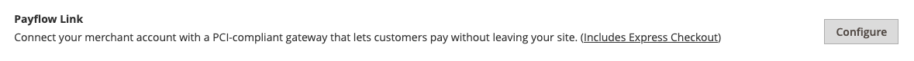
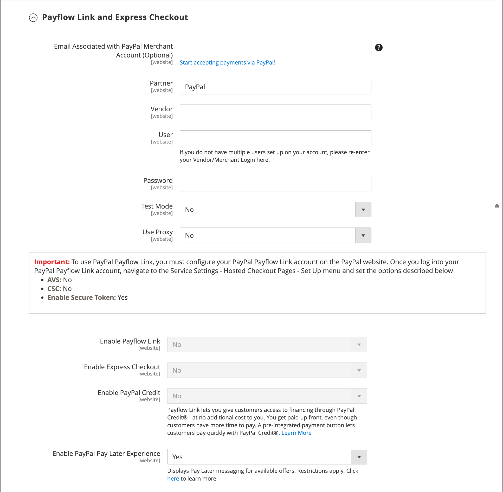

# PayPal Payflow Link

PayPal Payflow Linkは、米国およびカナダのマーチャントのみが利用できます。 お客様は、個人のPayPal アカウントを持ち、PayPalがホストするフォームにクレジットカード情報を入力する必要はありません。 Adobe CommerceやMagento Open Sourceのサーバーには保存されません。 Payflow Linkは、管理者から作成された注文には使用できません。

クレジットメモは、オンラインとオフラインの両方の返金に対応しています。 ただし、複数のオンライン払い戻しはサポートされていません。

>[!IMPORTANT]
>
>**PSD2の要件：**  
>2019年9月14日の時点で、ヨーロッパの銀行は[PSD2](../getting-started/compliance-payment-services-directive.md)の要件を満たさない支払いを拒否する可能性があります。PSD2に準拠するには、PayPal Payflow LinkをCardinal Commerceと統合する必要があります。詳しくは、「[3-D Secure for Payflow](https://developer.paypal.com/api/nvp-soap/payflow/3d-secure-overview/)」を参照してください。

## 要件定義

- [PayPal法人向けアカウント &#x200B;](https://www.paypal.com/webapps/mpp/how-to-sell-online) PayPal Payflow Pro ゲートウェイは、PayPalの加盟店アカウントを加盟店web サイトにリンクし、ゲートウェイと加盟店アカウントの両方として機能します。

- 複数のCommerce web サイトを管理する場合は、各web サイトに個別のPayPal マーチャント アカウントが必要です。

## 顧客ワークフロー

1. **お客様はチェックアウトに行きます** - チェックアウト中、お客様はPayPal Payflow リンクで支払うことを選択し、クレジットカード情報を入力します。 お客様は、個人のPayPal アカウントを持つ必要はありません。
1. **お客様が「今すぐ支払う」を選択** – お客様は「今すぐ支払う」ボタンをタップして注文を送信します。
1. **お客様がクレジットカード情報を入力** – お客様は、PayPalがホストするフォームにクレジットカード情報を入力します。 お客様が&#x200B;_支払いをキャンセル_ リンクをクリックすると、お客様はチェックアウトの支払い情報ステージに戻り、注文状況は&#x200B;_キャンセル済み_&#x200B;に変わります。
1. **お客様が注文を送信します** - クレジットカード情報はPayPalに直接送信され、Commerce サイトのどこにも保持されません。

## 注文ワークフロー

1. **PayPalはリクエストを受け取ります** - PayPalは、お客様から「今すぐ支払う」リクエストを受け取ります。
1. **PayPalは支払い情報を確認します** - PayPalはクレジットカード情報を確認し、適切なステータスを割り当てます。
   - **支払い検証済み：**&#x200B;確認された場合、_支払い保留中_&#x200B;のステータスは、トランザクションが決済されるまで最初に注文に割り当てられます。
   - **処理中** - トランザクションが成功しました。
   - **支払い保留中** - システムはPayPalから応答を受け取りませんでした。
   - **キャンセル済み** – 何らかの理由でトランザクションが成功しませんでした。
   - **不正行為の疑い** – トランザクションが[PayPal不正行為フィルター](paypal.md#paypal-fraud-management-filters)の一部を渡しませんでした。 このシステムは、取引がFraud ServiceによってレビューされているというPayPalからの応答を受け取ります。
   - **お支払いのキャンセル：**&#x200B;お客様が&#x200B;_お支払いのキャンセル_ リンクをクリックすると、お客様はチェックアウトの支払い情報ステージに戻り、注文状況は&#x200B;_キャンセル済み_&#x200B;に変わります。
1. **お客様は確認ページにリダイレクトされます** – 取引が正常に完了した場合、お客様はストアの注文確認ページにリダイレクトされます。 何らかの理由でトランザクションが失敗した場合は、チェックアウトページにエラーメッセージが表示され、チェックアウトプロセスを繰り返すようにお客様に指示されます。 これらの状況はPayPalによって管理されています。
1. **加盟店は注文を処理します** – 加盟店の請求書を作成し、通常どおり注文を発送します。

## PayPal アカウントの設定

1. [PayPal法人向けアカウント &#x200B;](https://manager.paypal.com/)にログインします。

1. PayPal Managerを使用して、次の設定で[&#x200B; ホスト型チェックアウトページ &#x200B;](https://developer.paypal.com/docs/payflow/integration-guide/configure-hosted-checkout/#configuring-hosted-pages-using-paypal-manager)を設定します。

   - **[!UICONTROL Security Options]**&#x200B;で、次の設定を完了します。

     **[!UICONTROL AVS]**: `No`

     **[!UICONTROL CSC]**: `No`

     **[!UICONTROL Enable Secure Token]**: `Yes`

   - **[!UICONTROL Customize]**&#x200B;を選択し、**[!UICONTROL Layout C]**&#x200B;を選択します。

     レイアウト Cにはクレジットカードとデビットカードのフィールドのみが表示され、サイトにフレーム化するか、スタンドアロンのポップアップとして使用できます。 サイズは490 x 565 ピクセルに固定され、エラーメッセージ用の余分なスペースが追加されています。 一部のシステムでは、この設定によって透過的なリダイレクトに関する問題が修正されます。

1. 設定が完了したら、**[!UICONTROL Save and Publish]**&#x200B;をクリックします。

1. 追加ユーザーを設定します（PayPalで推奨）。

   - メインメニューの2行目で、**[!UICONTROL Manage Users]**&#x200B;をクリックします。

   - アカウントに別のユーザーを追加するには、**[!UICONTROL Add User]**&#x200B;をクリックします。

   - _ユーザーを追加_ フォームの次のセクションで、必須フィールドに入力します。

      - [!UICONTROL Admin Confirmation]
      - [!UICONTROL User Information]
      - [!UICONTROL User Login Information]
      - [!UICONTROL Assign Privilege to User]

   - **[!UICONTROL Update]**&#x200B;をクリックします。

## PayPal Payflow Linkの設定

>[!TIP]
>
>いつでも&#x200B;**[!UICONTROL Save Config]**&#x200B;をクリックして、進行状況を保存します。

### 手順1：設定を開始する

この設定方法は、既存のPayPal アカウントを持っていることを前提としています。

1. _管理者_ サイドバーで、**[!UICONTROL Stores]** > _[!UICONTROL Settings]_>**[!UICONTROL Configuration]**&#x200B;に移動します。

1. 左側のパネルで、**[!UICONTROL Sales]**&#x200B;を展開し、**[!UICONTROL Payment Methods]**&#x200B;を選択します。

1. Commerce インストールに複数のweb サイト、ストア、またはビューがある場合は、この設定を適用するストアビューに&#x200B;**[!UICONTROL Store View]**&#x200B;を設定します。

1. 「_[!UICONTROL Merchant Location]_」セクションで、ビジネスが存在する&#x200B;**[!UICONTROL Merchant Country]**&#x200B;を選択します。

   この設定は、設定に表示されるPayPal ソリューションの選択を決定します。

   {width="600" zoomable="yes"}

1. **[!UICONTROL PayPal Payment Gateways]** （必要な場合）を展開し、**[!UICONTROL Payflow Link]**&#x200B;の&#x200B;**[!UICONTROL Configure]**&#x200B;をクリックします。

   {width="600" zoomable="yes"}

### ステップ 2：必要なPayPal設定を完了する

{width="600" zoomable="yes"}が必要

1. （オプション）を入力します。**[!UICONTROL Email Associated with your PayPal Merchant Account]**

   >[!IMPORTANT]
   >
   >メールアドレスでは、大文字と小文字が区別されます。 支払いを受け取るには、メールアドレスがPayPal加盟店アカウントで指定されたメールアドレスと一致している必要があります。

1. PayPal加盟店アカウントへのログインに使用する次のいずれかの資格情報を入力します。

   - **[!UICONTROL Partner]** - PayPal パートナーID。
   - **[!UICONTROL User]** - PayPal アカウントで設定されている別のユーザーのID。
   - **[!UICONTROL Vendor]** - PayPal ユーザーログイン名。

1. PayPal アカウントに関連付けられている&#x200B;**[!UICONTROL Password]**&#x200B;を入力します。

1. テスト トランザクションを実行するには、**[!UICONTROL Test Mode]**&#x200B;を`Yes`に設定します。

   サンドボックスで設定をテストする場合は、PayPalが推奨する[&#x200B; クレジットカード番号](https://www.paypalobjects.com/en_AU/vhelp/paypalmanager_help/credit_card_numbers.htm)のみを使用します。 実稼動環境に移行する準備ができたら、設定に戻り、テストモードを`No`に設定します。

1. システムでプロキシサーバーを使用してPayPal システムへの接続を確立する場合は、**[!UICONTROL Test Mode]**&#x200B;を`Yes`に設定し、次の操作を行います。

   - **[!UICONTROL Proxy Host]**&#x200B;のIP アドレスを入力してください。

   - **[!UICONTROL Proxy Port]**&#x200B;のポート番号を入力してください。

     プロキシは、サーバーファイアウォールがPayPal サーバーへの直接アクセスを禁止している場合に使用されます。 この場合、トラフィックを中継するためにサードパーティサーバーが使用されます。

1. **[!UICONTROL Enable Payflow Link]**&#x200B;を`Yes`に設定します。

1. 顧客に対して[PayPal Express チェックアウト &#x200B;](paypal-express-checkout.md) オプションを有効にする場合は、**[!UICONTROL Enable Express Checkout]**&#x200B;を`Yes`に設定します。

1. [PayPal クレジット &#x200B;](paypal.md#paypal-credit-and-pay-later)を顧客に提供する場合は、**[!UICONTROL Enable PayPal Credit]**&#x200B;を`Yes`に設定します。

### ステップ 3:Advertising PayPal Credit / Advertising PayPal PayLaterの設定（オプション）

2.4.3 リリース以降、PayPal PayLaterは、PayPalを含むデプロイメントでサポートされています。 この機能により、買い物客は購入時に全額を支払うのではなく、隔週の分割で注文の支払いを行うことができます。 PayPal Credit エクスペリエンスは非推奨（廃止予定）です。

**[!UICONTROL Enable PayPal PayLater Experience]**&#x200B;を次のいずれかに設定します：

- `Yes` - Advertising PayPal PayLaterを設定するには
- `No` - Advertising PayPal クレジットを設定するには

#### Advertising PayPal Credit

1. **[!UICONTROL Advertise PayPal Credit]** セクションのを展開します。

   {width="600" zoomable="yes"}

1. アカウント情報を取得するには、**[!UICONTROL Get Publisher ID from PayPal]**&#x200B;をクリックし、指示に従います。

1. **[!UICONTROL Publisher ID]**&#x200B;を入力します。

1. **[!UICONTROL Home Page]** セクションのを展開します。

   {width="600" zoomable="yes"}

1. ページにバナーを配置するには、**[!UICONTROL Display]**&#x200B;を`Yes`に設定します。

1. **[!UICONTROL Position]**&#x200B;を次のいずれかに設定します：

   - `Header (center)`
   - `Sidebar (right)`

1. **[!UICONTROL Size]**&#x200B;を次のいずれかに設定します：

   - `190 x 100`
   - `234 x 60`
   - `300 x 50`
   - `468 x 60`
   - `728 x 90`
   - `800 x 66`

1. 残りのセクションを展開し、ホームページ設定の前の手順を繰り返します。

   - **[!UICONTROL Catalog Category Page]**
   - **[!UICONTROL Catalog Product Page]**
   - **[!UICONTROL Checkout Cart Page]**

#### PayPal PayLaterの広告

1. **[!UICONTROL Advertise PayPal PayLater]** セクションのを展開します。

1. **[!UICONTROL Enable PayPal PayLater]**&#x200B;を`Yes`に設定します。

1. **[!UICONTROL Home Page]** セクションのを展開します。

   {width="600" zoomable="yes"}

1. ページにバナーを配置するには、**[!UICONTROL Display]**&#x200B;を`Yes`に設定します。

1. **[!UICONTROL Position]**&#x200B;を次のいずれかに設定します：

   - `Header (center)`
   - `Sidebar`

1. **[!UICONTROL Style Layout]**&#x200B;を次のいずれかに設定します：

   - `Text`
   - `Flex`

1. [!UICONTROL Style Layout] **[!UICONTROL Text]**&#x200B;のみの場合は、**[!UICONTROL Logo Type]**&#x200B;を次のいずれかに設定します。

   - `Primary`
   - `Alternative`
   - `Inline`
   - `None`

1. [!UICONTROL Style Layout] **[!UICONTROL Text]**&#x200B;のみの場合は、**[!UICONTROL Logo Position]**&#x200B;を次のいずれかに設定します。

   - `Left`
   - `Right`
   - `Top`

1. [!UICONTROL Style Layout] **[!UICONTROL Text]**&#x200B;のみの場合は、**[!UICONTROL Text Color]**&#x200B;を次のいずれかに設定します。

   - `Black`
   - `White`
   - `Monochrome`
   - `Grayscale`

1. [!UICONTROL Style Layout] **[!UICONTROL Text]**&#x200B;のみの場合は、**[!UICONTROL Text Size]**&#x200B;を次のいずれかに設定します。

   - `10px`
   - `11px`
   - `12px`
   - `13px`
   - `14px`
   - `15px`
   - `16px`

1. [!UICONTROL Style Layout] **[!UICONTROL Flex]**&#x200B;のみの場合は、**[!UICONTROL Ratio]**&#x200B;を次のいずれかに設定します。

   - `1x1`
   - `1x4`
   - `8x1`
   - `20x1`

1. [!UICONTROL Style Layout] **[!UICONTROL Flex]**&#x200B;のみの場合は、**[!UICONTROL Color]**&#x200B;を次のいずれかに設定します。

   - `Blue`
   - `Black`
   - `White`
   - `White No Border`
   - `Gray`
   - `Monochrome`
   - `Grayscale`

1. 残りのセクションを展開し、前の手順を繰り返します。

   - **[!UICONTROL Catalog Product Page]**
   - **[!UICONTROL Checkout Cart Page]**
   - **[!UICONTROL Checkout Payment Step]**
   - **[!UICONTROL Catalog Category Page]**

### 手順4：基本設定を完了する

1. **[!UICONTROL Basic Settings - PayPal Payflow Link]** セクションのを展開します。

   {width="600" zoomable="yes"}

1. 「**[!UICONTROL Title]**」に、チェックアウト時にPayPal Payflow Linkを識別するタイトルを入力します。

   「_デビットカードまたはクレジットカード_」というタイトルを使用することをお勧めします。

1. 複数の支払い方法を提供している場合は、**[!UICONTROL Sort Order]**&#x200B;の数値を入力して、他の支払い方法と共に表示されたときにPayflow Linkが表示される順序を決定します。

   この数字は他の支払い方法に関連しています。 （`0` = first, `1` = second, `2` = thirdなど）

1. **[!UICONTROL Payment Action]**&#x200B;を次のいずれかに設定します：

   - `Authorization` – 購入を承認し、資金を保留します。 金額は、加盟店が獲得するまで引き落とされません。
   - `Sale` – 購入金額が承認され、お客様のアカウントから直ちに引き落とされます。

### 手順5：詳細設定を完了する

1. **[!UICONTROL Advanced Settings]** セクションのを展開します。

   {width="600" zoomable="yes"}

1. **[!UICONTROL Payment Applicable From]**&#x200B;を次のいずれかに設定します：

   - `All Allowed Countries` - ストア設定で指定されたすべての[国](../getting-started/store-details.md#country-options)のお客様は、この支払い方法を使用できます。
   - `Specific Countries` – このオプションを選択すると、_[!UICONTROL Payment from Specific Countries]_&#x200B;リストが表示されます。 Ctrl キーを押しながら、リスト内の各国を選択し、お客様がストアから購入できるようにする場所を選択します。

1. 支払いシステムとの通信をログファイルに書き込むには、**[!UICONTROL Debug Mode]**&#x200B;を`Yes`に設定します。

   >[!NOTE]
   >
   >PCI データセキュリティ基準に従い、クレジットカード情報はログファイルに記録されません。

1. ホストの真正性検証を有効にするには、**[!UICONTROL Enable SSL Verification]**&#x200B;を`Yes`に設定します。

1. お客様がクレジットカードの裏面から3桁のCVV セキュリティコードの入力を修正できるようにするには、**[!UICONTROL CVV Entry is Editable]**&#x200B;を`Yes`に設定します。

1. 顧客にCVV コードの入力を求めるには、**[!UICONTROL Require CVV Entry]**&#x200B;を`Yes`に設定します。

1. お客様に支払いの確認を送信するには、**[!UICONTROL Send Email Confirmation]**&#x200B;を`Yes`に設定します。

1. トランザクション中にPayPal サーバーと情報を交換するために使用される方法を決定するには、**[!UICONTROL URL method for Cancel URL and Return URL]**&#x200B;を次のいずれかに設定します。

   - `GET` - プロセスの結果である情報を取得します（既定のメソッド）。
   - `POST` - フォームに入力されたデータなどのデータ ブロックをデータ処理プロセスに提供します。

   _キャンセル URL_&#x200B;と&#x200B;_リターン URL_&#x200B;は、PayPal サーバーのチェックアウトプロセスの支払い部分を完了またはキャンセルした後にお客様が戻るページを指します

1. ストアの必要に応じて、次のセクションを完了します。

   - [決済レポート設定](#settlement-report-settings)
   - [フロントエンドエクスペリエンス設定](#frontend-experience-settings)

#### 決済レポート設定

1. **[!UICONTROL Settlement Report Settings]** セクションのを展開します。

   {width="600" zoomable="yes"}

1. **[!UICONTROL SFTP Credentials]**&#x200B;に対して、次の操作を行います。

   - PayPal Secure FTP Serverにサインアップしている場合は、次のSFTP ログイン資格情報を入力します。

      - ログイン
      - パスワード

   - サイトでExpress Checkoutを使用して本番稼働前にテストレポートを実行するには、**[!UICONTROL Sandbox Mode]**&#x200B;を`Yes`に設定します。

   - **[!UICONTROL Custom Endpoint Hostname or IP Address]**&#x200B;を入力します。

     デフォルトでは、値は`reports.paypal.com`です。

   - レポートを保存する&#x200B;**[!UICONTROL Custom Path]**&#x200B;を入力します。

     デフォルトでは、値は`/ppreports/outgoing`です。

1. スケジュールに従ってレポートを生成するには、**[!UICONTROL Scheduled Fetching]**&#x200B;設定を完了します。

   - **[!UICONTROL Enable Automatic Fetching]**&#x200B;を`Yes`に設定します。

   - **[!UICONTROL Schedule]**&#x200B;を次のいずれかに設定します：

      - `Daily`
      - `Every 3 Days`
      - `Every 7 Days`
      - `Every 10 Days`
      - `Every 14 Days`
      - `Every 30 Days`
      - `Every 40 Days`

     PayPalは、各レポートを45日間保持します。

   - レポートを生成する場合は、**[!UICONTROL Time of Day]**&#x200B;を時間、分、秒に設定します。

#### フロントエンドエクスペリエンス設定

_[!UICONTROL Frontend Experience Settings]_&#x200B;を使用して、サイトに表示するPayPal ロゴを選択し、PayPal マーチャント ページの外観をカスタマイズします。

1. **[!UICONTROL Frontend Experience Settings]** セクションのを展開します。

   {width="600" zoomable="yes"}

1. ストアのPayPal ブロックに表示する&#x200B;**[!UICONTROL PayPal Product Logo]**&#x200B;を選択します。

   PayPalのロゴには4つのスタイルと2つのサイズがあります。

   - `No Logo`
   - `We Prefer PayPal (150 x 60 or 150 x 40)`
   - `Now Accepting PayPal (150 x 60 or 150 x 40)`
   - `Payments by PayPal (150 x 60 or 150 x 40)`
   - `Shop Now Using PayPal (150 x 60 or 150 x 40)`

1. PayPal マーチャントページの外観をカスタマイズするには：

   - PayPal マーチャント ページに適用する&#x200B;**[!UICONTROL Page Style]**&#x200B;の名前を入力します。

      - `paypal` - PayPal ページスタイルを使用します。
      - `primary` - アカウントプロファイルで&#x200B;_primary_ スタイルとして識別したページスタイルを使用します。
      - `your_custom_value` - アカウント プロファイルで指定されたカスタム支払いページ スタイルを使用します。

   - **[!UICONTROL Header Image URL]**&#x200B;に、支払いページの左上隅に表示する画像のURLを入力します。 最大ファイルサイズは、幅750 ピクセル、高さ90 ピクセルです。

     >[!NOTE]
     >
     >PayPalでは、画像が安全な（https）サーバー上にあることをお勧めします。 それ以外の場合、ブラウザーは、_ページにセキュアな項目とセキュアでない項目の両方が含まれていることを警告する場合があります_。

   - ページの色を設定するには、次のそれぞれに`#`記号なしで6文字の16進数コードを入力します。

      - **[!UICONTROL Header Background Color]** - チェックアウト ページ ヘッダーの背景色。
      - **[!UICONTROL Header Border Color]** - ヘッダーの周囲の2 ピクセル境界の色。
      - **[!UICONTROL Page Background Color]** - チェックアウトページと、ヘッダーと支払いフォームの周囲の背景色。

### ステップ 6:PayPal Express Checkoutの基本設定を完了する

1. **[!UICONTROL Basic Settings - PayPal Express Checkout]** セクションのを展開します。

   {width="600" zoomable="yes"}

1. **[!UICONTROL Title]**&#x200B;に、チェックアウト時にこの支払い方法を識別するタイトルを入力します。

   各ストアビューのタイトルを&#x200B;_PayPal_&#x200B;に設定することをお勧めします。

1. 複数の支払い方法を提供している場合は、**[!UICONTROL Sort Order]**&#x200B;の数値を入力して、他の支払い方法と一緒に表示されるPayPal Express Checkoutの順序を決定します。

   この数字は他の支払い方法に関連しています。 （`0` = first, `1` = second, `2` = thirdなど）

1. **[!UICONTROL Payment Action]**&#x200B;を次のいずれかに設定します：

   - `Authorization` – 購入を承認し、資金を保留します。 金額は、加盟店が&#x200B;_獲得_&#x200B;するまで引き落とされません。
   - `Sale` – 購入金額が承認され、お客様のアカウントから直ちに引き落とされます。

1. 製品ページに&#x200B;_[!UICONTROL Check out with PayPal]_&#x200B;ボタンを表示するには、**[!UICONTROL Display on Product Details Page]**&#x200B;を`Yes`に設定します。

### 手順7:PayPal Express Checkoutの詳細設定を完了する

1. **[!UICONTROL Advanced Settings]** セクションのを展開します。

   {width="600" zoomable="yes"}

1. **[!UICONTROL Display on Shopping Cart]**&#x200B;を`Yes`に設定します。

1. **[!UICONTROL Payment Applicable From]**&#x200B;を次のいずれかに設定します：

   - `All Allowed Countries` - ストア設定で指定されたすべての国のお客様は、この支払い方法を使用できます。
   - `Specific Countries` – このオプションを選択すると、_[!UICONTROL Payment from Specific Countries]_&#x200B;リストが表示されます。 複数の国を選択するには、Ctrl キー（PC）またはCommand キー（Mac）を押しながら各項目をクリックします。

1. 支払いシステムとの通信をログファイルに書き込むには、**[!UICONTROL Debug Mode]**&#x200B;を`Yes`に設定します。

   >[!NOTE]
   >
   >PCI データセキュリティ基準に従い、クレジットカード情報はログファイルに記録されません。

1. ホストの真正性検証を有効にするには、**[!UICONTROL Enable SSL Verification]**&#x200B;を`Yes`に設定します。

1. PayPal サイトからの顧客注文の完全な概要を行項目ごとに表示するには、**[!UICONTROL Transfer Cart Line Items]**&#x200B;を`Yes`に設定します。

1. 注文レビューのために店舗に戻ることなく、PayPal サイトからトランザクションを完了できるようにするには、**[!UICONTROL Skip Order Review Step]**&#x200B;を`Yes`に設定します。

1. 完了したら、**[!UICONTROL Save Config]**&#x200B;をクリックします。
