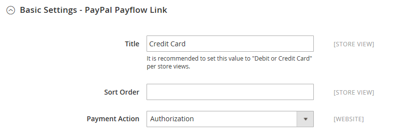
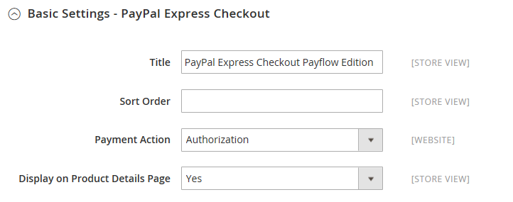

# PayPal ペイフローリンク

PayPal Payflow Link は、米国およびカナダのマーチャントのみが利用できます。 お客様は PayPal アカウントを持ち、PayPal が管理するフォームにクレジットカード情報を入力する必要はありません。 この情報は、Adobe CommerceやMagento Open Sourceサーバーに保存されません。 Payflow Link は、管理者から作成された注文には使用できません。

オンラインとオフラインの両方の払い戻しでクレジットメモがサポートされています。 ただし、複数のオンライン払い戻しはサポートされていません。

>[!IMPORTANT]
>
>**PSD2 の要件：**  
>2019 年 9 月 14 日の時点で、ヨーロッパの銀行は満たされていない支払いを拒否する可能性があります [PSD2](../getting-started/compliance-payment-services-directive.md) 要件 PSD2 に準拠するには、PayPal Payflow Link を Cardinal Commerceと統合する必要があります。 詳しくは、 [ペイフロー用の 3-D セキュア](https://developer.paypal.com/api/nvp-soap/payflow/3d-secure-overview/).

## 要件

- [PayPal ビジネスアカウント][1] PayPal Payflow Pro ゲートウェイは、PayPal のマーチャントアカウントをマーチャントウェブサイトとリンクし、ゲートウェイとマーチャントアカウントの両方として機能します。

- 複数のCommerce web サイトを管理する場合は、web サイトごとに個別の PayPal マーチャントアカウントが必要です。

## 顧客のワークフロー

1. **顧客がチェックアウトに移動** - チェックアウト時に、顧客は PayPal Payflow リンクを使用して支払うことを選択し、クレジットカード情報を入力します。 お客様は個人の PayPal アカウントを持っている必要はありません。
1. **顧客が今すぐ支払いを選択します**  – お客様が「今すぐ支払う」ボタンをタップして注文を送信します。
1. **顧客がクレジットカード情報を入力**  – 顧客は、PayPal がホストするフォームにクレジットカード情報を入力します。 顧客が「」をクリックした場合 _支払のキャンセル_ リンクをクリックすると、顧客はチェックアウトの支払情報ステージに戻り、注文のステータスがに変わります。 _キャンセル済み_.
1. **顧客が注文を送信します** - クレジットカード情報は PayPal に直接送信され、Commerce サイト上のどこにも保持されません。

## 注文ワークフロー

1. **PayPal がリクエストを受信** - PayPal は、お客様から Pay Now へのリクエストを受け取ります。
1. **PayPal は支払い情報を検証します** - PayPal はクレジットカード情報を検証し、適切なステータスを割り当てます。
   - **支払い確認：** 確認した場合、 _保留中の支払い_ ステータスは、トランザクションが決済されるまで、最初に注文に割り当てられます。
   - **処理** - トランザクションが成功しました。
   - **保留中の支払い** - システムは PayPal から応答を受信しませんでした。
   - **キャンセル済み**  – 何らかの理由でトランザクションが成功しませんでした。
   - **詐欺の疑い** - トランザクションは、一部のを渡しませんでした [PayPal 不正フィルター](paypal.md#paypal-fraud-management-filters). システムは、PayPal から取引が不正サービスによって審査中であるという応答を受け取ります。
   - **支払いのキャンセル：** 顧客が「」をクリックした場合 _支払のキャンセル_ リンクをクリックすると、顧客はチェックアウトの支払情報ステージに戻り、注文のステータスがに変わります。 _キャンセル済み_.
1. **顧客は確認ページにリダイレクトされる**   – 取引が正常に完了すると、顧客はストアの注文確認ページにリダイレクトされます。 何らかの理由でトランザクションが失敗した場合は、チェックアウトページにエラーメッセージが表示され、顧客にチェックアウトプロセスを繰り返すように指示されます。 これらの状況は PayPal によって管理されます。
1. **商人は注文を履行する**  – 販売者は通常どおり注文を請求し、出荷します。

## PayPal アカウントの設定

1. にログイン [PayPal ビジネスアカウント][2].

1. の設定 [ホストされたチェックアウトページ][4] 次の設定で PayPal Manager を使用します。

   - 次の下 **[!UICONTROL Security Options]**&#x200B;の場合、次の設定を完了します。

     **[!UICONTROL AVS]**: `No`

     **[!UICONTROL CSC]**: `No`

     **[!UICONTROL Enable Secure Token]**: `Yes`

   - を選択 **[!UICONTROL Customize]**&#x200B;を選択してから、 **[!UICONTROL Layout C]**.

     レイアウト C では、クレジットカードとデビットカードのフィールドのみが表示され、サイトにフレームを組み込んだり、スタンドアロンポップアップとして使用したりできます。 サイズは 490 x 565 ピクセルで固定され、エラーメッセージ用のスペースも追加されます。 一部のシステムでは、この設定によりトランスペアレント リダイレクトの問題が修正されます。

1. 設定が完了したら、 **[!UICONTROL Save and Publish]**.

1. 追加のユーザーを設定する（PayPal が推奨）:

   - メイン メニューの 2 行目で、をクリックします。 **[!UICONTROL Manage Users]**.

   - 別のユーザーをアカウントに追加するには、 **[!UICONTROL Add User]**.

   - の次のセクションの必須フィールドに入力します _ユーザーを追加_ フォーム：

      - [!UICONTROL Admin Confirmation]
      - [!UICONTROL User Information]
      - [!UICONTROL User Login Information]
      - [!UICONTROL Assign Privilege to User]

   - クリック **[!UICONTROL Update]**.

## PayPal Payflow リンクの設定

>[!TIP]
>
>クリック **[!UICONTROL Save Config]** 進行状況を保存する時間を指定できます。

### 手順 1：設定の開始

この設定方法は、既存の PayPal アカウントがあることを前提としています。

1. 日 _Admin_ サイドバー、に移動 **[!UICONTROL Stores]** > _[!UICONTROL Settings]_>**[!UICONTROL Configuration]**.

1. 左側のパネルで、を展開します **[!UICONTROL Sales]** を選択します **[!UICONTROL Payment Methods]**.

1. Commerceのインストールに複数の web サイト、ストアまたはビューがある場合は、を設定します **[!UICONTROL Store View]** この設定を適用するストア表示に移動します。

1. が含まれる _[!UICONTROL Merchant Location]_セクションで、**[!UICONTROL Merchant Country]**ビジネスの所在地。

   この設定により、設定に表示される PayPal ソリューションの選択が決まります。

   {width="600" zoomable="yes"}

1. を展開 **[!UICONTROL PayPal Payment Gateways]** （必要な場合）を選択し、 **[!UICONTROL Configure]** （用） **[!UICONTROL Payflow Link]**.

   {width="600" zoomable="yes"}

### 手順 2：必要な PayPal 設定を完了する

{width="600" zoomable="yes"}

1. （任意） **[!UICONTROL Email Associated with your PayPal Merchant Account]**.

   >[!IMPORTANT]
   >
   >メールアドレスでは大文字と小文字が区別されます。 支払いを受け取るには、メールアドレスが PayPal マーチャントアカウントで指定されたメールアドレスと一致する必要があります。

1. PayPal マーチャントアカウントへのログインに使用する次の資格情報のいずれかを入力します。

   - **[!UICONTROL Partner]** - PayPal パートナー ID。
   - **[!UICONTROL User]** - PayPal アカウントで設定されている別のユーザーの ID。
   - **[!UICONTROL Vendor]** - PayPal ユーザーログイン名。

1. を入力 **[!UICONTROL Password]** これは PayPal アカウントに関連付けられています。

1. テストトランザクションを実行するには、次を設定します **[!UICONTROL Test Mode]** 対象： `Yes`.

   サンドボックスで設定をテストする場合は、のみを使用します [クレジットカード番号][3] それは PayPal で推奨されています。 実稼動に移行する準備ができたら、設定に戻ってテストモードをに設定します。 `No`.

1. システムがプロキシサーバーを使用して PayPal システムへの接続を確立する場合は、を設定します **[!UICONTROL Test Mode]** 対象： `Yes` 次の手順を実行します。

   - の IP アドレスを入力 **[!UICONTROL Proxy Host]**.

   - のポート番号を入力します **[!UICONTROL Proxy Port]**.

     プロキシは、サーバーファイアウォールが PayPal サーバーへの直接アクセスを防ぐ場合に使用されます。 この場合、サードパーティのサーバーを使用してトラフィックがリレーされます。

1. を設定 **[!UICONTROL Enable Payflow Link]** 対象： `Yes`.

1. を有効にする場合 [PayPal Express チェックアウト](paypal-express-checkout.md) 顧客のオプション，設定 **[!UICONTROL Enable Express Checkout]** 対象： `Yes`.

1. を提供したい場合 [PayPal クレジット](paypal.md#paypal-credit-and-pay-later) 顧客に、次を設定 **[!UICONTROL Enable PayPal Credit]** 対象： `Yes`.

### 手順 3：広告 PayPal クレジット/広告 PayPal PayLater の設定（オプション）

2.4.3 リリース以降、PayPal PayLater は PayPal を含むデプロイメントでサポートされます。 この機能により、買い物客は購入時に全額を支払うのではなく、隔週の分割払いで注文の支払いを行うことができます。 PayPal クレジットエクスペリエンスは非推奨（廃止予定）となりました。

を設定 **[!UICONTROL Enable PayPal PayLater Experience]** を次のいずれかに変更します。

- `Yes`  – 広告 PayPal PayLater を設定するには
- `No`  – 広告 PayPal クレジットを設定する

#### PayPal クレジットのアドバタイズ

1. を展開  この **[!UICONTROL Advertise PayPal Credit]** セクション。

   {width="600" zoomable="yes"}

1. アカウント情報を取得するには、 **[!UICONTROL Get Publisher ID from PayPal]** 指示に従ってください。

1. を入力 **[!UICONTROL Publisher ID]**.

1. を展開  この **[!UICONTROL Home Page]** セクション。

   {width="600" zoomable="yes"}

1. ページにバナーを配置するには、を設定します **[!UICONTROL Display]** 対象： `Yes`.

1. を設定 **[!UICONTROL Position]** を次のいずれかに変更します。

   - `Header (center)`
   - `Sidebar (right)`

1. を設定 **[!UICONTROL Size]** を次のいずれかに変更します。

   - `190 x 100`
   - `234 x 60`
   - `300 x 50`
   - `468 x 60`
   - `728 x 90`
   - `800 x 66`

1. を展開  ホームページ設定について、残りのセクションと前の手順を繰り返します。

   - **[!UICONTROL Catalog Category Page]**
   - **[!UICONTROL Catalog Product Page]**
   - **[!UICONTROL Checkout Cart Page]**

#### PayPal PayLater のアドバタイズ

1. を展開  この **[!UICONTROL Advertise PayPal PayLater]** セクション。

1. を設定 **[!UICONTROL Enable PayPal PayLater]** 対象： `Yes`.

1. を展開  この **[!UICONTROL Home Page]** セクション。

   {width="600" zoomable="yes"}

1. ページにバナーを配置するには、を設定します **[!UICONTROL Display]** 対象： `Yes`.

1. を設定 **[!UICONTROL Position]** を次のいずれかに変更します。

   - `Header (center)`
   - `Sidebar`

1. を設定 **[!UICONTROL Style Layout]** を次のいずれかに変更します。

   - `Text`
   - `Flex`

1. の場合 [!UICONTROL Style Layout] **[!UICONTROL Text]** のみ、設定 **[!UICONTROL Logo Type]** を次のいずれかに変更します。

   - `Primary`
   - `Alternative`
   - `Inline`
   - `None`

1. の場合 [!UICONTROL Style Layout] **[!UICONTROL Text]** のみ、設定 **[!UICONTROL Logo Position]** を次のいずれかに変更します。

   - `Left`
   - `Right`
   - `Top`

1. の場合 [!UICONTROL Style Layout] **[!UICONTROL Text]** のみ、設定 **[!UICONTROL Text Color]** を次のいずれかに変更します。

   - `Black`
   - `White`
   - `Monochrome`
   - `Grayscale`

1. の場合 [!UICONTROL Style Layout] **[!UICONTROL Text]** のみ、設定 **[!UICONTROL Text Size]** を次のいずれかに変更します。

   - `10px`
   - `11px`
   - `12px`
   - `13px`
   - `14px`
   - `15px`
   - `16px`

1. の場合 [!UICONTROL Style Layout] **[!UICONTROL Flex]** のみ、設定 **[!UICONTROL Ratio]** を次のいずれかに変更します。

   - `1x1`
   - `1x4`
   - `8x1`
   - `20x1`

1. の場合 [!UICONTROL Style Layout] **[!UICONTROL Flex]** のみ、設定 **[!UICONTROL Color]** を次のいずれかに変更します。

   - `Blue`
   - `Black`
   - `White`
   - `White No Border`
   - `Gray`
   - `Monochrome`
   - `Grayscale`

1. を展開  残りのセクションと前の手順を繰り返します。

   - **[!UICONTROL Catalog Product Page]**
   - **[!UICONTROL Checkout Cart Page]**
   - **[!UICONTROL Checkout Payment Step]**
   - **[!UICONTROL Catalog Category Page]**

### 手順 4：基本設定を完了する

1. を展開  この **[!UICONTROL Basic Settings - PayPal Payflow Link]** セクション。

   {width="600" zoomable="yes"}

1. の場合 **[!UICONTROL Title]**&#x200B;を入力し、チェックアウト時に PayPal ペイフローリンクを識別するタイトルを入力します。

   タイトルを使用することをお勧めします _デビットまたはクレジットカード_.

1. 複数の支払方法を提供する場合は、次の番号を入力します **[!UICONTROL Sort Order]** 他の支払方法とともにリストされた場合に表示される支払フロー・リンクの順序を決定します。

   この番号は、他の支払い方法と相対的です。 （`0` =最初、 `1` =秒、 `2` = 3 番目、など）。

1. を設定 **[!UICONTROL Payment Action]** を次のいずれかに変更します。

   - `Authorization`  – 購入を承認し、資金を保留します。 この金額は、マーチャントによって取り込まれるまで引き出されません。
   - `Sale`  – 購入金額が承認され、すぐにお客様のアカウントから引き出されます。

### 手順 5：詳細設定の完了

1. を展開  この **[!UICONTROL Advanced Settings]** セクション。

   {width="600" zoomable="yes"}

1. を設定 **[!UICONTROL Payment Applicable From]** を次のいずれかに変更します。

   - `All Allowed Countries`  – すべてのお客様 [国](../getting-started/store-details.md#country-options) ストア設定で指定されたお支払方法を使用できます。
   - `Specific Countries`  – このオプションを選択した後、 _[!UICONTROL Payment from Specific Countries]_リストが表示されます。 Ctrl キーを押しながら、顧客がストアから購入できるリストの各国を選択します。

1. 支払システムとの通信をログ・ファイルに書き込むには、次のように設定します **[!UICONTROL Debug Mode]** 対象： `Yes`.

   >[!NOTE]
   >
   >PCI Data Security Standards に従い、クレジットカード情報はログファイルに記録されません。

1. ホストの信頼性の検証を有効にするには、を設定します **[!UICONTROL Enable SSL Verification]** 対象： `Yes`.

1. クレジット カードの背面から 3 桁の CVV セキュリティ コードの入力を修正するには、次のように設定します **[!UICONTROL CVV Entry is Editable]** 対象： `Yes`.

1. 顧客に CVV コードの入力を要求するには、次のように設定します **[!UICONTROL Require CVV Entry]** 対象： `Yes`.

1. 顧客に支払の確認を送信するには、次のように設定します **[!UICONTROL Send Email Confirmation]** 対象： `Yes`.

1. トランザクション中に PayPal サーバーと情報を交換する方法を決定するには、 **[!UICONTROL URL method for Cancel URL and Return URL]** を次のいずれかに変更します。

   - `GET` - プロセスの結果である情報を取得します（デフォルトのメソッド）。
   - `POST` - フォームに入力されたデータなどのデータブロックをデータ処理プロセスに提供します。

   この _URL をキャンセル_ および _URL を返す_ paypal サーバーでチェックアウトプロセスの支払い部分を完了またはキャンセルした後に顧客が戻ってくるページを参照してください

1. ストアの必要に応じて、次の節を完了します。

   - [決済報告書の設定](#settlement-report-settings)
   - [フロントエンドエクスペリエンス設定](#frontend-experience-settings)

#### 決済報告書の設定

1. を展開  この **[!UICONTROL Settlement Report Settings]** セクション。

   {width="600" zoomable="yes"}

1. の場合 **[!UICONTROL SFTP Credentials]**、次の手順を実行します。

   - PayPal セキュア FTP サーバーに新規登録している場合は、次の SFTP ログイン資格情報を入力します。

      - ログイン
      - パスワード

   - サイトで高速チェックアウトを使用して運用を開始する前にテストレポートを実行するには、次を設定します **[!UICONTROL Sandbox Mode]** 対象： `Yes`.

   - を入力 **[!UICONTROL Custom Endpoint Hostname or IP Address]**.

     デフォルト値はです `reports.paypal.com`.

   - を入力 **[!UICONTROL Custom Path]** レポートの保存場所。

     デフォルト値はです `/ppreports/outgoing`.

1. スケジュールに従ってレポートを生成するには、を実行します **[!UICONTROL Scheduled Fetching]** 設定：

   - を設定 **[!UICONTROL Enable Automatic Fetching]** 対象： `Yes`.

   - を設定 **[!UICONTROL Schedule]** を次のいずれかに変更します。

      - `Daily`
      - `Every 3 Days`
      - `Every 7 Days`
      - `Every 10 Days`
      - `Every 14 Days`
      - `Every 30 Days`
      - `Every 40 Days`

     PayPal は各レポートを 45 日間保持します。

   - を設定 **[!UICONTROL Time of Day]** レポートを生成する時、分、秒。

#### フロントエンドエクスペリエンス設定

の使用 _[!UICONTROL Frontend Experience Settings]_サイトに表示する PayPal ロゴを選択したり、PayPal のマーチャントページの外観をカスタマイズしたりできます。

1. を展開  この **[!UICONTROL Frontend Experience Settings]** セクション。

   {width="600" zoomable="yes"}

1. 「」を選択します **[!UICONTROL PayPal Product Logo]** ストアの PayPal ブロックに表示する。

   PayPal ロゴは、4 つのスタイルと 2 つのサイズで使用できます。

   - `No Logo`
   - `We Prefer PayPal (150 x 60 or 150 x 40)`
   - `Now Accepting PayPal (150 x 60 or 150 x 40)`
   - `Payments by PayPal (150 x 60 or 150 x 40)`
   - `Shop Now Using PayPal (150 x 60 or 150 x 40)`

1. PayPal マーチャントページの外観をカスタマイズするには：

   - の名前を入力 **[!UICONTROL Page Style]** paypal マーチャントページに適用する手順は次のとおりです。

      - `paypal` - PayPal ページスタイルを使用します。
      - `primary`  – として識別したページスタイルを使用します _プライマリ_ アカウントプロファイルのスタイル。
      - `your_custom_value` - アカウントプロファイルで指定されているカスタム支払いページスタイルを使用します。

   - の場合 **[!UICONTROL Header Image URL]**、支払いページの左上隅に表示する画像の URL を入力します。 最大ファイルサイズは、幅 750 ピクセル、高さ 90 ピクセルです。

     >[!NOTE]
     >
     >PayPal では、画像をセキュアな（https）サーバーに配置することをお勧めします。 そうでない場合、ブラウザーは次の警告を表示する場合があります _ページには、セキュリティで保護された項目と保護されていない項目の両方が含まれています_.

   - ページのカラーを設定するには、6 文字の 16 進コードを `#` 記号。次の各項目について説明します。

      - **[!UICONTROL Header Background Color]** - チェックアウトページヘッダーの背景色
      - **[!UICONTROL Header Border Color]** - ヘッダーの周囲の 2 ピクセルの境界線の色。
      - **[!UICONTROL Page Background Color]** - チェックアウトページ、およびヘッダーと支払いフォーム周辺の背景色

### 手順 6:PayPal Express チェックアウトの基本設定を完了する

1. を展開  この **[!UICONTROL Basic Settings - PayPal Express Checkout]** セクション。

   {width="600" zoomable="yes"}

1. の場合 **[!UICONTROL Title]**、チェックアウト時にこの支払い方法を識別するタイトルを入力します。

   タイトルの設定 _PayPal_ ストアごとに表示することをお勧めします。

1. 複数の支払方法を提供する場合は、次の番号を入力します **[!UICONTROL Sort Order]** 他の支払い方法と共にリストされた際に、PayPal Express チェックアウトが表示される順序を決定します。

   この番号は、他の支払い方法と相対的です。 （`0` =最初、 `1` =秒、 `2` = 3 番目、など）。

1. を設定 **[!UICONTROL Payment Action]** を次のいずれかに変更します。

   - `Authorization`  – 購入を承認し、資金を保留します。 金額は確定するまで引き出されません _キャプチャ済み_ 商人によって。
   - `Sale`  – 購入金額が承認され、すぐにお客様のアカウントから引き出されます。

1. を表示するには _[!UICONTROL Check out with PayPal]_ボタンを使用して、次を設定します&#x200B;**[!UICONTROL Display on Product Details Page]**対象： `Yes`.

### 手順 7:PayPal Express チェックアウトの詳細設定を完了する

1. を展開  この **[!UICONTROL Advanced Settings]** セクション。

   {width="600" zoomable="yes"}

1. を設定 **[!UICONTROL Display on Shopping Cart]** 対象： `Yes`.

1. を設定 **[!UICONTROL Payment Applicable From]** を次のいずれかに変更します。

   - `All Allowed Countries`  – 店舗の構成で指定されたすべての国の顧客は、この支払い方法を使用できます。
   - `Specific Countries`  – このオプションを選択した後、 _[!UICONTROL Payment from Specific Countries]_リストが表示されます。 複数の国を選択するには、Ctrl キー（PC）または Command キー（Mac）を押しながら、各項目をクリックします。

1. 支払システムとの通信をログ・ファイルに書き込むには、次のように設定します **[!UICONTROL Debug Mode]** 対象： `Yes`.

   >[!NOTE]
   >
   >PCI Data Security Standards に従い、クレジットカード情報はログファイルに記録されません。

1. ホストの信頼性の検証を有効にするには、を設定します **[!UICONTROL Enable SSL Verification]** 対象： `Yes`.

1. PayPal サイトの明細項目別の顧客注文の完全な概要を表示するには、次のように設定します **[!UICONTROL Transfer Cart Line Items]** 対象： `Yes`.

1. お客様が注文レビューのためにストアに戻ることなく、PayPal サイトからトランザクションを完了できるようにするには、次のように設定します **[!UICONTROL Skip Order Review Step]** 対象： `Yes`.

1. 完了したら、 **[!UICONTROL Save Config]**.

[1]: https://www.paypal.com/webapps/mpp/how-to-sell-online
[2]: https://manager.paypal.com/
[3]: https://www.paypalobjects.com/en_AU/vhelp/paypalmanager_help/credit_card_numbers.htm
[4]: https://developer.paypal.com/docs/payflow/integration-guide/configure-hosted-checkout/#configuring-hosted-pages-using-paypal-manager
