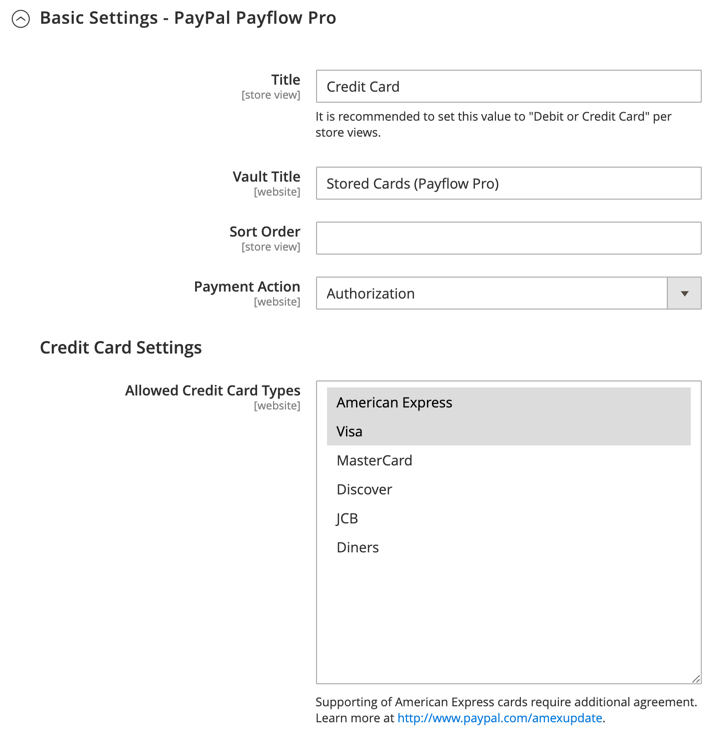

# PayPal Payflow Pro

PayPal Payflow Pro ゲートウェイ ( 旧称： _Verisign_&#x200B;は、米国、カナダ、オーストラリアおよびニュージーランドのお客様が利用できます。 他の PayPal の支払い方法とは異なり、商人は月額料金を固定し、各取引に対して固定料金を加えて、数に関係なく請求されます。

{width="700" zoomable="yes"}

>[!IMPORTANT]
>
>**PSD2 の要件：**  
>2019 年 9 月 14 日現在、ヨーロッパの銀行は、満たさない支払いを辞退する可能性があります [PSD2](../getting-started/compliance-payment-services-directive.md) 要件。 PSD2 に準拠するには、PayPal Payflow Pro をサードパーティのプラグインと統合する必要があります。 詳しくは、 [3-D セキュア（ペイフロー用）](https://developer.paypal.com/api/nvp-soap/payflow/3d-secure-mpi/).

## 要件

- [PayPal ビジネスアカウント][1] - PayPal Payflow Pro ゲートウェイは、PayPal のマーチャントアカウントとマーチャントウェブサイトとをリンクし、ゲートウェイとマーチャントアカウントの両方の役割を果たします。

- 複数のAdobe CommerceおよびMagento Open Sourceの Web サイトを管理する場合は、Web サイトごとに個別の PayPal マーチャントアカウントが必要です。

## 顧客ワークフロー

1. **顧客がチェックアウトに移動**  — チェックアウト時に、お客様は PayPal Payflow Pro で支払いを選択し、クレジットカード情報を入力します。 お客様は、個人の PayPal アカウントを持つ必要はありません。 ただし、商家の国によっては、顧客は自分の PayPal アカウントを使用して注文の支払いを行うこともできます。
1. **顧客が注文を送信**  — 顧客が注文を送信し、注文情報が PayPal に送信されて処理されます。 顧客がサイトのチェックアウトページから移動しない。
1. **PayPal がトランザクションを完了します** ・支払いは、注文時に受け入れられます。 構成で指定した支払い処理に応じて、受注または受注と請求書のどちらかが作成されます。

## オンラインの注文処理ワークフロー

1. **管理者がオンライン請求書を送信します**  — 店舗管理者は、オンライン請求書を送信し、その結果、対応する取引と請求書が作成されます。
1. **PayPal がトランザクションを受信**  — 注文情報は PayPal に送信されます。 トランザクションのレコードと請求書が生成されます。 すべての Payflow Pro Gateway トランザクションは、 [PayPal マーチャントアカウント][2].

>[!NOTE]
>
>PayPal Payflow Pro では、一部の請求書および部分的な返金はサポートされていません。

## PayPal アカウントを設定する

1. にログインします。 [PayPal ビジネスアカウント][2].

1. を設定します。 [ホストされるチェックアウトページ][4] 以下の設定で PayPal Manager を使用します。

   - の下 **[!UICONTROL Choose your settings]**，設定 **[!UICONTROL Transaction Process Mode]** から `Live`.

   - の下 **[!UICONTROL Display options on payment page]**，設定 **Cancel URL メソッド** から `POST`.

   - の下 **[!UICONTROL Billing Information]**、カードのセキュリティコードを選択します。 **[!UICONTROL CSC]** 必須フィールドと編集可能フィールドの両方のチェックボックス。

   - の下 **[!UICONTROL Payment Confirmation]**，設定 **[!UICONTROL Return URL Method]** から `POST`.

   - の下 **[!UICONTROL Security Options]**、次の設定を実行します。

      - **[!UICONTROL AVS]**: `No`
      - **[!UICONTROL CSC]**: `No`
      - **[!UICONTROL Enable Secure Token]**: `Yes`

   - 選択 **[!UICONTROL Customize]**&#x200B;を選択し、次を選択します。 **[!UICONTROL Layout C]**.

     レイアウト C はクレジットカードとデビットカードのフィールドのみを表示し、サイト上に枠付けしたり、スタンドアロンのポップアップとして使用したりできます。 サイズは 490 x 565 ピクセルで固定され、エラーメッセージ用の余分なスペースがあります。 一部のシステムでは、この設定により、透過的なリダイレクトの問題が修正されます。

1. 設定が完了したら、 **[!UICONTROL Save and Publish]**.

1. PayPal マネージャーメニューで、を選択します。 **[!UICONTROL Account Administration]**.

1. の下 **[!UICONTROL Manage Security]**&#x200B;をクリックし、 **[!UICONTROL Transaction Settings]** 次の操作を実行します。

   - 設定 **[!UICONTROL Allow reference transactions]** から `Yes`.

   - クリック **[!UICONTROL Confirm]**.

     >[!NOTE]
     >
     >複数のコマース Web サイトを持っている場合は、それぞれに対して個別の PayPal Payments Advanced アカウントを作成する必要があります。

1. 別のユーザーを設定する（PayPal で推奨）:

   - メインメニューの 2 行目で、 **[!UICONTROL Manage Users]**.

   - 別のユーザーをアカウントに追加するには、 **[!UICONTROL Add User]**. リンクは「ユーザーを管理」タイトルのすぐ上にあります。

   - 次のセクションの必須フィールドに入力します。 _[!UICONTROL Add User]_フォーム：

      - [!UICONTROL Admin Confirmation]
      - [!UICONTROL User Information]
      - [!UICONTROL User Login Information]
      - [!UICONTROL Assign Privilege to User]

   - クリック **[!UICONTROL Update]**.

1. PayPal アカウントからログアウトするようにしてください。

## コマースでの PayPal Payflow Pro の設定

>[!TIP]
>
>クリック **[!UICONTROL Save Config]** いつでも作業内容を保存できます。

### 手順 1：設定の開始

この設定方法は、既存の PayPal アカウントを持っていることを前提としています。

1. 次の日： _管理者_ サイドバー、移動 **[!UICONTROL Stores]** > _[!UICONTROL Settings]_>**[!UICONTROL Configuration]**.

1. 左側のパネルで、を展開します。 **[!UICONTROL Sales]** を選択します。 **[!UICONTROL Payment Methods]**.

1. コマースインストールに複数の Web サイト、ストア、または表示がある場合は、 **[!UICONTROL Store View]** を、この設定を適用するストア表示に追加します。

1. Adobe Analytics の _[!UICONTROL Merchant Location]_セクションで、**[!UICONTROL Merchant Country]**ビジネスの所在地

   この設定は、設定に表示される PayPal ソリューションの選択を決定します。

   {width="600" zoomable="yes"}

1. 展開 **[!UICONTROL PayPal Payment Gateways]** （必要に応じて）をクリックし、 **[!UICONTROL Configure]** 対象： **[!UICONTROL Payflow Pro]**.

   {width="600" zoomable="yes"}

### 手順 2：必要な PayPal 設定を完了する

{width="600" zoomable="yes"}

1. （オプション） **[!UICONTROL Email Associated with your PayPal Merchant Account]**.

   >[!IMPORTANT]
   >
   >E メールアドレスでは、大文字と小文字が区別されます。 支払いを受け取るには、メールアドレスが PayPal マーチャントアカウントで指定されたメールアドレスと一致している必要があります。

1. PayPal マーチャントアカウントへのログインに使用する次のいずれかの資格情報を入力します。

   - **[!UICONTROL Partner]** - PayPal パートナー ID。
   - **[!UICONTROL User]** - PayPal アカウントで設定されている別のユーザーの ID。
   - **[!UICONTROL Vendor]** - PayPal ユーザーのログイン名。

1. 次を入力します。 **[!UICONTROL Password]** PayPal アカウントに関連付けられている。

1. テスト取引を実行するには、 **[!UICONTROL Test Mode]** から `Yes`.

   サンドボックスで設定をテストする場合は、次のみを使用します。 [クレジットカード番号][3] PayPal で推奨される情報です。 実稼動に移行する準備が整ったら、設定に戻り、テストモードをに設定します。 `No`.

1. システムがプロキシサーバを使用して PayPal システムへの接続を確立する場合は、 **[!UICONTROL Use Proxy]** から `Yes` 次の操作を実行します。

   - の IP アドレスを入力 **[!UICONTROL Proxy Host]**.

   - ポート番号を入力 **[!UICONTROL Proxy Port]**.

     プロキシは、サーバーファイアウォールが PayPal サーバーへの直接アクセスを禁止する場合に使用されます。 その場合、トラフィックの中継にサードパーティサーバーが使用されます。

1. 設定 **[!UICONTROL Enable this Solution]** から `Yes`.

1. 次の項目を選択します。 [PayPal クレジット](paypal.md#paypal-credit-and-pay-later) を顧客に設定する **[!UICONTROL Enable PayPal Credit]** から `Yes`.

1. 顧客の支払い/クレジットカードの詳細を安全に保存したい場合、顧客は毎回支払い情報を再入力する必要がない場合は、 **[!UICONTROL Vault Enabled]** から `Yes`.

### ステップ 3：広告 PayPal クレジット/広告 PayPal PayLater（オプション）の設定

2.4.3 リリース以降、PayPal PayLater は PayPal を含むデプロイメントでサポートされます。 この機能を使用すると、買い物客は購入時に全額を支払う代わりに、隔週の分割払いで注文に対して支払うことができます。 PayPal Credit エクスペリエンスは廃止されました。

設定 **[!UICONTROL Enable PayPal PayLater Experience]** を次のいずれかに変更します。

- `Yes` - PayPal PayLater を宣伝する
- `No` - PayPal クレジットの宣伝を設定するには

#### PayPal クレジットの宣伝

1. 展開  の **[!UICONTROL Advertise PayPal Credit]** 」セクションに入力します。

   {width="600" zoomable="yes"}

1. アカウント情報を取得するには、 **[!UICONTROL Get Publisher ID from PayPal]** そして指示に従う

1. を入力します。 **[!UICONTROL Publisher ID]**.

1. 展開  の **[!UICONTROL Home Page]** 」セクションに入力します。

   {width="600" zoomable="yes"}

1. ページにバナーを配置するには、 **[!UICONTROL Display]** から `Yes`.

1. 設定 **[!UICONTROL Position]** を次のいずれかに変更します。

   - `Header (center)`
   - `Sidebar (right)`

1. 設定 **[!UICONTROL Size]** を次のいずれかに変更します。

   - `190 x 100`
   - `234 x 60`
   - `300 x 50`
   - `468 x 60`
   - `728 x 90`
   - `800 x 66`

1. 展開  残りのセクションで、ホームページ設定に対して前の手順を繰り返します。

   - **[!UICONTROL Catalog Category Page]**
   - **[!UICONTROL Catalog Product Page]**
   - **[!UICONTROL Checkout Cart Page]**

#### 広告 PayPal PayLater

1. 展開  の **[!UICONTROL Advertise PayPal PayLater]** 」セクションに入力します。

1. 設定 **[!UICONTROL Enable PayPal PayLater]** から `Yes`.

1. 展開  の **[!UICONTROL Home Page]** 」セクションに入力します。

   {width="600" zoomable="yes"}

1. ページにバナーを配置するには、 **[!UICONTROL Display]** から `Yes`.

1. 設定 **[!UICONTROL Position]** を次のいずれかに変更します。

   - `Header (center)`
   - `Sidebar`

1. 設定 **[!UICONTROL Style Layout]** を次のいずれかに変更します。

   - `Text`
   - `Flex`

1. の場合 [!UICONTROL Style Layout] **[!UICONTROL Text]** 唯一、設定 **[!UICONTROL Logo Type]** を次のいずれかに変更します。

   - `Primary`
   - `Alternative`
   - `Inline`
   - `None`

1. の場合 [!UICONTROL Style Layout] **[!UICONTROL Text]** 唯一、設定 **[!UICONTROL Logo Position]** を次のいずれかに変更します。

   - `Left`
   - `Right`
   - `Top`

1. の場合 [!UICONTROL Style Layout] **[!UICONTROL Text]** 唯一、設定 **[!UICONTROL Text Color]** を次のいずれかに変更します。

   - `Black`
   - `White`
   - `Monochrome`
   - `Grayscale`

1. の場合 [!UICONTROL Style Layout] **[!UICONTROL Text]** 唯一、設定 **[!UICONTROL Text Size]** を次のいずれかに変更します。

   - `10px`
   - `11px`
   - `12px`
   - `13px`
   - `14px`
   - `15px`
   - `16px`

1. の場合 [!UICONTROL Style Layout] **[!UICONTROL Flex]** 唯一、設定 **[!UICONTROL Ratio]** を次のいずれかに変更します。

   - `1x1`
   - `1x4`
   - `8x1`
   - `20x1`

1. の場合 [!UICONTROL Style Layout] **[!UICONTROL Flex]** 唯一、設定 **[!UICONTROL Color]** を次のいずれかに変更します。

   - `Blue`
   - `Black`
   - `White`
   - `White No Border`
   - `Gray`
   - `Monochrome`
   - `Grayscale`

1. 展開  残りのセクションと、前の手順を繰り返します。

   - **[!UICONTROL Catalog Product Page]**
   - **[!UICONTROL Checkout Cart Page]**
   - **[!UICONTROL Checkout Payment Step]**
   - **[!UICONTROL Catalog Category Page]**

### 手順 4：基本設定の完了

1. 展開  の **[!UICONTROL Basic Settings - PayPal Payflow Pro]** 」セクションに入力します。

   {width="600" zoomable="yes"}

1. の場合 **[!UICONTROL Title]**、チェックアウト時に PayPal Payflow Pro を識別するタイトルを入力します。

   タイトルは、 _デビットまたはクレジットカード_.

1. 複数の支払い方法を提供する場合は、次の項目に数値を入力します： **[!UICONTROL Sort Order]** 他の支払い方法と共に Payflow Pro が表示される順序を決定します。

   この数は他の支払い方法に対する相対値です。 (`0` =最初 `1` =秒 `2` = 3 番目、など )

1. 設定 **[!UICONTROL Payment Action]** を次のいずれかに変更します。

   - `Authorization` ・買い付けを承認し、資金を保留する。 金額は、商人が取り込むまで引き落とされません。
   - `Sale`  — 購入金額は、お客様のアカウントから承認され、直ちに取り下げられます。

1. の場合 **[!UICONTROL Credit Card Settings]**、ストアでの支払いに使用するクレジットカードを選択します。

   複数のカードを選択するには、Ctrl キー (PC) または Command キー (Mac) を押しながら各カードをクリックします。

   >[!NOTE]
   >
   >American Express は、追加の合意を必要とします。

### 手順 5：詳細設定の完了

1. 展開  の **[!UICONTROL Advanced Settings]** 」セクションに入力します。

   {width="600" zoomable="yes"}

1. 設定 **[!UICONTROL Payment Applicable From]** を次のいずれかに変更します。

   - `All Allowed Countries`  — すべてのお客様から [国](../getting-started/store-details.md#country-options) ストア設定で指定された場合、この支払い方法を使用できます。
   - `Specific Countries`  — このオプションを選択した後、 _[!UICONTROL Payment from Specific Countries]_リストが表示されます。 Ctrl キー (PC) または Command キー (Mac) を押しながら、リスト内の顧客がストアで購入できる国を選択します。

1. 支払いシステムとの通信をログファイルに書き込むには、 **[!UICONTROL Debug Mode]** から `Yes`.

   >[!NOTE]
   >
   >PCI データセキュリティ基準に従って、クレジットカード情報はログファイルに記録されません。

1. ホストの信頼性を検証するには、次のように設定します。 **[!UICONTROL Enable SSL Verification]** から `Yes`.

1. 顧客に CVV コードの入力を要求するには、 **[!UICONTROL Require CVV Entry]** から `Yes`.

1. ストアの必要に応じて、次のセクションに入力します。

   - [CVV と AVS の設定](#cvv-and-avs-settings)
   - [決済レポート設定](#settlement-report-settings)
   - [フロントエンドエクスペリエンス設定](#frontend-experience-settings)

#### CVV と AVS の設定

アドレス検証システムで不一致が特定された場合にトランザクションを拒否するタイミングを決定するには、様々なシナリオの処理方法を指定します。

1. 展開  の **[!UICONTROL CVV and AVS Settings]** 」セクションに入力します。

   {width="600" zoomable="yes"}

1. 不一致の番地の不一致に基づいて取引を拒否するには、 **[!UICONTROL AVS Street Does Not Match]** から `Yes`.

1. 郵便番号の不一致に基づいてトランザクションを却下するには、 **[!UICONTROL AVS Zip Does Not Match]** から `Yes`.

1. 不一致の国 ID に基づいてトランザクションを却下するには、 **[!UICONTROL International AVS Indicator Does Not Match]** から `Yes`.

1. 不一致の CVV コードに基づいてトランザクションを拒否するには、 **[!UICONTROL International Card Security Code Does Not Match]** から `Yes`.

#### 決済レポート設定

1. 展開  の **[!UICONTROL Settlement Report Settings]** 」セクションに入力します。

   {width="600" zoomable="yes"}

1. の場合 **[!UICONTROL SFTP Credentials]**、次の操作を実行します。

   - PayPal セキュア FTP サーバーに新規登録している場合は、次の SFTP ログイン資格情報を入力します。

      - ログイン
      - パスワード

   - サイト上で高速チェックアウトを使用して運用を開始する前にテストレポートを実行するには、 **[!UICONTROL Sandbox Mode]** から `Yes`.

   - 次を入力します。 **[!UICONTROL Custom Endpoint Hostname or IP Address]**.

     デフォルトでは、値は `reports.paypal.com`.

   - 次を入力します。 **[!UICONTROL Custom Path]** レポートが保存される場所。

     デフォルトでは、値は `/ppreports/outgoing`.

1. スケジュールに従ってレポートを生成するには、 **[!UICONTROL Scheduled Fetching]** 設定：

   - 設定 **[!UICONTROL Enable Automatic Fetching]** から `Yes`.

   - 設定 **[!UICONTROL Schedule]** を次のいずれかに変更します。

      - `Daily`
      - `Every 3 Days`
      - `Every 7 Days`
      - `Every 10 Days`
      - `Every 14 Days`
      - `Every 30 Days`
      - `Every 40 Days`

     PayPal は各レポートを 45 日間保持します。

   - 設定 **[!UICONTROL Time of Day]** を、時間、分および秒（秒）に設定します。

#### フロントエンドエクスペリエンス設定

Frontend Experience Settings を使用して、サイトに表示する PayPal ロゴを選択し、PayPal マーチャントページの外観をカスタマイズします。

1. 展開  の **[!UICONTROL Frontend Experience Settings]** 」セクションに入力します。

   {width="600" zoomable="yes"}

1. を選択します。 **[!UICONTROL PayPal Product Logo]** ストアの PayPal ブロックに表示する

   PayPal ロゴは、4 つのスタイルと 2 つのサイズで使用できます。

   - `No Logo`
   - `We Prefer PayPal (150 x 60 or 150 x 40)`
   - `Now Accepting PayPal (150 x 60 or 150 x 40)`
   - `Payments by PayPal (150 x 60 or 150 x 40)`
   - `Shop Now Using PayPal (150 x 60 or 150 x 40)`

1. PayPal マーチャントページの外観をカスタマイズするには、次の手順を実行します。

   - 名前を入力 **[!UICONTROL Page Style]** PayPal のマーチャントページに適用する

      - `paypal` - PayPal ページスタイルを使用します。
      - `primary` - _プライマリ_ スタイルを設定します。
      - `your_custom_value`  — アカウントプロファイルで指定されたカスタムの支払いページスタイルを使用します。

   - の場合 **[!UICONTROL Header Image URL]**」で、支払いページの左上隅に表示する画像の URL を入力します。 最大ファイルサイズは、幅 750 ピクセル、高さ 90 ピクセルです。

     >[!NOTE]
     >
     >PayPal では、画像を安全な (https) サーバーに配置することをお勧めします。 そうしないと、ブラウザーは、 _ページにセキュリティで保護された項目とセキュリティで保護されていない項目の両方が含まれています_.

   - ページの色を設定するには、6 文字の 16 進コード ( `#` 記号。次の各項目に対して使用します。

      - **[!UICONTROL Header Background Color]**  — チェックアウトページヘッダーの背景色。
      - **[!UICONTROL Header Border Color]**  — ヘッダーの周囲の 2 ピクセルの境界線のカラー。
      - **[!UICONTROL Page Background Color]**  — チェックアウトページ、ヘッダーおよび支払いフォームの周囲の背景色。

### ステップ 6: PayPal Express Checkout の基本設定を完了する

1. 展開  の **[!UICONTROL Basic Settings - PayPal Express Checkout]** 」セクションに入力します。

   {width="600" zoomable="yes"}

1. の場合 **[!UICONTROL Title]**、チェックアウト時にこの支払い方法を識別するタイトルを入力します。

   タイトルをに設定します。 _PayPal_ 各ストア表示に対して、をお勧めします。

1. 複数の支払い方法を提供する場合は、次の項目に数値を入力します： **[!UICONTROL Sort Order]** PayPal Express Checkout が他の支払い方法と共にリストされた際に表示される順序を決定する。

   この数は他の支払い方法に対する相対値です。 (`0` =最初 `1` =秒 `2` = 3 番目、など )

1. 設定 **[!UICONTROL Payment Action]** を次のいずれかに変更します。

   - `Authorization` ・買い付けを承認し、資金を保留する。 金額は、そのまま取り下げられない _キャプチャ_ 商人が
   - `Sale`  — 購入金額は、お客様のアカウントから承認され、直ちに取り下げられます。

1. 次の手順で _[!UICONTROL Check out with PayPal]_製品ページのボタンをクリックし、**[!UICONTROL Display on Product Details Page]**から `Yes`.

### ステップ 7: PayPal Express チェックアウトの詳細設定を完了する

1. 展開  の **[!UICONTROL Advanced Settings]** 」セクションに入力します。

   {width="600" zoomable="yes"}

1. 設定 **[!UICONTROL Display on Shopping Cart]** から `Yes`.

1. 設定 **[!UICONTROL Payment Applicable From]** を次のいずれかに変更します。

   - `All Allowed Countries`  — ストア設定で指定されたすべての国のお客様は、この支払い方法を使用できます。
   - `Specific Countries`  — このオプションを選択した後、 _[!UICONTROL Payment from Specific Countries]_リストが表示されます。 複数の国を選択するには、Ctrl キー (PC) または Command キー (Mac) を押しながら各項目をクリックします。

1. 支払いシステムとの通信をログファイルに書き込むには、 **[!UICONTROL Debug Mode]** から `Yes`.

   >[!NOTE]
   >
   >PCI データセキュリティ基準に従って、クレジットカード情報はログファイルに記録されません。

1. ホストの信頼性を検証するには、次のように設定します。 **[!UICONTROL Enable SSL Verification]** から `Yes`.

1. PayPal サイトから顧客の注文の完全な概要を行項目別に表示するには、 **[!UICONTROL Transfer Cart Line Items]** から `Yes`.

1. 顧客が注文確認のためにストアに戻ることなく PayPal サイトからトランザクションを完了できるようにするには、 **[!UICONTROL Skip Order Review Step]** から `Yes`.

1. 完了したら、「 **[!UICONTROL Save Config]**.

### 手順 8:Google reCAPTCHA を追加する

PayPal Payflow Pro チェックアウトをより適切に保護するには、Google reCAPTCHA を有効にします。 クリック可能なインターフェイスを使用して reCAPTCHA を実行するオプションや、顧客を検証するための非表示のチェックが含まれます。 目に見えないオプションは、売り上げのコンバージョンを増やし、店舗を保護するために推奨されます。 詳しくは、 [Google reCAPTCHA](../systems/security-google-recaptcha.md).

[1]: https://www.paypal.com/webapps/mpp/how-to-sell-online
[2]: https://manager.paypal.com/
[3]: https://www.paypalobjects.com/en_AU/vhelp/paypalmanager_help/credit_card_numbers.htm
[4]: https://developer.paypal.com/docs/payflow/integration-guide/configure-hosted-checkout/#configuring-hosted-pages-using-paypal-manager
