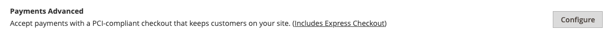
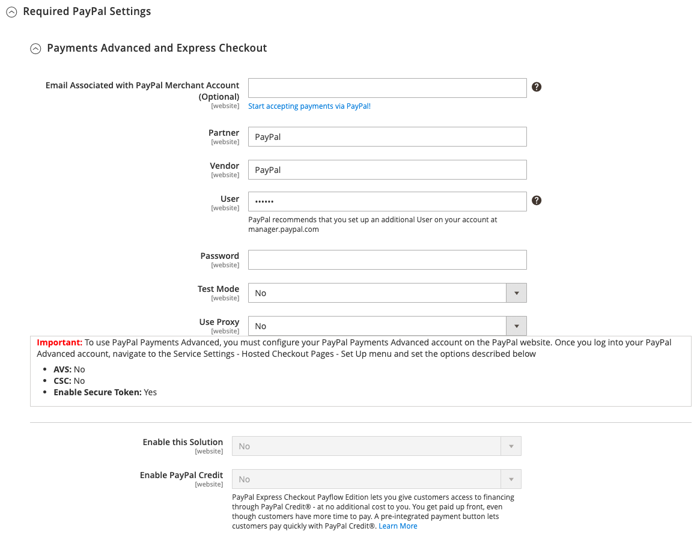
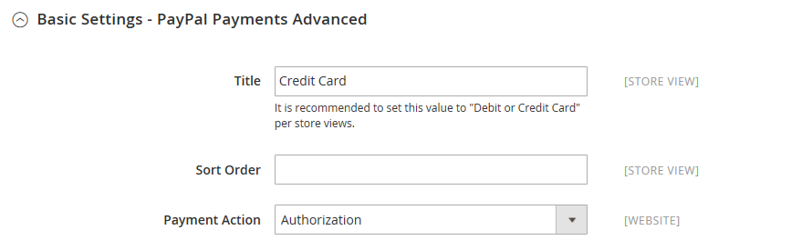
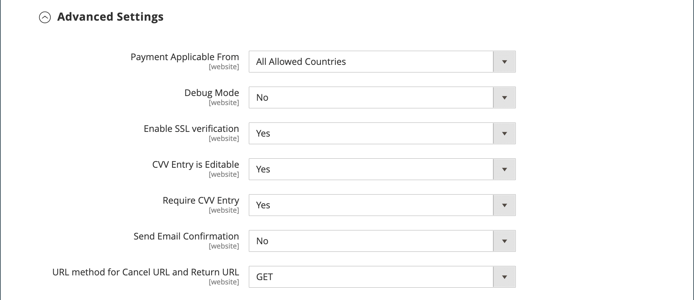
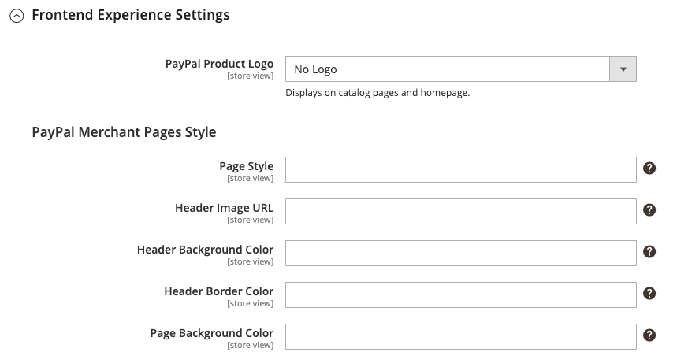
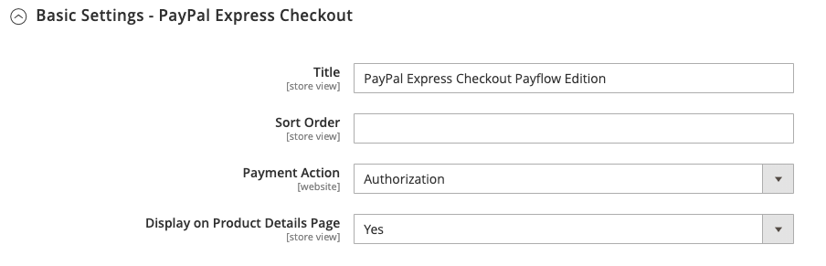
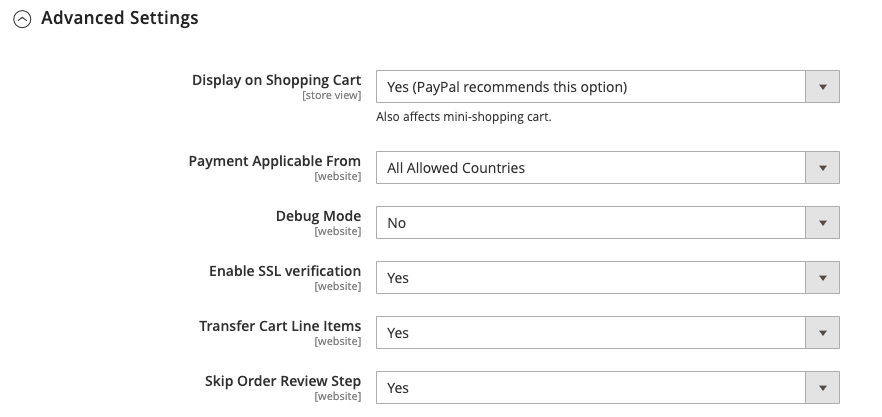

# PayPal Payments Advanced

[PayPal Payments Advanced](https://developer.paypal.com/docs/payflow/gs-ppa-hosted-pages/)は[PCIに準拠した](../getting-started/compliance-pci.md) ソリューションで、顧客はサイトを離れることなくデビットカードまたはクレジットカードで支払うことができます。 また、シームレスで安全なチェックアウト体験を実現するためにカスタマイズできる、組み込みのチェックアウトページも用意されています。

PayPal アカウントをお持ちでないお客様でも、PayPalの安全な支払いゲートウェイを通じて購入することができます。 利用可能なカードには、米国および英国のVisa、MasterCard、Switch/Maestro、Solo クレジットカードが含まれます。 さらに便利にするために、PayPal Express CheckoutはPayPal Payments Advancedに含まれています。

>[!IMPORTANT]
>
>**PSD2の要件：**  
>2019年9月14日現在、ヨーロッパの銀行は[PSD2](../getting-started/compliance-payment-services-directive.md)の要件を満たさない支払いを拒否する可能性があります。 PSD2に準拠するには、PayPal Payments Advancedをサードパーティのプラグインと統合する必要があります。 詳しくは、「[3-D Secure for Payflow](https://developer.paypal.com/api/nvp-soap/payflow/3d-secure-mpi/)」を参照してください。

>[!NOTE]
>
>PayPal Payments Advancedは、ストアの管理者から作成された注文には使用できません。

## 要件定義

- [PayPal法人向けアカウント](https://www.paypal.com/webapps/mpp/how-to-sell-online)
- 複数のAdobe CommerceおよびMagento Open Source web サイトを管理する場合は、各web サイトに対して個別のPayPal マーチャント アカウントが必要です。

## チェックアウトワークフロー

1. **お客様が支払い方法を選択** - チェックアウト時に、お客様はPayPal Payments Advancedでの支払いを選択します。 「注文する」ボタンの代わりに「Pay Now」ボタンが表示されます。

1. **今すぐ支払う** – 顧客が&#x200B;_今すぐ支払う_&#x200B;をクリックまたはタップすると、PayPalでホストされているフォームが表示されます。 お客様がカード情報を入力すると、カードが確認されます。 正常に動作した場合は、注文確認ページが表示されます。

   **PayPalでのお支払い** - フォームには&#x200B;_PayPalでのお支払い_ ボタンも含まれています。このボタンを使用すると、お客様はPayPal サイトにリダイレクトされ、PayPal Express チェックアウトでお支払いをおこなうことができます。

1. **トラブルシューティング** – 何らかの理由でトランザクションが失敗した場合、チェックアウトページにエラーメッセージが表示され、お客様に再試行するように指示されます。 問題はすべてPayPalが管理します。

## 注文処理ワークフロー

PayPal Payments Advancedでの注文の処理は、通常のPayPal注文の場合と同じです。 注文は請求され、発送され、オンラインとオフラインの両方の返金のために生成されたクレジットメモ。 ただし、PayPal Payments Advancedで支払われた注文については、複数のオンライン払い戻しは利用できません。

1. **お客様が注文を行う** - チェックアウトの最終段階で、お客様は「注文を行う」ボタンをタップします。

1. **PayPalが応答** - PayPalがリクエストを評価します。 有効であることが判明した場合、PayPalは取引を処理します。

1. **Commerceは注文ステータスを設定します** - CommerceはPayPalからレスポンスを受け取り、注文ステータスを次のいずれかに設定します。

   - **処理中** - トランザクションが成功しました。
   - **支払い保留中** - システムはPayPalから応答を受け取りませんでした。
   - **キャンセル済み** – 何らかの理由でトランザクションが成功しませんでした
   - **不正行為の疑い** – トランザクションが[PayPal不正行為フィルター](paypal.md#paypal-fraud-management-filters)の一部を渡しませんでした。 このシステムは、取引がFraud ServiceによってレビューされているというPayPalからの応答を受け取ります。

1. **加盟店が注文を処理** – 加盟店の請求書と注文の発送。

## PayPal アカウントの設定

CommerceでPayPal Payments Advancedを設定する前に、PayPal web サイトでアカウントを設定する必要があります。

1. [PayPal法人向けアカウント &#x200B;](https://manager.paypal.com/)にログインします。

1. **[!UICONTROL Service Settings]** > **[!UICONTROL Hosted Checkout Pages]** > **[!UICONTROL Set Up Menu]**&#x200B;に移動し、次の設定を完了します。

   - **[!UICONTROL AVS]**: `No`
   - **[!UICONTROL CSC]**: `No`
   - **[!UICONTROL Enable Secure Token]**: `Yes`

1. **[!UICONTROL Save]**&#x200B;設定。

   >[!NOTE]
   >
   >複数のCommerce Web サイトがある場合は、それぞれに個別のPayPal Payments Advanced アカウントを作成する必要があります。

1. レイアウトの作成を求めるメッセージが表示されたら、次の操作を行います。

   - ページの上部で、**[!UICONTROL Customize]**&#x200B;をクリックします。

   - **[!UICONTROL Layout C]**&#x200B;を選択してください。

   - **[!UICONTROL Save and Publish]**&#x200B;をクリックします。

1. 別のユーザーを設定する（PayPalで推奨）:

   - [PayPal法人向けアカウント &#x200B;](https://manager.paypal.com/)にログインします。

   - 別のユーザーを設定するには、指示に従います。

   - 変更を&#x200B;**[!UICONTROL Save]**&#x200B;します。

## CommerceでPayPal Payments Advancedを設定する

>[!NOTE]
>
>Express Checkoutと、All-In-OneまたはPayment Gateway ソリューションの2つのPayPal ソリューションを同時にアクティブにすることができます。 支払いソリューションを変更する場合、以前に使用したものは無効になります。

>[!TIP]
>
>いつでも&#x200B;**[!UICONTROL Save Config]**&#x200B;をクリックして、進行状況を保存します。

### 手順1：設定を開始する

1. _管理者_ サイドバーで、**[!UICONTROL Stores]** > _[!UICONTROL Settings]_>**[!UICONTROL Configuration]**&#x200B;に移動します。

1. 左側のパネルで、**[!UICONTROL Sales]**&#x200B;を展開し、**[!UICONTROL Payment Methods]**&#x200B;を選択します。

1. Commerce インストールに複数のweb サイト、ストア、またはビューがある場合は、この設定を適用するストアビューに&#x200B;**[!UICONTROL Store View]**&#x200B;を設定します。

1. 「_[!UICONTROL Merchant Location]_」セクションで、ビジネスが存在する&#x200B;**[!UICONTROL Merchant Country]**&#x200B;を選択します。

   この設定は、設定に表示されるPayPal ソリューションの選択を決定します。

   {width="600" zoomable="yes"}

1. **[!UICONTROL PayPal All-in-One Payment Solution]**&#x200B;を展開し、**[!UICONTROL Payments Advanced]**&#x200B;の&#x200B;**[!UICONTROL Configure]**&#x200B;をクリックします。

   {width="600" zoomable="yes"}

### 手順2：必要な設定を完了する

1. 必要に応じて、**[!UICONTROL Required PayPal Settings]** セクションのを展開します。

   {width="600" zoomable="yes"}

1. （オプション）を入力します。**[!UICONTROL Email Associated with your PayPal Merchant Account]**

   >[!IMPORTANT]
   >
   >メールアドレスでは、大文字と小文字が区別されます。 支払いを受け取るには、メールアドレスがPayPal加盟店アカウントで指定されたメールアドレスと一致している必要があります。

   PayPal アカウントをお持ちでない場合は、**[!UICONTROL Start accepting payments via PayPal]**&#x200B;をクリックしてください。

1. PayPal加盟店アカウントへのログインに使用する次のいずれかの資格情報を入力します。

   - **[!UICONTROL Partner]** - PayPal パートナーID。
   - **[!UICONTROL Vendor]** - PayPal ユーザーログイン名。
   - **[!UICONTROL User]** - PayPal アカウントで設定されている別のユーザーのID。

1. PayPal アカウントに関連付けられている&#x200B;**[!UICONTROL Password]**&#x200B;を入力します。

1. テスト トランザクションを実行するには、**[!UICONTROL Test Mode]**&#x200B;を`Yes`に設定します。

   サンドボックスで設定をテストする場合は、PayPalが推奨する[&#x200B; クレジットカード番号](https://www.paypalobjects.com/en_AU/vhelp/paypalmanager_help/credit_card_numbers.htm)のみを使用します。 実稼動環境に移行する準備ができたら、設定に戻り、テストモードを`No`に設定します。

1. システムでプロキシサーバーを使用してPayPal システムへの接続を確立する場合は、**[!UICONTROL Use Proxy]**&#x200B;を`Yes`に設定し、次の操作を行います。

   - **[!UICONTROL Proxy Host]**&#x200B;のIP アドレスを入力してください。

   - **[!UICONTROL Proxy Port]**&#x200B;のポート番号を入力してください。

     プロキシは、サーバーファイアウォールがPayPal サーバーへの直接アクセスを禁止している場合に使用されます。 この場合、トラフィックを中継するためにサードパーティサーバーが使用されます。

1. **[!UICONTROL Enable this Solution]**&#x200B;を`Yes`に設定します。

1. [PayPal クレジット &#x200B;](paypal.md#paypal-credit-and-pay-later)を顧客に提供する場合は、**[!UICONTROL Enable PayPal Credit]**&#x200B;を`Yes`に設定します。

### ステップ 3:Advertising PayPal Credit / Advertising PayPal PayLaterの設定（オプション）

2.4.3 リリース以降、PayPal PayLaterは、PayPalを含むデプロイメントでサポートされています。 この機能により、買い物客は購入時に全額を支払うのではなく、隔週の分割で注文の支払いを行うことができます。 PayPal Credit エクスペリエンスは非推奨（廃止予定）です。

**[!UICONTROL Enable PayPal PayLater Experience]**&#x200B;を次のいずれかに設定します：

- `Yes` - Advertising PayPal PayLaterを設定するには
- `No` - Advertising PayPal クレジットを設定するには

#### Advertising PayPal Credit

1. **[!UICONTROL Advertise PayPal Credit]** セクションのを展開します。

   {width="600" zoomable="yes"}

1. アカウント情報を取得するには、**[!UICONTROL Get Publisher ID from PayPal]**&#x200B;をクリックし、指示に従います。

1. **[!UICONTROL Publisher ID]**&#x200B;を入力します。

1. **[!UICONTROL Home Page]** セクションのを展開します。

1. ページにバナーを配置するには、**[!UICONTROL Display]**&#x200B;を`Yes`に設定します。

1. **[!UICONTROL Position]**&#x200B;を次のいずれかに設定します：

   - `Header (center)`
   - `Sidebar (right)`

1. **[!UICONTROL Size]**&#x200B;を次のいずれかに設定します：

   - `190 x 100`
   - `234 x 60`
   - `300 x 50`
   - `468 x 60`
   - `728 x 90`
   - `800 x 66`

   {width="600" zoomable="yes"}

1. 残りのセクションを展開し、前の手順を繰り返します。

   - **[!UICONTROL Catalog Category Page]**
   - **[!UICONTROL Catalog Product Page]**
   - **[!UICONTROL Checkout Cart Page]**

#### PayPal PayLaterの広告

1. **[!UICONTROL Advertise PayPal PayLater]** セクションのを展開します。

1. **[!UICONTROL Enable PayPal PayLater]**&#x200B;を`Yes`に設定します。

1. **[!UICONTROL Home Page]** セクションのを展開します。

1. ページにバナーを配置するには、**[!UICONTROL Display]**&#x200B;を`Yes`に設定します。

1. **[!UICONTROL Position]**&#x200B;を次のいずれかに設定します：

   - `Header (center)`
   - `Sidebar`

1. **[!UICONTROL Style Layout]**&#x200B;を次のいずれかに設定します：

   - `Text`
   - `Flex`

1. [!UICONTROL Style Layout] **[!UICONTROL Text]**&#x200B;のみの場合は、**[!UICONTROL Logo Type]**&#x200B;を次のいずれかに設定します。

   - `Primary`
   - `Alternative`
   - `Inline`
   - `None`

1. [!UICONTROL Style Layout] **[!UICONTROL Text]**&#x200B;のみの場合は、**[!UICONTROL Logo Position]**&#x200B;を次のいずれかに設定します。

   - `Left`
   - `Right`
   - `Top`

1. [!UICONTROL Style Layout] **[!UICONTROL Text]**&#x200B;のみの場合は、**[!UICONTROL Text Color]**&#x200B;を次のいずれかに設定します。

   - `Black`
   - `White`
   - `Monochrome`
   - `Grayscale`

1. [!UICONTROL Style Layout] **[!UICONTROL Text]**&#x200B;のみの場合は、**[!UICONTROL Text Size]**&#x200B;を次のいずれかに設定します。

   - `10px`
   - `11px`
   - `12px`
   - `13px`
   - `14px`
   - `15px`
   - `16px`

1. [!UICONTROL Style Layout] **[!UICONTROL Flex]**&#x200B;のみの場合は、**[!UICONTROL Ratio]**&#x200B;を次のいずれかに設定します。

   - `1x1`
   - `1x4`
   - `8x1`
   - `20x1`

1. [!UICONTROL Style Layout] **[!UICONTROL Flex]**&#x200B;のみの場合は、**[!UICONTROL Color]**&#x200B;を次のいずれかに設定します。

   - `Blue`
   - `Black`
   - `White`
   - `White No Border`
   - `Gray`
   - `Monochrome`
   - `Grayscale`

   {width="600" zoomable="yes"}

1. 残りのセクションを展開し、前の手順を繰り返します。

   - **[!UICONTROL Catalog Product Page]**
   - **[!UICONTROL Checkout Cart Page]**
   - **[!UICONTROL Checkout Payment Step]**
   - **[!UICONTROL Catalog Category Page]**

### 手順4：基本設定を完了する

1. 必要に応じて、**[!UICONTROL Basic Settings - PayPal Payments Advanced]** セクションのを展開します。

   {width="600" zoomable="yes"}

1. チェックアウト時にPayPal Payments Advancedを識別するには、**[!UICONTROL Title]**&#x200B;を入力します。

   「_デビットカードまたはクレジットカード_」というタイトルを使用することをお勧めします。

1. 複数の支払い方法を提供している場合は、チェックアウト時に他の支払い方法と一緒に表示されるPayPal支払い詳細が表示される順序を決定するために、**[!UICONTROL Sort Order]**&#x200B;の数値を入力します。

   この数字は他の支払い方法に関連しています。 （`0` = first, `1` = second, `2` = thirdなど）

1. **[!UICONTROL Payment Action]**&#x200B;を次のいずれかに設定します：

   - `Authorization` – 購入を承認しますが、ファンドを保持します。 金額は、加盟店が&#x200B;_獲得_&#x200B;するまで引き落とされません。
   - `Sale` – 購入金額が承認され、お客様のアカウントから直ちに引き落とされます。

### 手順5：詳細設定を完了する

1. **[!UICONTROL Advanced Settings]** セクションのを展開します。

   {width="600" zoomable="yes"}

1. **[!UICONTROL Payment Applicable From]**&#x200B;を次のいずれかに設定します：

   - `All Allowed Countries` - ストア設定で指定されたすべての[国](../getting-started/store-details.md#country-options)のお客様は、この支払い方法を使用できます。
   - `Specific Countries` – このオプションを選択すると、_[!UICONTROL Payment from Specific Countries]_&#x200B;リストが表示されます。 Ctrl キー（PC）またはCommand キー（Mac）を押しながら、お客様が店舗で購入できる国をリストから選択します。

1. 支払いシステムとの通信をログファイルに書き込むには、**[!UICONTROL Debug Mode]**&#x200B;を`Yes`に設定します。

   PayPal Payments Advancedのログファイルは`payments_payflow_advanced.log`です。

   >[!NOTE]
   >
   >PCI データセキュリティ基準に従い、クレジットカード情報はログファイルに記録されません。

1. ホストの真正性検証を有効にするには、**[!UICONTROL Enable SSL Verification]**&#x200B;を`Yes`に設定します。

1. お客様がクレジットカードの裏面から3桁のCVV セキュリティコードの入力を修正できるようにするには、**[!UICONTROL CVV Entry is Editable]**&#x200B;を`Yes`に設定します。

1. 顧客にCVV コードの入力を求めるには、**[!UICONTROL Require CVV Entry]**&#x200B;を`Yes`に設定します。

1. お客様に支払いの確認を送信するには、**[!UICONTROL Send Email Confirmation]**&#x200B;を`Yes`に設定します。

1. トランザクション中にPayPal サーバーと情報を交換するために使用される方法を決定するには、**[!UICONTROL URL method for Cancel URL and Return URL]**&#x200B;を次のいずれかに設定します。

   - `GET` - （デフォルト） プロセスの結果である情報を取得します。
   - `POST` - フォームに入力されたデータなどのデータ ブロックをデータ処理プロセスに提供します。

   _キャンセル URL_&#x200B;と&#x200B;_リターン URL_&#x200B;は、PayPal サーバーのチェックアウトプロセスの支払い部分を完了またはキャンセルした後にお客様が戻るページを指します。

1. ストアの必要に応じて、次のセクションを完了します。

   - [決済レポート設定](#settlement-report-settings)
   - [フロントエンドエクスペリエンス設定](#frontend-experience-settings)

#### 決済レポート設定

1. **[!UICONTROL Settlement Report Settings]** セクションのを展開します。

   {width="600" zoomable="yes"}

1. **[!UICONTROL SFTP Credentials]**&#x200B;に対して、次の操作を行います。

   - PayPalのセキュア FTP サーバーにサインアップしている場合は、次のSFTP ログイン資格情報を入力します。

      - ログイン
      - パスワード

   - 本番稼働前にテストレポートを実行するには、**[!UICONTROL Sandbox Mode]**&#x200B;を`Yes`に設定します。

   - **[!UICONTROL Custom Endpoint Hostname or IP Address]**&#x200B;を入力します。

     デフォルトでは、値は`reports.paypal.com`です。

   - レポートを保存する&#x200B;**[!UICONTROL Custom Path]**&#x200B;を入力します。

     デフォルトでは、値は`/ppreports/outgoing`です。

1. スケジュールに従ってレポートを生成するには、**[!UICONTROL Scheduled Fetching]**&#x200B;設定を完了します。

   - **[!UICONTROL Enable Automatic Fetching]**&#x200B;を`Yes`に設定します。

   - **[!UICONTROL Schedule]**&#x200B;を次のいずれかに設定します：

      - `Daily`
      - `Every 3 Days`
      - `Every 7 Days`
      - `Every 10 Days`
      - `Every 14 Days`
      - `Every 30 Days`
      - `Every 40 Days`

     PayPalは、各レポートを45日間保持します。

   - レポートを生成する場合は、**[!UICONTROL Time of Day]**&#x200B;を時間、分、秒に設定します。

#### フロントエンドエクスペリエンス設定

_[!UICONTROL Frontend Experience Settings]_&#x200B;を使用して、サイトに表示するPayPal ロゴを選択し、PayPal マーチャント ページの外観をカスタマイズします。

1. **[!UICONTROL Frontend Experience Settings]** セクションのを展開します。

   {width="600" zoomable="yes"}

1. ストアのPayPal ブロックに表示する&#x200B;**[!UICONTROL PayPal Product Logo]**&#x200B;を選択します。

   PayPalのロゴには4つのスタイルと2つのサイズがあります。

   - `No Logo`
   - `We Prefer PayPal (150 x 60 or 150 x 40)`
   - `Now Accepting PayPal (150 x 60 or 150 x 40)`
   - `Payments by PayPal (150 x 60 or 150 x 40)`
   - `Shop Now Using PayPal (150 x 60 or 150 x 40)`

1. PayPal マーチャントページの外観をカスタマイズするには：

   - PayPal マーチャント ページに適用する&#x200B;**[!UICONTROL Page Style]**&#x200B;の名前を入力します。

      - `paypal` - PayPal ページスタイルを使用します。
      - `primary` - アカウントプロファイルで&#x200B;_primary_ スタイルとして識別したページスタイルを使用します。
      - `your_custom_value` - アカウント プロファイルで指定されたカスタム支払いページ スタイルを使用します。

   - **[!UICONTROL Header Image URL]**&#x200B;に、支払いページの左上隅に表示する画像のURLを入力します。 最大ファイルサイズは、幅750 ピクセル、高さ90 ピクセルです。

   >[!NOTE]
   >
   >PayPalでは、画像が安全な（https）サーバー上にあることをお勧めします。 それ以外の場合、ブラウザーは、_ページにセキュアな項目とセキュアでない項目の両方が含まれていることを警告する場合があります_。

   - ページの色を設定するには、次のそれぞれに`#`記号なしで6文字の16進数コードを入力します。

      - **[!UICONTROL Header Background Color]** - チェックアウト ページ ヘッダーの背景色。
      - **[!UICONTROL Header Border Color]** - ヘッダーの周囲の2 ピクセル境界の色。
      - **[!UICONTROL Page Background Color]** - チェックアウトページと、ヘッダーと支払いフォームの周囲の背景色。

### ステップ 6:PayPal Express Checkoutの基本設定を完了する

1. **[!UICONTROL Basic Settings - PayPal Express Checkout]** セクションのを展開します。

   {width="600" zoomable="yes"}

1. **[!UICONTROL Title]**&#x200B;に、チェックアウト時にこの支払い方法を識別するタイトルを入力します。

   各ストアビューのタイトルを&#x200B;_PayPal_&#x200B;に設定することをお勧めします。

1. 複数の支払い方法を提供している場合は、**[!UICONTROL Sort Order]**&#x200B;の数値を入力して、他の支払い方法と一緒に表示されるPayPal Express Checkoutの順序を決定します。

   この数字は他の支払い方法に関連しています。 （`0` = first, `1` = second, `2` = thirdなど）

1. **[!UICONTROL Payment Action]**&#x200B;を次のいずれかに設定します：

   - `Authorization` – 購入を承認し、資金を保留します。 金額は、加盟店が&#x200B;_獲得_&#x200B;するまで引き落とされません。
   - `Sale` – 購入金額が承認され、お客様のアカウントから直ちに引き落とされます。

1. 製品ページに&#x200B;_[!UICONTROL Check out with PayPal]_&#x200B;ボタンを表示するには、**[!UICONTROL Display on Product Details Page]**&#x200B;を`Yes`に設定します。

### ステップ 7：詳細設定を完了する – PayPal Express チェックアウト

1. **[!UICONTROL Advanced Settings]** セクションのを展開します。

   {width="600" zoomable="yes"}

1. PayPal Express チェックアウトをショッピングカートとミニカートの両方から利用できるようにするには、**[!UICONTROL Display on Shopping Cart]**&#x200B;を`Yes`に設定します。

1. **[!UICONTROL Payment Applicable From]**&#x200B;を次のいずれかに設定します：

   - `All Allowed Countries` - ストア設定で指定されたすべての[国](../getting-started/store-details.md#country-options)のお客様は、この支払い方法を使用できます。
   - `Specific Countries` |このオプションを選択すると、_特定国からの支払い_&#x200B;が表示されます。 Ctrl キー（PC）またはCommand キー（Mac）を押しながら、お客様がストアから購入できるリストの各国をクリックします。

1. 支払いシステムとの通信をログファイルに書き込むには、**[!UICONTROL Debug Mode]**&#x200B;を`Yes`に設定します。

   >[!NOTE]
   >
   >[PCI データセキュリティ基準](../getting-started/compliance-pci.md)に従い、クレジットカード情報はログファイルに記録されません。

1. ホストの真正性検証を有効にするには、**[!UICONTROL Enable SSL Verification]**&#x200B;を`Yes`に設定します。

1. PayPal サイトからの顧客の注文品目別の完全な概要を表示するには、**[!UICONTROL Transfer Cart Line Items]**&#x200B;を`Yes`に設定します。

1. 注文レビューのために店舗に戻ることなく、PayPal サイトからトランザクションを完了できるようにするには、**[!UICONTROL Skip Order Review Step]**&#x200B;を`Yes`に設定します。

1. 完了したら、**[!UICONTROL Save Config]**&#x200B;をクリックします。
