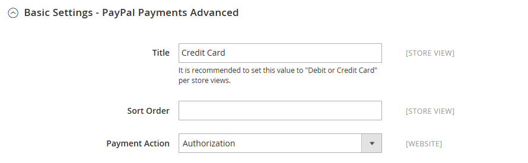

# PayPal 支払い詳細

[PayPal Payments Advanced][4] は、[PCI 準拠 ](../getting-started/compliance-pci.md) のソリューションで、サイトを離れることなくデビットまたはクレジットカードで支払うことができます。 これには、シームレスで安全なチェックアウトエクスペリエンスを作成するためにカスタマイズできる埋め込みチェックアウトページが含まれています。

PayPal アカウントを持たないお客様でも、PayPal セキュア支払いゲートウェイを通じて購入することができます。 Visa、MasterCard、Switch/Maestro、Solo のクレジットカードはアメリカ合衆国とイギリスで利用可能です。 さらなる利便性のために、PayPal Express Checkout は PayPal Payments Advanced に含まれています。

>[!IMPORTANT]
>
>**PSD2 の要件：**  
>2019 年 9 月 14 日（PT）現在、ヨーロッパの銀行は、[PSD2](../getting-started/compliance-payment-services-directive.md) の要件を満たさない支払いを拒否する可能性があります。 PSD2 に準拠するには、PayPal Payments Advanced をサードパーティのプラグインと統合する必要があります。 詳しくは、[3-D Secure for Payflow](https://developer.paypal.com/api/nvp-soap/payflow/3d-secure-mpi/) を参照してください。

>[!NOTE]
>
>ストアの管理者から作成された注文には、PayPal Payments Advanced を使用できません。

## 要件

- [PayPal ビジネスアカウント ][1]
- 複数のAdobe Commerce web サイトとMagento Open Source web サイトを管理する場合は、web サイトごとに個別の PayPal マーチャントアカウントが必要です。

## チェックアウトワークフロー

1. **お客様が支払い方法を選択** - チェックアウト時に、お客様は PayPal Payments Advanced を使用して支払うことを選択します。 [Place Order] （注文する）ボタンの代わりに [Pay Now] （今すぐ支払う）ボタンが表示されます。

1. **Pay Now** – 顧客が _Pay Now_ をクリックまたはタップすると、PayPal でホストされるフォームが表示されます。 お客様がカード情報を入力し、カードが検証されます。 成功すると、注文確認ページが表示されます。

   **PayPal で支払う** - フォームには「_PayPal で支払う_ ボタンも含まれています。このボタンは、PayPal サイトにリダイレクトされ、PayPal Express チェックアウトでお支払いいただくことができます。

1. **トラブルシューティング** – 何らかの理由でトランザクションが失敗した場合、チェックアウトページにエラーメッセージが表示され、顧客は再試行するように指示されます。 問題はすべて PayPal で管理されます。

## 注文処理ワークフロー

PayPal Payments Advanced を使用した注文の処理は、通常の PayPal 注文の場合と同じです。 注文は請求および発送され、オンラインとオフラインの両方の払い戻しのためにクレジットメモが生成されます。 ただし、PayPal Payments Advanced で支払われた注文については、複数のオンライン払い戻しはできません。

1. **顧客が注文する** - チェックアウトの最終段階で、顧客は「注文する」ボタンをタップします。

1. **PayPal 応答** - PayPal はリクエストを評価します。 有効であることが判明した場合、PayPal はトランザクションを処理します。

1. **Commerceが注文ステータスを設定します** - Commerceは PayPal から応答を受け取り、注文ステータスを次のいずれかに設定します。

   - **処理中** - トランザクションが成功しました。
   - **支払い保留中** - システムは PayPal から応答を受け取りませんでした。
   - **キャンセル** - トランザクションが何らかの理由で成功しませんでした
   - **不正の疑い** - トランザクションが一部の [PayPal 不正フィルター ](paypal.md#paypal-fraud-management-filters) を渡しませんでした。 システムは、PayPal から取引が不正サービスによって審査中であるという応答を受け取ります。

1. **マーチャントが注文を履行** - マーチャントは注文の請求書を送信し、注文を出荷します。

## PayPal アカウントの設定

Commerceで PayPal Payments Advanced を設定する前に、PayPal Web サイトでアカウントを設定する必要があります。

1. [PayPal ビジネスアカウント ][2] にログインします。

1. **[!UICONTROL Service Settings]**/**[!UICONTROL Hosted Checkout Pages]**/**[!UICONTROL Set Up Menu]** に移動して、次の設定を行います。

   - **[!UICONTROL AVS]**: `No`
   - **[!UICONTROL CSC]**: `No`
   - **[!UICONTROL Enable Secure Token]**: `Yes`

1. 設定を **[!UICONTROL Save]** 定します。

   >[!NOTE]
   >
   >複数のCommerce Web サイトがある場合は、それぞれに個別の PayPal 支払い詳細アカウントを作成する必要があります。

1. レイアウトの作成を求めるプロンプトが表示されたら、次の操作を行います。

   - ページの上部にある「**[!UICONTROL Customize]**」をクリックします。

   - 「**[!UICONTROL Layout C]**」を選択します。

   - 「**[!UICONTROL Save and Publish]**」をクリックします。

1. 別のユーザーを設定します（PayPal が推奨）。

   - [PayPal ビジネスアカウント ][2] にログインします。

   - 別のユーザーを設定するには、手順に従います。

   - 変更を **[!UICONTROL Save]** きます。

## Commerceでの PayPal の前払い支払いの設定

>[!NOTE]
>
>同時に 2 つの PayPal ソリューションをアクティブにすることができます：エクスプレスチェックアウトに加えて、オールインワンまたはペイメントゲートウェイソリューション。 支払いソリューションを変更すると、以前に使用したソリューションが無効になります。

>[!TIP]
>
>「**[!UICONTROL Save Config]**」をクリックすると、いつでも進行状況を保存できます。

### 手順 1：設定の開始

1. _管理者_ サイドバーで、**[!UICONTROL Stores]**/_[!UICONTROL Settings]_/**[!UICONTROL Configuration]**&#x200B;に移動します。

1. 左側のパネルで「**[!UICONTROL Sales]**」を展開し、「**[!UICONTROL Payment Methods]**」を選択します。

1. Commerceのインストールに複数の web サイト、ストアまたはビューがある場合は、この設定を適用するストアビューに **[!UICONTROL Store View]** を設定します。

1. 「_[!UICONTROL Merchant Location]_」セクションで、ビジネスが所在する&#x200B;**[!UICONTROL Merchant Country]**&#x200B;を選択します。

   この設定により、設定に表示される PayPal ソリューションの選択が決まります。

   {width="600" zoomable="yes"}

1. 「**[!UICONTROL PayPal All-in-One Payment Solution]**」を展開し、「**[!UICONTROL Configure]**」をクリックして「**[!UICONTROL Payments Advanced]**」を選択します。

   {width="600" zoomable="yes"}

### 手順 2：必要な設定を完了する

1. 必要に応じて  展開セレクター **[!UICONTROL Required PayPal Settings]** セクション）を展開します。

   {width="600" zoomable="yes"}

1. （任意） **[!UICONTROL Email Associated with your PayPal Merchant Account]** を入力します。

   >[!IMPORTANT]
   >
   >メールアドレスでは大文字と小文字が区別されます。 支払いを受け取るには、メールアドレスが PayPal マーチャントアカウントで指定されたメールアドレスと一致する必要があります。

   PayPal アカウントをお持ちでない場合は、[**[!UICONTROL Start accepting payments via PayPal]**] をクリックします。

1. PayPal マーチャントアカウントへのログインに使用する次の資格情報のいずれかを入力します。

   - **[!UICONTROL Partner]** - PayPal パートナー ID。
   - **[!UICONTROL Vendor]** - PayPal ユーザーのログイン名。
   - **[!UICONTROL User]** - PayPal アカウントで設定されている別のユーザーの ID。

1. PayPal アカウントに関連付けられている **[!UICONTROL Password]** を入力します。

1. テストトランザクションを実行するには、**[!UICONTROL Test Mode]** を `Yes` に設定します。

   サンドボックスで設定をテストする場合は、PayPal が推奨する [ クレジットカード番号 ][3] のみを使用します。 実稼動に移行する準備が整ったら、設定に戻って「テストモード」を `No` に設定します。

1. システムがプロキシサーバーを使用して PayPal システムへの接続を確立する場合は、**[!UICONTROL Use Proxy]** を `Yes` に設定し、次の手順を実行します。

   - **[!UICONTROL Proxy Host]** の IP アドレスを入力します。

   - **[!UICONTROL Proxy Port]** のポート番号を入力します。

     プロキシは、サーバーファイアウォールが PayPal サーバーへの直接アクセスを防ぐ場合に使用されます。 この場合、サードパーティのサーバーを使用してトラフィックがリレーされます。

1. **[!UICONTROL Enable this Solution]** を `Yes` に設定します。

1. 顧客に [PayPal クレジット ](paypal.md#paypal-credit-and-pay-later) を提供する場合は、**[!UICONTROL Enable PayPal Credit]** を `Yes` に設定します。

### 手順 3：広告 PayPal クレジット/広告 PayPal PayLater の設定（オプション）

2.4.3 リリース以降、PayPal PayLater は PayPal を含むデプロイメントでサポートされます。 この機能により、買い物客は購入時に全額を支払うのではなく、隔週の分割払いで注文の支払いを行うことができます。 PayPal クレジットエクスペリエンスは非推奨（廃止予定）となりました。

**[!UICONTROL Enable PayPal PayLater Experience]** を次のいずれかに設定します。

- `Yes` - PayPal PayLater をアドバタイズを設定するには
- `No` – 広告 PayPal クレジットを設定する

#### PayPal クレジットのアドバタイズ

1. 「」を展開し、「**[!UICONTROL Advertise PayPal Credit]**」セクションを展開します。

   {width="600" zoomable="yes"}

1. アカウント情報を取得するには、**[!UICONTROL Get Publisher ID from PayPal]** をクリックし、指示に従ってください。

1. **[!UICONTROL Publisher ID]** を入力します。

1. 「」を展開し、「**[!UICONTROL Home Page]**」セクションを展開します。

1. ページにバナーを配置するには、「**[!UICONTROL Display]**」を「`Yes`」に設定します。

1. **[!UICONTROL Position]** を次のいずれかに設定します。

   - `Header (center)`
   - `Sidebar (right)`

1. **[!UICONTROL Size]** を次のいずれかに設定します。

   - `190 x 100`
   - `234 x 60`
   - `300 x 50`
   - `468 x 60`
   - `728 x 90`
   - `800 x 66`

   {width="600" zoomable="yes"}

1.  残りのセクションを展開し、前の手順を繰り返します。

   - **[!UICONTROL Catalog Category Page]**
   - **[!UICONTROL Catalog Product Page]**
   - **[!UICONTROL Checkout Cart Page]**

#### PayPal PayLater のアドバタイズ

1. 「」を展開し、「**[!UICONTROL Advertise PayPal PayLater]**」セクションを展開します。

1. **[!UICONTROL Enable PayPal PayLater]** を `Yes` に設定します。

1. 「」を展開し、「**[!UICONTROL Home Page]**」セクションを展開します。

1. ページにバナーを配置するには、「**[!UICONTROL Display]**」を「`Yes`」に設定します。

1. **[!UICONTROL Position]** を次のいずれかに設定します。

   - `Header (center)`
   - `Sidebar`

1. **[!UICONTROL Style Layout]** を次のいずれかに設定します。

   - `Text`
   - `Flex`

1. [!UICONTROL Style Layout] **[!UICONTROL Text]** の場合のみ、**[!UICONTROL Logo Type]** を次のいずれかに設定します。

   - `Primary`
   - `Alternative`
   - `Inline`
   - `None`

1. [!UICONTROL Style Layout] **[!UICONTROL Text]** の場合のみ、**[!UICONTROL Logo Position]** を次のいずれかに設定します。

   - `Left`
   - `Right`
   - `Top`

1. [!UICONTROL Style Layout] **[!UICONTROL Text]** の場合のみ、**[!UICONTROL Text Color]** を次のいずれかに設定します。

   - `Black`
   - `White`
   - `Monochrome`
   - `Grayscale`

1. [!UICONTROL Style Layout] **[!UICONTROL Text]** の場合のみ、**[!UICONTROL Text Size]** を次のいずれかに設定します。

   - `10px`
   - `11px`
   - `12px`
   - `13px`
   - `14px`
   - `15px`
   - `16px`

1. [!UICONTROL Style Layout] **[!UICONTROL Flex]** の場合のみ、**[!UICONTROL Ratio]** を次のいずれかに設定します。

   - `1x1`
   - `1x4`
   - `8x1`
   - `20x1`

1. [!UICONTROL Style Layout] **[!UICONTROL Flex]** の場合のみ、**[!UICONTROL Color]** を次のいずれかに設定します。

   - `Blue`
   - `Black`
   - `White`
   - `White No Border`
   - `Gray`
   - `Monochrome`
   - `Grayscale`

   {width="600" zoomable="yes"}

1.  残りのセクションを展開し、前の手順を繰り返します。

   - **[!UICONTROL Catalog Product Page]**
   - **[!UICONTROL Checkout Cart Page]**
   - **[!UICONTROL Checkout Payment Step]**
   - **[!UICONTROL Catalog Category Page]**

### 手順 4：基本設定を完了する

1. 必要に応じて  展開セレクター **[!UICONTROL Basic Settings - PayPal Payments Advanced]** セクション）を展開します。

   {width="600" zoomable="yes"}

1. チェックアウト時に PayPal の支払い詳細を識別するには、**[!UICONTROL Title]** を入力します。

   タイトル _デビットまたはクレジットカード_ を使用することをお勧めします。

1. 複数の支払い方法を提供する場合は、**[!UICONTROL Sort Order]** の番号を入力して、チェックアウト時に他の支払い方法と一緒に表示される PayPal 支払い方法の表示順序を決定します。

   この番号は、他の支払い方法と相対的です。 （`0` = 1 番目、`1` = 2 番目、`2` = 3 番目など）。

1. **[!UICONTROL Payment Action]** を次のいずれかに設定します。

   - `Authorization` – 購入を承認しますが、資金を保留します。 この金額は、マーチャントによって _キャプチャ_ されるまで引き出されません。
   - `Sale` – 購入金額は許可され、すぐにお客様のアカウントから引き出されます。

### 手順 5：詳細設定の完了

1. 「」を展開し、「**[!UICONTROL Advanced Settings]**」セクションを展開します。

   {width="600" zoomable="yes"}

1. **[!UICONTROL Payment Applicable From]** を次のいずれかに設定します。

   - `All Allowed Countries` - ストア設定で指定されたすべての [ 国 ](../getting-started/store-details.md#country-options) のお客様がこの支払い方法を使用できます。
   - `Specific Countries` – このオプションを選択すると、_[!UICONTROL Payment from Specific Countries]_&#x200B;のリストが表示されます。 Ctrl キー（PC）または Command キー（Mac）を押しながら、リスト内で、お客様がストアから購入できる国を選択します。

1. 支払いシステムとの通信をログファイルに書き込むには、**[!UICONTROL Debug Mode]** を `Yes` に設定します。

   PayPal Payments Advanced のログファイルは `payments_payflow_advanced.log` です。

   >[!NOTE]
   >
   >PCI Data Security Standards に従い、クレジットカード情報はログファイルに記録されません。

1. ホストの信頼性の検証を有効にするには、**[!UICONTROL Enable SSL Verification]** を `Yes` に設定します。

1. クレジットカードの裏面から 3 桁の CVV セキュリティコードの入力を修正できるようにするには、**[!UICONTROL CVV Entry is Editable]** を `Yes` に設定します。

1. 顧客に CVV コードの入力を要求するには、**[!UICONTROL Require CVV Entry]** を `Yes` に設定します。

1. 顧客に支払の確認を送信するには、**[!UICONTROL Send Email Confirmation]** を `Yes` に設定します。

1. トランザクション中に PayPal サーバーと情報を交換するために使用する方法を決定するには、**[!UICONTROL URL method for Cancel URL and Return URL]** を次のいずれかに設定します。

   - `GET` – （デフォルト）プロセスの結果である情報を取得します。
   - `POST` - フォームに入力されたデータなどのデータブロックをデータ処理プロセスに提供します。

   _キャンセル URL_ と _返品 URL_ は、PayPal サーバーのチェックアウトプロセスの支払い部分を完了またはキャンセルした後に顧客が戻ってくるページを参照します。

1. ストアの必要に応じて、次の節を完了します。

   - [決済報告書の設定](#settlement-report-settings)
   - [フロントエンドエクスペリエンス設定](#frontend-experience-settings)

#### 決済報告書の設定

1. 「」を展開し、「**[!UICONTROL Settlement Report Settings]**」セクションを展開します。

   {width="600" zoomable="yes"}

1. **[!UICONTROL SFTP Credentials]** の場合は、次の手順を実行します。

   - PayPal のセキュア FTP サーバーに新規登録している場合は、次の SFTP ログイン資格情報を入力します。

      - ログイン
      - パスワード

   - 運用開始前にテストレポートを実行するには、**[!UICONTROL Sandbox Mode]** を `Yes` に設定します。

   - **[!UICONTROL Custom Endpoint Hostname or IP Address]** を入力します。

     デフォルト値は `reports.paypal.com` です。

   - レポートを保存する **[!UICONTROL Custom Path]** を入力します。

     デフォルト値は `/ppreports/outgoing` です。

1. スケジュールに従ってレポートを生成するには、**[!UICONTROL Scheduled Fetching]** の設定を完了します。

   - **[!UICONTROL Enable Automatic Fetching]** を `Yes` に設定します。

   - **[!UICONTROL Schedule]** を次のいずれかに設定します。

      - `Daily`
      - `Every 3 Days`
      - `Every 7 Days`
      - `Every 10 Days`
      - `Every 14 Days`
      - `Every 30 Days`
      - `Every 40 Days`

     PayPal は各レポートを 45 日間保持します。

   - レポートを生成する時、分、秒に **[!UICONTROL Time of Day]** を設定します。

#### フロントエンドエクスペリエンス設定

_[!UICONTROL Frontend Experience Settings]_&#x200B;を使用して、サイトに表示する PayPal ロゴを選択したり、PayPal マーチャントページの外観をカスタマイズしたりします。

1. 「」を展開し、「**[!UICONTROL Frontend Experience Settings]**」セクションを展開します。

   {width="600" zoomable="yes"}

1. ストアの PayPal ブロックに表示する **[!UICONTROL PayPal Product Logo]** を選択します。

   PayPal ロゴは、4 つのスタイルと 2 つのサイズで使用できます。

   - `No Logo`
   - `We Prefer PayPal (150 x 60 or 150 x 40)`
   - `Now Accepting PayPal (150 x 60 or 150 x 40)`
   - `Payments by PayPal (150 x 60 or 150 x 40)`
   - `Shop Now Using PayPal (150 x 60 or 150 x 40)`

1. PayPal マーチャントページの外観をカスタマイズするには：

   - PayPal マーチャントページに適用する **[!UICONTROL Page Style]** ージの名前を入力します。

      - `paypal` - PayPal ページスタイルを使用します。
      - `primary` - アカウントプロファイルで _プライマリ_ スタイルとして識別したページスタイルを使用します。
      - `your_custom_value` - アカウントプロファイルで指定されているカスタム支払いページスタイルを使用します。

   - **[!UICONTROL Header Image URL]**：支払いページの左上隅に表示する画像の URL を入力します。 最大ファイルサイズは、幅 750 ピクセル、高さ 90 ピクセルです。

   >[!NOTE]
   >
   >PayPal では、画像をセキュアな（https）サーバーに配置することをお勧めします。 そうしないと、ブラウザーは _ページにセキュアな項目とセキュアでない項目の両方が含まれている_ と警告する場合があります。

   - ページの色を設定するには、次の各項目に対して、6 文字の 16 進コードを `#` 記号なしで入力します。

      - **[!UICONTROL Header Background Color]** - チェックアウトページヘッダーの背景色
      - **[!UICONTROL Header Border Color]** - ヘッダーの周囲の 2 ピクセルの境界線の色。
      - **[!UICONTROL Page Background Color]** - チェックアウトページ、およびヘッダーと支払いフォーム周辺の背景色

### 手順 6:PayPal Express チェックアウトの基本設定を完了する

1. 「」を展開し、「**[!UICONTROL Basic Settings - PayPal Express Checkout]**」セクションを展開します。

   {width="600" zoomable="yes"}

1. **[!UICONTROL Title]** の場合は、チェックアウト時にこの支払い方法を識別するタイトルを入力します。

   ストア表示ごとにタイトルを _PayPal_ に設定することをお勧めします。

1. 複数の支払い方法を提供する場合は、**[!UICONTROL Sort Order]** の番号を入力して、他の支払い方法と共に表示される PayPal Express Checkout の表示順序を決定します。

   この番号は、他の支払い方法と相対的です。 （`0` = 1 番目、`1` = 2 番目、`2` = 3 番目など）。

1. **[!UICONTROL Payment Action]** を次のいずれかに設定します。

   - `Authorization` – 購入を承認し、資金を保留します。 この金額は、マーチャントによって _キャプチャ_ されるまで引き出されません。
   - `Sale` – 購入金額は許可され、すぐにお客様のアカウントから引き出されます。

1. 製品ページに「_[!UICONTROL Check out with PayPal]_」ボタンを表示するには、「**[!UICONTROL Display on Product Details Page]**」を「`Yes`」に設定します。

### ステップ 7：詳細設定の完了 – PayPal Express チェックアウト

1. 「」を展開し、「**[!UICONTROL Advanced Settings]**」セクションを展開します。

   {width="600" zoomable="yes"}

1. PayPal Express Checkout をショッピングカートとミニカートの両方から利用できるようにするには、**[!UICONTROL Display on Shopping Cart]** を `Yes` に設定します。

1. **[!UICONTROL Payment Applicable From]** を次のいずれかに設定します。

   - `All Allowed Countries` - ストア設定で指定されたすべての [ 国 ](../getting-started/store-details.md#country-options) のお客様がこの支払い方法を使用できます。
   - `Specific Countries` |このオプションを選択すると、_特定の国からのお支払い_ が表示されます。 Ctrl キー（PC）または Command キー（Mac）を押しながら、リスト内の各国をクリックして、お客様がストアから購入できるようにします。

1. 支払いシステムとの通信をログファイルに書き込むには、**[!UICONTROL Debug Mode]** を `Yes` に設定します。

   >[!NOTE]
   >
   >[PCI Data Security Standards](../getting-started/compliance-pci.md) に従って、クレジットカード情報はログファイルに記録されません。

1. ホストの信頼性の検証を有効にするには、**[!UICONTROL Enable SSL Verification]** を `Yes` に設定します。

1. PayPal サイトの顧客の注文品目の完全な概要を明細項目別に表示するには、**[!UICONTROL Transfer Cart Line Items]** を `Yes` に設定します。

1. お客様が注文レビューのためにストアに戻ることなく、PayPal サイトからトランザクションを完了できるようにするには、**[!UICONTROL Skip Order Review Step]** を `Yes` に設定します。

1. 完了したら、「**[!UICONTROL Save Config]**」をクリックします。

[1]: https://www.paypal.com/webapps/mpp/how-to-sell-online
[2]: https://manager.paypal.com/
[3]: https://www.paypalobjects.com/en_AU/vhelp/paypalmanager_help/credit_card_numbers.htm
[4]: https://developer.paypal.com/docs/payflow/gs-ppa-hosted-pages/
