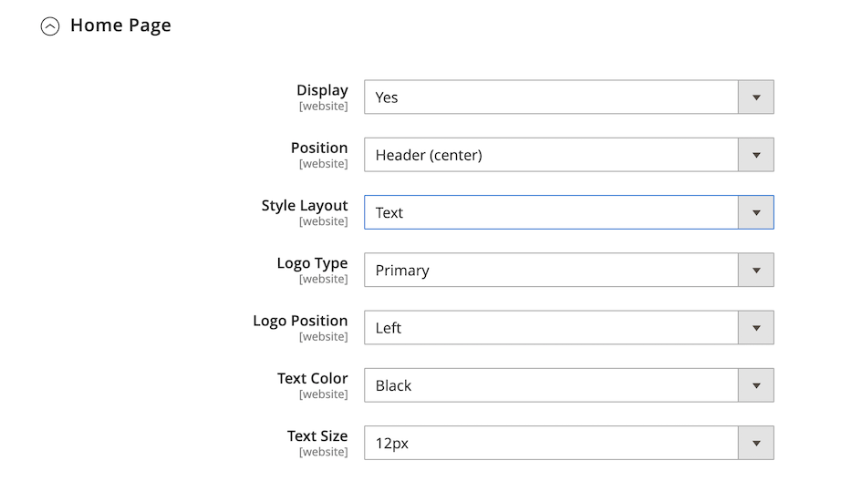

# PayPal ペイメントプロ

[PayPal Payments Pro][3] は、マーチャントアカウントと支払いゲートウェイのすべての利点に加えて、独自の完全にカスタマイズされたチェックアウトエクスペリエンスを作成する機能を 1 つにもたらします。 PayPal Express Checkout は PayPal Payments Pro で自動的に有効化されるため、1 億 1,000 万人以上のアクティブな PayPal ユーザーを利用できます。

{width="700" zoomable="yes"}

>[!IMPORTANT]
>
>**PSD2 の要件：**  
>2019 年 9 月 14 日（PT）現在、ヨーロッパの銀行は、[PSD2](../getting-started/compliance-payment-services-directive.md) の要件を満たさない支払いを拒否する可能性があります。 PSD2 に準拠するには、PayPal Payments Pro をサードパーティのプラグインと統合する必要があります。

>[!NOTE]
>
>現在、PayPal Payments Pro は米国、英国、カナダで利用できます。

## 要件

- [PayPal マーチャントアカウント ][1] （直接支払いが有効化されている場合）

## チェックアウトワークフロー

1. **顧客がチェックアウトに移動** – 顧客が買い物かごに製品を追加し、クリックまたはタップします _チェックアウトに進みます_。|
1. **お客様が支払い方法を選択** - チェックアウト時に、お客様は _PayPal ダイレクト支払い_ オプションを選択し、クレジットカード情報を入力します。
   - PayPal Payments Pro で支払う場合、お客様はチェックアウトプロセス中にサイトに滞在します。
   - PayPal Express Checkout で支払う場合、お客様は取引を完了するために PayPal サイトにリダイレクトされます。

顧客の要求に応じて、店舗管理者は管理者からの注文を作成し、PayPal Payments Pro でトランザクションを処理することもできます。

## 注文処理ワークフロー

1. **注文** – 注文は、ストアの管理者または PayPal マーチャントアカウントから処理できます。

1. **[!UICONTROL Payment Action]** – 設定で指定された支払いアクションが注文に適用されます。 次のようなオプションがあります。

   - **認証** - Commerceは「処理中 _ステータスの受注を作成_ ます。 この場合において、認可を受けるべき金額については、承認保留中とする。
   - **売上** - Commerceによって、受注と請求書の両方が作成されます。
   - **キャプチャ** - PayPal は、注文金額を顧客残高、銀行口座、またはクレジットカードからマーチャントアカウントに転送します。

1. **請求** - PayPal がCommerceに即時支払い通知メッセージを送信すると、請求書がCommerceで作成されます。

   PayPal マーチャントアカウントで即時支払い通知が有効になっていることを確認します。

   >[!NOTE]
   >
   >必要に応じて、指定された数量の製品に対して注文の一部を請求できます。 送信された部分請求書ごとに、一意の ID を持つ個別の取得取引が使用可能になり、個別の請求書が生成されます。

   承認のみの支払トランザクションは、注文金額が完全にキャプチャされた後にのみクローズされます。

   注文金額が完全に請求されるまで、オンラインでいつでも注文を無効にできます。

1. **返品** – お客様が購入した商品を返品し、返金を請求する場合、注文金額の取得や請求書作成と同様に、管理者または PayPal マーチャントアカウントからオンライン返金を作成できます。

## PayPal アカウントの設定

Commerceで PayPal Payments Pro を設定する前に、PayPal Web サイトでマーチャントアカウントを設定する必要があります。

1. [PayPal ビジネスアカウント &#x200B;](https://manager.paypal.com/) にログインします。

1. PayPal Manager メニューで、「**[!UICONTROL Service Settings]**」を選択します。

1. [**[!UICONTROL Hosted Checkout Pages]**] で、[**[!UICONTROL Set Up]**] をクリックします。

1. **[!UICONTROL Choose your settings]** で、**[!UICONTROL Transaction Process Mode]** を `Live` に設定します。

1. **[!UICONTROL Display options on payment page]** で、**[!UICONTROL Cancel URL Method]** を `POST` に設定します。

1. 「**[!UICONTROL Billing Information]**」の下で、カードセキュリティコード **[!UICONTROL CSC]** チェックボックスを、必須フィールドと編集可能フィールドの両方で選択します。

1. **[!UICONTROL Payment Confirmation]** で、**[!UICONTROL Return URL Method]** を `POST` に設定します。

1. 「**[!UICONTROL Security Options]**」で以下を設定します。

   - **[!UICONTROL AVS]**: `No`
   - **[!UICONTROL CSC]**: `No`
   - **[!UICONTROL Enable Secure Token]**: `Yes`

1. 「**[!UICONTROL Save Changes]**」をクリックします。

1. _PayPal マネージャー_ メニューで「**[!UICONTROL Service Settings]**」を選択し、「_ホストされたチェックアウトページ_」で「**[!UICONTROL Customize]**」を選択します。

1. 「**[!UICONTROL Layout C]**」を選択します。

   レイアウト C では、クレジットカードとデビットカードのフィールドのみが表示され、サイトにフレームを組み込んだり、スタンドアロンポップアップとして使用したりできます。 サイズは 490 x 565 ピクセルで固定され、エラーメッセージ用のスペースも追加されます。 一部のシステムでは、この設定によりトランスペアレント リダイレクトの問題が修正されます。

1. 「**[!UICONTROL Save and Publish]**」をクリックします。

1. PayPal Manager メニューで、「**[!UICONTROL Account Administration]**」を選択します。 [**[!UICONTROL Manage Security]**] で、[**[!UICONTROL Transaction Settings]**] をクリックします。

1. **[!UICONTROL Allow reference transactions]** を `Yes` に設定します。

1. 「**[!UICONTROL Confirm]**」をクリックします。

   >[!NOTE]
   >
   >複数のCommerce Web サイトがある場合は、それぞれに個別の PayPal Payments Pro アカウントを作成する必要があります。

1. 別のユーザーを設定します（PayPal が推奨）。

   - メインメニューの 2 行目にある「**[!UICONTROL Manage Users]**」をクリックします。

   - アカウントに別のユーザーを追加するには、「**[!UICONTROL Add User]**」をクリックします。 リンクは、ユーザーを管理タイトルのすぐ上にあります。

   - _[!UICONTROL Add User]_&#x200B;フォームの次のセクションの必須フィールドに入力します。

      - [!UICONTROL Admin Confirmation]
      - [!UICONTROL User Information]
      - [!UICONTROL User Login Information]
      - [!UICONTROL Assign Privilege to User]

   - 「**[!UICONTROL Update]**」をクリックします。

1. 必ず PayPal アカウントからログアウトしてください。

## Commerceでの PayPal Payments Pro の設定

>[!NOTE]
>
>同時に 2 つの PayPal ソリューションをアクティブにすることができます。[PayPal Express Checkout](paypal-express-checkout.md) に加えて、いずれかの [&#x200B; オールインワンソリューション &#x200B;](paypal.md#paypal-all-in-one-payment-solutions)。 支払いソリューションを変更すると、以前に使用したソリューションが自動的に無効になります。

>[!TIP]
>
>「**[!UICONTROL Save Config]**」をクリックすると、いつでも進行状況を保存できます。

### 手順 1：設定の開始

1. _管理者_ サイドバーで、**[!UICONTROL Stores]**/_[!UICONTROL Settings]_/**[!UICONTROL Configuration]**&#x200B;に移動します。

1. 左側のパネルで「**[!UICONTROL Sales]**」を展開し、「**[!UICONTROL Payment Methods]**」を選択します。

1. Commerceのインストールに複数の web サイト、ストアまたはビューがある場合は、この設定を適用するストアビューに **[!UICONTROL Store View]** を設定します。

1. 「_[!UICONTROL Merchant Location]_」セクションで、ビジネスが所在する&#x200B;**[!UICONTROL Merchant Country]**&#x200B;を選択します。

   この設定により、設定に表示される PayPal ソリューションの選択が決まります。

   {width="600" zoomable="yes"}

1. 「**[!UICONTROL PayPal All-in-One Payment Solution]**」を展開し、「**[!UICONTROL Configure]**」をクリックして「**[!UICONTROL Payments Pro]**」を選択します。

   {width="600" zoomable="yes"}

### 手順 2：必要な PayPal 設定を完了する

1. 「」を展開し、「**[!UICONTROL Payments Pro and Express Checkout]**」セクションを展開します。

   {width="600" zoomable="yes"}

1. （任意） **[!UICONTROL Email Associated with your PayPal Merchant Account]** を入力します。

   >[!IMPORTANT]
   >
   >メールアドレスでは大文字と小文字が区別されます。 支払いを受け取るには、メールアドレスが PayPal マーチャントアカウントで指定されたメールアドレスと一致する必要があります。

   PayPal アカウントをお持ちでない場合は、[**[!UICONTROL Start accepting payments via PayPal]**] をクリックします。

1. PayPal マーチャントアカウントへのログインに使用する次の資格情報のいずれかを入力します。

   - **[!UICONTROL Partner]** - PayPal パートナー ID。
   - **[!UICONTROL Vendor]** - PayPal ユーザーのログイン名。
   - **[!UICONTROL User]** - PayPal アカウントで設定されている別のユーザーの ID。

1. PayPal アカウントに関連付けられている **[!UICONTROL Password]** を入力します。

1. テストトランザクションを実行するには、**[!UICONTROL Test Mode]** を `Yes` に設定します。

   サンドボックスで設定をテストする場合は、PayPal が推奨する [ クレジットカード番号 ][2] のみを使用します。 実稼動に移行する準備が整ったら、設定に戻って「テストモード」を `No` に設定します。

1. システムがプロキシサーバーを使用して PayPal システムへの接続を確立する場合は、**[!UICONTROL Use Proxy]** を `Yes` に設定し、次の手順を実行します。

   - **[!UICONTROL Proxy Host]** の IP アドレスを入力します。

   - **[!UICONTROL Proxy Port]** のポート番号を入力します。

   プロキシは、サーバーファイアウォールが PayPal サーバーへの直接アクセスを防ぐ場合に使用されます。 この場合、サードパーティのサーバーを使用してトラフィックがリレーされます。

1. **[!UICONTROL Enable this Solution]** を `Yes` に設定します。

1. 顧客に [PayPal クレジット &#x200B;](paypal.md#paypal-credit-and-pay-later) を提供する場合は、**[!UICONTROL Enable PayPal Credit]** を `Yes` に設定します。

1. 顧客の支払い/クレジットカードの詳細を安全に保存して、顧客が毎回の支払情報を再入力する必要がない場合は、**[!UICONTROL Vault Enabled]** を `Yes` に設定します。

### 手順 3：広告 PayPal クレジット/広告 PayPal PayLater の設定（オプション）

2.4.3 リリース以降、PayPal PayLater は PayPal を含むデプロイメントでサポートされます。 この機能により、買い物客は購入時に全額を支払うのではなく、隔週の分割払いで注文の支払いを行うことができます。 PayPal クレジットエクスペリエンスは非推奨（廃止予定）となりました。

**[!UICONTROL Enable PayPal PayLater Experience]** を次のいずれかに設定します。

- `Yes` - PayPal PayLater をアドバタイズを設定するには
- `No` – 広告 PayPal クレジットを設定する

#### PayPal クレジットのアドバタイズ

1. 「」を展開し、「**[!UICONTROL Advertise PayPal Credit]**」セクションを展開します。

   {width="600" zoomable="yes"}

1. アカウント情報を取得するには、**[!UICONTROL Get Publisher ID from PayPal]** をクリックし、指示に従ってください。

1. **[!UICONTROL Publisher ID]** を入力します。

1. 「」を展開し、「**[!UICONTROL Home Page]**」セクションを展開します。

   {width="600" zoomable="yes"}

1. ページにバナーを配置するには、「**[!UICONTROL Display]**」を「`Yes`」に設定します。

1. **[!UICONTROL Position]** を次のいずれかに設定します。

   - `Header (center)`
   - `Sidebar (right)`

1. **[!UICONTROL Size]** を次のいずれかに設定します。

   - `190 x 100`
   - `234 x 60`
   - `300 x 50`
   - `468 x 60`
   - `728 x 90`
   - `800 x 66`

1.  残りのセクションを展開し、前の手順を繰り返します。

   - **[!UICONTROL Catalog Category Page]**
   - **[!UICONTROL Catalog Product Page]**
   - **[!UICONTROL Checkout Cart Page]**

#### PayPal PayLater のアドバタイズ

1. 「」を展開し、「**[!UICONTROL Advertise PayPal PayLater]**」セクションを展開します。

1. **[!UICONTROL Enable PayPal PayLater]** を `Yes` に設定します。

1. 「」を展開し、「**[!UICONTROL Home Page]**」セクションを展開します。

   {width="600" zoomable="yes"}

1. ページにバナーを配置するには、「**[!UICONTROL Display]**」を「`Yes`」に設定します。

1. **[!UICONTROL Position]** を次のいずれかに設定します。

   - `Header (center)`
   - `Sidebar`

1. **[!UICONTROL Style Layout]** を次のいずれかに設定します。

   - `Text`
   - `Flex`

1. [!UICONTROL Style Layout] **[!UICONTROL Text]** の場合のみ、**[!UICONTROL Logo Type]** を次のいずれかに設定します。

   - `Primary`
   - `Alternative`
   - `Inline`
   - `None`

1. [!UICONTROL Style Layout] **[!UICONTROL Text]** の場合のみ、**[!UICONTROL Logo Position]** を次のいずれかに設定します。

   - `Left`
   - `Right`
   - `Top`

1. [!UICONTROL Style Layout] **[!UICONTROL Text]** の場合のみ、**[!UICONTROL Text Color]** を次のいずれかに設定します。

   - `Black`
   - `White`
   - `Monochrome`
   - `Grayscale`

1. [!UICONTROL Style Layout] **[!UICONTROL Text]** の場合のみ、**[!UICONTROL Text Size]** を次のいずれかに設定します。

   - `10px`
   - `11px`
   - `12px`
   - `13px`
   - `14px`
   - `15px`
   - `16px`

1. [!UICONTROL Style Layout] **[!UICONTROL Flex]** の場合のみ、**[!UICONTROL Ratio]** を次のいずれかに設定します。

   - `1x1`
   - `1x4`
   - `8x1`
   - `20x1`

1. [!UICONTROL Style Layout] **[!UICONTROL Flex]** の場合のみ、**[!UICONTROL Color]** を次のいずれかに設定します。

   - `Blue`
   - `Black`
   - `White`
   - `White No Border`
   - `Gray`
   - `Monochrome`
   - `Grayscale`

1.  残りのセクションを展開し、前の手順を繰り返します。

   - **[!UICONTROL Catalog Product Page]**
   - **[!UICONTROL Checkout Cart Page]**
   - **[!UICONTROL Checkout Payment Step]**
   - **[!UICONTROL Catalog Category Page]**

### 手順 4：基本設定を完了する

1. 「」を展開し、「**[!UICONTROL Basic Settings - PayPal Payments Pro]**」セクションを展開します。

   {width="600" zoomable="yes"}

1. **[!UICONTROL Title]** しくは、チェックアウト時に PayPal Payments Pro を識別するタイトルを入力します。

   タイトル _デビットまたはクレジットカード_ を使用することをお勧めします。

1. 複数の支払い方法を提供する場合は、**[!UICONTROL Sort Order]** の番号を入力して、チェックアウト時に他の支払い方法と一緒にリストされたときに PayPal Payments Pro が表示される順序を決定します。

   この番号は、他の支払い方法と相対的です。 （`0` = 1 番目、`1` = 2 番目、`2` = 3 番目など）。

1. **[!UICONTROL Payment Action]** を次のいずれかに設定します。

   - `Authorization` – 購入を承認しますが、資金を保留します。 この金額は、マーチャントによって _キャプチャ_ されるまで引き出されません。
   - `Sale` – 購入金額は許可され、直ちに顧客アカウントから引き出されます。

1. **[!UICONTROL Credit Card Settings]** の場合、ストアで支払いに使用できるクレジットカードを選択します。

   複数のカードを選択するには、Ctrl キー（PC）または Command キー（Mac）を押したまま、それぞれのカードをクリックします。

   >[!NOTE]
   >
   >American Express は追加契約が必要です。

### 手順 5：詳細設定の完了

1. 「」を展開し、「**[!UICONTROL Advanced Settings]**」セクションを展開します。

   {width="600" zoomable="yes"}

1. **[!UICONTROL Payment Applicable From]** を次のいずれかに設定します。

   - `All Allowed Countries` - ストア設定で指定されたすべての [&#x200B; 国 &#x200B;](../getting-started/store-details.md#country-options) のお客様がこの支払い方法を使用できます。
   - `Specific Countries` – このオプションを選択すると、_[!UICONTROL Payment from Specific Countries]_&#x200B;のリストが表示されます。 Ctrl キー（PC）または Command キー（Mac）を押しながら、リスト内で、お客様がストアから購入できる国を選択します。

1. 支払いシステムとの通信をログファイルに書き込むには、**[!UICONTROL Debug Mode]** を `Yes` に設定します。

   >[!NOTE]
   >
   >PCI Data Security Standards に従い、クレジットカード情報はログファイルに記録されません。

1. ホストの信頼性の検証を有効にするには、**[!UICONTROL Enable SSL Verification]** を `Yes` に設定します。

1. 顧客に CVV コードの入力を要求するには、**[!UICONTROL Require CVV Entry]** を `Yes` に設定します。

1. 「」を展開し、「**[!UICONTROL CVV and AVS Settings]**」セクションを展開します。

1. アドレス検証システムが不一致を識別したときにトランザクションを拒否するタイミングを決定するには、次の各シナリオの処理方法を指定します。

   - 一致しない番地の不一致に基づいてトランザクションを拒否するには、**[!UICONTROL AVS Street Does Not Match]** を `Yes` に設定します。

   - 一致しない郵便番号に基づいてトランザクションを拒否するには、**[!UICONTROL AVS Zip Does Not Match]** を `Yes` に設定します。

   - 一致しない国識別子に基づいてトランザクションを拒否するには、**[!UICONTROL International AVS Indicator Does Not Match]** を `Yes` に設定します。

   - 一致しない CVV コードに基づいてトランザクションを拒否するには、**[!UICONTROL International Card Security Code Does Not Match]** を `Yes` に設定します。

   {width="600" zoomable="yes"}

1. ストアの必要に応じて、次の節を完了します。

   - [決済報告書の設定](#settlement-report-settings)
   - [フロントエンドエクスペリエンス設定](#frontend-experience-settings)

#### 決済報告書の設定

1. 「」を展開し、「**[!UICONTROL Settlement Report Settings]**」セクションを展開します。

   {width="600" zoomable="yes"}

1. **[!UICONTROL SFTP Credentials]** の場合は、次の手順を実行します。

   - PayPal のセキュア FTP サーバーに新規登録している場合は、次の SFTP ログイン資格情報を入力します。

      - ログイン
      - パスワード

   - サイトで Payments Pro を使用して運用を開始する前にテストレポートを実行するには、**[!UICONTROL Sandbox Mode]** を `Yes` に設定します。

   - **[!UICONTROL Custom Endpoint Hostname or IP Address]** を入力します。

     デフォルト値は `reports.paypal.com` です。

   - レポートを保存する **[!UICONTROL Custom Path]** を入力します。

     デフォルト値は `/ppreports/outgoing` です。

1. スケジュールに従ってレポートを生成するには、**[!UICONTROL Scheduled Fetching]** の設定を完了します。

   - **[!UICONTROL Enable Automatic Fetching]** を `Yes` に設定します。

   - **[!UICONTROL Schedule]** を次のいずれかに設定します。

      - `Daily`
      - `Every 3 Days`
      - `Every 7 Days`
      - `Every 10 Days`
      - `Every 14 Days`
      - `Every 30 Days`
      - `Every 40 Days`

     PayPal は各レポートを 45 日間保持します。

   - レポートを生成する時、分、秒に **[!UICONTROL Time of Day]** を設定します。

#### フロントエンドエクスペリエンス設定

_[!UICONTROL Frontend Experience Settings]_&#x200B;を使用して、サイトに表示する PayPal ロゴを選択したり、PayPal マーチャントページの外観をカスタマイズしたりします。

1. 「」を展開し、「**[!UICONTROL Frontend Experience Settings]**」セクションを展開します。

   {width="600" zoomable="yes"}

1. ストアの PayPal ブロックに表示する **[!UICONTROL PayPal Product Logo]** を選択します。

   PayPal ロゴは、4 つのスタイルと 2 つのサイズで使用できます。

   - `No Logo`
   - `We Prefer PayPal (150 x 60 or 150 x 40)`
   - `Now Accepting PayPal (150 x 60 or 150 x 40)`
   - `Payments by PayPal (150 x 60 or 150 x 40)`
   - `Shop Now Using PayPal (150 x 60 or 150 x 40)`

1. PayPal マーチャントページの外観をカスタマイズするには、次の手順を実行します。

   - PayPal マーチャントページに適用する **[!UICONTROL Page Style]** ージの名前を入力します。

      - `paypal` - PayPal ページスタイルを使用します。
      - `primary` - アカウントプロファイルで _プライマリ_ スタイルとして識別したページスタイルを使用します。
      - `your_custom_value` - アカウントプロファイルで指定されているカスタム支払いページスタイルを使用します。

   - **[!UICONTROL Header Image URL]**：支払いページの左上隅に表示する画像の URL を入力します。 最大ファイルサイズは、幅 750 ピクセル、高さ 90 ピクセルです。

     >[!NOTE]
     >
     >PayPal では、画像をセキュアな（https）サーバーに配置することをお勧めします。 そうしないと、ブラウザーは _ページにセキュアな項目とセキュアでない項目の両方が含まれている_ と警告する場合があります。

   - ページの色を設定するには、次の各項目に対して、6 文字の 16 進コードを `#` 記号なしで入力します。

      - **[!UICONTROL Header Background Color]** - チェックアウトページヘッダーの背景色
      - **[!UICONTROL Header Border Color]** - ヘッダーの周囲の 2 ピクセルの境界線の色。
      - **[!UICONTROL Page Background Color]** - チェックアウトページ、およびヘッダーと支払いフォーム周辺の背景色

### 手順 6:PayPal Express チェックアウトの基本設定を完了する

1. 「」を展開し、「**[!UICONTROL Basic Settings - PayPal Express Checkout]**」セクションを展開します。

   {width="600" zoomable="yes"}

1. **[!UICONTROL Title]** の場合は、チェックアウト時にこの支払い方法を識別するタイトルを入力します。

   ストア表示ごとにタイトルを _PayPal_ に設定することをお勧めします。

1. 複数の支払い方法を提供する場合は、**[!UICONTROL Sort Order]** の番号を入力して、他の支払い方法と共に表示される PayPal Express Checkout の表示順序を決定します。

   この番号は、他の支払い方法と相対的です。 （`0` = 1 番目、`1` = 2 番目、`2` = 3 番目など）。

1. **[!UICONTROL Payment Action]** を次のいずれかに設定します。

   - `Authorization` – 購入を承認し、資金を保留します。 この金額は、マーチャントによって _キャプチャ_ されるまで引き出されません。
   - `Sale` – 購入金額は許可され、すぐにお客様のアカウントから引き出されます。

1. 製品ページに「_[!UICONTROL Check out with PayPal]_」ボタンを表示するには、「**[!UICONTROL Display on Product Details Page]**」を「`Yes`」に設定します。

### 手順 7:PayPal Express チェックアウトの詳細設定を完了する

1. 「」を展開し、「**[!UICONTROL Advanced Settings]**」セクションを展開します。

   {width="600" zoomable="yes"}

1. **[!UICONTROL Display on Shopping Cart]** を `Yes` に設定します。

1. **[!UICONTROL Payment Applicable From]** を次のいずれかに設定します。

   - `All Allowed Countries` - ストア設定で指定されたすべての [&#x200B; 国 &#x200B;](../getting-started/store-details.md#country-options) のお客様がこの支払い方法を使用できます。
   - `Specific Countries` – このオプションを選択すると、_[!UICONTROL Payment from Specific Countries]_&#x200B;のリストが表示されます。 複数の国を選択するには、Ctrl キー（PC）または Command キー（Mac）を押しながら、各項目をクリックします。

1. 支払いシステムとの通信をログファイルに書き込むには、**[!UICONTROL Debug Mode]** を `Yes` に設定します。

   >[!NOTE]
   >
   >PCI Data Security Standards に従い、クレジットカード情報はログファイルに記録されません。

1. ホストの信頼性の検証を有効にするには、**[!UICONTROL Enable SSL Verification]** を `Yes` に設定します。

1. PayPal サイトの品目別の顧客オーダーの完全な概要を表示するには、**[!UICONTROL Transfer Cart Line Items]** を `Yes` に設定します。

1. お客様が注文レビューのためにストアに戻ることなく、PayPal サイトからトランザクションを完了できるようにするには、**[!UICONTROL Skip Order Review Step]** を `Yes` に設定します。

1. 完了したら、「**[!UICONTROL Save Config]**」をクリックします。

[1]: https://www.paypal.com/webapps/mpp/how-to-sell-online
[2]: https://www.paypalobjects.com/en_AU/vhelp/paypalmanager_help/credit_card_numbers.htm
[3]: https://developer.paypal.com/docs/paypal-payments-pro/
