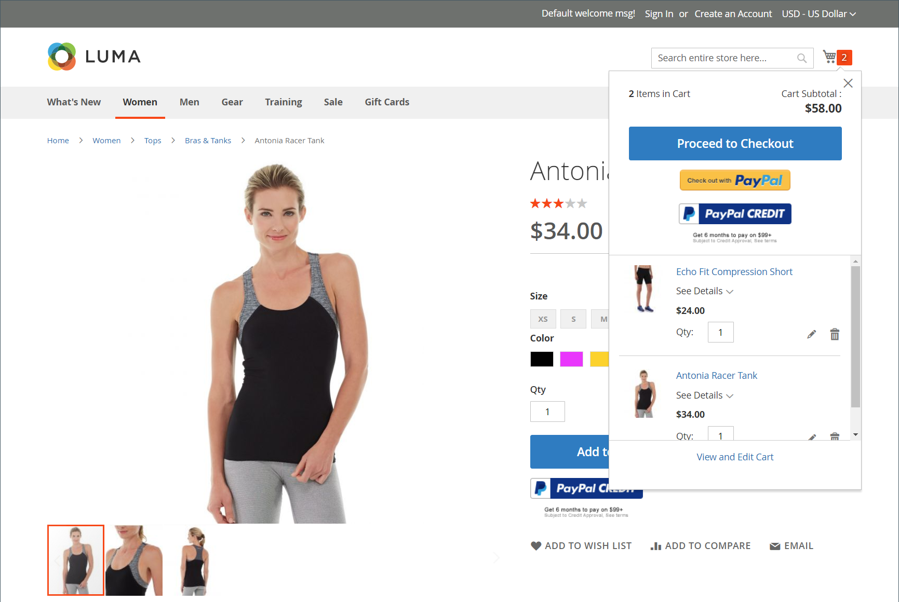
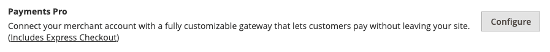
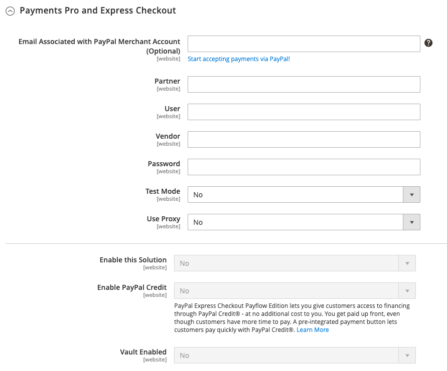
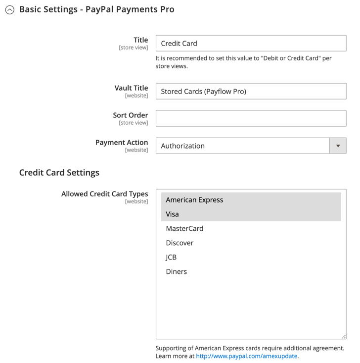
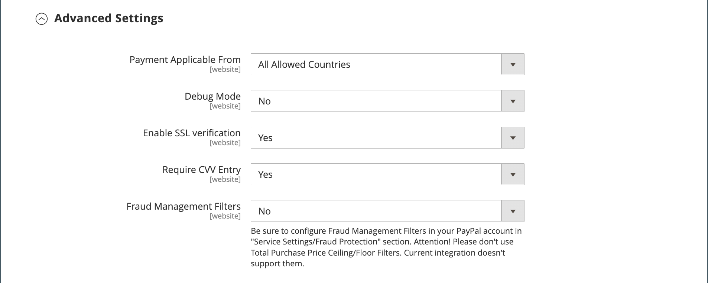
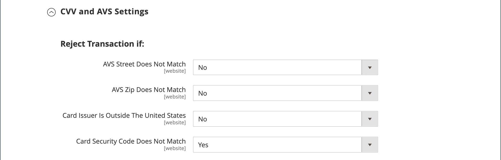

# PayPal Payments Pro

[PayPal Payments Pro](https://developer.paypal.com/docs/paypal-payments-pro/)では、加盟店アカウントと支払いゲートウェイのすべての利点に加えて、完全にカスタマイズされた独自のチェックアウト体験を作成できます。 PayPal Express CheckoutはPayPal Payments Proで自動的に有効になるので、1億1,000万人以上のアクティブなPayPal ユーザーを利用できます。

ミニカートに表示された{width="700" zoomable="yes"}

>[!IMPORTANT]
>
>**PSD2の要件：**  
>2019年9月14日の時点で、ヨーロッパの銀行は[PSD2](../getting-started/compliance-payment-services-directive.md)の要件を満たさない支払いを拒否する可能性があります。PSD2に準拠するには、PayPal Payments Proをサードパーティ製プラグインと統合する必要があります。

>[!NOTE]
>
>現在、PayPal Payments Proは米国、英国、カナダで利用可能です。

## 要件定義

- [PayPal加盟店アカウント &#x200B;](https://www.paypal.com/webapps/mpp/how-to-sell-online) （直接支払いが有効）

## チェックアウトワークフロー

1. **お客様がチェックアウトに移動** – お客様が商品をカートに追加し、クリック/タップします&#x200B;_チェックアウトに進みます_。|
1. **お客様が支払い方法を選択** - チェックアウト時に、お客様が&#x200B;_PayPal直接支払い_ オプションを選択し、クレジットカード情報を入力します。
   - PayPal Payments Proでお支払いの場合、チェックアウトプロセス中も顧客はサイトにとどまります。
   - PayPal Express Checkoutでお支払いの場合、お客様はPayPal サイトにリダイレクトされ、取引が完了します。

お客様のリクエストに応じて、ストア管理者は管理者から注文を作成し、PayPal Payments Proでトランザクションを処理することもできます。

## 注文処理ワークフロー

1. **注文が行われました** – 注文は、ストアの管理者またはPayPal加盟店アカウントから処理できます。

1. **[!UICONTROL Payment Action]** – 設定で指定された支払いアクションが注文に適用されます。 オプションは次のとおりです。

   - **Authorize** - Commerceは、_処理中_&#x200B;のステータスで販売注文を作成します。 この場合において、当該承認を受けるべき金銭の額は、承認待ちとする。
   - **Sale** - Commerceは販売注文と請求書の両方を作成します。
   - **キャプチャ** - PayPalは、注文金額を顧客残高、銀行口座、またはクレジットカードから加盟店アカウントに転送します。

1. **請求書** - PayPalがCommerceに即時支払い通知メッセージを送信した後、Commerceで請求書が作成されます。

   PayPal加盟店アカウントで即時支払い通知が有効になっていることを確認します。

   >[!NOTE]
   >
   >必要に応じて、特定の数量の製品に対して注文を部分的に請求できます。 送信された部分的な請求書ごとに、一意のIDを持つ個別のキャプチャ トランザクションが使用可能になり、個別の請求書が生成されます。

   承認専用の支払いトランザクションは、注文金額が全額確定した後にのみクローズされます。

   注文金額が完全に請求されるまで、オンラインでいつでも注文を無効にできます。

1. **返品** – お客様が購入した商品を返品し、注文金額の取得や請求書の作成と同様に返金を要求する場合は、管理者またはPayPal加盟店アカウントからオンライン返金を作成できます。

## PayPal アカウントの設定

CommerceでPayPal Payments Proを設定する前に、PayPal web サイトで加盟店アカウントを設定する必要があります。

1. [PayPal法人向けアカウント &#x200B;](https://manager.paypal.com/)にログインします。

1. PayPal Manager メニューで、**[!UICONTROL Service Settings]**&#x200B;を選択します。

1. **[!UICONTROL Hosted Checkout Pages]**&#x200B;で、**[!UICONTROL Set Up]**&#x200B;をクリックします。

1. **[!UICONTROL Choose your settings]**&#x200B;で、**[!UICONTROL Transaction Process Mode]**&#x200B;を`Live`に設定します。

1. **[!UICONTROL Display options on payment page]**&#x200B;で、**[!UICONTROL Cancel URL Method]**&#x200B;を`POST`に設定します。

1. **[!UICONTROL Billing Information]**&#x200B;で、必須フィールドと編集可能フィールドの両方に対して、カードセキュリティコード **[!UICONTROL CSC]**&#x200B;のチェックボックスを選択します。

1. **[!UICONTROL Payment Confirmation]**&#x200B;で、**[!UICONTROL Return URL Method]**&#x200B;を`POST`に設定します。

1. **[!UICONTROL Security Options]**&#x200B;で、次の設定を行います。

   - **[!UICONTROL AVS]**: `No`
   - **[!UICONTROL CSC]**: `No`
   - **[!UICONTROL Enable Secure Token]**: `Yes`

1. **[!UICONTROL Save Changes]**&#x200B;をクリックします。

1. _PayPal Manager_ メニューで「**[!UICONTROL Service Settings]**」を選択し、_ホスト済みチェックアウトページ_」で「**[!UICONTROL Customize]**」を選択します。

1. **[!UICONTROL Layout C]**&#x200B;を選択してください。

   レイアウト Cにはクレジットカードとデビットカードのフィールドのみが表示され、サイトにフレーム化するか、スタンドアロンのポップアップとして使用できます。 サイズは490 x 565 ピクセルに固定され、エラーメッセージ用の余分なスペースが追加されています。 一部のシステムでは、この設定によって透過的なリダイレクトに関する問題が修正されます。

1. **[!UICONTROL Save and Publish]**&#x200B;をクリックします。

1. PayPal Manager メニューで、**[!UICONTROL Account Administration]**&#x200B;を選択します。 **[!UICONTROL Manage Security]**&#x200B;で、**[!UICONTROL Transaction Settings]**&#x200B;をクリックします。

1. **[!UICONTROL Allow reference transactions]**&#x200B;を`Yes`に設定します。

1. **[!UICONTROL Confirm]**&#x200B;をクリックします。

   >[!NOTE]
   >
   >複数のCommerce Web サイトがある場合は、それぞれに個別のPayPal Payments Pro アカウントを作成する必要があります。

1. 別のユーザーを設定する（PayPalで推奨）:

   - メインメニューの2行目で、**[!UICONTROL Manage Users]**&#x200B;をクリックします。

   - アカウントに別のユーザーを追加するには、**[!UICONTROL Add User]**&#x200B;をクリックします。 リンクは、「ユーザーを管理」タイトルのすぐ上にあります。

   - _[!UICONTROL Add User]_&#x200B;フォームの次のセクションで、必須フィールドに入力します。

      - [!UICONTROL Admin Confirmation]
      - [!UICONTROL User Information]
      - [!UICONTROL User Login Information]
      - [!UICONTROL Assign Privilege to User]

   - **[!UICONTROL Update]**&#x200B;をクリックします。

1. 必ずPayPal アカウントからログアウトしてください。

## CommerceでのPayPal Payments Proの設定

>[!NOTE]
>
>同時に2つのPayPal ソリューションをアクティブにできます：[PayPal Express Checkout](paypal-express-checkout.md)、および[&#x200B; オールインワンソリューション &#x200B;](paypal.md#paypal-all-in-one-payment-solutions)のいずれか1つを追加します。 支払いソリューションを変更すると、以前に使用したものは自動的に無効になります。

>[!TIP]
>
>いつでも&#x200B;**[!UICONTROL Save Config]**&#x200B;をクリックして、進行状況を保存します。

### 手順1：設定を開始する

1. _管理者_ サイドバーで、**[!UICONTROL Stores]** > _[!UICONTROL Settings]_>**[!UICONTROL Configuration]**&#x200B;に移動します。

1. 左側のパネルで、**[!UICONTROL Sales]**&#x200B;を展開し、**[!UICONTROL Payment Methods]**&#x200B;を選択します。

1. Commerce インストールに複数のweb サイト、ストア、またはビューがある場合は、この設定を適用するストアビューに&#x200B;**[!UICONTROL Store View]**&#x200B;を設定します。

1. 「_[!UICONTROL Merchant Location]_」セクションで、ビジネスが存在する&#x200B;**[!UICONTROL Merchant Country]**&#x200B;を選択します。

   この設定は、設定に表示されるPayPal ソリューションの選択を決定します。

   {width="600" zoomable="yes"}

1. **[!UICONTROL PayPal All-in-One Payment Solution]**&#x200B;を展開し、**[!UICONTROL Payments Pro]**&#x200B;の&#x200B;**[!UICONTROL Configure]**&#x200B;をクリックします。

   {width="600" zoomable="yes"}

### ステップ 2：必要なPayPal設定を完了する

1. **[!UICONTROL Payments Pro and Express Checkout]** セクションのを展開します。

   {width="600" zoomable="yes"}

1. （オプション）を入力します。**[!UICONTROL Email Associated with your PayPal Merchant Account]**

   >[!IMPORTANT]
   >
   >メールアドレスでは、大文字と小文字が区別されます。 支払いを受け取るには、メールアドレスがPayPal加盟店アカウントで指定されたメールアドレスと一致している必要があります。

   PayPal アカウントをお持ちでない場合は、**[!UICONTROL Start accepting payments via PayPal]**&#x200B;をクリックしてください。

1. PayPal加盟店アカウントへのログインに使用する次のいずれかの資格情報を入力します。

   - **[!UICONTROL Partner]** - PayPal パートナーID。
   - **[!UICONTROL Vendor]** - PayPal ユーザーログイン名。
   - **[!UICONTROL User]** - PayPal アカウントで設定されている別のユーザーのID。

1. PayPal アカウントに関連付けられている&#x200B;**[!UICONTROL Password]**&#x200B;を入力します。

1. テスト トランザクションを実行するには、**[!UICONTROL Test Mode]**&#x200B;を`Yes`に設定します。

   サンドボックスで設定をテストする場合は、PayPalが推奨する[&#x200B; クレジットカード番号](https://www.paypalobjects.com/en_AU/vhelp/paypalmanager_help/credit_card_numbers.htm)のみを使用します。 実稼動環境に移行する準備ができたら、設定に戻り、テストモードを`No`に設定します。

1. システムでプロキシサーバーを使用してPayPal システムへの接続を確立する場合は、**[!UICONTROL Use Proxy]**&#x200B;を`Yes`に設定し、次の操作を行います。

   - **[!UICONTROL Proxy Host]**&#x200B;のIP アドレスを入力してください。

   - **[!UICONTROL Proxy Port]**&#x200B;のポート番号を入力してください。

   プロキシは、サーバーファイアウォールがPayPal サーバーへの直接アクセスを禁止している場合に使用されます。 この場合、トラフィックを中継するためにサードパーティサーバーが使用されます。

1. **[!UICONTROL Enable this Solution]**&#x200B;を`Yes`に設定します。

1. [PayPal クレジット &#x200B;](paypal.md#paypal-credit-and-pay-later)を顧客に提供する場合は、**[!UICONTROL Enable PayPal Credit]**&#x200B;を`Yes`に設定します。

1. 顧客の支払い/クレジットカードの詳細を安全に保存する場合、顧客が毎回支払い情報を再入力する必要がないように、**[!UICONTROL Vault Enabled]**&#x200B;を`Yes`に設定します。

### ステップ 3:Advertising PayPal Credit / Advertising PayPal PayLaterの設定（オプション）

2.4.3 リリース以降、PayPal PayLaterは、PayPalを含むデプロイメントでサポートされています。 この機能により、買い物客は購入時に全額を支払うのではなく、隔週の分割で注文の支払いを行うことができます。 PayPal Credit エクスペリエンスは非推奨（廃止予定）です。

**[!UICONTROL Enable PayPal PayLater Experience]**&#x200B;を次のいずれかに設定します：

- `Yes` - Advertising PayPal PayLaterを設定するには
- `No` - Advertising PayPal クレジットを設定するには

#### Advertising PayPal Credit

1. **[!UICONTROL Advertise PayPal Credit]** セクションのを展開します。

   {width="600" zoomable="yes"}

1. アカウント情報を取得するには、**[!UICONTROL Get Publisher ID from PayPal]**&#x200B;をクリックし、指示に従います。

1. **[!UICONTROL Publisher ID]**&#x200B;を入力します。

1. **[!UICONTROL Home Page]** セクションのを展開します。

   {width="600" zoomable="yes"}

1. ページにバナーを配置するには、**[!UICONTROL Display]**&#x200B;を`Yes`に設定します。

1. **[!UICONTROL Position]**&#x200B;を次のいずれかに設定します：

   - `Header (center)`
   - `Sidebar (right)`

1. **[!UICONTROL Size]**&#x200B;を次のいずれかに設定します：

   - `190 x 100`
   - `234 x 60`
   - `300 x 50`
   - `468 x 60`
   - `728 x 90`
   - `800 x 66`

1. 残りのセクションを展開し、前の手順を繰り返します。

   - **[!UICONTROL Catalog Category Page]**
   - **[!UICONTROL Catalog Product Page]**
   - **[!UICONTROL Checkout Cart Page]**

#### PayPal PayLaterの広告

1. **[!UICONTROL Advertise PayPal PayLater]** セクションのを展開します。

1. **[!UICONTROL Enable PayPal PayLater]**&#x200B;を`Yes`に設定します。

1. **[!UICONTROL Home Page]** セクションのを展開します。

   {width="600" zoomable="yes"}

1. ページにバナーを配置するには、**[!UICONTROL Display]**&#x200B;を`Yes`に設定します。

1. **[!UICONTROL Position]**&#x200B;を次のいずれかに設定します：

   - `Header (center)`
   - `Sidebar`

1. **[!UICONTROL Style Layout]**&#x200B;を次のいずれかに設定します：

   - `Text`
   - `Flex`

1. [!UICONTROL Style Layout] **[!UICONTROL Text]**&#x200B;のみの場合は、**[!UICONTROL Logo Type]**&#x200B;を次のいずれかに設定します。

   - `Primary`
   - `Alternative`
   - `Inline`
   - `None`

1. [!UICONTROL Style Layout] **[!UICONTROL Text]**&#x200B;のみの場合は、**[!UICONTROL Logo Position]**&#x200B;を次のいずれかに設定します。

   - `Left`
   - `Right`
   - `Top`

1. [!UICONTROL Style Layout] **[!UICONTROL Text]**&#x200B;のみの場合は、**[!UICONTROL Text Color]**&#x200B;を次のいずれかに設定します。

   - `Black`
   - `White`
   - `Monochrome`
   - `Grayscale`

1. [!UICONTROL Style Layout] **[!UICONTROL Text]**&#x200B;のみの場合は、**[!UICONTROL Text Size]**&#x200B;を次のいずれかに設定します。

   - `10px`
   - `11px`
   - `12px`
   - `13px`
   - `14px`
   - `15px`
   - `16px`

1. [!UICONTROL Style Layout] **[!UICONTROL Flex]**&#x200B;のみの場合は、**[!UICONTROL Ratio]**&#x200B;を次のいずれかに設定します。

   - `1x1`
   - `1x4`
   - `8x1`
   - `20x1`

1. [!UICONTROL Style Layout] **[!UICONTROL Flex]**&#x200B;のみの場合は、**[!UICONTROL Color]**&#x200B;を次のいずれかに設定します。

   - `Blue`
   - `Black`
   - `White`
   - `White No Border`
   - `Gray`
   - `Monochrome`
   - `Grayscale`

1. 残りのセクションを展開し、前の手順を繰り返します。

   - **[!UICONTROL Catalog Product Page]**
   - **[!UICONTROL Checkout Cart Page]**
   - **[!UICONTROL Checkout Payment Step]**
   - **[!UICONTROL Catalog Category Page]**

### 手順4：基本設定を完了する

1. **[!UICONTROL Basic Settings - PayPal Payments Pro]** セクションのを展開します。

   {width="600" zoomable="yes"}

1. 「**[!UICONTROL Title]**」に、チェックアウト時にPayPal Payments Proを識別するタイトルを入力します。

   「_デビットカードまたはクレジットカード_」というタイトルを使用することをお勧めします。

1. 複数の支払い方法を提供している場合は、チェックアウト時に他の支払い方法と一緒に表示されるPayPal Payments Proの表示シーケンスを決定するために、**[!UICONTROL Sort Order]**&#x200B;の数値を入力します。

   この数字は他の支払い方法に関連しています。 （`0` = first, `1` = second, `2` = thirdなど）

1. **[!UICONTROL Payment Action]**&#x200B;を次のいずれかに設定します：

   - `Authorization` – 購入を承認しますが、ファンドを保持します。 金額は、加盟店が&#x200B;_獲得_&#x200B;するまで引き落とされません。
   - `Sale` – 購入金額が承認され、直ちに顧客アカウントから引き落とされます。

1. **[!UICONTROL Credit Card Settings]**&#x200B;の場合、ストアでの支払いに使用できるクレジットカードを選択します。

   複数のカードを選択するには、Ctrl キー（PC）またはCommand キー（Mac）を押しながら、それぞれのカードをクリックします。

   >[!NOTE]
   >
   >American Expressには追加契約が必要です。

### 手順5：詳細設定を完了する

1. **[!UICONTROL Advanced Settings]** セクションのを展開します。

   {width="600" zoomable="yes"}

1. **[!UICONTROL Payment Applicable From]**&#x200B;を次のいずれかに設定します：

   - `All Allowed Countries` - ストア設定で指定されたすべての[国](../getting-started/store-details.md#country-options)のお客様は、この支払い方法を使用できます。
   - `Specific Countries` – このオプションを選択すると、_[!UICONTROL Payment from Specific Countries]_&#x200B;リストが表示されます。 Ctrl キー（PC）またはCommand キー（Mac）を押しながら、お客様が店舗で購入できる国をリストから選択します。

1. 支払いシステムとの通信をログファイルに書き込むには、**[!UICONTROL Debug Mode]**&#x200B;を`Yes`に設定します。

   >[!NOTE]
   >
   >PCI データセキュリティ基準に従い、クレジットカード情報はログファイルに記録されません。

1. ホストの真正性検証を有効にするには、**[!UICONTROL Enable SSL Verification]**&#x200B;を`Yes`に設定します。

1. 顧客にCVV コードの入力を求めるには、**[!UICONTROL Require CVV Entry]**&#x200B;を`Yes`に設定します。

1. **[!UICONTROL CVV and AVS Settings]** セクションのを展開します。

1. Address Verification Systemが不一致を識別したときにトランザクションを拒否するタイミングを決定するには、次の各シナリオの処理方法を指定します。

   - 不一致のストリートミスマッチに基づいてトランザクションを拒否するには、**[!UICONTROL AVS Street Does Not Match]**&#x200B;を`Yes`に設定します。

   - 一致しない郵便番号に基づいてトランザクションを拒否するには、**[!UICONTROL AVS Zip Does Not Match]**&#x200B;を`Yes`に設定します。

   - 一致しない国IDに基づいてトランザクションを拒否するには、**[!UICONTROL International AVS Indicator Does Not Match]**&#x200B;を`Yes`に設定します。

   - 一致しないCVV コードに基づいてトランザクションを拒否するには、**[!UICONTROL International Card Security Code Does Not Match]**&#x200B;を`Yes`に設定します。

   {width="600" zoomable="yes"}

1. ストアの必要に応じて、次のセクションを完了します。

   - [決済レポート設定](#settlement-report-settings)
   - [フロントエンドエクスペリエンス設定](#frontend-experience-settings)

#### 決済レポート設定

1. **[!UICONTROL Settlement Report Settings]** セクションのを展開します。

   {width="600" zoomable="yes"}

1. **[!UICONTROL SFTP Credentials]**&#x200B;に対して、次の操作を行います。

   - PayPalのセキュア FTP サーバーにサインアップしている場合は、次のSFTP ログイン資格情報を入力します。

      - ログイン
      - パスワード

   - サイトでPayments Proを公開する前にテストレポートを実行するには、**[!UICONTROL Sandbox Mode]**&#x200B;を`Yes`に設定します。

   - **[!UICONTROL Custom Endpoint Hostname or IP Address]**&#x200B;を入力します。

     デフォルトでは、値は`reports.paypal.com`です。

   - レポートを保存する&#x200B;**[!UICONTROL Custom Path]**&#x200B;を入力します。

     デフォルトでは、値は`/ppreports/outgoing`です。

1. スケジュールに従ってレポートを生成するには、**[!UICONTROL Scheduled Fetching]**&#x200B;設定を完了します。

   - **[!UICONTROL Enable Automatic Fetching]**&#x200B;を`Yes`に設定します。

   - **[!UICONTROL Schedule]**&#x200B;を次のいずれかに設定します：

      - `Daily`
      - `Every 3 Days`
      - `Every 7 Days`
      - `Every 10 Days`
      - `Every 14 Days`
      - `Every 30 Days`
      - `Every 40 Days`

     PayPalは、各レポートを45日間保持します。

   - レポートを生成する場合は、**[!UICONTROL Time of Day]**&#x200B;を時間、分、秒に設定します。

#### フロントエンドエクスペリエンス設定

_[!UICONTROL Frontend Experience Settings]_&#x200B;を使用して、サイトに表示するPayPal ロゴを選択し、PayPal マーチャント ページの外観をカスタマイズします。

1. **[!UICONTROL Frontend Experience Settings]** セクションのを展開します。

   {width="600" zoomable="yes"}

1. ストアのPayPal ブロックに表示する&#x200B;**[!UICONTROL PayPal Product Logo]**&#x200B;を選択します。

   PayPalのロゴには4つのスタイルと2つのサイズがあります。

   - `No Logo`
   - `We Prefer PayPal (150 x 60 or 150 x 40)`
   - `Now Accepting PayPal (150 x 60 or 150 x 40)`
   - `Payments by PayPal (150 x 60 or 150 x 40)`
   - `Shop Now Using PayPal (150 x 60 or 150 x 40)`

1. PayPal マーチャントページの外観をカスタマイズするには、次の操作を行います。

   - PayPal マーチャント ページに適用する&#x200B;**[!UICONTROL Page Style]**&#x200B;の名前を入力します。

      - `paypal` - PayPal ページスタイルを使用します。
      - `primary` - アカウントプロファイルで&#x200B;_primary_ スタイルとして識別したページスタイルを使用します。
      - `your_custom_value` - アカウント プロファイルで指定されたカスタム支払いページ スタイルを使用します。

   - **[!UICONTROL Header Image URL]**&#x200B;に、支払いページの左上隅に表示する画像のURLを入力します。 最大ファイルサイズは、幅750 ピクセル、高さ90 ピクセルです。

     >[!NOTE]
     >
     >PayPalでは、画像が安全な（https）サーバー上にあることをお勧めします。 それ以外の場合、ブラウザーは、_ページにセキュアな項目とセキュアでない項目の両方が含まれていることを警告する場合があります_。

   - ページの色を設定するには、次のそれぞれに`#`記号なしで6文字の16進数コードを入力します。

      - **[!UICONTROL Header Background Color]** - チェックアウト ページ ヘッダーの背景色。
      - **[!UICONTROL Header Border Color]** - ヘッダーの周囲の2 ピクセル境界の色。
      - **[!UICONTROL Page Background Color]** - チェックアウトページと、ヘッダーと支払いフォームの周囲の背景色。

### ステップ 6:PayPal Express Checkoutの基本設定を完了する

1. **[!UICONTROL Basic Settings - PayPal Express Checkout]** セクションのを展開します。

   {width="600" zoomable="yes"}

1. **[!UICONTROL Title]**&#x200B;に、チェックアウト時にこの支払い方法を識別するタイトルを入力します。

   各ストアビューのタイトルを&#x200B;_PayPal_&#x200B;に設定することをお勧めします。

1. 複数の支払い方法を提供している場合は、**[!UICONTROL Sort Order]**&#x200B;の数値を入力して、他の支払い方法と一緒に表示されるPayPal Express Checkoutの順序を決定します。

   この数字は他の支払い方法に関連しています。 （`0` = first, `1` = second, `2` = thirdなど）

1. **[!UICONTROL Payment Action]**&#x200B;を次のいずれかに設定します：

   - `Authorization` – 購入を承認し、資金を保留します。 金額は、加盟店が&#x200B;_獲得_&#x200B;するまで引き落とされません。
   - `Sale` – 購入金額が承認され、お客様のアカウントから直ちに引き落とされます。

1. 製品ページに&#x200B;_[!UICONTROL Check out with PayPal]_&#x200B;ボタンを表示するには、**[!UICONTROL Display on Product Details Page]**&#x200B;を`Yes`に設定します。

### 手順7:PayPal Express Checkoutの詳細設定を完了する

1. **[!UICONTROL Advanced Settings]** セクションのを展開します。

   {width="600" zoomable="yes"}

1. **[!UICONTROL Display on Shopping Cart]**&#x200B;を`Yes`に設定します。

1. **[!UICONTROL Payment Applicable From]**&#x200B;を次のいずれかに設定します：

   - `All Allowed Countries` - ストア設定で指定されたすべての[国](../getting-started/store-details.md#country-options)のお客様は、この支払い方法を使用できます。
   - `Specific Countries` – このオプションを選択すると、_[!UICONTROL Payment from Specific Countries]_&#x200B;リストが表示されます。 複数の国を選択するには、Ctrl キー（PC）またはCommand キー（Mac）を押しながら各項目をクリックします。

1. 支払いシステムとの通信をログファイルに書き込むには、**[!UICONTROL Debug Mode]**&#x200B;を`Yes`に設定します。

   >[!NOTE]
   >
   >PCI データセキュリティ基準に従い、クレジットカード情報はログファイルに記録されません。

1. ホストの真正性検証を有効にするには、**[!UICONTROL Enable SSL Verification]**&#x200B;を`Yes`に設定します。

1. PayPal サイトからの顧客注文の完全な概要を行項目ごとに表示するには、**[!UICONTROL Transfer Cart Line Items]**&#x200B;を`Yes`に設定します。

1. 注文レビューのために店舗に戻ることなく、PayPal サイトからトランザクションを完了できるようにするには、**[!UICONTROL Skip Order Review Step]**&#x200B;を`Yes`に設定します。

1. 完了したら、**[!UICONTROL Save Config]**&#x200B;をクリックします。
