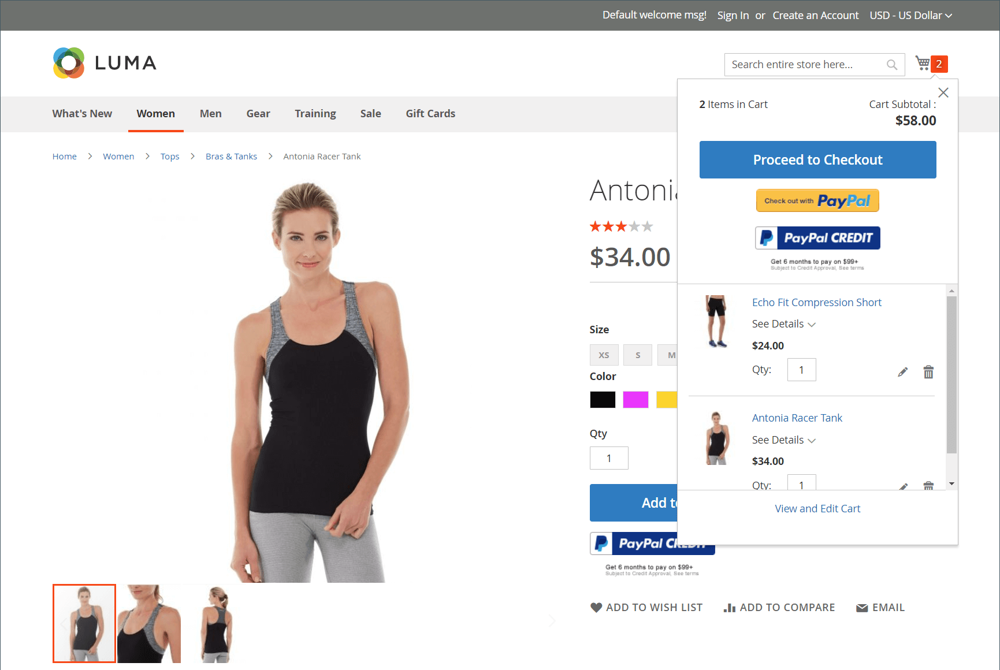
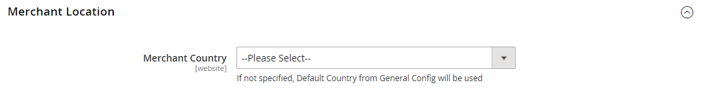

# PayPal Payments Pro

[PayPal Payments Pro][3] では、マーチャントアカウントと支払いゲートウェイのすべての利点を 1 つにまとめ、独自の完全にカスタマイズされたチェックアウトエクスペリエンスを作成できます。 PayPal Express Checkout は PayPal Payments Pro で自動的に有効になるので、1 億 1,000 万人を超えるアクティブな PayPal ユーザーをタップできます。

{width="700" zoomable="yes"}

>[!IMPORTANT]
>
>**PSD2 の要件：**  
>2019 年 9 月 14 日現在、ヨーロッパの銀行は、満たさない支払いを辞退する可能性があります [PSD2](../getting-started/compliance-payment-services-directive.md) 要件。 PSD2 に準拠するには、PayPal Payments Pro をサードパーティのプラグインと統合する必要があります。

>[!NOTE]
>
>現在、PayPal Payments Pro は米国、英国、カナダで利用できます。

## 要件

- [PayPal マーチャントアカウント][1] （直接支払が有効な場合）

## チェックアウトワークフロー

1. **顧客がチェックアウトに移動**  — 顧客が買い物かごに製品を追加し、クリック/タップ _チェックアウトに進みます。_.|
1. **顧客が支払い方法を選択**  — チェックアウト時に、顧客は _PayPal 直接支払い_ 」オプションを選択し、クレジットカード情報を入力します。
   - PayPal Payments Pro で支払う場合、顧客はチェックアウトプロセス中にサイトに滞在します。
   - PayPal Express Checkout で支払う場合、顧客は PayPal サイトにリダイレクトされ、トランザクションを完了します。

お客様のリクエストに応じて、ストア管理者は管理者から注文を作成し、PayPal Payments Pro を使用してトランザクションを処理することもできます。

## 注文処理ワークフロー

1. **発注済み**  — 注文は、ストアの管理者または PayPal マーチャントアカウントから処理できます。

1. **[!UICONTROL Payment Action]**  — 設定で指定された支払い処理が注文に適用されます。 オプションは次のとおりです。

   - **許可**  — コマースは、 _処理中_ ステータス。 この場合、認可される金額は承認待ちです。
   - **販売** - Commerce は、販売注文と請求書の両方を作成します。
   - **Capture** - PayPal は、顧客残高、銀行口座、クレジットカードから商人口座に注文金額を振り替えます。

1. **請求** - PayPal が Commerce に即時支払い通知メッセージを送信した後、Commerce で請求書が作成されます。

   PayPal マーチャントアカウントで即時支払い通知が有効になっていることを確認します。

   >[!NOTE]
   >
   >必要に応じて、注文の一部を指定した数量の製品に対して請求することができます。 送信された部分的な請求書ごとに、一意の ID を持つ個別の取得トランザクションが使用可能になり、別の請求書が生成されます。

   承認のみの支払トランザクションは、全注文額が取り込まれた後にのみクローズされます。

   注文額が完全に請求されるまで、いつでもオンラインで注文を無効にできます。

1. **戻り値**  — 顧客が購入した商品を返品し、払い戻しを要求した場合、注文額の取得と請求書の作成と同様に、管理者または PayPal マーチャントアカウントからオンライン払い戻しを作成できます。

## PayPal アカウントを設定する

PayPal Payments Pro を Commerce に設定する前に、PayPal Web サイトでマーチャントアカウントを設定する必要があります。

1. にログインします。 [PayPal ビジネスアカウント](https://manager.paypal.com/).

1. PayPal マネージャーメニューで、を選択します。 **[!UICONTROL Service Settings]**.

1. の下 **[!UICONTROL Hosted Checkout Pages]**&#x200B;をクリックし、 **[!UICONTROL Set Up]**.

1. の下 **[!UICONTROL Choose your settings]**，設定 **[!UICONTROL Transaction Process Mode]** から `Live`.

1. の下 **[!UICONTROL Display options on payment page]**，設定 **[!UICONTROL Cancel URL Method]** から `POST`.

1. の下 **[!UICONTROL Billing Information]**、カードのセキュリティコードを選択します。 **[!UICONTROL CSC]** 必須フィールドと編集可能フィールドの両方のチェックボックス。

1. の下 **[!UICONTROL Payment Confirmation]**，設定 **[!UICONTROL Return URL Method]** から `POST`.

1. の下 **[!UICONTROL Security Options]**、次の設定をおこないます。

   - **[!UICONTROL AVS]**: `No`
   - **[!UICONTROL CSC]**: `No`
   - **[!UICONTROL Enable Secure Token]**: `Yes`

1. クリック **[!UICONTROL Save Changes]**.

1. Adobe Analytics の _PayPal マネージャ_ メニュー、選択 **[!UICONTROL Service Settings]** および _ホストされるチェックアウトページ_&#x200B;を選択します。 **[!UICONTROL Customize]**.

1. 選択 **[!UICONTROL Layout C]**.

   レイアウト C はクレジットカードとデビットカードのフィールドのみを表示し、サイト上に枠付けしたり、スタンドアロンのポップアップとして使用したりできます。 サイズは 490 x 565 ピクセルで固定され、エラーメッセージ用の余分なスペースがあります。 一部のシステムでは、この設定により、透過的なリダイレクトの問題が修正されます。

1. クリック **[!UICONTROL Save and Publish]**.

1. PayPal マネージャーメニューで、を選択します。 **[!UICONTROL Account Administration]**. の下 **[!UICONTROL Manage Security]**&#x200B;をクリックし、 **[!UICONTROL Transaction Settings]**.

1. 設定 **[!UICONTROL Allow reference transactions]** から `Yes`.

1. クリック **[!UICONTROL Confirm]**.

   >[!NOTE]
   >
   >複数のコマース Web サイトを持っている場合は、それぞれに対して個別の PayPal Payments Pro アカウントを作成する必要があります。

1. 別のユーザーを設定する（PayPal で推奨）:

   - メインメニューの 2 行目で、 **[!UICONTROL Manage Users]**.

   - 別のユーザーをアカウントに追加するには、 **[!UICONTROL Add User]**. リンクは「ユーザーを管理」タイトルのすぐ上にあります。

   - 次のセクションの必須フィールドに入力します。 _[!UICONTROL Add User]_フォーム：

      - [!UICONTROL Admin Confirmation]
      - [!UICONTROL User Information]
      - [!UICONTROL User Login Information]
      - [!UICONTROL Assign Privilege to User]

   - クリック **[!UICONTROL Update]**.

1. PayPal アカウントからログアウトするようにしてください。

## PayPal Payments Pro をコマースで設定する

>[!NOTE]
>
>2 つの PayPal ソリューションを同時にアクティブにすることができます。 [PayPal Express チェックアウト](paypal-express-checkout.md)それに加えて、 [オールインワンソリューション](paypal.md#paypal-all-in-one-payment-solutions). 支払い方法を変更すると、以前使用していたものが自動的に無効になります。

>[!TIP]
>
>クリック **[!UICONTROL Save Config]** いつでも作業内容を保存できます。

### 手順 1：設定の開始

1. 次の日： _管理者_ サイドバー、移動 **[!UICONTROL Stores]** > _[!UICONTROL Settings]_>**[!UICONTROL Configuration]**.

1. 左側のパネルで、を展開します。 **[!UICONTROL Sales]** を選択します。 **[!UICONTROL Payment Methods]**.

1. コマースインストールに複数の Web サイト、ストア、または表示がある場合は、 **[!UICONTROL Store View]** を、この設定を適用するストア表示に追加します。

1. Adobe Analytics の _[!UICONTROL Merchant Location]_セクションで、**[!UICONTROL Merchant Country]**ビジネスの所在地

   この設定は、設定に表示される PayPal ソリューションの選択を決定します。

   {width="600" zoomable="yes"}

1. 展開 **[!UICONTROL PayPal All-in-One Payment Solution]** をクリックします。 **[!UICONTROL Configure]** 対象： **[!UICONTROL Payments Pro]**.

   {width="600" zoomable="yes"}

### 手順 2：必要な PayPal 設定を完了する

1. 展開  の **[!UICONTROL Payments Pro and Express Checkout]** 」セクションに入力します。

   {width="600" zoomable="yes"}

1. （オプション） **[!UICONTROL Email Associated with your PayPal Merchant Account]**.

   >[!IMPORTANT]
   >
   >E メールアドレスでは、大文字と小文字が区別されます。 支払いを受け取るには、メールアドレスが PayPal マーチャントアカウントで指定されたメールアドレスと一致している必要があります。

   PayPal アカウントをお持ちでない場合は、 **[!UICONTROL Start accepting payments via PayPal]**.

1. PayPal マーチャントアカウントへのログインに使用する次のいずれかの資格情報を入力します。

   - **[!UICONTROL Partner]** - PayPal パートナー ID。
   - **[!UICONTROL Vendor]** - PayPal ユーザーのログイン名。
   - **[!UICONTROL User]** - PayPal アカウントで設定されている別のユーザーの ID。

1. 次を入力します。 **[!UICONTROL Password]** PayPal アカウントに関連付けられている。

1. テスト取引を実行するには、 **[!UICONTROL Test Mode]** から `Yes`.

   サンドボックスで設定をテストする場合は、次のみを使用します。 [クレジットカード番号][2] PayPal で推奨される情報です。 実稼動に移行する準備が整ったら、設定に戻り、テストモードをに設定します。 `No`.

1. システムがプロキシサーバを使用して PayPal システムへの接続を確立する場合は、 **[!UICONTROL Use Proxy]** から `Yes` 次の操作を実行します。

   - の IP アドレスを入力 **[!UICONTROL Proxy Host]**.

   - ポート番号を入力 **[!UICONTROL Proxy Port]**.

   プロキシは、サーバーファイアウォールが PayPal サーバーへの直接アクセスを禁止する場合に使用されます。 その場合、トラフィックの中継にサードパーティサーバーが使用されます。

1. 設定 **[!UICONTROL Enable this Solution]** から `Yes`.

1. 次の項目を選択します。 [PayPal クレジット](paypal.md#paypal-credit-and-pay-later) を顧客に設定する **[!UICONTROL Enable PayPal Credit]** から `Yes`.

1. 顧客の支払い/クレジットカードの詳細を安全に保存したい場合、顧客は毎回支払い情報を再入力する必要がない場合は、 **[!UICONTROL Vault Enabled]** から `Yes`.

### ステップ 3：広告 PayPal クレジット/広告 PayPal PayLater（オプション）の設定

2.4.3 リリース以降、PayPal PayLater は PayPal を含むデプロイメントでサポートされます。 この機能を使用すると、買い物客は購入時に全額を支払う代わりに、隔週の分割払いで注文に対して支払うことができます。 PayPal Credit エクスペリエンスは廃止されました。

設定 **[!UICONTROL Enable PayPal PayLater Experience]** を次のいずれかに変更します。

- `Yes` - PayPal PayLater を宣伝する
- `No` - PayPal クレジットの宣伝を設定するには

#### PayPal クレジットの宣伝

1. 展開  の **[!UICONTROL Advertise PayPal Credit]** 」セクションに入力します。

   {width="600" zoomable="yes"}

1. アカウント情報を取得するには、 **[!UICONTROL Get Publisher ID from PayPal]** そして指示に従う

1. を入力します。 **[!UICONTROL Publisher ID]**.

1. 展開  の **[!UICONTROL Home Page]** 」セクションに入力します。

   {width="600" zoomable="yes"}

1. ページにバナーを配置するには、 **[!UICONTROL Display]** から `Yes`.

1. 設定 **[!UICONTROL Position]** を次のいずれかに変更します。

   - `Header (center)`
   - `Sidebar (right)`

1. 設定 **[!UICONTROL Size]** を次のいずれかに変更します。

   - `190 x 100`
   - `234 x 60`
   - `300 x 50`
   - `468 x 60`
   - `728 x 90`
   - `800 x 66`

1. 展開  残りのセクションと、前の手順を繰り返します。

   - **[!UICONTROL Catalog Category Page]**
   - **[!UICONTROL Catalog Product Page]**
   - **[!UICONTROL Checkout Cart Page]**

#### 広告 PayPal PayLater

1. 展開  の **[!UICONTROL Advertise PayPal PayLater]** 」セクションに入力します。

1. 設定 **[!UICONTROL Enable PayPal PayLater]** から `Yes`.

1. 展開  の **[!UICONTROL Home Page]** 」セクションに入力します。

   {width="600" zoomable="yes"}

1. ページにバナーを配置するには、 **[!UICONTROL Display]** から `Yes`.

1. 設定 **[!UICONTROL Position]** を次のいずれかに変更します。

   - `Header (center)`
   - `Sidebar`

1. 設定 **[!UICONTROL Style Layout]** を次のいずれかに変更します。

   - `Text`
   - `Flex`

1. の場合 [!UICONTROL Style Layout] **[!UICONTROL Text]** 唯一、設定 **[!UICONTROL Logo Type]** を次のいずれかに変更します。

   - `Primary`
   - `Alternative`
   - `Inline`
   - `None`

1. の場合 [!UICONTROL Style Layout] **[!UICONTROL Text]** 唯一、設定 **[!UICONTROL Logo Position]** を次のいずれかに変更します。

   - `Left`
   - `Right`
   - `Top`

1. の場合 [!UICONTROL Style Layout] **[!UICONTROL Text]** 唯一、設定 **[!UICONTROL Text Color]** を次のいずれかに変更します。

   - `Black`
   - `White`
   - `Monochrome`
   - `Grayscale`

1. の場合 [!UICONTROL Style Layout] **[!UICONTROL Text]** 唯一、設定 **[!UICONTROL Text Size]** を次のいずれかに変更します。

   - `10px`
   - `11px`
   - `12px`
   - `13px`
   - `14px`
   - `15px`
   - `16px`

1. の場合 [!UICONTROL Style Layout] **[!UICONTROL Flex]** 唯一、設定 **[!UICONTROL Ratio]** を次のいずれかに変更します。

   - `1x1`
   - `1x4`
   - `8x1`
   - `20x1`

1. の場合 [!UICONTROL Style Layout] **[!UICONTROL Flex]** 唯一、設定 **[!UICONTROL Color]** を次のいずれかに変更します。

   - `Blue`
   - `Black`
   - `White`
   - `White No Border`
   - `Gray`
   - `Monochrome`
   - `Grayscale`

1. 展開  残りのセクションと、前の手順を繰り返します。

   - **[!UICONTROL Catalog Product Page]**
   - **[!UICONTROL Checkout Cart Page]**
   - **[!UICONTROL Checkout Payment Step]**
   - **[!UICONTROL Catalog Category Page]**

### 手順 4：基本設定の完了

1. 展開  の **[!UICONTROL Basic Settings - PayPal Payments Pro]** 」セクションに入力します。

   {width="600" zoomable="yes"}

1. の場合 **[!UICONTROL Title]**、チェックアウト時に PayPal Payments Pro を識別するタイトルを入力します。

   タイトルは、 _デビットまたはクレジットカード_.

1. 複数の支払い方法を提供する場合は、次の項目に数値を入力します： **[!UICONTROL Sort Order]** PayPal Payments Pro がチェックアウト時に他の支払い方法と共にリストされた場合に表示される順序を決定する。

   この数は他の支払い方法に対する相対値です。 (`0` =最初 `1` =秒 `2` = 3 番目、など )

1. 設定 **[!UICONTROL Payment Action]** を次のいずれかに変更します。

   - `Authorization` ・買い付けを承認するが、資金を保留する。 金額は、そのまま取り下げられない _キャプチャ_ 商人が
   - `Sale`  — 購入金額は、承認され、顧客アカウントから直ちに取り下げられます。

1. の場合 **[!UICONTROL Credit Card Settings]**、ストアでの支払いに使用するクレジットカードを選択します。

   複数のカードを選択するには、Ctrl キー (PC) または Command キー (Mac) を押しながら各カードをクリックします。

   >[!NOTE]
   >
   >American Express は、追加の合意を必要とします。

### 手順 5：詳細設定の完了

1. 展開  の **[!UICONTROL Advanced Settings]** 」セクションに入力します。

   {width="600" zoomable="yes"}

1. 設定 **[!UICONTROL Payment Applicable From]** を次のいずれかに変更します。

   - `All Allowed Countries`  — すべてのお客様から [国](../getting-started/store-details.md#country-options) ストア設定で指定された場合、この支払い方法を使用できます。
   - `Specific Countries`  — このオプションを選択した後、 _[!UICONTROL Payment from Specific Countries]_リストが表示されます。 Ctrl キー (PC) または Command キー (Mac) を押しながら、リスト内の顧客がストアで購入できる国を選択します。

1. 支払いシステムとの通信をログファイルに書き込むには、 **[!UICONTROL Debug Mode]** から `Yes`.

   >[!NOTE]
   >
   >PCI データセキュリティ基準に従って、クレジットカード情報はログファイルに記録されません。

1. ホストの信頼性を検証するには、次のように設定します。 **[!UICONTROL Enable SSL Verification]** から `Yes`.

1. 顧客に CVV コードの入力を要求するには、 **[!UICONTROL Require CVV Entry]** から `Yes`.

1. 展開  の **[!UICONTROL CVV and AVS Settings]** 」セクションに入力します。

1. アドレス検証システムで不一致が特定された場合にトランザクションを拒否するタイミングを決定するには、次の各シナリオの処理方法を指定します。

   - 不一致の番地の不一致に基づいて取引を拒否するには、 **[!UICONTROL AVS Street Does Not Match]** から `Yes`.

   - 郵便番号の不一致に基づいてトランザクションを却下するには、 **[!UICONTROL AVS Zip Does Not Match]** から `Yes`.

   - 不一致の国 ID に基づいてトランザクションを却下するには、 **[!UICONTROL International AVS Indicator Does Not Match]** から `Yes`.

   - 不一致の CVV コードに基づいてトランザクションを拒否するには、 **[!UICONTROL International Card Security Code Does Not Match]** から `Yes`.

   {width="600" zoomable="yes"}

1. ストアの必要に応じて、次のセクションに入力します。

   - [決済レポート設定](#settlement-report-settings)
   - [フロントエンドエクスペリエンス設定](#frontend-experience-settings)

#### 決済レポート設定

1. 展開  の **[!UICONTROL Settlement Report Settings]** 」セクションに入力します。

   {width="600" zoomable="yes"}

1. の場合 **[!UICONTROL SFTP Credentials]**、次の操作を実行します。

   - PayPal のセキュア FTP サーバーに新規登録済みの場合は、次の SFTP ログイン資格情報を入力します。

      - ログイン
      - パスワード

   - サイト上で Payments Pro を使用して運用を開始する前にテストレポートを実行するには、 **[!UICONTROL Sandbox Mode]** から `Yes`.

   - 次を入力します。 **[!UICONTROL Custom Endpoint Hostname or IP Address]**.

     デフォルトでは、値は `reports.paypal.com`.

   - 次を入力します。 **[!UICONTROL Custom Path]** レポートが保存される場所。

     デフォルトでは、値は `/ppreports/outgoing`.

1. スケジュールに従ってレポートを生成するには、 **[!UICONTROL Scheduled Fetching]** 設定：

   - 設定 **[!UICONTROL Enable Automatic Fetching]** から `Yes`.

   - 設定 **[!UICONTROL Schedule]** を次のいずれかに変更します。

      - `Daily`
      - `Every 3 Days`
      - `Every 7 Days`
      - `Every 10 Days`
      - `Every 14 Days`
      - `Every 30 Days`
      - `Every 40 Days`

     PayPal は各レポートを 45 日間保持します。

   - 設定 **[!UICONTROL Time of Day]** を、時間、分および秒（秒）に設定します。

#### フロントエンドエクスペリエンス設定

以下を使用します。 _[!UICONTROL Frontend Experience Settings]_サイトに表示する PayPal ロゴを選択し、PayPal マーチャントページの外観をカスタマイズします。

1. 展開  の **[!UICONTROL Frontend Experience Settings]** 」セクションに入力します。

   {width="600" zoomable="yes"}

1. を選択します。 **[!UICONTROL PayPal Product Logo]** ストアの PayPal ブロックに表示する

   PayPal ロゴは、4 つのスタイルと 2 つのサイズで使用できます。

   - `No Logo`
   - `We Prefer PayPal (150 x 60 or 150 x 40)`
   - `Now Accepting PayPal (150 x 60 or 150 x 40)`
   - `Payments by PayPal (150 x 60 or 150 x 40)`
   - `Shop Now Using PayPal (150 x 60 or 150 x 40)`

1. PayPal のマーチャントページの外観をカスタマイズするには、次の手順を実行します。

   - 名前を入力 **[!UICONTROL Page Style]** PayPal のマーチャントページに適用する

      - `paypal` - PayPal ページスタイルを使用します。
      - `primary` - _プライマリ_ スタイルを設定します。
      - `your_custom_value`  — アカウントプロファイルで指定されたカスタムの支払いページスタイルを使用します。

   - の場合 **[!UICONTROL Header Image URL]**」で、支払いページの左上隅に表示する画像の URL を入力します。 最大ファイルサイズは、幅 750 ピクセル、高さ 90 ピクセルです。

     >[!NOTE]
     >
     >PayPal では、画像を安全な (https) サーバーに配置することをお勧めします。 そうしないと、ブラウザーは、 _ページにセキュリティで保護された項目とセキュリティで保護されていない項目の両方が含まれています_.

   - ページの色を設定するには、6 文字の 16 進コード ( `#` 記号。次の各項目に対して使用します。

      - **[!UICONTROL Header Background Color]**  — チェックアウトページヘッダーの背景色。
      - **[!UICONTROL Header Border Color]**  — ヘッダーの周囲の 2 ピクセルの境界線のカラー。
      - **[!UICONTROL Page Background Color]**  — チェックアウトページ、ヘッダーおよび支払いフォームの周囲の背景色。

### ステップ 6: PayPal Express Checkout の基本設定を完了する

1. 展開  の **[!UICONTROL Basic Settings - PayPal Express Checkout]** 」セクションに入力します。

   {width="600" zoomable="yes"}

1. の場合 **[!UICONTROL Title]**、チェックアウト時にこの支払い方法を識別するタイトルを入力します。

   タイトルをに設定します。 _PayPal_ 各ストア表示に対して、をお勧めします。

1. 複数の支払い方法を提供する場合は、次の項目に数値を入力します： **[!UICONTROL Sort Order]** PayPal Express Checkout が他の支払い方法と共にリストされた際に表示される順序を決定する。

   この数は他の支払い方法に対する相対値です。 (`0` =最初 `1` =秒 `2` = 3 番目、など )

1. 設定 **[!UICONTROL Payment Action]** を次のいずれかに変更します。

   - `Authorization` ・買い付けを承認し、資金を保留する。 金額は、そのまま取り下げられない _キャプチャ_ 商人が
   - `Sale`  — 購入金額は、お客様のアカウントから承認され、直ちに取り下げられます。

1. 次の手順で _[!UICONTROL Check out with PayPal]_製品ページのボタンをクリックし、**[!UICONTROL Display on Product Details Page]**から `Yes`.

### ステップ 7: PayPal Express チェックアウトの詳細設定を完了する

1. 展開  の **[!UICONTROL Advanced Settings]** 」セクションに入力します。

   {width="600" zoomable="yes"}

1. 設定 **[!UICONTROL Display on Shopping Cart]** から `Yes`.

1. 設定 **[!UICONTROL Payment Applicable From]** を次のいずれかに変更します。

   - `All Allowed Countries`  — すべてのお客様から [国](../getting-started/store-details.md#country-options) ストア設定で指定された場合、この支払い方法を使用できます。
   - `Specific Countries`  — このオプションを選択した後、 _[!UICONTROL Payment from Specific Countries]_リストが表示されます。 複数の国を選択するには、Ctrl キー (PC) または Command キー (Mac) を押しながら各項目をクリックします。

1. 支払いシステムとの通信をログファイルに書き込むには、 **[!UICONTROL Debug Mode]** から `Yes`.

   >[!NOTE]
   >
   >PCI データセキュリティ基準に従って、クレジットカード情報はログファイルに記録されません。

1. ホストの信頼性を検証するには、次のように設定します。 **[!UICONTROL Enable SSL Verification]** から `Yes`.

1. PayPal サイトから顧客の注文の完全な概要を行項目別に表示するには、 **[!UICONTROL Transfer Cart Line Items]** から `Yes`.

1. 顧客が注文確認のためにストアに戻ることなく PayPal サイトからトランザクションを完了できるようにするには、 **[!UICONTROL Skip Order Review Step]** から `Yes`.

1. 完了したら、「 **[!UICONTROL Save Config]**.

[1]: https://www.paypal.com/webapps/mpp/how-to-sell-online
[2]: https://www.paypalobjects.com/en_AU/vhelp/paypalmanager_help/credit_card_numbers.htm
[3]: https://developer.paypal.com/docs/paypal-payments-pro/
