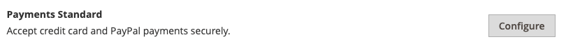
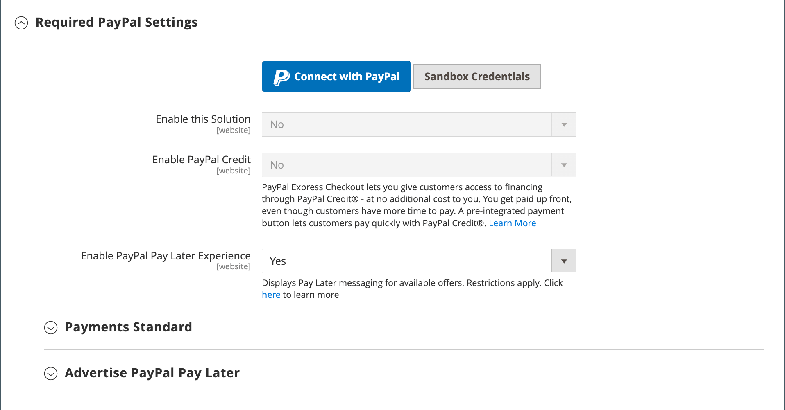
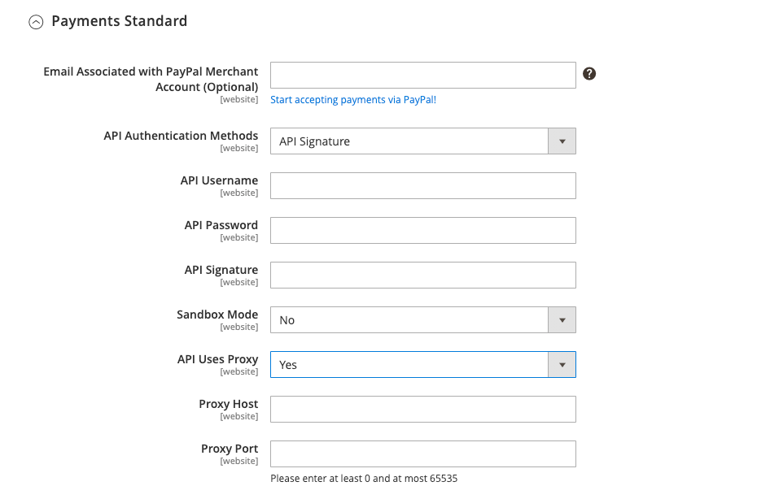
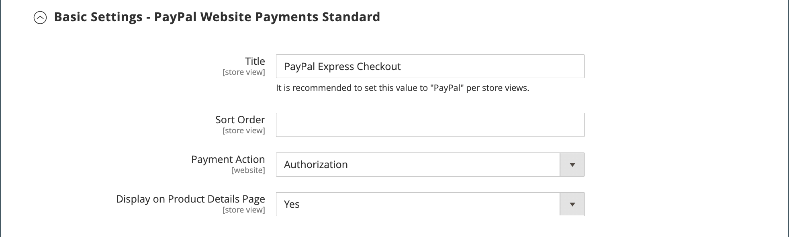

# PayPal Payments Standard

[PayPal Payments Standard](https://developer.paypal.com/docs/paypal-payments-standard/mobile-paypal-payments-standard/)は、オンラインでの支払いを受け付ける最も簡単な方法です。 チェックアウトボタンをストアに追加するだけで、クレジットカードとPayPalの両方で支払いをおこなえる利便性を顧客に提供できます。

>[!NOTE]
>
>米国外の販売者の場合は、_PayPal Web サイトの支払い標準_&#x200B;と呼ばれます。

PayPal Payments Standardでは、モバイルデバイスでクレジットカードをスワイプできます。 月額料金は発生せず、eBayを通じて支払いを受けることができます。 対応しているクレジットカードには、Visa、MasterCard、Discover、American Expressなどがあります。 さらに、顧客は個人のPayPal アカウントから直接支払うことができます。 PayPal Payments Standardは、PayPalの世界各国のリファレンスリストに記載されているすべての国で利用できます。

>[!IMPORTANT]
>
>**PSD2の要件：**  
>2019年9月14日の時点で、ヨーロッパの銀行は[PSD2](../getting-started/compliance-payment-services-directive.md)の要件を満たさない支払いを拒否する可能性があります。すべての要件はPayPalで処理されるため、PayPal Payments StandardがPSD2に準拠するために何もする必要はありません。

## 加盟店の要件

- [PayPal法人向けアカウント](https://www.paypal.com/webapps/mpp/how-to-sell-online)

## チェックアウトワークフロー

お客様の場合、PayPal Payments Standardは、個人のPayPal アカウントのクレジットカード情報が最新の場合のワンステップのプロセスです。

1. **お客様からの注文** – お客様は、_今すぐ支払う_ ボタンをクリックまたはタップして、購入を完了します。

1. **PayPalはトランザクションを処理します** – お客様は、トランザクションを完了するためにPayPal サイトにリダイレクトされます。

## PayPal Payments Standardの設定

>[!NOTE]
>
>PayPal Payments Standardは、Express Checkoutを含む他のPayPal方式と同時に使用することはできません。 支払いソリューションを変更すると、以前に使用したものは無効になります。

>[!TIP]
>
>いつでも&#x200B;**[!UICONTROL Save Config]**&#x200B;をクリックして、進行状況を保存します。

### 手順1：設定を開始する

この設定方法は、既存のPayPal アカウントを持っていることを前提としています。

1. _管理者_ サイドバーで、**[!UICONTROL Stores]** > _[!UICONTROL Settings]_>**[!UICONTROL Configuration]**&#x200B;に移動します。

1. 左側のパネルで、**[!UICONTROL Sales]**&#x200B;を展開し、**[!UICONTROL Payment Methods]**&#x200B;を選択します。

1. Commerce インストールに複数のweb サイト、ストア、またはビューがある場合は、この設定を適用するストアビューに&#x200B;**[!UICONTROL Store View]**&#x200B;を設定します。

1. 「_[!UICONTROL Merchant Location]_」セクションで、ビジネスが存在する&#x200B;**[!UICONTROL Merchant Country]**&#x200B;を選択します。

   この設定は、設定に表示されるPayPal ソリューションの選択を決定します。

   {width="600" zoomable="yes"}

1. **[!UICONTROL PayPal All-in-One Payment Solutions]**&#x200B;を展開し、**[!UICONTROL Payments Standard]**&#x200B;の&#x200B;**[!UICONTROL Configure]**&#x200B;をクリックします。

   {width="700" zoomable="yes"}

### ステップ 2:PayPal アカウントを有効にして接続する

{width="600" zoomable="yes"}

1. テストまたは本番用にアカウントを接続します。

   - テスト （開発） モードの場合は、**[!UICONTROL Sandbox Credentials]**&#x200B;をクリックし、[PayPal サンドボックス &#x200B;](https://developer.paypal.com/docs/api-basics/sandbox/)資格情報を入力します。
   - 実稼動モードの場合は、**[!UICONTROL Connect with PayPal]**&#x200B;をクリックし、実稼動アカウントの資格情報を入力します。

   接続が検証されたら、続行できます。

1. **[!UICONTROL Enable this Solution]**&#x200B;を`Yes`に設定します。

1. [PayPal クレジット &#x200B;](paypal.md#paypal-credit-and-pay-later)を顧客に提供する場合は、**[!UICONTROL Enable PayPal Credit]**&#x200B;を`Yes`に設定します。

### ステップ 3：支払い標準設定を完了する

1. **[!UICONTROL Payments Standard]** セクションのを展開します。

   {width="600" zoomable="yes"}

1. **[!UICONTROL Email Associated with your PayPal Merchant Account]**&#x200B;を入力します。

   >[!IMPORTANT]
   >
   >メールアドレスでは、大文字と小文字が区別されます。 支払いを受け取るには、入力するメールアドレスがPayPal加盟店アカウントで指定されたメールアドレスと一致している必要があります。

   PayPal アカウントをお持ちでない場合は、**[!UICONTROL Start accepting payments via PayPal]**&#x200B;をクリックしてください。

1. **[!UICONTROL API Authentication Methods]**&#x200B;を次のいずれかに設定します：

   - `API Signature` – このPayPal認証方法は、実装が最も簡単で、ユーザー名、パスワード、アカウントを識別する一意の文字と数字の文字列に基づいています。 API署名の資格情報が期限切れになりません。
   - `API Certificate` – このPayPal認証方法はより安全で、ユーザー名、パスワード、ダウンロード可能な証明書に基づいています。 API資格情報は3年後に有効期限が切れ、更新する必要があります。

   必要に応じて、次の手順を実行します。

   - **[!UICONTROL API Username]**
   - **[!UICONTROL API Password]**
   - **[!UICONTROL API Signature]**

1. サンドボックスアカウントの資格情報を使用している場合は、**[!UICONTROL Sandbox Mode]**&#x200B;を`Yes`に設定します。

   サンドボックスで設定をテストする場合は、PayPalが推奨する[&#x200B; クレジットカード番号](https://www.paypalobjects.com/en_AU/vhelp/paypalmanager_help/credit_card_numbers.htm)のみを使用します。 本番環境に移行する準備ができたら、設定に戻り、サンドボックスモードを`No`に設定し、本番環境のPayPal アカウントに接続します。

1. お使いのシステムでプロキシサーバーを使用してAdobe CommerceまたはMagento Open SourceとPayPalの決済システムを接続する場合は、**[!UICONTROL API Uses Proxy]**&#x200B;を`Yes`に設定し、次の操作を行います。

   - **[!UICONTROL Proxy Host]**
   - **[!UICONTROL Proxy Port]**

### ステップ 4:Advertising PayPal Credit / Advertising PayPal PayLaterの設定（オプション）

2.4.3 リリース以降、PayPal PayLaterは、PayPalを含むデプロイメントでサポートされています。 この機能により、買い物客は購入時に全額を支払うのではなく、隔週の分割で注文の支払いを行うことができます。 PayPal Credit エクスペリエンスは非推奨（廃止予定）です。

**[!UICONTROL Enable PayPal PayLater Experience]**&#x200B;を次のいずれかに設定します：

- `Yes` - Advertising PayPal PayLaterを設定するには
- `No` - Advertising PayPal クレジットを設定するには

#### Advertising PayPal Credit

1. **[!UICONTROL Advertise PayPal Credit]** セクションのを展開します。

   {width="600" zoomable="yes"}

1. アカウント情報を取得するには、**[!UICONTROL Get Publisher ID from PayPal]**&#x200B;をクリックし、指示に従います。

1. **[!UICONTROL Publisher ID]**&#x200B;を入力します。

   {width="600" zoomable="yes"}

1. **[!UICONTROL Home Page]** セクションのを展開します。

1. ページにバナーを配置するには、**[!UICONTROL Display]**&#x200B;を`Yes`に設定します。

1. **[!UICONTROL Position]**&#x200B;を次のいずれかに設定します：

   - `Header (center)`
   - `Sidebar (right)`

1. **[!UICONTROL Size]**&#x200B;を次のいずれかに設定します：

   - `190 x 100`
   - `234 x 60`
   - `300 x 50`
   - `468 x 60`
   - `728 x 90`
   - `800 x 66`

1. 残りのセクションを展開し、前の手順を繰り返します。

   - **[!UICONTROL Catalog Category Page]**
   - **[!UICONTROL Catalog Product Page]**
   - **[!UICONTROL Checkout Cart Page]**

#### PayPal PayLaterの広告

1. **[!UICONTROL Advertise PayPal PayLater]** セクションのを展開します。

1. **[!UICONTROL Enable PayPal PayLater]**&#x200B;を`Yes`に設定します。

1. **[!UICONTROL Home Page]** セクションのを展開します。

   {width="600" zoomable="yes"}

1. ページにバナーを配置するには、**[!UICONTROL Display]**&#x200B;を`Yes`に設定します。

1. **[!UICONTROL Position]**&#x200B;を次のいずれかに設定します：

   - `Header (center)`
   - `Sidebar`

1. **[!UICONTROL Style Layout]**&#x200B;を次のいずれかに設定します：

   - `Text`
   - `Flex`

1. [!UICONTROL Style Layout] **[!UICONTROL Text]**&#x200B;のみの場合は、**[!UICONTROL Logo Type]**&#x200B;を次のいずれかに設定します。

   - `Primary`
   - `Alternative`
   - `Inline`
   - `None`

1. [!UICONTROL Style Layout] **[!UICONTROL Text]**&#x200B;のみの場合は、**[!UICONTROL Logo Position]**&#x200B;を次のいずれかに設定します。

   - `Left`
   - `Right`
   - `Top`

1. [!UICONTROL Style Layout] **[!UICONTROL Text]**&#x200B;のみの場合は、**[!UICONTROL Text Color]**&#x200B;を次のいずれかに設定します。

   - `Black`
   - `White`
   - `Monochrome`
   - `Grayscale`

1. [!UICONTROL Style Layout] **[!UICONTROL Text]**&#x200B;のみの場合は、**[!UICONTROL Text Size]**&#x200B;を次のいずれかに設定します。

   - `10px`
   - `11px`
   - `12px`
   - `13px`
   - `14px`
   - `15px`
   - `16px`

1. [!UICONTROL Style Layout] **[!UICONTROL Flex]**&#x200B;のみの場合は、**[!UICONTROL Ratio]**&#x200B;を次のいずれかに設定します。

   - `1x1`
   - `1x4`
   - `8x1`
   - `20x1`

1. [!UICONTROL Style Layout] **[!UICONTROL Flex]**&#x200B;のみの場合は、**[!UICONTROL Color]**&#x200B;を次のいずれかに設定します。

   - `Blue`
   - `Black`
   - `White`
   - `White No Border`
   - `Gray`
   - `Monochrome`
   - `Grayscale`

1. 残りのセクションを展開し、前の手順を繰り返します。

   - **[!UICONTROL Catalog Product Page]**
   - **[!UICONTROL Checkout Cart Page]**
   - **チェックアウトの支払い手順**
   - **[!UICONTROL Catalog Category Page]**

### 手順5：基本設定を完了する

1. **[!UICONTROL Basic Settings - PayPal Website Payments Standard]** セクションのを展開します。

   {width="600" zoomable="yes"}

1. **[!UICONTROL Title]**&#x200B;に、チェックアウト時にこの支払い方法を識別するタイトルを入力します。

   すべてのストアビューにタイトル _PayPal_&#x200B;を使用することをお勧めします。

1. 複数の支払い方法を提供している場合は、**[!UICONTROL Sort Order]**&#x200B;の数値を入力して、他の支払い方法と共に表示されるときにPayPal Payments Standardが表示される順序を決定します。

   この数字は他の支払い方法に関連しています。 （`0` = first, `1` = second, `2` = thirdなど）

1. **[!UICONTROL Payment Action]**&#x200B;を次のいずれかに設定します：

   - `Authorization` – 購入を承認し、資金を保留します。 金額は、加盟店が獲得するまで引き落とされません。
   - `Sale` – 購入金額が承認され、お客様のアカウントから直ちに引き落とされます。

1. 製品ページに&#x200B;_[!UICONTROL Check out with PayPal]_&#x200B;ボタンを表示するには、**[!UICONTROL Display on Product Details Page]**&#x200B;を`Yes`に設定します。

### 手順6：詳細設定を完了する

1. **[!UICONTROL Advanced Settings]** セクションのを展開します。

   {width="600" zoomable="yes"}

1. PayPal Payments Standardをショッピングカートとミニカートの両方から利用できるようにするには、**[!UICONTROL Display on Shopping Cart]**&#x200B;を`Yes`に設定します。

1. **[!UICONTROL Payment from Applicable Countries]**&#x200B;を次のいずれかに設定します：

   - `All Allowed Countries` - ストア設定で指定されたすべての[国](../getting-started/store-details.md#country-options)のお客様は、この支払い方法を使用できます。
   - `Specific Countries` – このオプションを選択すると、_[!UICONTROL Payment from Specific Countries]_&#x200B;リストが表示されます。 複数の国を選択するには、Ctrl キー（PC）またはCommand キー（Mac）を押しながら、各オプションをクリックします。

1. 支払いシステムとの通信をログファイルに記録するには、**[!UICONTROL Debug Mode]**&#x200B;を`Yes`に設定します。

   >[!NOTE]
   >
   >ログファイルはサーバーに保存され、開発者のみがアクセスできます。 PCI データセキュリティ基準に従い、クレジットカード情報はログファイルに記録されません。

1. SSL検証を有効にするには、**[!UICONTROL Enable SSL Verification]**&#x200B;を`Yes`に設定します。

1. PayPal支払いページで注文の各行項目の概要を表示するには、**[!UICONTROL Transfer Cart Line Items]**&#x200B;を`Yes`に設定します。

   概要に最大10個の配送オプションを含めるには、**[!UICONTROL Transfer Shipping Options]**&#x200B;を`Yes`に設定します。 （このオプションは、行項目が「転送」に設定されている場合にのみ表示されます）。

1. PayPal承認ボタンに使用される画像の種類を判断するには、**[!UICONTROL Shortcut Buttons Flavor]**&#x200B;を次のいずれかに設定します。

   - `Dynamic` - （推奨） PayPal サーバーから動的に変更できる画像を表示します。
   - `Static` – 動的に変更できない特定の画像を表示します。

1. PayPal アカウントをお持ちでないお客様がこの方法で購入できるようにするには、**[!UICONTROL Enable PayPal Guest Checkout]**&#x200B;を`Yes`に設定します。

1. **[!UICONTROL Require Customer's Billing Address]**&#x200B;を次のいずれかに設定します：

   - `Yes` – すべての購入に対して顧客の請求先住所が必要です。
   - `No` – 購入に顧客の請求先住所は必要ありません。
   - `For Virtual Quotes Only` – 仮想見積に対してのみ、お客様の請求先住所が必要です。

1. 顧客アカウントで有効な請求契約書がない場合に、お客様がストアと[PayPal請求契約書](paypal-billing-agreements.md)に入力できるようにするには、**[!UICONTROL Billing Agreement Signup]**&#x200B;を次のいずれかに設定します。

   - `Auto` – お客様は、Express Checkout フロー中に請求契約書に入力するか、別の支払い方法を使用できます。
   - `Ask Customer` – お客様は、Express Checkout ワークフロー中に請求契約書を入力するかどうかを決定できます。
   - `Never` – お客様は、Express チェックアウト ワークフロー中に請求契約書に入力できません。

   >[!NOTE]
   >
   >加盟店は、アカウントの請求契約書を有効にするために、PayPal加盟店テクニカルサポートをリクエストする必要があります。 _請求契約書の登録_ パラメーターは、加盟店アカウントに対して請求契約書が有効になっていることをPayPalが確認した後にのみ有効にできます。

1. 注文レビューのために店舗に戻ることなく、PayPal サイトからトランザクションを完了できるようにするには、**[!UICONTROL Skip Order Review Step]**&#x200B;を`Yes`に設定します。

### 手順7：設定を完了して保存する

1. ストアの必要に応じて、次のセクションを完了します。

   - [PayPal請求契約書の設定](#paypal-billing-agreement-settings)
   - [決済レポート設定](#settlement-report-settings)
   - [フロントエンドエクスペリエンス設定](#frontend-experience-settings)

1. 完了したら、**[!UICONTROL Save Config]**&#x200B;をクリックします。

#### PayPal請求契約書の設定

[請求契約書](paypal-billing-agreements.md)とは、複数の注文での使用がPayPalによって承認されている、加盟店とお客様との間の販売契約書です。 チェックアウトプロセス中に、請求契約書の支払いオプションは、会社との請求契約書を既に入力した顧客にのみ表示されます。 PayPalが契約を承認すると、支払いシステムは一意の参照IDを発行して、契約に関連付けられている各注文を識別します。 発注と同様に、顧客が会社と設定できる契約件数に制限はありません。

1. **[!UICONTROL PayPal Billing Agreement Settings]** セクションのを展開します。

   {width="600" zoomable="yes"}

1. **[!UICONTROL Enabled]**&#x200B;を`Yes`に設定します。

1. **[!UICONTROL Title]**&#x200B;に、チェックアウト時にPayPal請求契約書の方法を識別するタイトルを入力します。

1. 複数の支払い方法を提供している場合は、**[!UICONTROL Sort Order]** フィールドに番号を入力して、チェックアウト時に他の支払い方法と一緒に表示される請求契約書の順序を決定します。

1. **[!UICONTROL Payment Action]**&#x200B;を次のいずれかに設定します：

   - `Authorization` – 購入を承認し、資金を保留します。 金額は、加盟店が「獲得」するまで引き落とされません。
   - `Sale` – 購入金額が承認され、お客様のアカウントから直ちに引き落とされます。

1. **[!UICONTROL Payment Applicable From]**&#x200B;を次のいずれかに設定します：

   - `All Allowed Countries` - ストア設定で指定されたすべての国のお客様は、この支払い方法を使用できます。
   - `Specific Countries` – このオプションを選択すると、_[!UICONTROL Payment from Specific Countries]_&#x200B;リストが表示されます。 複数の国を選択するには、Ctrl キー（PC）またはCommand キー（Mac）を押しながら、それぞれの国をクリックします。

1. 支払いシステムとの通信をログファイルに記録するには、**[!UICONTROL Debug Mode]**&#x200B;を`Yes`に設定します。

   >[!NOTE]
   >
   >ログファイルはサーバーに保存され、開発者のみがアクセスできます。 PCI データセキュリティ基準に従い、クレジットカード情報はログファイルに記録されません。

1. SSL検証を有効にするには、**[!UICONTROL Enable SSL Verification]**&#x200B;を`Yes`に設定します。

1. PayPal支払いページでお客様の注文の各行項目の概要を表示するには、**[!UICONTROL Transfer Cart Line Items]**&#x200B;を`Yes`に設定します。

1. 顧客アカウントのダッシュボードから請求契約書を開始できるようにするには、**[!UICONTROL Allow in Billing Agreement Wizard]**&#x200B;を`Yes`に設定します。

#### 決済レポート設定

1. **[!UICONTROL Settlement Report Settings]** セクションのを展開します。

   {width="600" zoomable="yes"}

1. **[!UICONTROL SFTP Credentials]**&#x200B;に対して、次の操作を行います。

   - PayPal Secure FTP Serverにサインアップしている場合は、次のSFTP ログイン資格情報を入力します。

      - ログイン
      - パスワード

   - サイトでExpress Checkoutを使用して本番稼働前にテストレポートを実行するには、**[!UICONTROL Sandbox Mode]**&#x200B;を`Yes`に設定します。

   - **[!UICONTROL Custom Endpoint Hostname or IP Address]**&#x200B;を入力します。

     デフォルトでは、値は`reports.paypal.com`です。

   - レポートを保存する&#x200B;**[!UICONTROL Custom Path]**&#x200B;を入力します。

     デフォルトでは、値は`/ppreports/outgoing`です。

1. スケジュールに従ってレポートを生成するには、**[!UICONTROL Scheduled Fetching]**&#x200B;設定を完了します。

   - **[!UICONTROL Enable Automatic Fetching]**&#x200B;を`Yes`に設定します。

   - **[!UICONTROL Schedule]**&#x200B;を次のいずれかに設定します：

      - `Daily`
      - `Every 3 Days`
      - `Every 7 Days`
      - `Every 10 Days`
      - `Every 14 Days`
      - `Every 30 Days`
      - `Every 40 Days`

     PayPalは、各レポートを45日間保持します。

   - レポートを生成する場合は、**[!UICONTROL Time of Day]**&#x200B;を時間、分、秒に設定します。

#### フロントエンドエクスペリエンス設定

_[!UICONTROL Frontend Experience Settings]_&#x200B;を使用して、サイトに表示するPayPal ロゴを選択し、PayPal マーチャント ページの外観をカスタマイズします。

1. **[!UICONTROL Frontend Experience Settings]** セクションのを展開します。

   {width="600" zoomable="yes"}

1. ストアのPayPal ブロックに表示する&#x200B;**[!UICONTROL PayPal Product Logo]**&#x200B;を選択します。

   PayPalのロゴには4つのスタイルと2つのサイズがあります。

   - `No Logo`
   - `We Prefer PayPal (150 x 60 or 150 x 40)`
   - `Now Accepting PayPal (150 x 60 or 150 x 40)`
   - `Payments by PayPal (150 x 60 or 150 x 40)`
   - `Shop Now Using PayPal (150 x 60 or 150 x 40)`

1. PayPal マーチャントページの外観をカスタマイズするには：

   - PayPal マーチャント ページに適用する&#x200B;**[!UICONTROL Page Style]**&#x200B;の名前を入力します。

      - `paypal` - PayPal ページスタイルを使用します。
      - `primary` - アカウントプロファイルで&#x200B;_primary_ スタイルとして識別したページスタイルを使用します。
      - `your_custom_value` - アカウント プロファイルで指定されたカスタム支払いページ スタイルを使用します。

   - **[!UICONTROL Header Image URL]**&#x200B;に、支払いページの左上隅に表示する画像のURLを入力します。 最大ファイルサイズは、幅750 ピクセル、高さ90 ピクセルです。

     >[!NOTE]
     >
     >PayPalでは、画像が安全な（https）サーバー上にあることをお勧めします。 それ以外の場合、ブラウザーは、_ページにセキュアな項目とセキュアでない項目の両方が含まれていることを警告する場合があります_。

   - ページの色を設定するには、次のそれぞれに`#`記号なしで6文字の16進数コードを入力します。

      - **[!UICONTROL Header Background Color]** - チェックアウト ページ ヘッダーの背景色。
      - **[!UICONTROL Header Border Color]** - ヘッダーの周囲の2 ピクセル境界の色。
      - **[!UICONTROL Page Background Color]** - チェックアウトページと、ヘッダーと支払いフォームの周囲の背景色。
