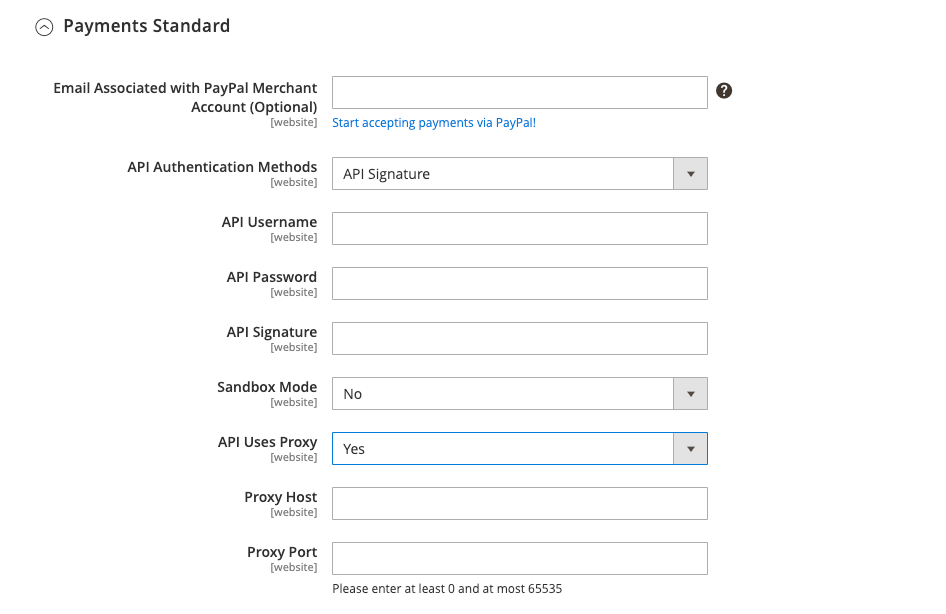

# PayPal 支払い標準

[PayPal Payments Standard][4] は、オンラインで支払いを受け入れる最も簡単な方法です。 お店にチェックアウトボタンを追加するだけで、クレジットカードと PayPal の両方でお支払いの便利さを顧客に提供できます。

>[!NOTE]
>
>米国以外のマーチャントの場合、これは _PayPal Website Payments Standard_ と呼ばれます。

PayPal Payments Standard を使用すると、モバイルデバイスでクレジットカードをスワイプできます。 月額料金はかかりません。eBay を通じて支払いを受けることができます。 サポートされるクレジットカードには、Visa、MasterCard、Discover、American Express が含まれます。 また、お客様は個人の PayPal アカウントから直接支払うことができます。 PayPal Payments Standard は、PayPal のワールドワイドなリファレンスリストのすべての国で利用できます。

>[!IMPORTANT]
>
>**PSD2 の要件：**  
>2019 年 9 月 14 日（PT）現在、ヨーロッパの銀行は、[PSD2](../getting-started/compliance-payment-services-directive.md) の要件を満たさない支払いを拒否する可能性があります。 PayPal Payments Standard がPSD2 に準拠するには、すべての要件が PayPal で処理されるので、何もする必要はありません。

## マーチャントの要件

- [PayPal ビジネスアカウント ][1]

## チェックアウトワークフロー

顧客の場合、PayPal Payments Standard は、個人の PayPal アカウントのクレジットカード情報が最新の場合、1 つの手順で処理されます。

1. **顧客が注文する** - 「_今すぐ支払う_」ボタンをクリックまたはタップして購入を完了します。

1. **PayPal がトランザクションを処理** - トランザクションを完了するために、顧客は PayPal サイトにリダイレクトされます。

## PayPal 支払い標準の設定

>[!NOTE]
>
>PayPal Payments Standard は、Express Checkout を含む他の PayPal メソッドと同時に使用することはできません。 支払いソリューションを変更すると、以前に使用したソリューションは無効になります。

>[!TIP]
>
>「**[!UICONTROL Save Config]**」をクリックすると、いつでも進行状況を保存できます。

### 手順 1：設定の開始

この設定方法は、既存の PayPal アカウントがあることを前提としています。

1. _管理者_ サイドバーで、**[!UICONTROL Stores]**/_[!UICONTROL Settings]_/**[!UICONTROL Configuration]**&#x200B;に移動します。

1. 左側のパネルで「**[!UICONTROL Sales]**」を展開し、「**[!UICONTROL Payment Methods]**」を選択します。

1. Commerceのインストールに複数の web サイト、ストアまたはビューがある場合は、この設定を適用するストアビューに **[!UICONTROL Store View]** を設定します。

1. 「_[!UICONTROL Merchant Location]_」セクションで、ビジネスが所在する&#x200B;**[!UICONTROL Merchant Country]**&#x200B;を選択します。

   この設定により、設定に表示される PayPal ソリューションの選択が決まります。

   {width="600" zoomable="yes"}

1. 「**[!UICONTROL PayPal All-in-One Payment Solutions]**」を展開し、「**[!UICONTROL Configure]**」をクリックして「**[!UICONTROL Payments Standard]**」を選択します。

   {width="700" zoomable="yes"}

### 手順 2:PayPal アカウントを有効にして接続する

{width="600" zoomable="yes"}

1. テストまたは実稼動用にアカウントを接続：

   - テスト（開発）モードの場合は、「**[!UICONTROL Sandbox Credentials]**」をクリックし、[PayPal サンドボックス ][3] 資格情報を入力します。
   - 実稼動モードの場合は、「**[!UICONTROL Connect with PayPal]**」をクリックして、実稼動アカウントの資格情報を入力します。

   接続が検証されたら、続行できます。

1. **[!UICONTROL Enable this Solution]** を `Yes` に設定します。

1. 顧客に [PayPal クレジット ](paypal.md#paypal-credit-and-pay-later) を提供する場合は、**[!UICONTROL Enable PayPal Credit]** を `Yes` に設定します。

### 手順 3：支払の標準設定の完了

1. 「」を展開し、「**[!UICONTROL Payments Standard]**」セクションを展開します。

   {width="600" zoomable="yes"}

1. **[!UICONTROL Email Associated with your PayPal Merchant Account]** を入力します。

   >[!IMPORTANT]
   >
   >メールアドレスでは大文字と小文字が区別されます。 支払いを受け取るには、入力するメールアドレスが PayPal マーチャントアカウントで指定されたメールアドレスと一致する必要があります。

   PayPal アカウントをお持ちでない場合は、[**[!UICONTROL Start accepting payments via PayPal]**] をクリックします。

1. **[!UICONTROL API Authentication Methods]** を次のいずれかに設定します。

   - `API Signature` – この PayPal 認証方法は実装が最も簡単で、ユーザー名、パスワード、およびアカウントを識別する一意の文字列と数字に基づいています。 API 署名資格情報の有効期限はありません。
   - `API Certificate` – この PayPal 認証方法はより安全で、ユーザー名、パスワード、ダウンロード可能な証明書に基づいています。 API 資格情報は 3 年後に期限切れになり、更新する必要があります。

   必要に応じて、次の手順を実行します。

   - **[!UICONTROL API Username]**
   - **[!UICONTROL API Password]**
   - **[!UICONTROL API Signature]**

1. サンドボックスアカウントの資格情報を使用している場合は、**[!UICONTROL Sandbox Mode]** を `Yes` に設定します。

   サンドボックスで設定をテストする場合は、PayPal が推奨する [ クレジットカード番号 ][2] のみを使用します。 実稼動に移行する準備が整ったら、設定に戻り、サンドボックスモードを `No` に設定して、実稼動 PayPal アカウントに接続します。

1. プロキシサーバーを使用してAdobe CommerceまたはMagento Open Sourceと PayPal 支払いシステムを接続する場合は、**[!UICONTROL API Uses Proxy]** を `Yes` に設定し、次の手順を実行します。

   - **[!UICONTROL Proxy Host]**
   - **[!UICONTROL Proxy Port]**

### 手順 4：広告 PayPal クレジット/広告 PayPal PayLater の設定（オプション）

2.4.3 リリース以降、PayPal PayLater は PayPal を含むデプロイメントでサポートされます。 この機能により、買い物客は購入時に全額を支払うのではなく、隔週の分割払いで注文の支払いを行うことができます。 PayPal クレジットエクスペリエンスは非推奨（廃止予定）となりました。

**[!UICONTROL Enable PayPal PayLater Experience]** を次のいずれかに設定します。

- `Yes` - PayPal PayLater をアドバタイズを設定するには
- `No` – 広告 PayPal クレジットを設定する

#### PayPal クレジットのアドバタイズ

1. 「」を展開し、「**[!UICONTROL Advertise PayPal Credit]**」セクションを展開します。

   {width="600" zoomable="yes"}

1. アカウント情報を取得するには、**[!UICONTROL Get Publisher ID from PayPal]** をクリックし、指示に従ってください。

1. **[!UICONTROL Publisher ID]** を入力します。

   {width="600" zoomable="yes"}

1. 「」を展開し、「**[!UICONTROL Home Page]**」セクションを展開します。

1. ページにバナーを配置するには、「**[!UICONTROL Display]**」を「`Yes`」に設定します。

1. **[!UICONTROL Position]** を次のいずれかに設定します。

   - `Header (center)`
   - `Sidebar (right)`

1. **[!UICONTROL Size]** を次のいずれかに設定します。

   - `190 x 100`
   - `234 x 60`
   - `300 x 50`
   - `468 x 60`
   - `728 x 90`
   - `800 x 66`

1.  残りのセクションを展開し、前の手順を繰り返します。

   - **[!UICONTROL Catalog Category Page]**
   - **[!UICONTROL Catalog Product Page]**
   - **[!UICONTROL Checkout Cart Page]**

#### PayPal PayLater のアドバタイズ

1. 「」を展開し、「**[!UICONTROL Advertise PayPal PayLater]**」セクションを展開します。

1. **[!UICONTROL Enable PayPal PayLater]** を `Yes` に設定します。

1. 「」を展開し、「**[!UICONTROL Home Page]**」セクションを展開します。

   {width="600" zoomable="yes"}

1. ページにバナーを配置するには、「**[!UICONTROL Display]**」を「`Yes`」に設定します。

1. **[!UICONTROL Position]** を次のいずれかに設定します。

   - `Header (center)`
   - `Sidebar`

1. **[!UICONTROL Style Layout]** を次のいずれかに設定します。

   - `Text`
   - `Flex`

1. [!UICONTROL Style Layout] **[!UICONTROL Text]** の場合のみ、**[!UICONTROL Logo Type]** を次のいずれかに設定します。

   - `Primary`
   - `Alternative`
   - `Inline`
   - `None`

1. [!UICONTROL Style Layout] **[!UICONTROL Text]** の場合のみ、**[!UICONTROL Logo Position]** を次のいずれかに設定します。

   - `Left`
   - `Right`
   - `Top`

1. [!UICONTROL Style Layout] **[!UICONTROL Text]** の場合のみ、**[!UICONTROL Text Color]** を次のいずれかに設定します。

   - `Black`
   - `White`
   - `Monochrome`
   - `Grayscale`

1. [!UICONTROL Style Layout] **[!UICONTROL Text]** の場合のみ、**[!UICONTROL Text Size]** を次のいずれかに設定します。

   - `10px`
   - `11px`
   - `12px`
   - `13px`
   - `14px`
   - `15px`
   - `16px`

1. [!UICONTROL Style Layout] **[!UICONTROL Flex]** の場合のみ、**[!UICONTROL Ratio]** を次のいずれかに設定します。

   - `1x1`
   - `1x4`
   - `8x1`
   - `20x1`

1. [!UICONTROL Style Layout] **[!UICONTROL Flex]** の場合のみ、**[!UICONTROL Color]** を次のいずれかに設定します。

   - `Blue`
   - `Black`
   - `White`
   - `White No Border`
   - `Gray`
   - `Monochrome`
   - `Grayscale`

1.  残りのセクションを展開し、前の手順を繰り返します。

   - **[!UICONTROL Catalog Product Page]**
   - **[!UICONTROL Checkout Cart Page]**
   - **チェックアウト支払い手順**
   - **[!UICONTROL Catalog Category Page]**

### 手順 5：基本設定を完了する

1. 「」を展開し、「**[!UICONTROL Basic Settings - PayPal Website Payments Standard]**」セクションを展開します。

   {width="600" zoomable="yes"}

1. **[!UICONTROL Title]** の場合は、チェックアウト時にこの支払い方法を識別するタイトルを入力します。

   すべてのストアビューで _PayPal_ というタイトルを使用することをお勧めします。

1. 複数の支払い方法を提供する場合は、**[!UICONTROL Sort Order]** の番号を入力して、他の支払い方法と共にリストされた際に PayPal 支払い標準が表示される順序を決定します。

   この番号は、他の支払い方法と相対的です。 （`0` = 1 番目、`1` = 2 番目、`2` = 3 番目など）。

1. **[!UICONTROL Payment Action]** を次のいずれかに設定します。

   - `Authorization` – 購入を承認し、資金を保留します。 この金額は、マーチャントによって取り込まれるまで引き出されません。
   - `Sale` – 購入金額は許可され、すぐにお客様のアカウントから引き出されます。

1. 製品ページに「_[!UICONTROL Check out with PayPal]_」ボタンを表示するには、「**[!UICONTROL Display on Product Details Page]**」を「`Yes`」に設定します。

### 手順 6：詳細設定の完了

1. 「」を展開し、「**[!UICONTROL Advanced Settings]**」セクションを展開します。

   {width="600" zoomable="yes"}

1. PayPal Payments Standard をショッピングカートとミニカートの両方から利用できるようにするには、**[!UICONTROL Display on Shopping Cart]** を `Yes` に設定します。

1. **[!UICONTROL Payment from Applicable Countries]** を次のいずれかに設定します。

   - `All Allowed Countries` - ストア設定で指定されたすべての [ 国 ](../getting-started/store-details.md#country-options) のお客様がこの支払い方法を使用できます。
   - `Specific Countries` – このオプションを選択すると、_[!UICONTROL Payment from Specific Countries]_&#x200B;リストが表示されます。 複数の国を選択するには、Ctrl キー（PC）または Command キー（Mac）を押しながら、それぞれのオプションをクリックします。

1. 支払いシステムとの通信をログファイルに記録するには、**[!UICONTROL Debug Mode]** を `Yes` に設定します。

   >[!NOTE]
   >
   >ログファイルはサーバーに保存され、開発者のみがアクセスできます。 PCI Data Security Standards に従い、クレジットカード情報はログファイルに記録されません。

1. SSL 検証を有効にするには、**[!UICONTROL Enable SSL Verification]** を `Yes` に設定します。

1. PayPal 支払いページの注文の各行項目の概要を表示するには、**[!UICONTROL Transfer Cart Line Items]** を `Yes` に設定します。

   概要に最大 10 個の配送オプションを含めるには、**[!UICONTROL Transfer Shipping Options]** を `Yes` に設定します。 （このオプションは、明細項目が転送に設定されている場合にのみ表示されます。）

1. PayPal 受け入れボタンに使用する画像のタイプを決定するには、**[!UICONTROL Shortcut Buttons Flavor]** を次のいずれかに設定します。

   - `Dynamic` - （推奨） PayPal サーバーから動的に変更できる画像を表示します。
   - `Static` – 動的に変更できない特定の画像を表示します。

1. PayPal アカウントを持っていないお客様がこの方法で購入できるようにするには、**[!UICONTROL Enable PayPal Guest Checkout]** を `Yes` に設定します。

1. **[!UICONTROL Require Customer's Billing Address]** を次のいずれかに設定します。

   - `Yes` – すべての購入に対して顧客の請求先住所が必要です。
   - `No` – 購入に対してお客様の請求先住所は必要ありません。
   - `For Virtual Quotes Only` – 仮想見積もりのみに対して、顧客の請求先住所が必要です。

1. 顧客アカウントに有効な請求契約がない場合に、顧客が店舗と [PayPal 請求契約 ](paypal-billing-agreements.md) を締結できるようにするには、**[!UICONTROL Billing Agreement Signup]** を次のいずれかに設定します。

   - `Auto` – お客様は、エクスプレスチェックアウトフロー中に請求契約を締結するか、別の支払い方法を使用できます。
   - `Ask Customer` – お客様は、エクスプレスチェックアウトワークフロー中に請求契約を締結するかどうかを決定できます。
   - `Never` – 顧客はエクスプレスチェックアウトワークフロー中に請求契約を締結できません。

   >[!NOTE]
   >
   >マーチャントは、PayPal マーチャントテクニカルサポートにリクエストして、アカウントで請求契約を有効にする必要があります。 _請求契約のサインアップ_ パラメーターは、PayPal がマーチャントアカウントで請求契約が有効になっていることを確認した後にのみ有効にできます。

1. お客様が注文レビューのためにストアに戻ることなく、PayPal サイトからトランザクションを完了できるようにするには、**[!UICONTROL Skip Order Review Step]** を `Yes` に設定します。

### 手順 7：設定を完了して保存する

1. ストアの必要に応じて、次の節を完了します。

   - [PayPal 請求契約設定](#paypal-billing-agreement-settings)
   - [決済報告書の設定](#settlement-report-settings)
   - [フロントエンドエクスペリエンス設定](#frontend-experience-settings)

1. 完了したら、「**[!UICONTROL Save Config]**」をクリックします。

#### PayPal 請求契約設定

[ 請求契約 ](paypal-billing-agreements.md) は、複数の注文での使用が PayPal によって許可されている、マーチャントと顧客の間の販売契約です。 チェックアウトプロセス中に、請求契約の支払いオプションは、会社と請求契約を既に入力している顧客にのみ表示されます。 PayPal が契約を承認すると、支払いシステムは、契約に関連付けられている各注文を識別するための一意の参照 ID を発行します。 発注書と同様に、顧客が会社で設定できる請求契約の数に制限はありません。

1. 「」を展開し、「**[!UICONTROL PayPal Billing Agreement Settings]**」セクションを展開します。

   {width="600" zoomable="yes"}

1. **[!UICONTROL Enabled]** を `Yes` に設定します。

1. **[!UICONTROL Title]** しくは、チェックアウト時に PayPal 請求契約メソッドを識別するタイトルを入力します。

1. 複数の支払方法を提供する場合は、「**[!UICONTROL Sort Order]**」フィールドに数値を入力して、チェックアウト時に他の支払方法とともに表示される請求基本契約の表示順序を決定します。

1. **[!UICONTROL Payment Action]** を次のいずれかに設定します。

   - `Authorization` – 購入を承認し、資金を保留します。 この金額は、マーチャントによって「キャプチャ」されるまで引き出されません。
   - `Sale` – 購入金額は許可され、すぐにお客様のアカウントから引き出されます。

1. **[!UICONTROL Payment Applicable From]** を次のいずれかに設定します。

   - `All Allowed Countries` - ストア設定で指定されたすべての国の顧客は、この支払い方法を使用できます。
   - `Specific Countries` – このオプションを選択すると、_[!UICONTROL Payment from Specific Countries]_&#x200B;のリストが表示されます。 複数の国を選択するには、Ctrl キー（PC）または Command キー（Mac）を押しながら、それぞれの国をクリックします。

1. 支払いシステムとの通信をログファイルに記録するには、**[!UICONTROL Debug Mode]** を `Yes` に設定します。

   >[!NOTE]
   >
   >ログファイルはサーバーに保存され、開発者のみがアクセスできます。 PCI Data Security Standards に従い、クレジットカード情報はログファイルに記録されません。

1. SSL 検証を有効にするには、**[!UICONTROL Enable SSL Verification]** を `Yes` に設定します。

1. PayPal 支払いページで顧客の注文の各行項目の概要を表示するには、**[!UICONTROL Transfer Cart Line Items]** を `Yes` に設定します。

1. 顧客が顧客アカウントのダッシュボードから請求契約を開始できるようにするには、**[!UICONTROL Allow in Billing Agreement Wizard]** を `Yes` に設定します。

#### 決済報告書の設定

1. 「」を展開し、「**[!UICONTROL Settlement Report Settings]**」セクションを展開します。

   {width="600" zoomable="yes"}

1. **[!UICONTROL SFTP Credentials]** の場合は、次の手順を実行します。

   - PayPal セキュア FTP サーバーに新規登録している場合は、次の SFTP ログイン資格情報を入力します。

      - ログイン
      - パスワード

   - サイトで高速チェックアウトを使用して運用を開始する前にテストレポートを実行するには、**[!UICONTROL Sandbox Mode]** を `Yes` に設定します。

   - **[!UICONTROL Custom Endpoint Hostname or IP Address]** を入力します。

     デフォルト値は `reports.paypal.com` です。

   - レポートを保存する **[!UICONTROL Custom Path]** を入力します。

     デフォルト値は `/ppreports/outgoing` です。

1. スケジュールに従ってレポートを生成するには、**[!UICONTROL Scheduled Fetching]** の設定を完了します。

   - **[!UICONTROL Enable Automatic Fetching]** を `Yes` に設定します。

   - **[!UICONTROL Schedule]** を次のいずれかに設定します。

      - `Daily`
      - `Every 3 Days`
      - `Every 7 Days`
      - `Every 10 Days`
      - `Every 14 Days`
      - `Every 30 Days`
      - `Every 40 Days`

     PayPal は各レポートを 45 日間保持します。

   - レポートを生成する時、分、秒に **[!UICONTROL Time of Day]** を設定します。

#### フロントエンドエクスペリエンス設定

_[!UICONTROL Frontend Experience Settings]_&#x200B;を使用して、サイトに表示する PayPal ロゴを選択したり、PayPal マーチャントページの外観をカスタマイズしたりします。

1. 「」を展開し、「**[!UICONTROL Frontend Experience Settings]**」セクションを展開します。

   {width="600" zoomable="yes"}

1. ストアの PayPal ブロックに表示する **[!UICONTROL PayPal Product Logo]** を選択します。

   PayPal ロゴは、4 つのスタイルと 2 つのサイズで使用できます。

   - `No Logo`
   - `We Prefer PayPal (150 x 60 or 150 x 40)`
   - `Now Accepting PayPal (150 x 60 or 150 x 40)`
   - `Payments by PayPal (150 x 60 or 150 x 40)`
   - `Shop Now Using PayPal (150 x 60 or 150 x 40)`

1. PayPal マーチャントページの外観をカスタマイズするには：

   - PayPal マーチャントページに適用する **[!UICONTROL Page Style]** ージの名前を入力します。

      - `paypal` - PayPal ページスタイルを使用します。
      - `primary` - アカウントプロファイルで _プライマリ_ スタイルとして識別したページスタイルを使用します。
      - `your_custom_value` - アカウントプロファイルで指定されているカスタム支払いページスタイルを使用します。

   - **[!UICONTROL Header Image URL]**：支払いページの左上隅に表示する画像の URL を入力します。 最大ファイルサイズは、幅 750 ピクセル、高さ 90 ピクセルです。

     >[!NOTE]
     >
     >PayPal では、画像をセキュアな（https）サーバーに配置することをお勧めします。 そうしないと、ブラウザーは _ページにセキュアな項目とセキュアでない項目の両方が含まれている_ と警告する場合があります。

   - ページの色を設定するには、次の各項目に対して、6 文字の 16 進コードを `#` 記号なしで入力します。

      - **[!UICONTROL Header Background Color]** - チェックアウトページヘッダーの背景色
      - **[!UICONTROL Header Border Color]** - ヘッダーの周囲の 2 ピクセルの境界線の色。
      - **[!UICONTROL Page Background Color]** - チェックアウトページ、およびヘッダーと支払いフォーム周辺の背景色

[1]: https://www.paypal.com/webapps/mpp/how-to-sell-online
[2]: https://www.paypalobjects.com/en_AU/vhelp/paypalmanager_help/credit_card_numbers.htm
[3]: https://developer.paypal.com/docs/api-basics/sandbox/
[4]: https://developer.paypal.com/docs/paypal-payments-standard/mobile-paypal-payments-standard/
