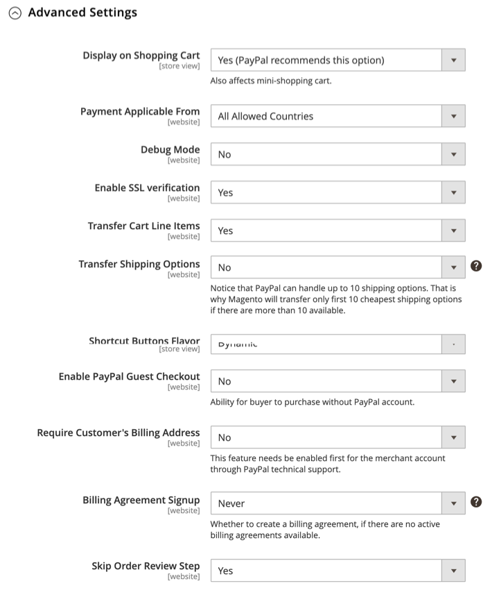

# PayPal 支払い標準

[PayPal 支払い標準][4] は、オンラインで支払いを受け入れる最も簡単な方法です。 お客様の店舗にチェックアウトボタンを追加するだけで、クレジットカードと PayPal の両方でお客様に支払いの便利さを提供できます。

>[!NOTE]
>
>米国以外の商人の場合は、と呼ばれます。 _PayPal Web サイトの支払い標準_.

PayPal Payments Standard を使用すると、モバイルデバイスでクレジットカードをスワイプできます。 月額料金はなく、eBay 経由で支払うことができます。 サポートされるクレジットカードには、Visa、MasterCard、Discover、American Express が含まれます。 また、お客様は個人の PayPal アカウントから直接お支払いいただけます。 PayPal Payments Standard は、PayPal の世界リファレンスリストのすべての国で利用できます。

>[!IMPORTANT]
>
>**PSD2 の要件：**  
>2019 年 9 月 14 日現在、ヨーロッパの銀行は、満たさない支払いを辞退する可能性があります [PSD2](../getting-started/compliance-payment-services-directive.md) 要件。 PayPal の支払い基準に従うために、PayPal の支払い基準に対するPSDは不要です。すべての要件は PayPal で処理されるためです。

## マーチャントの要件

- [PayPal ビジネスアカウント][1]

## チェックアウトワークフロー

お客様の場合、PayPal の PayPal アカウントのクレジットカード情報が最新の場合、PayPal の PayPal Payments Standard は、ワンステップのプロセスです。

1. **顧客の場所の注文**  — 顧客が _今すぐ支払う_ ボタンをクリックして、購入を完了します。

1. **PayPal がトランザクションを処理**  — 顧客は PayPal サイトにリダイレクトされ、トランザクションを完了します。

## PayPal 支払い標準を設定します

>[!NOTE]
>
>PayPal 支払い標準は、Express Checkout を含む他の PayPal メソッドと同時に使用することはできません。 支払い方法を変更すると、以前使用していたものは無効になります。

>[!TIP]
>
>クリック **[!UICONTROL Save Config]** いつでも作業内容を保存できます。

### 手順 1：設定の開始

この設定方法は、既存の PayPal アカウントを持っていることを前提としています。

1. 次の日： _管理者_ サイドバー、移動 **[!UICONTROL Stores]** > _[!UICONTROL Settings]_>**[!UICONTROL Configuration]**.

1. 左側のパネルで、を展開します。 **[!UICONTROL Sales]** を選択します。 **[!UICONTROL Payment Methods]**.

1. コマースインストールに複数の Web サイト、ストア、または表示がある場合は、 **[!UICONTROL Store View]** を、この設定を適用するストア表示に追加します。

1. Adobe Analytics の _[!UICONTROL Merchant Location]_セクションで、**[!UICONTROL Merchant Country]**ビジネスの所在地

   この設定は、設定に表示される PayPal ソリューションの選択を決定します。

   {width="600" zoomable="yes"}

1. 展開 **[!UICONTROL PayPal All-in-One Payment Solutions]** をクリックします。 **[!UICONTROL Configure]** 対象： **[!UICONTROL Payments Standard]**.

   {width="700" zoomable="yes"}

### 手順 2:PayPal アカウントを有効にして接続する

{width="600" zoomable="yes"}

1. テストまたは実稼動用のアカウントに接続します。

   - テスト（開発）モードの場合は、 **[!UICONTROL Sandbox Credentials]** を入力し、 [PayPal サンドボックス][3] 認証情報。
   - 実稼動モードの場合は、 **[!UICONTROL Connect with PayPal]** 実稼動アカウントの資格情報を入力します。

   接続が検証されたら、続行できます。

1. 設定 **[!UICONTROL Enable this Solution]** から `Yes`.

1. 次の項目を選択します。 [PayPal クレジット](paypal.md#paypal-credit-and-pay-later) を顧客に設定する **[!UICONTROL Enable PayPal Credit]** から `Yes`.

### ステップ 3：支払標準設定の完了

1. 展開  の **[!UICONTROL Payments Standard]** 」セクションに入力します。

   {width="600" zoomable="yes"}

1. 次を入力します。 **[!UICONTROL Email Associated with your PayPal Merchant Account]**.

   >[!IMPORTANT]
   >
   >E メールアドレスでは、大文字と小文字が区別されます。 支払いを受け取るには、入力した電子メールアドレスが PayPal マーチャントアカウントで指定された電子メールアドレスと一致している必要があります。

   PayPal アカウントをお持ちでない場合は、 **[!UICONTROL Start accepting payments via PayPal]**.

1. 設定 **[!UICONTROL API Authentication Methods]** を次のいずれかに変更します。

   - `API Signature`  — この PayPal 認証方式は、実装が最も簡単で、ユーザ名、パスワード、およびアカウントを識別する一意の文字列と数字列に基づいています。 API 署名の資格情報は期限切れにはなりません。
   - `API Certificate`  — この PayPal 認証方法は、ユーザー名、パスワード、ダウンロード可能な証明書に基づいて、より安全になります。 API 資格情報は 3 年後に期限切れになり、更新する必要があります。

   必要に応じて、以下の手順を実行します。

   - **[!UICONTROL API Username]**
   - **[!UICONTROL API Password]**
   - **[!UICONTROL API Signature]**

1. Sandbox アカウントの資格情報を使用している場合は、 **[!UICONTROL Sandbox Mode]** から `Yes`.

   サンドボックスで設定をテストする場合は、次のみを使用します。 [クレジットカード番号][2] PayPal で推奨される情報です。 実稼動に移行する準備が整ったら、設定に戻り、サンドボックスモードをに設定します。 `No` お使いの実稼動 PayPal アカウントに接続します。

1. システムでプロキシサーバーを使用してAdobe CommerceまたはMagento Open Sourceと PayPal 支払いシステム間の接続を確立する場合は、 **[!UICONTROL API Uses Proxy]** から `Yes` 次の手順を実行します。

   - **[!UICONTROL Proxy Host]**
   - **[!UICONTROL Proxy Port]**

### ステップ 4：広告 PayPal クレジット/広告 PayPal PayLater（オプション）の設定

2.4.3 リリース以降、PayPal PayLater は PayPal を含むデプロイメントでサポートされます。 この機能を使用すると、買い物客は購入時に全額を支払う代わりに、隔週の分割払いで注文に対して支払うことができます。 PayPal Credit エクスペリエンスは廃止されました。

設定 **[!UICONTROL Enable PayPal PayLater Experience]** を次のいずれかに変更します。

- `Yes` - PayPal PayLater を宣伝する
- `No` - PayPal クレジットの宣伝を設定するには

#### PayPal クレジットの宣伝

1. 展開  の **[!UICONTROL Advertise PayPal Credit]** 」セクションに入力します。

   {width="600" zoomable="yes"}

1. アカウント情報を取得するには、 **[!UICONTROL Get Publisher ID from PayPal]** そして指示に従う

1. を入力します。 **[!UICONTROL Publisher ID]**.

   {width="600" zoomable="yes"}

1. 展開  の **[!UICONTROL Home Page]** 」セクションに入力します。

1. ページにバナーを配置するには、 **[!UICONTROL Display]** から `Yes`.

1. 設定 **[!UICONTROL Position]** を次のいずれかに変更します。

   - `Header (center)`
   - `Sidebar (right)`

1. 設定 **[!UICONTROL Size]** を次のいずれかに変更します。

   - `190 x 100`
   - `234 x 60`
   - `300 x 50`
   - `468 x 60`
   - `728 x 90`
   - `800 x 66`

1. 展開  残りのセクションと、前の手順を繰り返します。

   - **[!UICONTROL Catalog Category Page]**
   - **[!UICONTROL Catalog Product Page]**
   - **[!UICONTROL Checkout Cart Page]**

#### 広告 PayPal PayLater

1. 展開  の **[!UICONTROL Advertise PayPal PayLater]** 」セクションに入力します。

1. 設定 **[!UICONTROL Enable PayPal PayLater]** から `Yes`.

1. 展開  の **[!UICONTROL Home Page]** 」セクションに入力します。

   {width="600" zoomable="yes"}

1. ページにバナーを配置するには、 **[!UICONTROL Display]** から `Yes`.

1. 設定 **[!UICONTROL Position]** を次のいずれかに変更します。

   - `Header (center)`
   - `Sidebar`

1. 設定 **[!UICONTROL Style Layout]** を次のいずれかに変更します。

   - `Text`
   - `Flex`

1. の場合 [!UICONTROL Style Layout] **[!UICONTROL Text]** 唯一、設定 **[!UICONTROL Logo Type]** を次のいずれかに変更します。

   - `Primary`
   - `Alternative`
   - `Inline`
   - `None`

1. の場合 [!UICONTROL Style Layout] **[!UICONTROL Text]** 唯一、設定 **[!UICONTROL Logo Position]** を次のいずれかに変更します。

   - `Left`
   - `Right`
   - `Top`

1. の場合 [!UICONTROL Style Layout] **[!UICONTROL Text]** 唯一、設定 **[!UICONTROL Text Color]** を次のいずれかに変更します。

   - `Black`
   - `White`
   - `Monochrome`
   - `Grayscale`

1. の場合 [!UICONTROL Style Layout] **[!UICONTROL Text]** 唯一、設定 **[!UICONTROL Text Size]** を次のいずれかに変更します。

   - `10px`
   - `11px`
   - `12px`
   - `13px`
   - `14px`
   - `15px`
   - `16px`

1. の場合 [!UICONTROL Style Layout] **[!UICONTROL Flex]** 唯一、設定 **[!UICONTROL Ratio]** を次のいずれかに変更します。

   - `1x1`
   - `1x4`
   - `8x1`
   - `20x1`

1. の場合 [!UICONTROL Style Layout] **[!UICONTROL Flex]** 唯一、設定 **[!UICONTROL Color]** を次のいずれかに変更します。

   - `Blue`
   - `Black`
   - `White`
   - `White No Border`
   - `Gray`
   - `Monochrome`
   - `Grayscale`

1. 展開  残りのセクションと、前の手順を繰り返します。

   - **[!UICONTROL Catalog Product Page]**
   - **[!UICONTROL Checkout Cart Page]**
   - **チェックアウトの支払い手順**
   - **[!UICONTROL Catalog Category Page]**

### 手順 5：基本設定の完了

1. 展開  の **[!UICONTROL Basic Settings - PayPal Website Payments Standard]** 」セクションに入力します。

   {width="600" zoomable="yes"}

1. の場合 **[!UICONTROL Title]**、チェックアウト時にこの支払い方法を識別するタイトルを入力します。

   タイトルは、 _PayPal_ （すべてのストア表示）

1. 複数の支払い方法を提供する場合は、次の項目に数値を入力します： **[!UICONTROL Sort Order]** PayPal Payments Standard が他の支払い方法と共に表示される際に表示される順序を決定する。

   この数は他の支払い方法に対する相対値です。 (`0` =最初 `1` =秒 `2` = 3 番目、など )

1. 設定 **[!UICONTROL Payment Action]** を次のいずれかに変更します。

   - `Authorization` ・買い付けを承認し、資金を保留する。 金額は、商人が取り込むまで引き落とされません。
   - `Sale`  — 購入金額は、お客様のアカウントから承認され、直ちに取り下げられます。

1. 次の手順で _[!UICONTROL Check out with PayPal]_製品ページのボタンをクリックし、**[!UICONTROL Display on Product Details Page]**から `Yes`.

### 手順 6：詳細設定の完了

1. 展開  の **[!UICONTROL Advanced Settings]** 」セクションに入力します。

   {width="600" zoomable="yes"}

1. 買い物かごとミニ買い物かごの両方から PayPal の支払い標準を利用できるようにするには、 **[!UICONTROL Display on Shopping Cart]** から `Yes`.

1. 設定 **[!UICONTROL Payment from Applicable Countries]** を次のいずれかに変更します。

   - `All Allowed Countries`  — すべてのお客様から [国](../getting-started/store-details.md#country-options) ストア設定で指定された場合、この支払い方法を使用できます。
   - `Specific Countries`  — このオプションを選択すると、 _[!UICONTROL Payment from Specific Countries]_リストが表示されます。 複数の国を選択するには、Ctrl キー (PC) または Command キー (Mac) を押しながら各オプションをクリックします。

1. 支払いシステムとの通信をログファイルに記録するには、 **[!UICONTROL Debug Mode]** から `Yes`.

   >[!NOTE]
   >
   >ログファイルはサーバーに保存され、開発者のみがアクセスできます。 PCI データセキュリティ基準に従って、クレジットカード情報はログファイルに記録されません。

1. SSL 検証を有効にするには、 **[!UICONTROL Enable SSL Verification]** から `Yes`.

1. 各行項目の要約を PayPal の支払いページの順序で表示するには、 **[!UICONTROL Transfer Cart Line Items]** から `Yes`.

   概要に最大 10 個の送料オプションを含めるには、 **[!UICONTROL Transfer Shipping Options]** から `Yes`. （このオプションは、行項目が転送に設定されている場合にのみ表示されます）。

1. PayPal の許可ボタンに使用する画像の種類を判断するには、 **[!UICONTROL Shortcut Buttons Flavor]** を次のいずれかに変更します。

   - `Dynamic` - （推奨） PayPal サーバーから動的に変更できる画像を表示します。
   - `Static`  — 動的に変更できない特定の画像を表示します。

1. PayPal アカウントを持たない顧客がこの方法で購入できるようにするには、 **[!UICONTROL Enable PayPal Guest Checkout]** から `Yes`.

1. 設定 **[!UICONTROL Require Customer's Billing Address]** を次のいずれかに変更します。

   - `Yes`  — すべての購入について、顧客の請求先住所が必要です。
   - `No`  — 購入時に顧客の請求先住所は不要です。
   - `For Virtual Quotes Only`  — 仮想見積もりの場合のみ、顧客の請求先住所が必要です。

1. 顧客が [PayPal 請求契約](paypal-billing-agreements.md) 顧客アカウントで使用できるアクティブな請求契約がない場合は、ストアで **[!UICONTROL Billing Agreement Signup]** を次のいずれかに変更します。

   - `Auto`  — 顧客は、「速達チェックアウト」フローで請求契約を入力するか、別の支払い方法を使用できます。
   - `Ask Customer` ：顧客は、「速達チェックアウト」ワークフローで請求基本契約を入力するかどうかを決定できます。
   - `Never`  — 顧客は、「速達チェックアウト」ワークフローで請求基本契約を入力できません。

   >[!NOTE]
   >
   >マーチャントは、PayPal Merchant テクニカルサポートに依頼して、アカウントでの請求契約を有効にする必要があります。 The _請求契約のサインアップ_ パラメーターは、PayPal がマーチャントアカウントに対して請求契約が有効になっていることを確認した後でのみ有効にできます。

1. 顧客が注文確認のためにストアに戻ることなく PayPal サイトからトランザクションを完了できるようにするには、 **[!UICONTROL Skip Order Review Step]** から `Yes`.

### 手順 7：設定を完了して保存する

1. ストアの必要に応じて、次のセクションに入力します。

   - [PayPal 請求契約設定](#paypal-billing-agreement-settings)
   - [決済レポート設定](#settlement-report-settings)
   - [フロントエンドエクスペリエンス設定](#frontend-experience-settings)

1. 完了したら、「 **[!UICONTROL Save Config]**.

#### PayPal 請求契約設定

A [請求契約](paypal-billing-agreements.md) は、複数の注文での使用を PayPal によって承認された、マーチャントと顧客の間の営業契約です。 チェックアウトプロセスでは、「請求契約の支払い」オプションは、会社との請求契約を既に入力している顧客に対してのみ表示されます。 PayPal が契約を承認すると、支払いシステムは、契約に関連付けられた各注文を識別する一意の参照 ID を発行します。 発注と同様に、顧客が会社で設定できる請求契約の数に制限はありません。

1. 展開  の **[!UICONTROL PayPal Billing Agreement Settings]** 」セクションに入力します。

   {width="600" zoomable="yes"}

1. 設定 **[!UICONTROL Enabled]** から `Yes`.

1. の場合 **[!UICONTROL Title]**&#x200B;をクリックし、チェックアウト時に PayPal の請求契約方法を識別するタイトルを入力します。

1. 複数の支払い方法を提供する場合は、 **[!UICONTROL Sort Order]** フィールドを使用して、チェックアウト時に他の支払い方法と共にリストされた場合に請求基本契約が表示される順序を決定します。

1. 設定 **[!UICONTROL Payment Action]** を次のいずれかに変更します。

   - `Authorization` ・買い付けを承認し、資金を保留する。 その金額は、商人によって「取り込まれる」まで引き落とされません。
   - `Sale`  — 購入金額は、お客様のアカウントから承認され、直ちに取り下げられます。

1. 設定 **[!UICONTROL Payment Applicable From]** を次のいずれかに変更します。

   - `All Allowed Countries`  — ストア設定で指定されたすべての国のお客様は、この支払い方法を使用できます。
   - `Specific Countries`  — このオプションを選択した後、 _[!UICONTROL Payment from Specific Countries]_リストが表示されます。 複数の国を選択するには、Ctrl キー (PC) または Command キー (Mac) を押しながら各国をクリックします。

1. 支払いシステムとの通信をログファイルに記録するには、 **[!UICONTROL Debug Mode]** から `Yes`.

   >[!NOTE]
   >
   >ログファイルはサーバーに保存され、開発者のみがアクセスできます。 PCI データセキュリティ基準に従って、クレジットカード情報はログファイルに記録されません。

1. SSL 検証を有効にするには、 **[!UICONTROL Enable SSL Verification]** から `Yes`.

1. 顧客の注文の各行項目の要約を PayPal の支払いページに表示するには、 **[!UICONTROL Transfer Cart Line Items]** から `Yes`.

1. 顧客が顧客アカウントのダッシュボードから請求契約を開始できるようにするには、 **[!UICONTROL Allow in Billing Agreement Wizard]** から `Yes`.

#### 決済レポート設定

1. 展開  の **[!UICONTROL Settlement Report Settings]** 」セクションに入力します。

   {width="600" zoomable="yes"}

1. の場合 **[!UICONTROL SFTP Credentials]**、次の操作を実行します。

   - PayPal セキュア FTP サーバーに新規登録している場合は、次の SFTP ログイン資格情報を入力します。

      - ログイン
      - パスワード

   - サイト上で高速チェックアウトを使用して運用を開始する前にテストレポートを実行するには、 **[!UICONTROL Sandbox Mode]** から `Yes`.

   - 次を入力します。 **[!UICONTROL Custom Endpoint Hostname or IP Address]**.

     デフォルトでは、値は `reports.paypal.com`.

   - 次を入力します。 **[!UICONTROL Custom Path]** レポートが保存される場所。

     デフォルトでは、値は `/ppreports/outgoing`.

1. スケジュールに従ってレポートを生成するには、 **[!UICONTROL Scheduled Fetching]** 設定：

   - 設定 **[!UICONTROL Enable Automatic Fetching]** から `Yes`.

   - 設定 **[!UICONTROL Schedule]** を次のいずれかに変更します。

      - `Daily`
      - `Every 3 Days`
      - `Every 7 Days`
      - `Every 10 Days`
      - `Every 14 Days`
      - `Every 30 Days`
      - `Every 40 Days`

     PayPal は各レポートを 45 日間保持します。

   - 設定 **[!UICONTROL Time of Day]** を、時間、分および秒（秒）に設定します。

#### フロントエンドエクスペリエンス設定

以下を使用します。 _[!UICONTROL Frontend Experience Settings]_サイトに表示する PayPal ロゴを選択し、PayPal マーチャントページの外観をカスタマイズします。

1. 展開  の **[!UICONTROL Frontend Experience Settings]** 」セクションに入力します。

   {width="600" zoomable="yes"}

1. を選択します。 **[!UICONTROL PayPal Product Logo]** ストアの PayPal ブロックに表示する

   PayPal ロゴは、4 つのスタイルと 2 つのサイズで使用できます。

   - `No Logo`
   - `We Prefer PayPal (150 x 60 or 150 x 40)`
   - `Now Accepting PayPal (150 x 60 or 150 x 40)`
   - `Payments by PayPal (150 x 60 or 150 x 40)`
   - `Shop Now Using PayPal (150 x 60 or 150 x 40)`

1. PayPal マーチャントページの外観をカスタマイズするには、次の手順を実行します。

   - 名前を入力 **[!UICONTROL Page Style]** PayPal のマーチャントページに適用する

      - `paypal` - PayPal ページスタイルを使用します。
      - `primary` - _プライマリ_ スタイルを設定します。
      - `your_custom_value`  — アカウントプロファイルで指定されたカスタムの支払いページスタイルを使用します。

   - の場合 **[!UICONTROL Header Image URL]**」で、支払いページの左上隅に表示する画像の URL を入力します。 最大ファイルサイズは、幅 750 ピクセル、高さ 90 ピクセルです。

     >[!NOTE]
     >
     >PayPal では、画像を安全な (https) サーバーに配置することをお勧めします。 そうしないと、ブラウザーは、 _ページにセキュリティで保護された項目とセキュリティで保護されていない項目の両方が含まれています_.

   - ページの色を設定するには、6 文字の 16 進コード ( `#` 記号。次の各項目に対して使用します。

      - **[!UICONTROL Header Background Color]**  — チェックアウトページヘッダーの背景色。
      - **[!UICONTROL Header Border Color]**  — ヘッダーの周囲の 2 ピクセルの境界線のカラー。
      - **[!UICONTROL Page Background Color]**  — チェックアウトページ、ヘッダーおよび支払いフォームの周囲の背景色。

[1]: https://www.paypal.com/webapps/mpp/how-to-sell-online
[2]: https://www.paypalobjects.com/en_AU/vhelp/paypalmanager_help/credit_card_numbers.htm
[3]: https://developer.paypal.com/docs/api-basics/sandbox/
[4]: https://developer.paypal.com/docs/paypal-payments-standard/mobile-paypal-payments-standard/
