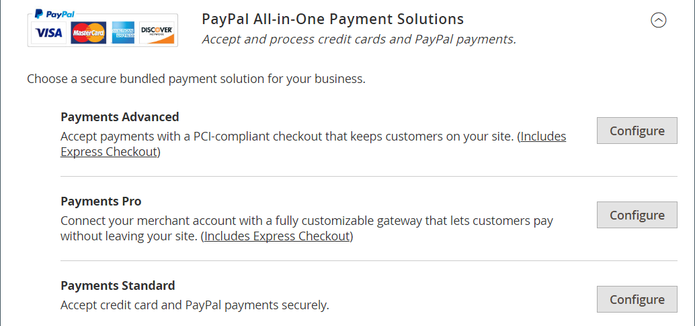
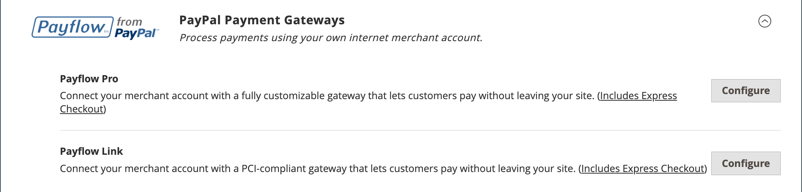

# PayPal決済ソリューション

PayPalは、オンライン決済の世界的なリーダーであり、顧客がオンラインで決済するための迅速かつ安全な方法です。 利用可能なPayPal ソリューションの選択は、加盟店の場所によって異なります。 PayPal Express CheckoutとPayPal Payments Standardは、世界中のあらゆる場所で利用できます。 詳しくは、[国別のPayPal ソリューション &#x200B;](#paypal-solutions-by-country)を参照してください。

>[!IMPORTANT]
>
>**PSD2の要件：**  
>2019年9月14日以降、ヨーロッパの銀行は、[PSD2](../getting-started/compliance-payment-services-directive.md)の要件を満たさない支払いを拒否する場合があります。ほとんどのPayPal ソリューションでは、これらの要件はPayPalによって処理されるため、PSD2に準拠するためのアクションは必要ありません。

## PayPal法人向けアカウント

PayPalをストアの支払い方法として提供するには、PayPal [法人向けアカウント &#x200B;](https://manager.paypal.com/)または[PayPal Payflow アカウント &#x200B;](https://developer.paypal.com/docs/payflow/payflow-gateway/)が必要です。 アカウント要件は、各PayPal ソリューションの説明で指定されています。 PayPal加盟店アカウントは、ストアからの購入に適用される[詐欺フィルター](#paypal-fraud-management-filters)を管理するためにも使用されます。

PayPal Express CheckoutまたはExpress Checkout for Payflow Proをご利用のお客様は、PayPalのバイヤーアカウントをお持ちである必要があります。 PayPal Payments Standard （一部の国ではWeb サイトの支払い標準）は、加盟店が&#x200B;_PayPal アカウント オプション_&#x200B;を有効にしている場合に、直接または購入者アカウントを通じて使用できます。 デフォルトでは、このパラメーターは有効になっているので、顧客はクレジットカード情報を入力するか、PayPalでバイヤーアカウントを作成するかを選択できます。 無効にした場合、お客様は購入する前にPayPal購入者アカウントを作成する必要があります。

Website Payments Pro、Website Payments Pro Payflow Edition、Payflow Pro Gateway、Payflow Linkでは、チェックアウト時にクレジットカード情報を入力する必要があります。

## PayPal CreditとPayLater

PayPal PayLaterは、顧客に融資への迅速なアクセスを提供するため、顧客は今すぐ購入し、追加費用なしで長期的に支払うことができます。 お客様がPayPal Credit オプションを選択した場合、お客様は請求されず、通常のPayPal取引手数料のみを支払います。 詳しくは、[PayPal web サイト &#x200B;](https://www.paypal.com/us/business/buy-now-pay-later)を参照してください。

ファイナンスを広告する際に売上を向上させます。 PayPal PayLaterは、PayPal PayLaterを利用して、ブラウザーを購入者に変えるのに役立ちます。 顧客は時間の経過とともに支払いを受けます。前払いは発生しますが、追加費用は発生しません。 PayPalの無料バナー広告を使用して、顧客がPayPalにチェックアウトした際の支払いオプションとしてPayPalの支払いを宣伝することができます。 PayPal Advertisingプログラムは、追加購入を生み出し、平均購入額を15%以上増加させています。

サイトのページに無料の既製のバナー広告を簡単に追加し、チェックアウト時にショッピングカートに「_PayPal Credit_」ボタンを追加して、資金調達がすぐに可能であることを顧客に思い出してもらうことができます。

>[!NOTE]
>
>2.4.3 リリース以降、PayPal PayLaterは、PayPalを含むデプロイメントでサポートされています。 この機能により、買い物客は購入時に全額を支払うのではなく、隔週の分割で注文の支払いを行うことができます。 PayPal Credit エクスペリエンスは非推奨（廃止予定）です。

米国のマーチャントの場合、PayPal クレジットは、[PayPal Express Checkout](paypal-express-checkout.md)支払いオプションに対してデフォルトで有効になっています。 この支払い方法でこの支払い方法を無効にするには、[PayPal Express チェックアウト設定](paypal-express-checkout.md#features)の&#x200B;_機能_&#x200B;の節を参照してください。

PayPal クレジットは、他のPayPal決済ソリューションではデフォルトで無効になっていますが、サポートソリューションの決済方法の設定で有効にすることができます。

- [決済の詳細](paypal-payments-advanced.md)
- [Payments Pro](paypal-payments-pro.md)
- [Payments Standard](paypal-payments-standard.md)
- [Payflow Pro](paypal-payflow-pro.md)
- [Payflow Link](paypal-payflow-link.md)

>[!IMPORTANT]
>
>ストアにPayPal CreditまたはPayPal PayLaterを設定する前に、PayPal加盟店アカウントでPayPal CreditまたはPayLaterが有効になっていることを確認してください。

## PayPal ソリューションとの統合

PayPalとAdobe Commerceを利用すれば、主要なデビットカードやクレジットカードからあらゆる支払いを受け付けることができます。 PayPal アカウントをお持ちでない顧客でもPayPalで購入した分を支払うことができるため、PayPalは特別な労力を必要とせずに利便性を向上させます。

>[!NOTE]
>
>PayPal Express Checkoutを除き、一度に複数のPayPal メソッドをストアで有効にすることはできません。 PayPal Express Checkoutは、PayPal Payments Standardを除く、他のPayPal支払い方法と併用できます。 支払いソリューションを変更すると、以前の方法は無効になります。

### PayPal Express チェックアウト

[PayPal Express チェックアウト](paypal-express-checkout.md)

### PayPal オールインワン決済ソリューション

米国では、PayPalは成長するビジネスのニーズを満たすために、PCI準拠の次のソリューションを提供しています。

- [PayPal Payments Advanced](paypal-payments-advanced.md)
- [PayPal Payments Pro](paypal-payments-pro.md)
- [PayPal Payments Standard](paypal-payments-standard.md)

{width="600" zoomable="yes"}

### PayPal支払いゲートウェイ

支払いゲートウェイとは、クレジットカードや直接支払いの処理を許可するe コマースアプリケーションサービスプロバイダーが提供するマーチャントサービスです。 顧客と銀行の間の仲介役を務めます。

支払いゲートウェイは、オンラインとオフラインの環境で利用できます。 支払いは、電話、オンライン、モバイルアプリを通じて受け付けることができます。 トランザクションは、サービスプロバイダーの処理システムに送信され、その後、確認と確認のために顧客の銀行に送信されます。 確認された場合、加盟店は、顧客の銀行口座に直接連絡することなく支払いを受け取ります。

支払いゲートウェイには、ダイレクトゲートウェイとホスティング型の2種類があります。

- 直接支払いゲートウェイを使用すると、オーディエンスは店舗のweb サイトでカードの詳細を入力できます。
- ホスティング決済ゲートウェイは、店舗のweb サイト外にあるホスティング決済ページに利用者をリダイレクトします。

支払いゲートウェイは、取引に関与するすべての関係者にセキュリティと保護を提供します。

PayPalでは、お客様のビジネスに合った2つの支払いゲートウェイソリューションから選択できます。 PayPalが安全な決済サイトでチェックアウトをホスティングできるようにすることも、カスタマイズ可能なソリューションで決済エクスペリエンス全体を管理することもできます。

- [PayPal Payflow Pro](paypal-payflow-pro.md)
- [PayPal Payflow Link](paypal-payflow-link.md)

{width="600" zoomable="yes"}

## PayPal不正管理フィルター

PayPalの不正管理フィルターを利用すれば、不正な取引の発見と対応が容易になり、よりリスクの高い支払いにフラグを立てたり、レビューのために保留したり、拒否したりするように設定できます。 Commerce [注文状況](order-status.md)値に関連するアクションが、不正フィルターの設定に従って変更されました。

| アクション | 結果 |
| --- | --- |
| [!UICONTROL Review] | 疑わしい注文は、注文が行われたときにステータス _支払いレビュー_&#x200B;を受け取ります。 注文を確認して承認するか、管理者またはPayPal側で支払いをキャンセルできます。 **[!UICONTROL Accept Payment]**&#x200B;または&#x200B;**[!UICONTROL Deny Payment]**&#x200B;をクリックすると、注文の新しいトランザクションは作成されません。   PayPal サイトでトランザクションのステータスを変更する場合は、管理者の注文ページで「**[!UICONTROL Get Payment Update]**」をクリックして変更を適用する必要があります。 **[!UICONTROL Accept Payment]**&#x200B;または&#x200B;**[!UICONTROL Deny Payment]**&#x200B;をクリックすると、PayPal サイトで行われた変更が適用されます。 |
| [!UICONTROL Deny] | 対応するトランザクションがPayPalによって拒否されるので、疑わしい注文は顧客によって行われません。   管理者からの支払いを拒否するには、ページの右上隅にある「**[!UICONTROL Deny Payment]**」をクリックします。 注文ステータスが`Canceled`に変更され、トランザクションが元に戻され、顧客アカウントで資金が解放されます。 対応する情報は、注文ビューの&#x200B;_[!UICONTROL Comments History]_&#x200B;セクションに追加されます。 |
| [!UICONTROL Flag] | 疑わしい注文は、配置時にステータス `Processing`を取得します。 対応するトランザクションには、加盟店アカウントトランザクションのリストにフラグが付けられます。 |

{style="table-layout:auto"}

## 各国のPayPal ソリューション

| 国 | PayPal決済ソリューション |
|--- |--- |
| Australia | [!DNL PayPal Website Payments Standard] [[!DNL PayPal Payflow Pro]](paypal-payflow-pro.md) [!DNL PayPal Website Payments Pro Hosted Solution] [[!DNL PayPal Express Checkout]](paypal-express-checkout.md) |
| カナダ | [!DNL PayPal Website Payments Standard] [!DNL PayPal Website Payments Pro] [[!DNL PayPal Payflow Pro]](paypal-payflow-pro.md) [[!DNL PayPal Payflow Link]](paypal-payflow-link.md) （Express チェックアウトを含む）  [[!DNL PayPal Express Checkout]](paypal-express-checkout.md) |
| フランス | [!DNL PayPal Integral Evolution] [!DNL PayPal Website Payments Standard] [[!DNL PayPal Express Checkout]](paypal-express-checkout.md) |
| ドイツ | [[!DNL PayPal Express Checkout]](paypal-express-checkout.md) |
| 中国香港特別行政区 | [!DNL PayPal Website Payments Pro Hosted Solution] [!DNL PayPal Website Payments Standard] [[!DNL PayPal Express Checkout]](paypal-express-checkout.md) |
| イタリア | [!DNL PayPal ProPay] [[!DNL Pal Payments Standard]](paypal-payments-standard.md) [[!DNL PayPal Express Checkout]](paypal-express-checkout.md) |
| 日本 | [!DNL PayPal Website Payments Plus] [!DNL PayPal Website Payments Standard] [[!DNL PayPal Express Checkout]](paypal-express-checkout.md) |
| ニュージーランド | [[!DNL PayPal Payflow Pro]](paypal-payflow-pro.md) [!DNL PayPal Website Payments Standard] [[!DNL PayPal Express Checkout]](paypal-express-checkout.md) |
| スペイン | [!DNL PayPal Pasarela Integral] [!DNL PayPal Website Payments Standard] [[!DNL PayPal Express Checkout]](paypal-express-checkout.md) |
| United Kingdom | [!DNL PayPal Payments Pro Hosted Solution] （Express チェックアウトを含む）  [[!DNL PayPal Payments Standard]](paypal-payments-standard.md) [[!DNL PayPal Express Checkout]](paypal-express-checkout.md) |
| United States | [[!DNL PayPal Payments Advanced]](paypal-payments-advanced.md) （Express チェックアウトを含む）  [[!DNL PayPal Payments Pro]](paypal-payments-pro.md) （Express チェックアウトを含む）  [[!DNL PayPal Payments Standard+]](paypal-payments-standard.md) [[!DNL PayPal Payflow Pro]](paypal-payflow-pro.md) （Express チェックアウトを含む）  [[!DNL PayPal Payflow Link]](paypal-payflow-link.md) （Express チェックアウトを含む）  [[!DNL PayPal Express Checkout]](paypal-express-checkout.md) |

{style="table-layout:auto"}

### その他の国

PayPal Express CheckoutおよびPayPal Web サイト支払い標準は、次の国で利用できます。

- アルゼンチン
- オーストリア
- ベルギー
- ブラジル
- ブルガリア
- チリ
- コスタリカ
- キプロス
- チェコ共和国
- デンマーク
- ドミニカ共和国
- エクアドル
- エストニア
- フィンランド
- フランス領ギアナ
- ジブラルタル
- ギリシャ
- グアドループ
- ハンガリー
- アイスランド
- インド
- インドネシア
- アイルランド
- イスラエル
- ジャマイカ
- ラトビア
- リヒテンシュタイン
- リトアニア
- ルクセンブルク
- マレーシア
- マルタ
- マルティニーク
- メキシコ
- オランダ
- ノルウェー
- フィリピン
- ポーランド
- ポルトガル
- レユニオン
- ルーマニア
- サンマリノ
- シンガポール
- スロバキア
- スロベニア
- 南アフリカ
- 韓国
- スウェーデン
- スイス
- 台湾
- タイ
- トルコ
- アラブ首長国連邦
- ウルグアイ
- ベネズエラ
- ベトナム
