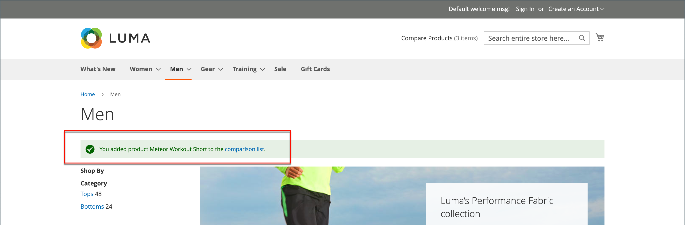

# 製品を比較

製品の比較では、2 つ以上の製品の詳細な並べて比較が生成されます。 テーマに応じて、「比較に追加」リンクはアイコンまたはテキストで表される場合があります。 The _製品を比較_ ブロックは通常、カタログページの左または右のサイドバーに表示されます。

{width="700" zoomable="yes"}

とは異なり、 [最近表示された製品/比較対象の製品](products-viewed-compared.md) ブロック内に含まれている場合、管理者には、製品の比較用の追加の設定は含まれていません。

## ストアフロントでの製品の比較

ストアフロントで比較リストを使用する方法はいくつかあります。

### カタログページから

1. 顧客が比較対象の製品を見つけ、 **[!UICONTROL Add to Compare]** 各に対するリンク。

1. 関連するカテゴリページに移動します。

   テーマとページのレイアウトに応じて、 _製品を比較_ ブロックを使用して、 その場合、比較の対象としてマークされているカテゴリの項目が表示されます。

   顧客は、 _削除_ (  ) をクリックして比較レポートから削除するか、 **[!UICONTROL Clear All]** すべての項目を削除し、比較対象を選択してやり直します。

1. クリック数 **[!UICONTROL Compare]**.

1. 比較情報を印刷するには、 **[!UICONTROL Print This Page]**.

1. 比較ページから 1 つの製品を削除するには、「 」をクリックします。 _削除_ (  ) をクリックします。

### 通知メッセージから

1. 顧客が比較リストに製品を追加すると、ページに通知メッセージが表示されます。

1. 表示された上部のメッセージ通知で、 _比較リスト_ リンク。

   {width="700" zoomable="yes"}

このアクションは、追加のアクションにアクセスできる比較リストに顧客をリダイレクトします。

### 次から： _製品を比較_ ブロック

1. 顧客が比較対象の製品を見つけ、 **[!UICONTROL Add to Compare]** 各に対するリンク。

1. 検索フィールドの近くにあるヘッダーで、 _製品を比較_ リンク。

   {width="700" zoomable="yes"}

### マイアカウントダッシュボードから

1. 顧客が比較リストに必要な製品を追加します。

1. 次に移動： **[!UICONTROL My Account]**.

1. Adobe Analytics の _製品を比較_ ブロック、クリック **[!UICONTROL Compare]**.

   {width="700" zoomable="yes"}

## 追加の比較リストアクション

| [!UICONTROL Action] | 説明 |
|------|-----------|
|  | 比較リストから 1 つの項目を削除します。 |
| **[!UICONTROL Add to Cart]** | 買い物かごに商品を追加します。 製品に設定がある場合、ページは顧客が設定可能なオプションを選択し、次に「 **[!UICONTROL Add to Cart]**. |
| _ウィッシュリストアイコン_ | 製品をウィッシュリストに追加します（ストア設定でウィッシュリスト機能が有効になっている必要があります）。 |
| _このページを印刷_ | 比較リストページを印刷します。 |

{style="table-layout:auto"}
