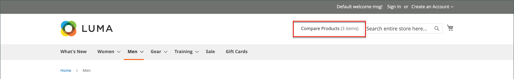

# 製品の比較

製品の比較複数の製品を詳細に並べて比較できます。 テーマによっては、「比較に追加」リンクがアイコンまたはテキストで表される場合があります。 _製品の比較_ ブロックは、通常、カタログページの左側または右側のサイドバーに表示されます。

{width="700" zoomable="yes"}

[最近表示/比較製品](products-viewed-compared.md) ブロックとは異なり、管理者には比較製品の追加の設定設定は含まれません。

## ストアフロントでの製品の比較

ストアフロントで比較リストを使用するには、いくつかの方法があります。

### カタログ ページから

1. 顧客は比較したい商品を見つけ、それぞれに&#x200B;**[!UICONTROL Add to Compare]** リンクをクリックします。

1. 関連するカテゴリーページに移動します。

   テーマとページレイアウトによっては、サイドバーに「_製品を比較_」ブロックがある場合があります。 その場合、比較のためにマークされたカテゴリ内の項目が一覧表示されます。

   お客様は、任意の製品の&#x200B;_削除_ （）をクリックして比較レポートから削除するか、**[!UICONTROL Clear All]**&#x200B;をクリックしてすべての項目を削除し、比較選択を再開できます。

1. **[!UICONTROL Compare]**&#x200B;をクリックします。

1. 比較情報を印刷するには、**[!UICONTROL Print This Page]**&#x200B;をクリックします。

1. 比較ページから1つの製品を削除するには、_削除_ （）をクリックします。

### 通知メッセージから

1. 顧客が比較リストに商品を追加すると、ページに通知メッセージが表示されます。

1. 表示された一番上のメッセージ通知で、_比較リスト_ リンクをクリックします。

   {width="700" zoomable="yes"}

このアクションにより、顧客は比較リストにリダイレクトされ、追加のアクションにアクセスできるようになります。

### _製品の比較_ ブロックから

1. 顧客は比較したい商品を見つけ、それぞれに&#x200B;**[!UICONTROL Add to Compare]** リンクをクリックします。

1. 検索フィールドの近くのヘッダーで、_製品を比較_ リンクをクリックします。

   {width="700" zoomable="yes"}

### マイアカウントダッシュボードから

1. 顧客は比較リストに必要な商品を追加します。

1. **[!UICONTROL My Account]**&#x200B;に移動します。

1. _製品を比較_ ブロックで、**[!UICONTROL Compare]**&#x200B;をクリックします。

   {width="700" zoomable="yes"}

## その他の比較リストアクション

| [!UICONTROL Action] | 説明 |
|------|-----------|
|  | 比較リストから1つの項目を削除します。 |
| **[!UICONTROL Add to Cart]** | 商品をショッピングカートに追加。 製品に設定がある場合、ページは顧客を製品ページにリダイレクトし、設定可能なオプションを選択して&#x200B;**[!UICONTROL Add to Cart]**&#x200B;をクリックします。 |
| _ウィッシュリストアイコン_ | 製品をウィッシュリストに追加します（ストア設定でウィッシュリスト機能を有効にする必要があります）。 |
| _このページを印刷_ | 比較リストページを印刷します。 |

{style="table-layout:auto"}
