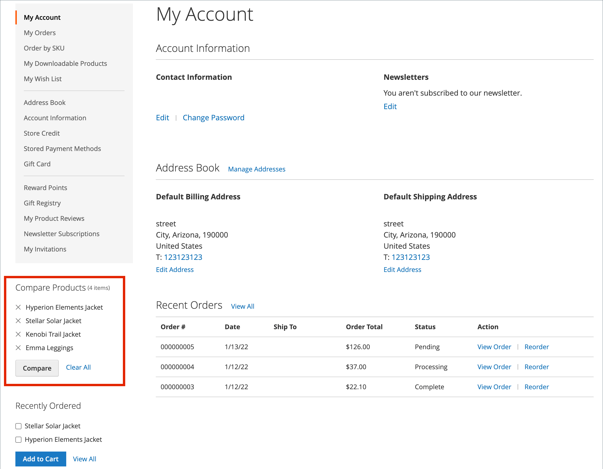

# 製品の比較

製品を比較を使用すると、2 つ以上の製品を並べて詳細に比較できます。 テーマによっては、「比較に追加」リンクがアイコンまたはテキストで表示されることがあります。 _製品を比較_ ブロックは、通常、カタログページの左または右のサイドバーに表示されます。

{width="700" zoomable="yes"}

[&#x200B; 最近表示/比較された製品 &#x200B;](products-viewed-compared.md) ブロックとは異なり、管理者には比較製品の追加の設定は含まれていません。

## ストアフロントでの製品の比較

ストアフロントの比較リストを使用する方法はいくつかあります。

### カタログページから

1. 顧客は比較する製品を見つけ、それぞれの **[!UICONTROL Add to Compare]** リンクをクリックします。

1. 関連付けられているカテゴリ ページに移動します。

   テーマとページのレイアウトによっては、サイドバーに _製品を比較_ ブロックが表示されることがあります。 その場合、比較対象としてマークされたカテゴリ内の項目が一覧表示されます。

   お客様は、任意の製品の _削除_ （）をクリックして比較レポートから削除するか、**[!UICONTROL Clear All]** をクリックしてすべての項目を削除し、比較の選択からやり直すことができます。

1. **[!UICONTROL Compare]** をクリックします。

1. 比較情報を印刷するには、**[!UICONTROL Print This Page]** をクリックします。

1. 比較ページから 1 つの製品を削除するには、_削除_ （）をクリックします。

### 通知メッセージから

1. 顧客が比較リストに製品を追加すると、ページに通知メッセージが表示されます。

1. 表示されたトップメッセージ通知で、「_比較リスト_」リンクをクリックします。

   {width="700" zoomable="yes"}

このアクションにより、顧客は比較リストにリダイレクトされ、追加のアクションにアクセスできます。

### _製品を比較_ ブロックから

1. 顧客は比較する製品を見つけ、それぞれの **[!UICONTROL Add to Compare]** リンクをクリックします。

1. 検索フィールドの近くのヘッダーで、「製品を比較 _リンクをクリック_ ます。

   {width="700" zoomable="yes"}

### マイアカウント ダッシュボードから

1. 顧客が必要な製品を比較リストに追加します。

1. **[!UICONTROL My Account]** に移動します。

1. _製品を比較_ ブロックで、**[!UICONTROL Compare]** をクリックします。

   {width="700" zoomable="yes"}

## 追加の比較リストアクション

| [!UICONTROL Action] | 説明 |
|------|-----------|
|  | 比較リストから 1 つの項目を削除します。 |
| **[!UICONTROL Add to Cart]** | 商品を買い物かごに追加します。 製品に設定がある場合、ページは顧客を製品ページにリダイレクトします。製品ページで設定可能なオプションを選択して、「**[!UICONTROL Add to Cart]**」をクリックします。 |
| _ウィッシュリストアイコン_ | 商品をウィッシュリストに追加します（ストア設定でウィッシュリスト機能が有効になっている必要があります）。 |
| _このページを印刷_ | 比較リストページを印刷します。 |

{style="table-layout:auto"}
