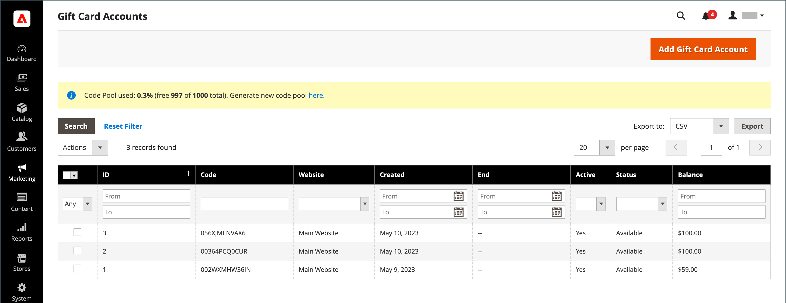
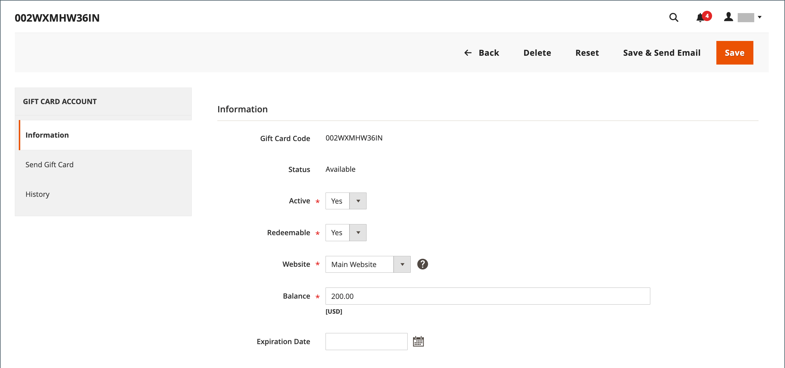
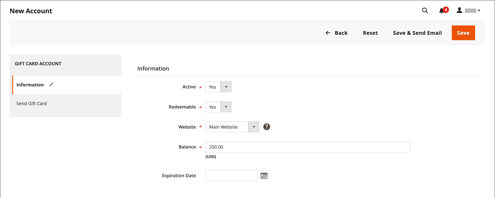
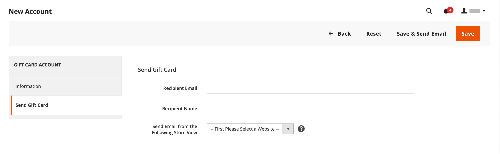
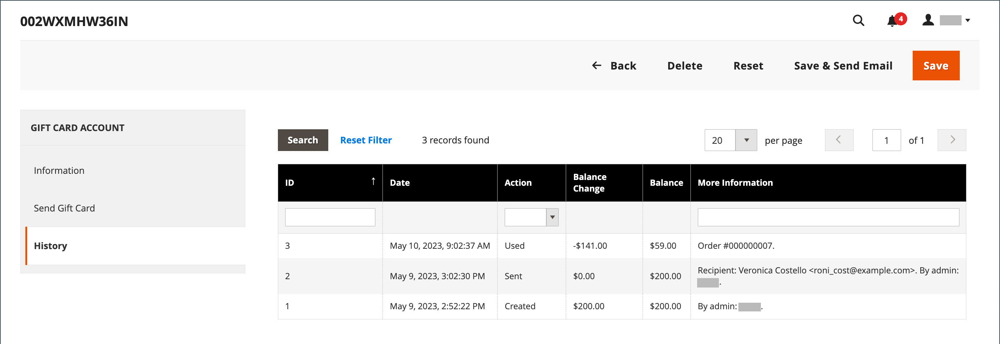

# ギフトカードアカウント

購入したギフトカードごとに、ギフトカードアカウントが自動的に作成されます。 ギフトカードの価値は、お店で商品を購入する際に適用できます。 また、管理者からギフトカードアカウントをプロモーションまたは顧客サービスとして作成することもできます。 ギフトカードの口座番号は、ギフトカードコードに対応しています。

{width="700" zoomable="yes"}

## ギフトカードアカウントの設定

ギフトカード設定は、ストアビューのすべてのギフトカードのデフォルト設定を確立し、コードプールを管理します。 コードプールは、特定の形式のユニークなギフトカードコードのセットです。 プールのコードは、ギフトカードアカウントが作成されるたびに使用されます。 ギフトカードの販売に十分なコードがあることを確認するのは、ストア管理者の責任です。 ギフトカードを販売する前に、コードプールを必ず生成してください。 デフォルトでは、Adobe Commerceは1,000個のコードを生成します。 新しいコードプールは、現在のプールに使用可能なコードがなくなるまで生成されません。

### 手順1：メール通知の設定

1. _管理者_ サイドバーで、**[!UICONTROL Stores]** > _[!UICONTROL Settings]_>**[!UICONTROL Configuration]**&#x200B;に移動します。

1. 左側のパネルで、**[!UICONTROL Sales]**&#x200B;を展開し、**[!UICONTROL Gift Cards]**&#x200B;を選択します。

1. _[!UICONTROL Gift Card Email Settings]_&#x200B;セクションのを展開し、次の操作を行います。

   - **[!UICONTROL Gift Card Notification Email Sender]**&#x200B;を、ギフトカード通知の送信者として表示されるストア IDに設定します。

   - 通知に使用するテンプレートに&#x200B;**[!UICONTROL Gift Card Notification Email Template]**&#x200B;を設定します。

   {width="600" zoomable="yes"}

1. _[!UICONTROL Email Sent from Gift Card Account Management]_&#x200B;セクションのを展開し、次の操作を行います。

   - **[!UICONTROL Gift Card Email Sender]**&#x200B;をストア IDに設定して、ギフトカードの送信者として表示します。

   - **[!UICONTROL Gift Card Template]**&#x200B;をギフトカードに使用するテンプレートに設定します。

特定の設定フィールドとオプションについては、[&#x200B; メールアドレスの保存](../configuration-reference/general/store-email-addresses.md)を参照してください。

### 手順2：一般的な設定の完了

1. _[!UICONTROL Gift Card General Settings]_&#x200B;セクションのを展開します。

1. お客様がカードの価値を現金と引き換えることができるようにするには、**[!UICONTROL Redeemable]**&#x200B;を`Yes`に設定します。

1. **[!UICONTROL Lifetime (days)]**&#x200B;の場合、カードの有効期限が切れるまでの日数を入力します。

   有効期限がない場合は、フィールドを空白のままにします。

   >[!NOTE]
   >
   >お住まいの地域によっては、ギフトカードの有効期限が切れることがあります。 ギフトカードの有効期間を設定する前に、地域の法律を確認してください。

1. お客様にギフトカードに添付するメッセージを入力するオプションを提供するには、**[!UICONTROL Allow Gift Message]**&#x200B;を`Yes`に設定し、**[!UICONTROL Gift Message Maximum Length]**&#x200B;のメッセージで使用可能な文字数を入力します。

1. **[!UICONTROL Generate Gift Card Account when Orders Item is]**&#x200B;を次のいずれかに設定します：

   - `Ordered` – 注文が行われたときにギフトカードアカウントが作成されます。
   - `Invoiced` – 支払いが取り込まれ、注文が請求された後、ギフトカードアカウントが作成されます。

   {width="600" zoomable="yes"}

### ステップ 3：ギフトカードコードプールの設定

1. _[!UICONTROL Gift Card Account General Settings]_&#x200B;セクションのを展開し、次の操作を行います。

   {width="600" zoomable="yes"}

   - コードをカスタマイズするには、好みに応じて次の操作を実行します。

      - コード長
      - コード形式
      - コード接頭辞
      - コードサフィックス
      - ダッシュのX文字ごと

   - 生成するコードの数を決定するには、**[!UICONTROL New Pool Size]**&#x200B;を入力します。

   - コード プールを再入荷する通知を受け取るタイミングを指定するには、**[!UICONTROL Low Code Pool Threshold]**&#x200B;を入力します。

1. コード プールを生成する前に、**[!UICONTROL Save Config]**&#x200B;をクリックしてください。

1. **[!UICONTROL Generate]**&#x200B;をクリックします。

1. 完了したら、**[!UICONTROL Save Config]**&#x200B;をクリックします。

## 既存のギフトカードアカウントの確認

1. 現在の注文のギフトカードアカウントの番号を確認するには、次の操作を行います。

   - _管理者_ サイドバーで、**[!UICONTROL Sales]** > _[!UICONTROL Operations]_>**[!UICONTROL Orders]**&#x200B;に移動します。

   - リスト内の順序を検索し、_[!UICONTROL Action]_&#x200B;列の&#x200B;**[!UICONTROL View]**&#x200B;をクリックします。

   - _[!UICONTROL Items Ordered]_&#x200B;セクションまでスクロールします。

   数字は&#x200B;**[!UICONTROL Gift Card Accounts]**&#x200B;の下の&#x200B;_[!UICONTROL Product]_&#x200B;列にあります。

1. _管理者_ サイドバーで、**[!UICONTROL Marketing]** > _[!UICONTROL Promotions]_>**[!UICONTROL Gift Card Accounts]**&#x200B;に移動します。

1. グリッドでギフトカードアカウントを見つけて、編集モードで開きます。

   ギフトカードコードは、_情報_ セクションの上部に表示されます。

   {width="600" zoomable="yes"}

## ギフトカードアカウントの作成

1. _管理者_ サイドバーで、**[!UICONTROL Marketing]** > _[!UICONTROL Promotions]_>**[!UICONTROL Gift Card Accounts]**&#x200B;に移動します。

1. 右上隅にある「**[!UICONTROL Add Gift Card Account]**」をクリックします。

1. _[!UICONTROL Information]_&#x200B;セクションで、**[!UICONTROL Active]**&#x200B;を`Yes`に設定し、次の操作を行います。

   - チェックアウト時にカード残高を引き換えたり、顧客の店舗のクレジットに転送したりするには、**[!UICONTROL Redeemable]**&#x200B;を`Yes`に設定します。

   - ギフトカードアカウントを使用できる&#x200B;**[!UICONTROL Website]**&#x200B;を選択します。

   - ギフトカードに最初の&#x200B;**[!UICONTROL Balance]**&#x200B;を入力します。

   - _（オプション）_ ギフトカードの&#x200B;**[!UICONTROL Expiration Date]**&#x200B;を設定するには、カレンダーから日付を選択します。

     空白のままにすると、ギフトカードアカウントは期限切れになりません。

     {width="600" zoomable="yes"}

1. 左側のパネルで、**[!UICONTROL Send Gift Card]**&#x200B;を選択し、次の操作を行います。

   - **[!UICONTROL Recipient Email]** アドレスを入力してください。

   - **[!UICONTROL Recipient Name]**&#x200B;を入力します。

   - **[!UICONTROL Send Email from the Following Store View]**&#x200B;を、ギフトカード通知の送信者として表示されるストアビューに設定します。

   {width="600" zoomable="yes"}

1. 新しいアカウントを保存するには、次のいずれかの操作を行います。

   - ギフトカードを送信する準備ができていない場合は、**[!UICONTROL Save]**&#x200B;をクリックします。

   - 変更を保存してギフトカードを受信者に電子メールで送信するには、**電子メールを保存して送信**&#x200B;をクリックします。

## ギフトカードのアカウント履歴の表示

1. **[!UICONTROL Marketing]** > _[!UICONTROL Promotions]_>**[!UICONTROL Gift Card Accounts]**&#x200B;に移動します。

1. ギフトカードを編集モードで開きます。

1. ギフトカードの&#x200B;**[!UICONTROL History]**&#x200B;が表示されます。

   {width="600" zoomable="yes"}

| 列 | 説明 |
|--- |--- |
| [!UICONTROL ID] | ギフトカード付きのユニークなアクション数。 |
| [!UICONTROL Date] | アクションの日付： |
| [!UICONTROL Action] | ギフトカードで可能なすべてのアクションを決定します。 オプション：`Created` / `Updated` / `Sent` / `Used` / `Redeemed` / `Expired` |
| [!UICONTROL Balance Change] | ギフトカードの残高が変更された金額を表示します。 |
| [!UICONTROL Balance] | 使用可能な残高を示します。 |
| [!UICONTROL More Information] | ギフトカードの残高を変更したユーザーに関する情報を表示します。 |

{style="table-layout:auto"}

## ギフトカードアカウントの削除

1. _管理者_ サイドバーで、**[!UICONTROL Marketing]** > _[!UICONTROL Promotions]_>**[!UICONTROL Gift Card Accounts]**&#x200B;に移動します。

1. 削除するギフトカードアカウントを選択し、編集モードで開きます。

1. メニューバーで、**[!UICONTROL Delete]**&#x200B;をクリックします。

1. アクションを確認するには、**[!UICONTROL OK]**&#x200B;をクリックします。

## 列の説明

| 列 | 説明 |
|--- |--- |
| [!UICONTROL ID] | ギフトカードアカウントに割り当てられる一意の数値識別子。 |
| [!UICONTROL Code] | ギフトカードを適用するために入力する必要があるコード。 |
| [!UICONTROL Website] | ギフトカードアカウントが利用可能なweb サイトを示します。 |
| [!UICONTROL Created] | 作成日： |
| [!UICONTROL End] | ギフトカードの有効期限（スケジュールされている場合）。 |
| [!UICONTROL Active] | ギフトカードが有効かどうかを判断します。 |
| [!UICONTROL Status] | ギフトカードがお客様のアカウントで利用できるか、利用できるかを判断します。 オプション：`Used` / `Redeemed` / `Expired` |
| [!UICONTROL Balance] | 使用可能な残高を示します。 |

{style="table-layout:auto"}
