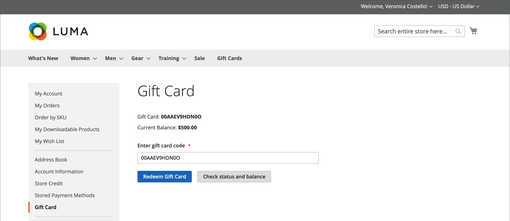
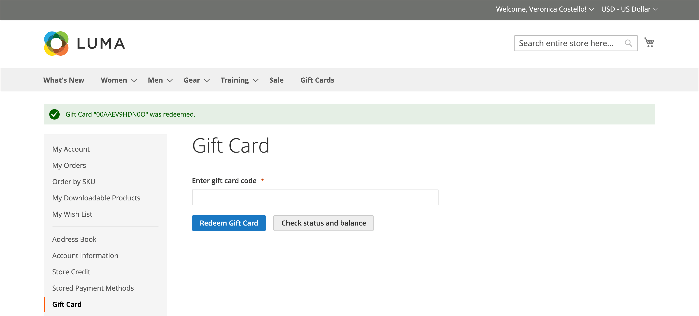

# ギフトカードの購入と引き換え

{{ee-feature}}

ギフトカードは、注文にクーポンが適用されるのと同様に、ショッピングカートで利用されます。 チェックアウト時に、買い物客はギフトカードコードを入力して、ギフトカードの金額を購入に適用します。 顧客アカウントを持つギフトカード所有者は、アカウントダッシュボードからステータスと残高残高を確認できます。 1枚または複数のギフトカードを使用して、注文の全額または一部を支払うことができます。

適用されたギフトカードコードは、_管理者_&#x200B;で注文を開くことで表示できます。これにより、必要に応じてコードを取得して物理的なギフトカードに配置することができます。 ギフトカードの注文がキャンセルまたは返金された場合、関連するギフトカードアカウントを手動でキャンセルする必要があります。 アカウントを完全に削除するか、非アクティブにすることができます。

{width="700" zoomable="yes"}

例えば、デモ Luma ストアで買い物をする顧客は、バーチャルギフトカードまたは物理的なギフトカードのいずれかを購入できます。

**仮想ギフトカード** - Luma仮想ギフトカードが、オプションのメッセージとともに受信者に電子メールで送信されます。 この機能は、Lumaの各web サイトで利用でき、有効期限はありません。

**物理的なギフトカード** - Luma ギフトカードは、カスタムアートメーラーにパッケージ化され、無料で受信者に送信されます。 事前に制作し、独自のコードでラベル付けし、店舗、電話、またはLuma ファミリーのweb サイトで利用できます。 有効期限はありません。

**ギフトカードの組み合わせ** – 組み合わせギフトカードは、バーチャルギフトカードと物理的なギフトカードの両方の特徴を備えています。 Luma組み合わせギフトカードが発送され、受信者に電子メールで送信されます。 ギフトカードの購入時には、メールアドレスと配送先住所が必要です。 有効期限はありません。

## ギフトカードのライフサイクル

1. **お客様がギフトカードの値を決定します**。

   お客様は、商品ページからギフトカードの価値を判断します。 設定に応じて、固定価格フィールド、価格オプションのリスト、またはその両方があります。 すべての金額は、店舗で使用されている通貨で表示されます。

1. **お客様はギフトカード情報を完了します**。

   物理的なギフトカードの場合、お客様は&#x200B;**送信者名**&#x200B;と&#x200B;**受信者名**&#x200B;を入力します。 仮想または組み合わせギフトカードの場合、顧客は&#x200B;**送信者の電子メール**&#x200B;と&#x200B;**受信者の電子メール**&#x200B;も入力します。 お客様がログインしている場合、送信者名（および送信者の電子メールが該当する場合）は、アカウントから自動的に入力されます。 設定によっては、顧客が受信者にメッセージを入力する場合もあります。

1. **お客様はチェックアウトを完了しました**。

   ギフトカードは、送信者、受信者、メッセージの名前（該当する場合）を示す詳細が記載されたカート内の行項目として表示されます。 ギフトカードに関連付けられた金額は、カートに追加されたときにストアの基本通貨に変換されます。

1. **お客様は、注文の確認を受け取ります**。

   ギフトカードの購入者は、確認書のリンクをクリックして、アカウントダッシュボードから注文を追跡できます。

1. **受信者はギフトカードを受け取ります**。

   バーチャルギフトカードまたは複合ギフトカードの場合、ギフトカードコード、送信者の名前、メッセージ（該当する場合）が記載された電子メールを受信者が受信します。 1回の注文で複数のギフトカードを購入し、種類がバーチャルまたは組み合わされた場合、対応するすべてのギフトカードコードが1通のメールで受信者に送信されます。 物理的なギフトカードは、受信者または顧客に直接配送でき、顧客は自分でギフトカードを受信者に配送できます。

1. **受信者は、購入にギフトカードを適用します**。

   受信者はストアで商品を購入し、チェックアウト時にギフトカードコードを適用します。 チェックアウト時にギフトカードが適用されるたびに、注文合計ブロックに金額が表示され、合計金額から差し引かれます。 各ギフトカードの残高は、ショッピングカートの合計から差し引かれます。 1回の購入で複数のギフトカードを使用する場合、残りの残高が最も少ないカードから始まる順に適用され、すべてが適用されるか、総計がゼロになるまで適用されます。 総計がゼロに達すると、カートに適用された最後のギフトカードのアカウントに一部控除が適用されます。 カートに適用されていないカードには、残高控除は適用されません。 金額は、注文が行われた後にのみギフトカードのアカウントから差し引かれます。

## ストアフロント体験

ギフトカードがストアフロントでどのように機能するか：

- ギフトカードコードは、カートまたはチェックアウト時に適用して、注文の合計金額をカバーできます。

- カタログでは、ギフトカードが別の種類の商品として表示されます。

- ギフトカードコードは、注文が請求された後に有効になります。 注文が支払われない場合、受け取り側のお客様はギフトカードを使用できません。

- ギフトコードのアカウントは、特定の割引券の残高を追跡するために作成されます。 ストア管理者は、残高を手動で調整できます。

受け取り側のお客様は、アカウントダッシュボードの&#x200B;_[!UICONTROL Gift Card]_セクションを使用して、[ ギフトカードアカウント ](product-gift-card-accounts.md)の残高を確認し、[ ストアクレジット ](../customers/store-credit-using.md)にギフトカードを引き換えることができます。

{width="700" zoomable="yes"}

### ギフトカードのステータスと残高を確認する

1. ストアフロントから、顧客はログインして顧客アカウントページを開きます。

1. お客様は&#x200B;**[!UICONTROL Gift Card]** ページを開き、ギフトカードコードを入力します。

1. お客様は&#x200B;**[!UICONTROL Check status and balance]**&#x200B;をクリックします。

{width="700" zoomable="yes"}

ギフトカードの残高が表示されます。

### ギフトカードの有効化

1. _[!UICONTROL Gift Card]_ページで、お客様はギフトカードコードを入力します。

1. お客様は&#x200B;**[!UICONTROL Redeem Gift Card]**&#x200B;をクリックします。

{width="700" zoomable="yes"}

ギフトカードの金額が有効になり、店舗のクレジット残高に追加されます。

{width="700" zoomable="yes"}

ギフトカード残高のすべての操作は、_[!UICONTROL Store Credit]_ページで利用できます。

### チェックアウト時にギフトカードを適用する

ギフトカードが引き換え可能でない場合、お客様はチェックアウト時にギフトカードコードを適用できます。

1. _確認と支払い_&#x200B;の手順で、お客様は&#x200B;**[!UICONTROL Apply Gift Card]**&#x200B;をクリックします。

1. ギフトカードコードを入力し、**[!UICONTROL Apply]**&#x200B;をクリックします。

   割引は&#x200B;_[!UICONTROL Order Summary]_に反映する必要があります。

1. **[!UICONTROL Place Order]**&#x200B;をクリックして注文を確定します。
